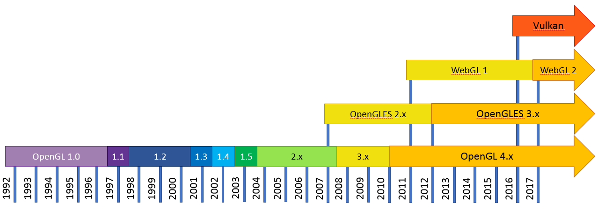
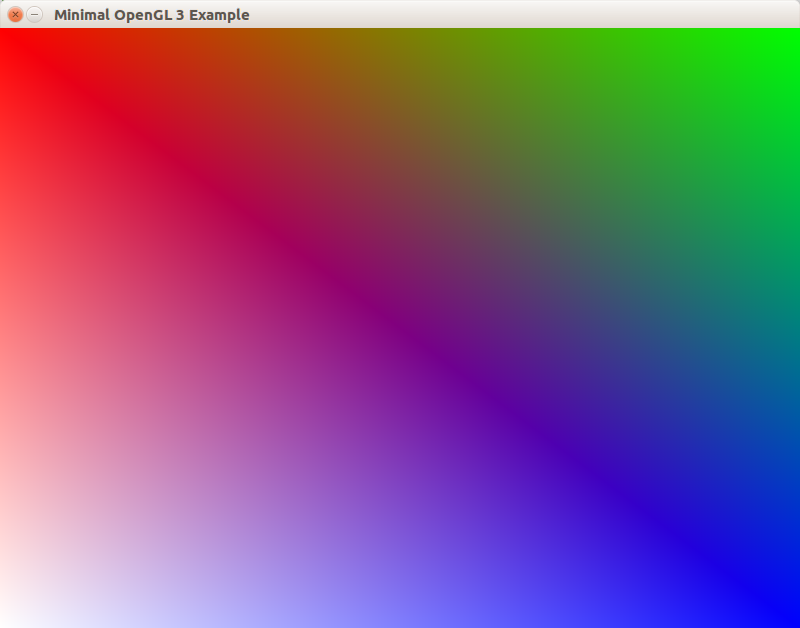

## Почему OpenGL?

Для программирования 3D-графики вам потребуется программный интерфейс 3D-рисования. За прошедшие десятилетия наибольшее распространение получили два стандарта — OpenGL и DirectX. OpenGL даёт возможность писать код, работающий на любой платформе и любом устройстве, поэтому мы сосредоточимся на изучении OpenGL.

## Что такое OpenGL

OpenGL — это стандарт API для рисования трёхмерной графики. Мы будем использовать OpenGL 3.x — примерно то же самое, что GLES 2.x или WebGL 1. Посмотрите на общую историю версий графических API, чтобы понять, где мы находимся:

За годы, прошедшие между OpenGL 1.x и OpenGL 3.x, представления программистов о 3D-графике изменились кардинально. Было обнаружено, что программный интерфейс, разработанный для OpenGL 1.0, имеет недостаточную гибкость и потворствует потерям производительности при рисовании графики. Начиная с OpenGL 3.0, была представлена полностью новая модель программирования с использованием OpenGL, а старый способ был объявлен устаревшим.

>В последующие годы появились очередные новшества, такие как OpenGL 4.x и Vulkan. Они нацелены на сверхбыстрый параллелизм при вычислениях и на нестандартные применения видеокарт (например, для выполнения расчётов общего назначения с помощью Computing Shaders). Если же вы хотите изучить именно графику, не стоит оглядываться на OpenGL 4 и Vulkan: их использование уже требует прекрасного понимания 3D-графики, а также умения качественно писать многопоточный и асинхронный код, глубих знаний в системном программировании.

## Минимальный пример на SDL2

>Ищите пример в каталоге `chapter1/01-minimal` в репозитории [modern-gl-samples](https://github.com/ps-group/modern-gl-samples)

Пример является оконным приложением на C++, он использует библиотеки SDL2 и glbinding. В примере создаётся окно с контекстом OpenGL и выводится всего 4 вершины, расположенных в углах окна, с разными цветами. Благодаря интерполяции между вершинами получается такая картина:

В примере используется библиотека glbinding. Эта библиотека изолирует программиста от заголовков OpenGL, оформленных в стиле языка C. Дело в том, что в стандартный для OpenGL загловок `GL/gl.h` имеет недостатки:

- в нём находится множество макросов и функций, недоступных в современном OpenGL без включения режима обратной совместимости
- на Windows в этом заголовке есть только функции из OpenGL 1.1, и нет современной функциональности

Библиотека glbinding заворачивает интерфейс OpenGL в собственные пространства имён, соответствующие версиям OpenGL: `gl::gl32`, `gl::gl33core` и так далее. В каждом из пространств имён расположены только те функции OpenGL, которые действительно доступны в соответствующей версии OpenGL.

Порядок инициализации в примере следующий:

- сперва вызывается `SDL_Init` для инициализации SDL2
- затем создаётся объект `SDL_Window`, представляющий абстракцию над окном приложения
- затем в окне создаётся объект `SDL_GLContext`, представляющий абстракцию над контекстом OpenGL для данного окна
- затем инициализируется glbinding: `glbinding::Binding::initialize();`
- после этого происходит подготовка данных: двух шейдеров и одного вершинного буфера, содержащего отправляемые на видеокарту вершины цветного прямоугольника
- в конце запускается Event Loop (также известен как Game Loop, Message Loop или Render Loop)

Рисование в OpenGL происходит при вызовах функций семейства `glDraw*`: `glDrawArrays`, `glDrawElements` и так далее. В момент вызова таких функций текущий буфер данных с хранящимися в нём вершинами запускается в обработку на графическом конвейере.

## Минимальный пример на WebGL
