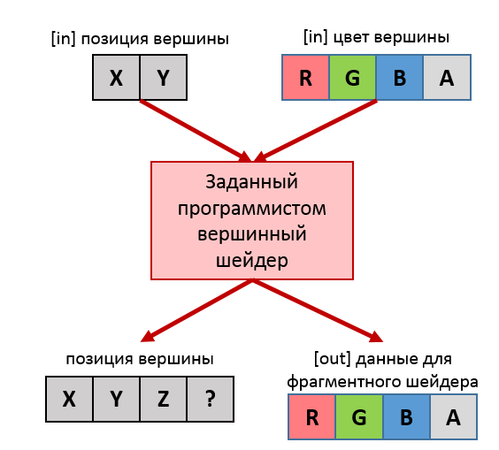
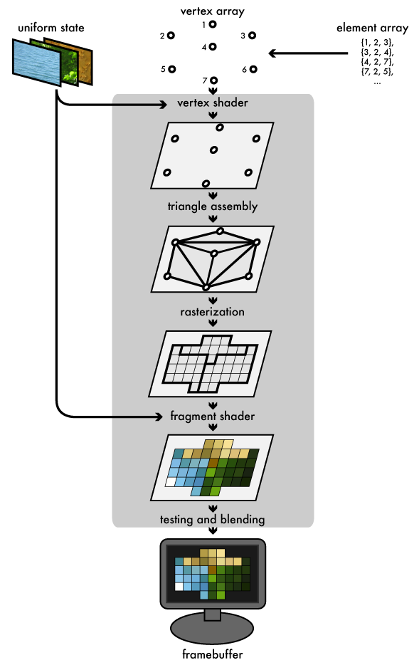
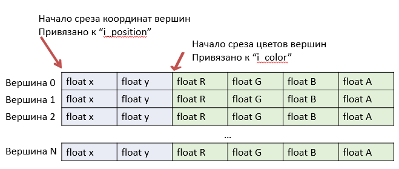
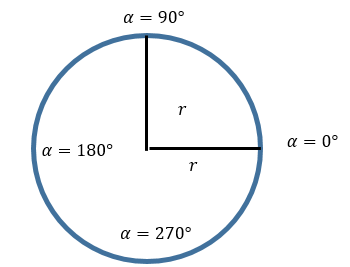
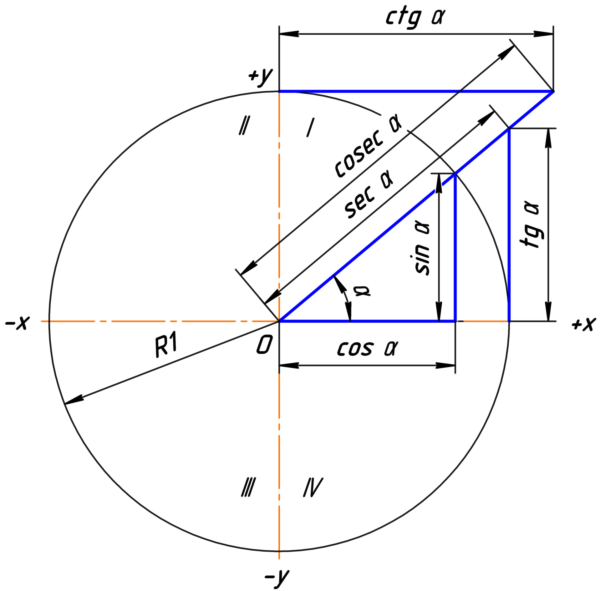
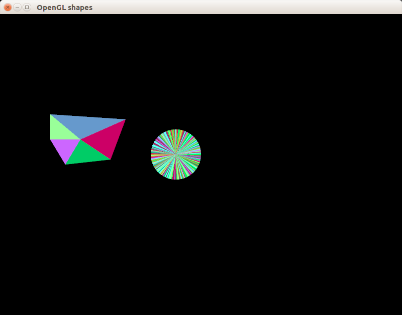

## Как работает OpenGL

В основном OpenGL оперирует треугольниками, изображениями и состояниями драйвера рисования. Если упростить схему работы, останется пять ключевых шагов рисования каждого объекта на экране. Рассмотрим все эти шаги.

### Шаг №1 - загрузка вершин

Программист передаёт из управляющей программы массивы данных, описывающих вершины треугольников. Каждая фигура и каждая поверхность будет нарисована с помощью этих треугольников. На рисунке показано, как разбить сектор эллипса на треугольники:


Загрузка вершин может быть выполнена заранее, до первого кадра, либо будет выполняться по необходимости. После загрузки вершинных данных и настройки *шейдеров* можно запускать проход рисования (англ. *draw batch*). Запуск прохода рисования выполняется функциями семейства `glDraw*`: `glDrawArrays`, `glDrawElements` и так далее.

### Шаг №2 - обработка вершин

На втором шаге выполняется *вершинный шейдер* (*англ.* vertex shader): он получает на вход все данные одной из вершин, а на выход обязан предоставить четырёхкомпонентный вектор с координатами вершины и набор любых других данных для фрагментного шейдера:



Программист заранее указывает свой вершинный шейдер. Его пишут на специальном языке GLSL, затем он компилируется видеодрайвером и выполняется прямо на видеокарте.

### Шаг №3 - интерполяция и фрагментация

Представьте, что вы рисуете треугольник на клетчатой бумаге. Какие-то клетки будут зарисованы полностью, другие — только частично, а оставшиеся не будут зарисованы вообще. Точно так же видеокарта должна определить, в какие пиксели попадает треугольник. Эти пиксели называются фрагментами.


Представьте, что вы захотели сделать треугольник разноцветным, с плавным переходом от жёлтого цвета по левому краю в красный цвет на правом. В OpenGL это выполняется автоматически:
 
 - вы указываете разные цвета для каждой из вершин треугольника
 - на шаге №3 видеокарта выполняет в каждом фрагменте линейную интерполяцию, вычисляя взвешенное значение цвета или любого другого атрибута

Линейная интерполяция — это интерполяция с линейным (равномерным) изменением свойства от вершины A к вершине B. Возьмём условный параметр `t ∈ [0..1]`, описанный следующим образом:
 
 - для фрагмента, содержащего вершину A, `t = 0`
 - для фрагмента, содержащего вершину B, `t = 1`
 - для фрагмента, лежащего между A и B ровно посередине, `t = 0.5`
 - и так далее для всех фрагментов между A и B

 Линейно интерполированное свойство фрагмента будет вычисляться по формуле: `p(t) = pA ∙ (1 - t) + pB ∙ t`. Легко заметить, что эта формула работает для самих вершин A и B:
 
 - для вершины A: `p(0) = pA ∙ (1 - 0) + pB ∙ 0 = pA`
 - для вершины B: `p(1) = pA ∙ (1 - 1) + pB ∙ 1 = pB`

 Конечный результат линейной интерполяции RGBA-цвета от вершин по всему треугольнику показан на рисунке:

 

### Шаг №4 - обработка фрагментов

На данном шаге снова вызывается пользовательский код в составе *фрагментного шейдера* (*англ.* fragment shader). Его также пишут на языке GLSL. Фрагментный шейдер получает на вход всё, что вершинный шейдер ему передал, но в преобразованном виде. Допустим, вершинный шейдер сохранил для фрагментного цвет вершины — но фрагментный шейдер оперирует фрагментами, и поэтому переданные данные также проходят линейную интерполяцию.


### Шаг №5 - проверки, смешивание цвета и запись в буфер кадра

На последнем шаге фрагмент проходит ряд тестов — в каждом из них видеокарта проверяет, должен ли фрагмент попасть в кадр. Например, в 3D пространстве фрагмент может быть закрыт другим геометрическим телом, и это выявляется в *тесте глубины* (*англ.* depth test).

Если проверка пройдена (что в 2D графике случается почти всегда), то фрагмент записывается в пиксель кадра. Перед эти выполняется смешивание, позволяющее наложить полупрозрачный пиксель на существующий фон кадра.

### Конвейер в целом

Все шаги конвейера изображены на единой схеме, взятой из статьи [An intro to modern OpenGL. Chapter 1: The Graphics Pipeline](http://duriansoftware.com/joe/An-intro-to-modern-OpenGL.-Chapter-1:-The-Graphics-Pipeline.html):



## Пример на OpenGL + SFML: псевдокод

Мы напишем программу, которая нарисует круг и пятиугольник, как в предыдущем примере. Сначала опишем желаемое в псевдокоде:

```cpp
int main()
{
    try
    {
        // Создаём окно SFML

        // Компилируем вершинный и фрагментный шейдеры в шейдерную программу

        // Создаём Vertex Buffer Object (VBO) для загрузки данных,
        //  в этот буфер мы запишем параметры вершин для видеокарты.

        // Создаём Vertex Array Object (VAO), который хранит связи между данными
        //  в VBO и переменными шейдера.

        // Генерируем список вершин треугольников, представляющих круг,
        //  каждый треугольник будет раскрашен в собственный цвет.

        // Генерируем список вершин треугольников, представляющих пятиугольник,
        //  добавляем его к списку вершин круга.

        // Выполняем привязку вершинных данных в контексте текущего VAO.

        // Устанавливаем матрицу ортографического проецирования.

        // Запускаем Render Loop, на каждом шаге
        //   1) обрабатываем события, закрываем окно при событии Close
        //   2) очищаем окно
        //   3) рисуем в буфер кадра с помощью glDrawArrays
        //   4) выводим буфер кадра на экран
    }
    catch (const std::exception& ex)
    {
        std::cerr << "fatal exception: " << ex.what() << std::endl;
    }
}
```

## Создание окна

Перед созданием окна мы создадим `sf::ContextSettings`, чтобы задач нестандартные настройки контекста OpenGL:

- версия 3.3
- режим Core Profile, в котором стандартные класс SFML для рисования перестают работать
- уровень сглаживания: 4

С этими настройками можно создать окно:

```cpp
// Указываем SFML, что контекст должен иметь определённые атрибуты
//  - версия OpenGL 3.3 Core Profile
//  - уровень сглаживания: 4
sf::ContextSettings settings;
settings.antialiasingLevel = 4;
settings.attributeFlags = sf::ContextSettings::Core;
settings.majorVersion = 3;
settings.minorVersion = 3;

// Создаём окно SFML
sf::Window window(
    sf::VideoMode(800, 600), "OpenGL shapes",
    sf::Style::Default, settings);
```

## Библиотека glbinding - абстракция версий OpenGL

Одно из слабых мест OpenGL — трудности доступа к контексту нужной версии. На Windows для получения OpenGL выше 1.1 потребуется напрямую запрашивать адреса процедур по именам функций. Это крайне неприятная задача, и избавиться от неё можно с помощью библиотек. Мы воспользуемся библиотекой [glbinding](https://github.com/cginternals/glbinding).

Запомните простые правила:

- заголовочные файлы выглядят так: `<glbinding/ВЕРСИЯ/gl.h>` (например, `<glbinding/gl33core/gl.h>`), они полностью заменяют обычные заголовки OpenGL (`GL/gl.h` и другие)
- все функции лежат в пространствах имёт, соответствующих версии стандарта (например, `gl21` или `gl33core`)
    - мы используем Core Profile и пространства имён `gl**core`
- в остальном интерфейс glbinding абсолютно идентичен интерфейсу OpenGL
- после создания окна с контекстом OpenGL нужно один раз проинициализировать glbinding: `glbinding::Binding::initialize();`

Мы подключим два заголовочных файла и будем использовать простанство имён `gl33core`:

```
#include <glbinding/Binding.h>
#include <glbinding/gl33core/gl.h>

using namespace gl33core;
```

Затем в функции main после создания окна выполним инициализацию glbinding:

```cpp
// Создаём окно SFML
sf::Window window(
    sf::VideoMode(800, 600), "OpenGL shapes",
    sf::Style::Default, settings);

// Инициализируем библиотеку glbinding после создания окна
glbinding::Binding::initialize();
```

## Компиляция вершинного и фрагментного шейдеров

Код вершинного и фрагментного шейдеров написан на языке GLSL. Вы можете сейчас не углубляться в язык GLSL — просто запомните, что он похож на C и C++, и в нём даже есть функция main.

Входные данные вершинного шейдера помечены ключевым словом `in`: это атрибуты `i_position` и `i_color`. Вершинный шейдер обрабатывает за один вызов main ровно одну вершину. Атрибуты `i_position` и `i_color` описывают позицию XY и цвет RGBA текущей вершины.

```glsl
#version 130

in vec2 i_position;
in vec4 i_color;
out vec4 v_color;
uniform mat4 u_projection_matrix;

void main()
{
    v_color = i_color;
    // gl_Position - это предопределённая out-переменная
    gl_Position = u_projection_matrix * vec4( i_position, 0.0, 1.0 );
}
```

Выходная переменная `v_color` является одновременно входной переменной для фраментного шейдера. Поскольку именно фрагментный шейдер вычисляет цвет фрагмента, вершинный шейдер всего лишь передал этот цвет через out-переменную. После интерполяции значение попадёт во фрагментный шейдер.

> Выходные переменные вершинного шейдера должны совпадать с входными переменными фрагментного. Если это правило не соблюдается, компоновка (linking) шейдерной программы завершится с ошибкой.

```glsl
#version 130
in vec4 v_color;
void main()
{
    // gl_FragColor - это предопределённая out-переменная
    gl_FragColor = v_color;
}
```

Мы запишем исходный код вершинного и фрагментного шейдеров в строковые константы kVertexShaderCode и kFragmentShaderCode:

```cpp
static const char kVertexShaderCode[] = R"**(#version 130
in vec2 i_position;
in vec4 i_color;
out vec4 v_color;
uniform mat4 u_projection_matrix;
void main()
{
    v_color = i_color;
    gl_Position = u_projection_matrix * vec4( i_position, 0.0, 1.0 );
}
)**";

// ..kFragmentShaderCode..
```

Затем в функции main скомпилируем шейдер и скомпонуем шейдерную программу — SFML совершит оба шага в одном методе `loadFromMemory`:

```cpp
// Компилируем вершинный и фрагментный шейдеры в шейдерную программу
sf::Shader shader;
if (!shader.loadFromMemory(kVertexShaderCode, kFragmentShaderCode))
{
    throw std::runtime_error("vertex or fragment shader compilation failed");
}
sf::Shader::bind(&shader);
```

## Vertex Buffer Object

Поскольку в OpenGL вычисления происходят на стороне видеокарты, данные для вычислений должны быть в памяти видеокарты. Однако, создавать эти данные обычно приходится на центральном процессоре. Затем данные передаются в выделенные специально для этой цели буферы, также известные как VBO (Vertex Buffer Object).

Создание и активация буфера выполняются двумя вызовами:

```cpp
// Создаём Vertex Buffer Object (VBO) для загрузки данных,
//  в этот буфер мы запишем параметры вершин для видеокарты.
GLuint vbo = 0;
glGenBuffers(1, &vbo);
glBindBuffer(GL_ARRAY_BUFFER, vbo);
```

Вершина будет описана следующей структурой Vertex. Структура не должна иметь указателей или связанных полей, поскольку байты массива Vertex будут напрямую загружаться на видеокарту, где любые указатели теряют смысл.

```cpp
struct Vertex
{
	glm::vec2 xy;
	glm::vec4 rgba;
};
```

Чтобы вершинный шейдер правильно распознал местонахождение полей `rgba` и `xy` в массиве байт, мы должны указать с помощью вызовов OpenGL смещения каждого поля от начала структуры, а также размер структуры. Смещения полей должны быть привязаны к конкретным атрибутам вершин.



>В терминологии компьютерной графики размер структуры называется stride, т.е. отступ в байтах до следующего экземпляра структуры. Принцип использования неоднородных массивов, содержащих впеременку разные атрибуты вершин, известен как interleaved arrays. Отдельные под-массивы называются срезами (slices). Срезы используются во многих современных языках программирования даже в задачах, не связанных с компьютерной графикой.

Для привязки вершинных данных мы напишем функцию BindVertexData, которая получаем массив вершин и шейдер.

- Для всех атрибутов шейдера с помощью [glGetAttribLocation](http://docs.gl/gl3/glGetAttribLocation) запрашивается location — целое число, которое идентифицирует конкретный атрибут.
- Каждый атрибут должен быть включен методом [glEnableVertexAttribArray](http://docs.gl/gl3/glEnableVertexAttribArray) — OpenGL извлекает данные из буфера только для включённых атрибутов
- Привязка параметров среза к шейдеру выполняется вызовом [glVertexAttribPointer](http://docs.gl/gl3/glVertexAttribPointer)

```cpp
void BindVertexData(const std::vector<Vertex>& verticies, const sf::Shader& shader)
{
    const GLuint programId = shader.getNativeHandle();

    // OpenGL должен получить байтовые смещения полей относительно структуры Vertex.
    const void* colorOffset = reinterpret_cast<void*>(offsetof(Vertex, rgba));
    const void* posOffset = reinterpret_cast<void*>(offsetof(Vertex, xy));
    const size_t stride = sizeof(Vertex);

    // Привязываем атрибут i_color к данным в вершинном буфере.
    const int colorLocation = glGetAttribLocation(programId, "i_color");
    glEnableVertexAttribArray(colorLocation);
    glVertexAttribPointer(colorLocation, glm::vec4().length(), GL_FLOAT, GL_FALSE, stride, colorOffset);

    // Привязываем атрибут i_position к данным в вершинном буфере.
    const int posLocation = glGetAttribLocation(programId, "i_position");
    glEnableVertexAttribArray(posLocation);
    glVertexAttribPointer(posLocation, glm::vec2().length(), GL_FLOAT, GL_FALSE, stride, posOffset);

    // Загружаем данные в вершинный буфер.
    glBufferData(GL_ARRAY_BUFFER, stride * verticies.size(), verticies.data(), GL_STATIC_DRAW);
}

int main()
{
    // ...

    // Создаём Vertex Buffer Object (VBO) для загрузки данных,
    //  в этот буфер мы запишем параметры вершин для видеокарты.
    GLuint vbo = 0;
    glGenBuffers(1, &vbo);
    glBindBuffer(GL_ARRAY_BUFFER, vbo);

    // TODO: создать Vertex Array Object

    std::vector<Vertex> verticies;
    // TODO: Генерируем список вершин

    // Выполняем привязку вершинных данных.
    BindVertexData(verticies, shader);

    // ..
```

## Vertex Array Object

Вы могли заметить, что функция BindVertexData содержит сразу 7 вызовов OpenGL, хотя мы всего лишь привязали два атрибута к именам переменных в шейдере и отправили массив данных на видеокарту. А что если рисование каждого объекта на каждом кадре потребует множества привязок атрибутов? В сложных приложениях могут возникнуть десятки тысяч вызовов OpenGL, что приведёт к спаду производительности.

Для решения этой проблемы был предложен Vertex Array Object, который "запоминает" все привязки, заданные вызовами glVertexAttribPointer, glEnableVertexAttribArray и glBindBuffer. Более того, в OpenGL 3.2+ наличие хотя бы одного VAO стало обязательным условием работы программы.

Мы создадим ровно один VAO параллельно созданию VBO. Возможности VAO пока что нам не нужны.

```cpp
// Создаём Vertex Array Object (VAO), который хранит связи между данными
//  в VBO и переменными шейдера.
GLuint vao = 0;
glGenVertexArrays(1, &vao);
glBindVertexArray(vao);
```

## Генератор цвета IColorGenerator

Фигуры будут нарисованы путём деления на треугольники. Каждый треугольник мы раскрасим в собственный цвет, чтобы триангуляция стала более наглядной. Алгоритм генерации цвета мы выделим в объектно-ориентированном стиле. Сначала в отдельном файле создадим интерфейс:

```cpp
#pragma once
#include <glm/vec4.hpp>

class IColorGenerator
{
public:
	~IColorGenerator() = default;

	virtual glm::vec4 GenerateColor() = 0;
};
```

Единственной реализацией интерфейса будет класс RandomColorGenerator. Алгоритм генераци будет следующим:

 1. создадим палитру из нескольких предопределённых цветов
 2. с помощью `std::random_device` получаем единственное псевдослучайное число
 3. затем с помощью `std::mt19937`, известного также как "Вихрь Мерсенна", размножаем псевдослучайное число-зерно в целый ряд псевдослучайных чисел
 4. затем при очередном запросе цвета извлекаем из Вихря Мерсенна случайное число, обрезаем его до диапазона от 0 до последнего индекса в палитре
 5. полученное число используем как индекс в палитре

Заголовок с классом будет выглядеть так:

```cpp
#pragma once
#include "IColorGenerator.h"
#include <vector>
#include <random>

class RandomColorGenerator : public IColorGenerator
{
public:
	RandomColorGenerator();

	glm::vec4 GenerateColor() override;

private:
	// Палитра цветов для выбора.
	std::vector<glm::vec4> m_palette;

	// random_device - это источник непредсказуемых псевдослучайных чисел.
	std::random_device m_rd;

	// mt19937 - это "Вихрь Мерсенна", он размножает одно псевдослучайное число,
	//  превращая в несколько по известному алгоритму.
	std::mt19937 m_generator;

	// В линейном случайном распределении вероятность появления
	//  каждого из чисел одинакова.
	std::uniform_int_distribution<size_t> m_indexDist;
};
```

В реализации большую часть составляет генерация палитры цветов. Эту задачу облегчает сайт [websafecolors.info](https://websafecolors.info/color-chart), который предлагает огромную палитру приятных для глаза цветов разных оттенков.

```cpp
#include "RandomColorGenerator.h"

namespace
{
std::vector<glm::vec4> MakePalette()
{
	// Превращает rgb(255, 0, 128) в vec4{ 1, 0, 0.5, 1 }
	auto rgb = [](unsigned red, unsigned green, unsigned blue) {
		return glm::vec4(float(red) / 255.f, float(green) / 255.f, float(blue) / 255.f, 1);
	};

	// Цвета подобраны на сайте https://websafecolors.info/color-chart
	return {
		rgb(0, 204, 102),
		rgb(102, 102, 102),
		rgb(102, 153, 204),
		rgb(153, 255, 153),
		rgb(204, 153, 51),
		rgb(0, 255, 102),
		rgb(204, 0, 102),
		rgb(204, 102, 255),
		rgb(102, 255, 255),
		rgb(153, 255, 102),
	};
}
}

RandomColorGenerator::RandomColorGenerator()
	: m_palette(MakePalette())
	, m_generator(m_rd())
	, m_indexDist(0, m_palette.size() - 1u)
{
}

glm::vec4 RandomColorGenerator::GenerateColor()
{
	const size_t index = m_indexDist(m_generator);
	return m_palette.at(index);
}
```

## Триангуляция пятиугольника

Среди всех многоугольников в компьютерной графике предпочитают выпуклые многоугольники (*англ.* convex), т.к. их проще всего разделить на треугольники. [Согласно википедии](https://ru.wikipedia.org/wiki/%D0%92%D1%8B%D0%BF%D1%83%D0%BA%D0%BB%D1%8B%D0%B9_%D0%BC%D0%BD%D0%BE%D0%B3%D0%BE%D1%83%D0%B3%D0%BE%D0%BB%D1%8C%D0%BD%D0%B8%D0%BA):

>Выпуклым многоугольником называется многоугольник, все точки которого лежат по одну сторону от любой прямой, проходящей через две его соседние вершины.

Благодаря этому мы можем разделить выпуклый многоугольник на треугольники с помощью центральной точки. Таким образом мы создадим своего рода веер треугольников.


Следует учесть, что многие вершины будут продублированы — каждая внешняя вершина входит в состав двух треугольников, но при этом треугольники могут иметь разный цвет, а цвета определяются вершинами. Всё это приводит к функции TesselateConvexByCenter:

```cpp
// Генерирует список вершин треугольников для выпуклого многоугольника, заданного вершинами и центром.
//  @param center - геометрический центр многоугольника
//  @param hullPoints - вершины многоугольника
//  @param colorGen - генератор цвета полученных треугольников
std::vector<Vertex> TesselateConvexByCenter(const glm::vec2& center, const std::vector<glm::vec2>& hullPoints, IColorGenerator& colorGen)
{
	const size_t size = hullPoints.size();
	std::vector<Vertex> verticies;
	verticies.reserve(3u * size);
	for (size_t pointIndex = 0; pointIndex < size; ++pointIndex)
	{
		// Генерируем цвет треугольника и добавляем три его вершины в список.
		const glm::vec4 triangleColor = colorGen.GenerateColor();
		const size_t nextPointIndex = (pointIndex + 1) % size;
		verticies.push_back({ hullPoints.at(pointIndex), triangleColor });
		verticies.push_back({ hullPoints.at(nextPointIndex), triangleColor });
		verticies.push_back({ center, triangleColor });
	}

	return verticies;
}
```

Явное указание центра выпуклой фигуры — плохая идея, т.к. центр пришлось бы вычислять вручную с риском ошибиться. Проще расчитать геометрический центр автоматически как среднее арифметическое вершин.

```cpp
// Генерирует список вершин треугольников для выпуклого многоугольника, заданного вершинами.
std::vector<Vertex> TesselateConvex(const std::vector<glm::vec2>& verticies, IColorGenerator& colorGen)
{
	// Центр выпуклого многоугольника - это среднее арифметическое его вершин
	const glm::vec2 center = std::reduce(verticies.begin(), verticies.end()) / float(verticies.size());
	return TesselateConvexByCenter(center, verticies, colorGen);
}
```

## Тесселяция круга

Разделить круг на треугольники легко с помощью тригонометрии: достаточно пройтись по углам от 0° до 360° с некоторым шагом, например, 1°. Каждый угол вместе с радиусом задаёт точку в полярных координатах.



Перевести полярные координаты в декартовы очень легко — достаточно вспомнить одно из определений синуса и косинуса:



Декартовы координаты по-английски называются Эвклидовыми (euclidean), и мы назовём функцию соответствующе:

```cpp
// Переводит полярные координаты {radius, angle} в декартовы.
// Угол задаётся в радианах.
glm::vec2 euclidean(float radius, float angle)
{
	return { radius * cos(angle), radius * sin(angle) };
}
```

Теперь мы можем описать функцию для триангуляции (тесселяции) круга:

```cpp
// Функция делит круг на треугольники,
//  возвращает массив с вершинами треугольников.
std::vector<Vertex> TesselateCircle(float radius, const glm::vec2& center, IColorGenerator& colorGen)
{
	assert(radius > 0);

	// Круг аппроксимируется с помощью треугольников.
	// Внешняя сторона каждого треугольника имеет длину 2.
	constexpr float step = 2;
	// Число треугольников равно длине окружности, делённой на шаг по окружности.
	const auto pointCount = static_cast<unsigned>(radius * 2 * M_PI / step);

	// Вычисляем точки-разделители на окружности.
	std::vector<glm::vec2> points(pointCount);
	for (unsigned pi = 0; pi < pointCount; ++pi)
	{
		const auto angleRadians = static_cast<float>(2.f * M_PI * pi / pointCount);
		points[pi] = center + euclidean(radius, angleRadians);
	}
	
	return TesselateConvexByCenter(center, points, colorGen);
}
```

## Выполняем триангуляцию двух фигур

Теперь мы можем триангулировать фигуры, чтобы получить результат, который вы видите на скриншоте:



Добавим в main следующий код перед BindVertexData:

```
// Генерируем список вершин треугольников, представляющих круг,
//  каждый треугольник будет раскрашен в собственный цвет.
RandomColorGenerator colorGen;
std::vector<Vertex> verticies = TesselateCircle(50, { 350, 280 }, colorGen);

// Генерируем список вершин треугольников, представляющих пятиугольник,
//  добавляем его к списку вершин круга.
const std::vector<glm::vec2> convexPoints = {
    { 100, 200 },
    { 250, 210 },
    { 220, 290 },
    { 130, 300 },
    { 100, 250 },
};
const std::vector<Vertex> convexVerticies = TesselateConvex(convexPoints, colorGen);
std::copy(convexVerticies.begin(), convexVerticies.end(), std::back_inserter(verticies));

// Выполняем привязку вершинных данных в контексте текущего VAO.
BindVertexData(verticies, shader);
```

## Матрица ортографического проецирования

Казалось бы, что может быть проще, чем наложить виртуальные координаты холста на координаты окна? Однако, OpenGL устроен иначе: он расчитан на 3D графику, в которой координаты виртуального мира не совпадают с координатами окна. Более того, начало координат OpenGL находится в нижнем левом углу, а не в верхнем левом!


Ради нужд 3D графики все координаты вершин проецируются внутрь куба размерами 2x2x2 условных единиц с помощью матрицы проецирования. Поскольку мы хотим получить 2D координаты, да ещё и совмещённые с привычными координатами окна, нам нужна матрица орторафического проецирования, которая растянет координаты вершин обратно из куба 2x2x2 в координаты окна. Для этой цели мы напишем функцию `SetProjectionMatrix`, выполняющую две задачи:

- вычислить матрицу ортографического проецирования из куба на координаты окна с помощью функции [glm::ortho](http://glm.g-truc.net/0.9.1/api/a00237.html#gad25e5b029ebefac5b657861378c17aa8)
- установить эту матрицу как константу в шейдерной программе с помощью [glUniformMatrix4fv](http://docs.gl/gl3/glUniform)

```cpp
void SetProjectionMatrix(const sf::Window& window, const sf::Shader& shader)
{
	// Вычисляем матрицу ортографического проецирования
	const glm::mat4 mat = glm::ortho(0.f, float(window.getSize().x), float(window.getSize().y), 0.f);
	const GLuint programId = shader.getNativeHandle();

	// Передаём матрицу как константу в графической программе
	glUniformMatrix4fv(glGetUniformLocation(programId, "u_projection_matrix"), 1, GL_FALSE, glm::value_ptr(mat));
}

int main()
{
    // ..активируем шейдер..

    // Устанавливаем матрицу ортографического проецирования.
    SetProjectionMatrix(window, shader);

    // ..продолжаем..
}
```

## Цикл событий

В этом примере мы напишем простейший цикл событий. В будущих примерах он станет сложнее. Для простейшего цикла событий мы воспользуемся принципом обратного вызова — функция `EnterRenderLoop` будет вызывать `DrawCallback` в нужный момент для выполнения рисования.

```cpp
using DrawCallback = std::function<void()>;

// Исполняет цикл рисования, завершается при закрытии окна.
void EnterRenderLoop(sf::Window& window, const DrawCallback& draw)
{
	glClearColor(0, 0, 0, 0);
	while (window.isOpen())
	{
		// Обработка событий
		sf::Event event = { sf::Event::Closed, 0 };
		while (window.pollEvent(event))
		{
			if (event.type == sf::Event::Closed)
			{
				window.close();
			}
		}
		// Рисование состояния
		glClear(GL_COLOR_BUFFER_BIT);
		draw();
		// Вывод кадра на экран
		window.display();
	}
}
```

Для обратного вызова мы предоставим лямбда-функцию, которая будет вызываться для рисования каждого кадра. Большую часть времени программа будет работать внутри `EnterRenderLoop` — от инициализации и до завершения работы. После выхода из Render Loop мы должны освободить выделенные ресурсы.

```cpp
EnterRenderLoop(window, [&]() {
    // На каждом кадре привязываем VAO
    glBindVertexArray(vao);
    // Рисуем треугольники, используя вершины из полуинтервала [0, verticies.size)
    glDrawArrays(GL_TRIANGLES, 0, verticies.size());
});

glDeleteBuffers(1, &vbo);
glDeleteVertexArrays(1, &vao);
```

## OpenGL спроектирован для видеокарт

Это означает, что в OpenGL приложениях изображение рисует не центральный процессор, а множество узкоспециализированных процессоров внутри видеокарты. В редких случаях используется медленная программная растеризация: в этом случае изображение рисует центральный процессор в несколько потоков.

Современные видеокарты предоставляют огромные вычислительные возможности благодаря параллельной обработке вершин и фрагментов. Это хорошо показано на видео "CPU vs GPU" от NVIDIA:

<iframe width="560" height="315" src="https://www.youtube.com/embed/-P28LKWTzrI" frameborder="0" allowfullscreen></iframe>

Возможности OpenGL на конкретном компьютере зависят от операционной системы и от производителя драйвера. OpenGL на Linux и на Windows имеют разные возможности. OpenGL в драйверах от NVIDIA и в драйверах от Intel также различаются. Тем не менее, можно писать код, одинаково качественно работающий на любой реализации OpenGL — для этого нужно соблюдать стандарты и внимательно читать документацию используемых функций OpenGL.
