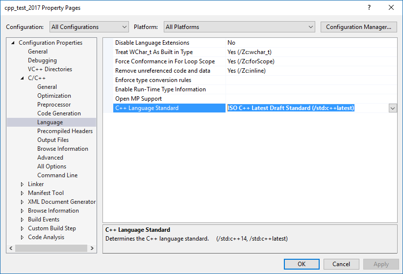

## Стандарт C++

Мы используем последний актуальный стандарт &mdash; C++17. Если вы используете Visual Studio, выбирайте версию Visual Studio 2017 или выше и укажите в настройках проекта `/std=c++latest`:



Если вы не используете ни Visual Studio, ни XCode, то вы должны использовать систему сборки CMake.

- Ознакомиться с CMake можно в статье [Современный CMake: 10 советов по улучшению скриптов сборки](https://habrahabr.ru/post/330902/)
- Работать с CMake умеют среды разработки CLion и QtCreator, также подойдут редакторы Visual Studio Code и Sublime Text

Ознакомиться с новинками C++17 можно в следующих статьях:

- [Миграция на повседневный C++17](/cxx/cxx17)
- [Привет, std::filesystem!](https://medium.com/@sshambir/%D0%BF%D1%80%D0%B8%D0%B2%D0%B5%D1%82-std-filesystem-4c7ed50d5634)

## Форматирование кода

Мы используем автоматическое форматирование кода с помощью clang-format. Перед сдачей работы вы обязаны проверить, что ваш код отформатирован.

Наш стиль отличается от стандартного стиля ClangFormat. Чтобы включить этот стиль, скачайте [наш конфиг .clang-format](https://gist.github.com/sergey-shambir/2615539b624758270ec70b1aa9a61bc2) и сохраните его под именем `.clang-format` в одном из каталогов выше каталога проекта.

- Для Visual Studio есть плагин [ClangFormat](https://marketplace.visualstudio.com/items?itemName=HansWennborg.ClangFormat)
    - этот плагин имеет удобную опцию "Format on Save" в настройках
- Для редактора Visual Studio Code есть плагин [Clang-Format](https://marketplace.visualstudio.com/items?itemName=xaver.clang-format)
- Если для вашего редактора плагина нет, вы должны запускать clang-format самостоятельно. На UNIX-системах можно использовать скрипт:

```bash
#!/usr/bin/env bash

filepaths=$(find . -type f \( -name "*.cpp" -or -name "*.h" \))
for filepath in $filepaths; do
    echo "Formatting ${filepath}..."
    clang-format -style=file -i "${filepath}"
done
```

Пример правильно отформатированного кода:

```cpp
void DoEventLoop(SDL_Window* window, const std::function<void()>& draw)
{
	for (;;)
	{
		SDL_Event event;
		while (SDL_PollEvent(&event))
		{
			switch (event.type)
			{
			case SDL_KEYUP:
				if (event.key.keysym.sym == SDLK_ESCAPE)
					return;
				break;
			case SDL_QUIT:
				return;
			}
		}

		glClear(GL_COLOR_BUFFER_BIT);

		draw();

		SDL_GL_SwapWindow(window);
		SDL_Delay(1);
	}
}
```

## Объектно-ориентированный стиль

Код на C++ пишется в объектно-ориентированном стиле с разумным использованием классов, инкапсуляции полиморфизма, наследования и композиции. Следует помнить о нескольких правилах:

- [C.1:](https://isocpp.github.io/CppCoreGuidelines/CppCoreGuidelines#c1-organize-related-data-into-structures-structs-or-classes) схожие данные объединяйте в структуры или классы
- [C.2:](https://isocpp.github.io/CppCoreGuidelines/CppCoreGuidelines#c2-use-class-if-the-class-has-an-invariant-use-struct-if-the-data-members-can-vary-independently) используйте класс, если объект имеет инвариант, а в случае независимо изменяющихся полей используйте структуры
)
- [C.3:](https://isocpp.github.io/CppCoreGuidelines/CppCoreGuidelines#c3-represent-the-distinction-between-an-interface-and-an-implementation-using-a-class) разделяйте интерфейс и реализацию в классе, т.е. пользуйтесь инкапсуляцией данных
- [C.9:](https://isocpp.github.io/CppCoreGuidelines/CppCoreGuidelines#Rc-private) минимизируйте публичный доступ к полям класса
- [C.7:](https://isocpp.github.io/CppCoreGuidelines/CppCoreGuidelines#Rc-standalone) не объявляйте переменную в той же инструкции, в которой вы объявили структуру или `enum`
- [C.41:](https://isocpp.github.io/CppCoreGuidelines/CppCoreGuidelines#Rc-complete) созданный конструктором объект должен быть проинициализирован полностью
- [C.42:](https://isocpp.github.io/CppCoreGuidelines/CppCoreGuidelines#Rc-throw) если конструктор не может создать объект с корректным состоянием, он должен выбросить исключение
- [C.49](https://isocpp.github.io/CppCoreGuidelines/CppCoreGuidelines#Rc-initialize) старайтесь использовать списки инициализации конструктора вместо присваивания в теле конструктора
- [C.46:](https://isocpp.github.io/CppCoreGuidelines/CppCoreGuidelines#Rc-explicit) добавляйте ключевое слово `explicit` для конструкторов с одним параметром
- [C.31:](https://isocpp.github.io/CppCoreGuidelines/CppCoreGuidelines#Rc-dtor-release) все захваченные объектом класса ресурсы должны быть освобождены в деструкторе
- [C.35](https://isocpp.github.io/CppCoreGuidelines/CppCoreGuidelines#c35-a-base-class-destructor-should-be-either-public-and-virtual-or-protected-and-nonvirtual) публичный деструктор базового класса должен быть виртуальным, либо он должен быть защищённым (`protected`)
