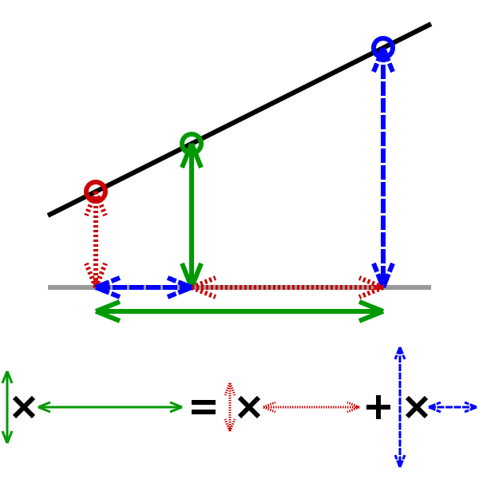

## Операции над числами с плавающей точкой

Заголовок `<glm/gtc/constants.hpp>` ([документация](http://glm.g-truc.net/0.9.9/api/a00162.html)) предоставляет константы `glm::pi()`, `glm::e()` и другие широко известные числа.

Заголовок `<glm/gtc/epsilon.hpp>` ([документация](http://glm.g-truc.net/0.9.9/api/a00163.html)) реализует функции неточного сравнения двух чисел: `glm::epsilonEqual(a, b)` и `glm::epsilonNotEqual(a, b)`.

## Операции над векторами

Стандартные геометрические операции определены в заголовке `<glm/geometric.hpp>` ([документация](http://glm.g-truc.net/0.9.9/api/a00147.html)).

- `glm::length(v)` вычисляет длину (модуль) вектора согласно теореме Пифагора, т.е.  `length({x, y}) = sqrt(x*x + y*y)`
	- не путайте с методом `vec2::length()`, который всегда возвращает число 2 (размерность вектора vec2)
- `glm::dot(v0, v1)` возвращает скалярное произведение векторов v0 и v1 
- `glm::distance(v0, v1)` принимает две точки (типов vec2 или vec3) и вычисляет расстояние между ними, т.е. `length(v0 - v1)`
- `glm::normalize(v)` возвращает нормализованный вектор, т.е. вектор с тем же направлением и единичной длиной

Заголовок `<glm/gtx/perpendicular.hpp>` ([документация](http://glm.g-truc.net/0.9.9/api/a00217.html)):

- функция `glm::perp(v)` возвращает вектор, перпендикулярный заданному — в 2D пространстве это эквивалентно превращению вектора `{x,y}` в вектор `{-y,x}`

Заголовок `<glm/gtx/projection.hpp>` ([документация](http://glm.g-truc.net/0.9.9/api/a00219.html)):

- функция `glm::proj(v, n)` вычисляет вектор-проекцию вектора v на вектор n.

Заголовок `<glm/gtx/closest_point.hpp>` ([документация](http://glm.g-truc.net/0.9.9/api/a00183.html)):

- функция `closestPointOnLine(P, A, B)`, вычисляет точку, ближайшую к точке P и лежащую на прямой AB (полученная точка может быть за пределами отрезка AB)

Заголовок `<glm/gtx/io.hpp>` определяет операторы вывода векторов и матриц в `std::ostream` и `std::wostream`.

## Матрицы аффинных трансформаций

Конструктор без параметров для матриц `glm::mat3` и `glm::mat4` создаёт единичную матрицу, которая эквивалентна нулевой аффинной трансформации. Если у вас есть набор аффинных трансформаций, которые надо объединить в одну матрицу, возьмите единичную матрицу и умножайте её на матрицы элементарных трансформаций в обратном порядке (т.е. начиная с последней трансформации).

Заголовок `<glm/gtx/matrix_transform_2d.hpp>` ([документация](https://glm.g-truc.net/0.9.9/api/a00209.html)) определяет функции для умножения матриц на матрицы элементарных трансформаций:

- `mat3 glm::rotate(mat3 mat, float angle)` умножает на матрицу поворота
- `mat3 glm::scale(mat3 mat, vec2 size)` умножает на матрицу масштабирования, растягивающую объекты на `size.x` по оси X и `size.y` по оси Y
- `mat3 glm::translate(mat3 mat, vec2 offset)` перемещает матрицу на `offset.x` по оси X и `offset.y` по оси Y

>Обратите внимание на класс [Transform2D](docs_transform2d) — он позволяет избегать прямой работы с элементарными трансформациями.

## Линейная интерполяция чисел и векторов

Линейная интерполяция двух значений вычисляет новое значение как среднее между двумя с заданными значениями с применением весового коэффициента. Ниже показана реализация чисел с плавающей точкой, которую можно обобщить для векторных величин:

```cpp
float lerp(float a, float b, float weight)
{
    // Ключевой момент: сумма коэффициентов `weight` и `1 - weight` всегда равна 1.
    return a * (1 - weight) + b * weight;
}
```

Представьте, как зелёная точка движется между красной и синей; математически это движение описывается изменением весового коэффициента от 0 до 1:



В библиотеке GLM и языке GLSL функция линейной интерполяции называется mix, а не lerp. Другими словами, именно функция `glm::mix` выполняет линейную интерполяцию. Она перегружена для скаляров и для векторов из 2-4 значений.

Пример показывает применение `glm::mix`:

```cpp
#include <glm/glm.hpp>
#include <glm/gtx/io.hpp>
#include <iostream>

/// Заголовок compatibility объявляет аналогичную функцию с другим именем: glm::lerp
/// такое имя используется в DirectX, в том числе в языке шейдеров HLSL
// #include <glm/gtx/compatibility.hpp>

using glm::vec2;
using glm::vec3;
using glm::vec4;

int main()
{
    {
        vec2 a = { 1, 3 };
        vec2 b = { -3, 5 };
        vec2 median = glm::mix(a, b, 0.5f);
        // Получаем точку {-1, 4} с поправкой на погрешность.
        std::cout
            << "Linear interpolated (1;3) and (-3;5) with factor 0.5: "
                << median << std::endl;
        assert(glm::distance(median, {-1, 4}) < 0.001f);
    }
    {
        vec3 a = { 1, 3, 6 };
        vec3 b = { -3, 5, 9 };
        vec3 interpolated = glm::mix(a, b, 0.2f);
        // Получаем точку {0.2, 3.4, 6.6} с поправкой на погрешность.
        std::cout
            << "Linear interpolated (1;3;6) and (-3;5;9) with factor 0.2: "
            << interpolated << std::endl;
    }
}
```

## Работа со сплайнами

Заголовок `<glm/gtx/spline.hpp>` ([документация](http://glm.g-truc.net/0.9.9/api/a00226.html)) предоставляет функции для выполнения сплайн-интерполяции.

- функция `vec glm::cubic(vec v1, vec v2, vec v3, vec v4, float factor)` принимает 4 N-мерных вектора и коэффициент (обычно от 0 до 1), вычисляет величину по алгоритму кубических сплайнов

>См. также [Spline interpolation на Wikipedia](https://en.wikipedia.org/wiki/Spline_interpolation)

- функция `vec glm::catmullRom(vec v1, vec v2, vec v3, vec v4, float factor)` принимает 4 N-мерных вектора и коэффициент (обычно от 0 до 1), вычисляет величину по алгоритму сплайнов Catmull-Rom

>См. также [Centripetal Catmull–Rom spline на Wikipedia](https://en.wikipedia.org/wiki/Centripetal_Catmull%E2%80%93Rom_spline)

- функция `vec glm::hermite(vec v1, vec t1, vec v2, vec t2, float factor)` принимает 4 N-мерных вектора и коэффициент (обычно от 0 до 1), вычисляет величину по алгоритму сплайнов Эрмита

>См. также [Cubic Hermite spline на Wikipedia](https://en.wikipedia.org/wiki/Cubic_Hermite_spline)
