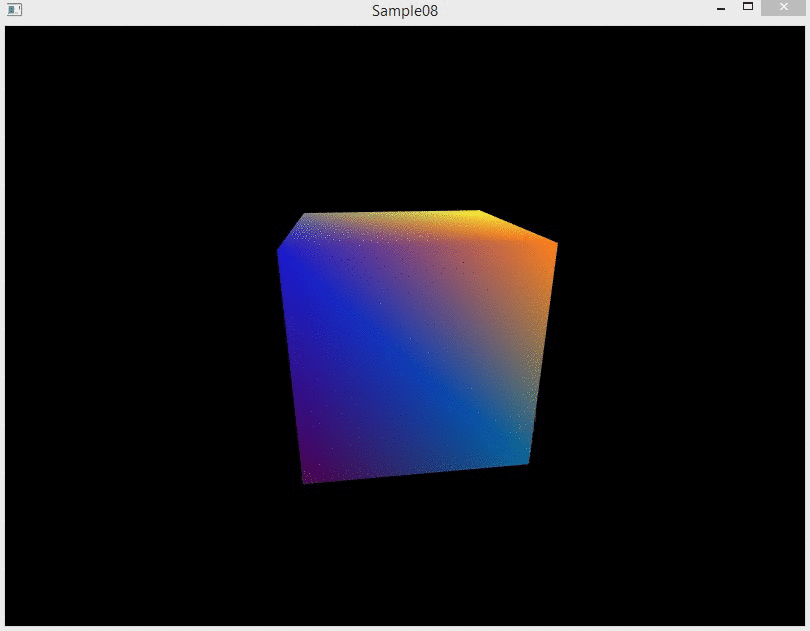
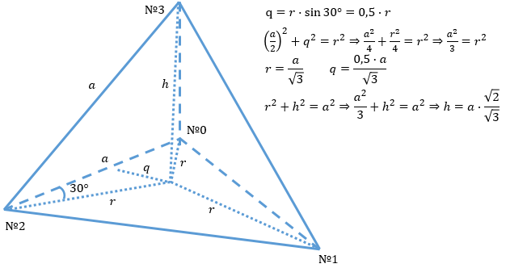
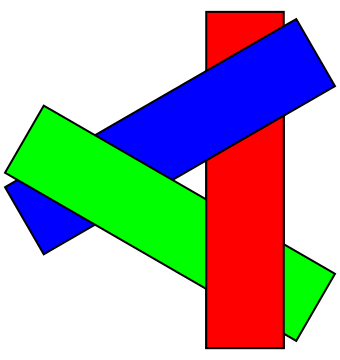
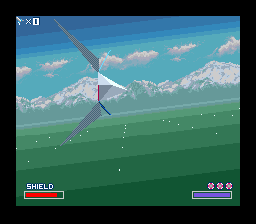

## Создаём проект

Обновите локальный репозиторий [cg-course-2018/QtLabs2D](https://github.com/cg-course-2018/QtLabs2D), переключитесь на ветку `sample08`.

Затем откройте `QtLabs2D.sln` и соберите проекты. Откройте проект Sample08 - в нём вы будете выполнять разработку. Но до этого мы доработаем заготовку проекта, чтобы добавить поддержку рендеринга в 3D пространстве. Места, где надо внести изменения, перечислены ниже; также вы можете их найти по комментариям `// TODO: ...`

### Включаем тест глубины и отсечение задних граней

Добавьте в `Simple3DScene::initialize()` настройку состояния OpenGL: включение теста глубины и отсечения задних граней.

```cpp
// Включаем тест глубины.
glEnable(GL_DEPTH_TEST);

// Включаем отсечение задних граней
glEnable(GL_CULL_FACE);
glFrontFace(GL_CCW);
glCullFace(GL_BACK);
```

Не забудьте добавить в метод рендеринга сцены очистку буфера глубины (а не только буфера цвета):

```cpp
glClear(GL_COLOR_BUFFER_BIT | GL_DEPTH_BUFFER_BIT);
```

### Устанавливаем матрицу проецирования

Чтобы выполнялось перспективное преобразование, мы должны передать в вершинный шейдер матрицу перспективного преобразования. Эта матрица будет создаваться классическим путём, который реализован в функции `glm::perspective`. Мы должны указать несколько параметров:

* fieldOfView - угол обзора зрителя
* aspect - соотношение ширины и высоты окна (чтобы изображение не искажалось по ширине или высоте)
* zNear - расстояние до ближней плоскости отсечения, больше нуля
* zFar - расстояние до дальней плоскости отсечения, больше zNear
    * Чем больше разница между zNear и zFar, тем больше погрешности вычислений глубины и больше перспективные искажения объектов, поэтому разницу между zNear и zFar желательно оставлять минимальной допустимой для вас

Добавьте в метод `Simple3DScene::setProjectionMatrix` следующий код:

```cpp
// Вычисляем матрицу перспективного проецирования.
// Затем передаём матрицу как константу в графической программе.
const float fieldOfView = glm::radians(70.f);
const float aspect = float(width) / float(height);
const float zNear = 0.05f;
const float zFar = 50.f;
const glm::mat4 mat = glm::perspective(fieldOfView, aspect, zNear, zFar);

glUniformMatrix4fv(glGetUniformLocation(m_program, "u_projection_matrix"), 1, GL_FALSE, glm::value_ptr(mat));
```

### Собираем программу

На этом этапе вы можете собрать программу и запустить её. Если всё было сделано правильно, вы увидите разноцветный куб в центре экрана.


### Добавляем вращение куба

В классе MeshP3C3 добавлено свойство `transform`. Мы будем устанавливать его перед каждым кадром. Для этого добавьте следующий код в метод `Simple3DScene::update()`:

```
// Вращаем куб вокруг оси Oy (вертикальной оси).
const float cubeRotation = glm::radians(CUBE_ROTATE_SPEED * deltaSeconds);
m_cubeTransform.rotateBy(glm::angleAxis(cubeRotation, glm::vec3{ 0, 1, 0 }));
m_cube.setTransform(m_cubeTransform);
```

На этом этапе вы можете собрать программу и запустить её. Если всё было сделано правильно, вы увидите вращающийся разноцветный куб в центре экрана.



### Включаем режим wireframe

Добавьте в метод рендеринга сцены установку в glPolygonMode в один из двух режимов: GL_FILL (по умолчанию) либо GL_LINE, в зависимости от значения поля `m_renderWireframe`:

```cpp
// Выбираем режим рендеринга треугольников: только линии (wireframe mode) либо полная заливка.
glPolygonMode(GL_FRONT_AND_BACK, m_renderWireframe ? GL_LINE : GL_FILL);
```

Соберите программу и запустите. Вы должны увидеть периодическое переключение между wireframe режимом и обычным рендерингом:


## Триангуляция тетраэдра

### Вершины куба

В чём OpenGL измеряет расстояния в трёхмерном мире? В 2D графике всё понятно: у нас есть пиксели. На трёхмерной проекции объекты одинакового размера могут дать разные проекции из-за перспективного искажения: чем дальше поверхность или линия, тем она меньше. Поэтому OpenGL измеряет расстояния в единицах измерения, не уточняя, в каких именно. Вы можете измерять в метрах, попугаях или в футах — на картинке это не имеет разницы, потому что исходные размеры не совпадают с проекциями.

Кроме того, трёхмерные тела поддаются преобразованиям. Поэтому мы будем рисовать только единичный куб и не станем заботиться о поддержке масштаба, вращения и положения центра куба. Единичный куб лежит в координатах от -1 до +1, т.е. каждое ребро имеет длину 2.

В примере вы можете найти следующий код:

```cpp
struct VertexP3C3
{
    glm::vec3 pos;
    glm::vec3 color;
};

const glm::vec3 kYellowColor = { 1.0f, 1.0f, 0.2f };
const glm::vec3 kOrangeColor = { 1.0f, 0.5f, 0.1f };
const glm::vec3 kBlueColor = { 0.f, 0.4f, 0.6f };
const glm::vec3 kGreenColor = { 0.1f, 1.0f, 0.1f };
const glm::vec3 kDarkBlueColor = { 0.1f, 0.1f, 0.8f };
const glm::vec3 kVioletColor = { 0.3f, 0.0f, 0.3f };
const glm::vec3 kLightGrayColor = { 0.5f, 0.5f, 0.5f };
const glm::vec3 kBrownColor = { 0.62f, 0.32f, 0.18f };

// Вершины куба служат материалом для формирования треугольников,
//  составляющих грани куба.
const VertexP3C3 kCubeVerticies[] = {
	{ { -1, +1, -1 }, kYellowColor },
	{ { +1, +1, -1 }, kOrangeColor },
	{ { +1, -1, -1 }, kBlueColor },
	{ { -1, -1, -1 }, kGreenColor },
	{ { -1, +1, +1 }, kLightGrayColor },
	{ { +1, +1, +1 }, kDarkBlueColor },
	{ { +1, -1, +1 }, kVioletColor },
	{ { -1, -1, +1 }, kBrownColor },
};
```

## Триангуляция куба

После того, как мы выписали список вершин куба, следует распределить вершины по треугольникам. У куба 6 квадратных граней, их можно описать 12-ю треугольниками. При этом вершины каждого треугольника следует перечислять по часовой стрелке для наблюдателя, смотрящего снаружи куба на этот треугольник. В противном случае треугольник станет поверхностью, видимой изнутри куба, что нарушает физические законы.

Процесс разделения поверхности на треугольники называют *триангуляцией* (*англ.* triangulation). Куб достаточно прост, чтобы выполнить триангуляцию в полуавтоматическом режиме. Для выполнения этой задачи сделаем визуализацию куба с вершинами, нумерованными в том же порядке, в котором они были перечислены ранее в массиве:


```cpp
// Индексы вершин задают косвенный способ получения вершины для
//  каждого из треугольников.
const glm::uvec3 kCubeIndexes[] = {
	{ 0, 1, 2 },
	{ 0, 2, 3 },
	{ 2, 1, 5 },
	{ 2, 5, 6 },
	{ 3, 2, 6 },
	{ 3, 6, 7 },
	{ 0, 3, 7 },
	{ 0, 7, 4 },
	{ 1, 0, 4 },
	{ 1, 4, 5 },
	{ 6, 5, 4 },
	{ 6, 4, 7 },
};
```

Для тесселяции куба мы должны пройтись по массивам данных и сформировать буферы вершин и индексов:

```cpp
MeshDataP3C3 tesselateCube(const Transform3D &transform)
{
	MeshDataP3C3 data;

	// Копируем вершинные данные, затем трансформируем их.
	data.vertexes.assign(std::begin(kCubeVerticies), std::end(kCubeVerticies));
	const glm::mat4 transformMat = transform.toMat4();
	for (auto &v : data.vertexes)
	{
		const glm::vec4 transformed = transformMat * glm::vec4(v.position, 1.f);
		v.position = { transformed.x, transformed.y, transformed.z };
	}

	// Копируем индексы вершин.
	data.indicies.reserve(3 * std::size(kCubeIndexes));
	for (const auto &triangleIndexes : kCubeIndexes)
	{
		data.indicies.push_back(triangleIndexes.x);
		data.indicies.push_back(triangleIndexes.y);
		data.indicies.push_back(triangleIndexes.z);
	}

	return data;
}
```

### Задание cg8.1: триангуляция тетраэдра

Куб относится к так называемым [платоновых тел](https://ru.wikipedia.org/wiki/%D0%9F%D1%80%D0%B0%D0%B2%D0%B8%D0%BB%D1%8C%D0%BD%D1%8B%D0%B9_%D0%BC%D0%BD%D0%BE%D0%B3%D0%BE%D0%B3%D1%80%D0%B0%D0%BD%D0%BD%D0%B8%D0%BA), в число которых также входят тетраэдр, октаэдр, икосаэдр и додекаэдр.


Каждый из этих пяти многогранников является выпуклым, каждая грань является правильной двумерной фигурой, и к каждой вершине сходится одинаковое число рёбер. Такие тела обладают высокой степенью симметрии, а способы расчёта координат их вершин широко известны.

Правильный тетраэдр — это правильный многогранник, состоящий из четырёх граней, каждая из которых является правильным треугольником (с равными сторонами и равными углами по 60°). Как и другие платоновы тела, тетраэдр является выпуклым и обладает высокой степенью симметрии. Сделав простое построение, можно аналитически рассчитать соотношения между его сторонами и особыми внутренними линиями, такими, ка высота тетраэдра (перпендикуляр из вершины к противоположной грани). Вычислим эти отношения:



Требуется добавить функцию триангуляции тетраэдра со сторонами размером √3. Список координат вершин представлен ниже, список индексов треугольников, содержащих эти вершины, вам нужно составить самостоятельно. Тетраэдр должен быть залит четырьмя разными цветами. Для этого вы можете доработать kTetrahedronVerticies в примере ниже:

```cpp
// Сторона тетраэдра равна √3,
// расстояние от центра грани до вершины равно 1.
const VertexP3C3 kTetrahedronVerticies[] = {
    {0.f, 0.f, -1.0f},
    {std::sqrt(1.5f), 0.f, 0.5f},
    {-std::sqrt(1.5f), 0.f, 0.5f},
    {0.f, std::sqrt(2.f), 0.f},
};
```

## Моделируем камеру в фиксированной позиции

Для моделирования камеры в трёхмерном пространстве нам потребуется две матрицы, которые мы будем передавать вершинному шейдеру через две uniform переменные:

* матрица `u_view` будет содержать аффинное преобразование от мировых координат к координатам наблюдателя
* матица `u_projection` будет выполнять перспективное преобразование из координат наблюдателя в нормализованные координаты

В OpenGL при использовании фиксированного конвейера есть ровно две матрицы, относящихся к трансформациям точек и объектов:

Начнём настройку камеры с view: зададим матрицу так, как будто бы камера смотрит с позиции `eye` на точку `center`, при этом направление "вверх" камеры задаёт вектор `up`:

```cpp
void CubeScene::setupView(const glm::ivec2 &size)
{
    glViewport(0, 0, size.x, size.y);

    const glm::vec3 eye = {4, -4, 2};
    const glm::vec3 center = {0, 0, 0};
    const glm::vec3 up = {0, 0, 1};
    // Матрица моделирования-вида вычисляется функцией glm::lookAt.
    const glm::mat4 mv = glm::lookAt(eye, center, up);
    glLoadMatrixf(glm::value_ptr(mv));
    // ... настройка матрицы GL_PROJECTION
}
```

Перспективное преобразование не является аффинным преобразованием. В частности, однородных координатах нижняя строка матрицы перспективного преобразования отличается от `0 0 0 1`. Кроме того, перспективное преобразование не сохраняет относительные размеры линий и поверхностей.


Для перспективного преобразования потребуется создать матрицу с помощью функции `glm::perspective`. Она принимает на вход несколько удобных для программиста параметров преобразования: горизонтальный угол обзора камеры (*англ.* field of view), соотношение ширины и высоты (*англ.* aspect), а также две граничных координаты для отсечения слишком близких к камере и слишком далёких от камеры объектов. Для лучшего понимания взгляните на иллюстрацию:


```cpp
void CubeScene::setupView(const glm::ivec2 &size)
{
    glViewport(0, 0, size.x, size.y);

    // ... настройка матрицы GL_MODELVIEW

    // Матрица перспективного преобразования вычисляется функцией
    // glm::perspective, принимающей угол обзора, соотношение ширины
    // и высоты окна, расстояния до ближней и дальней плоскостей отсечения.
    const float fieldOfView = glm::radians(70.f);
    const float aspect = float(size.x) / float(size.y);
    const float zNear = 0.01f;
    const float zFar = 100.f;
    const glm::mat4 proj = glm::perspective(fieldOfView, aspect, zNear, zFar);
    glMatrixMode(GL_PROJECTION);
    glLoadMatrixf(glm::value_ptr(proj));
    glMatrixMode(GL_MODELVIEW);
}
```

## Решение проблем невидимых поверхностей

При программном рисовании трёхмерного мира, состоящего из объемных тел с непрерывной поверхностью (*англ.* solid bodies), возникает вопрос: как не нарисовать невидимые поверхности? Например, на рисунке горы, покрытой лесом, мы не должны увидеть ни деревьев на противоположном к нам склоне, ни поверхности самого склона.

У художников для решения задачи есть свой алгоритм: сначала они рисуют композицию заднего фона, затем сверху покрывают средний фон, и, наконец, выводят передний фон:


Этот алгоритм так и называется — "алгоритм художника" (*англ.* painter's algorithm). В компьютерной графике он иногда применим, но с модификацией: вместо деления объектов на три группы (задний фон, средний фон и передний фон) придётся отсортировать все объекты и вывести их в порядке приближения. К сожалению, не всегда объекты воможно отсортировать: это известно как "проблема художника" (*англ.* painter's problem).



Для решения проблемы художника в OpenGL сделано следующее:

- все поверхности представляются как базовые примитивы: в ранних версиях OpenGL это были точки, линии, треугольники и четырёхугольники, а в более поздних остались только треугольники
- используется тест буфера глубины, т.е. модификация алгоритма художника, работающая с неделимыми фрагментами фигур
- используется отсечение граней, развернувшихся невидимой стороной после умножения на матрицы GL_MODELVIEW и GL_PROJECTION

## Тест буфера глубины

Буфер глубины OpenGL — это двумерная матрица дополнительных данных, где каждому пикселю соответствует одно значение float: глубина фрагмента примитива, оказавшегося ближе к пикселю, чем остальные фрагменты примитивов, проецируемые на тот же пиксель. Это позволяет реализовать попиксельный алгоритм художника: после приведения в нормализованное пространство каждая примитивная фигура будет разбита на фрагменты, для которых будет проведён тест глубины.

Фрагмент — это атомарная, то есть неделимая, часть фигуры. Если видеокарта не совершает сглаживание, то один фрагмент станет одним пикселем фигуры.

Тест глубины устроен следующим образом: если фрагмент в нормализованном пространтсве стал ближе, чем последнее значение буфера глубины, то мы выбираем его и обновляем значение в буфере глубины, иначе мы отбрасываем фрагмент. В псевдокоде способ выглядит так:

```python
for fragment in triangle.rasterize():
    index = (round(fragment.x), round(fragment.y))
    if depthBuffer[index] > fragment.depth:
        depthBuffer[index] = fragment.depth
    else
        discard fragment
```

Как и любой другой буфер OpenGL, буфер глубины следует очищать. Для этого вызов `glClear` должен получать ещё один флаг `GL_DEPTH_BUFFER_BIT`:

```cpp
void Clear()const
{
    // Заливка кадра цветом фона средствами OpenGL
    glClearColor(m_clearColor.x, m_clearColor.y, m_clearColor.z, m_clearColor.w);
    glClear(GL_COLOR_BUFFER_BIT | GL_DEPTH_BUFFER_BIT);
}
```

Также нужно после создания контекста включить режим теста глубины командой glEnable:

```cpp
glEnable(GL_DEPTH_TEST);
```

## Отсечение задних граней

OpenGL рассчитан на дополнительное отсечение невидимых поверхностей, построенное по принципу отсечения задних граней. По умолчанию включён режим, аналогичный вызову `glFrontFace(GL_CCW)`, и OpenGL делит примитивы на две группы:

- те, вершины которых перечисляются против часовой стрелки (GL_CCW), становятся передними гранями (GL_FRONT)
- те, вершины которых перечисляются по часовой стрелке (GL_CW), становятся задним гранями (GL_BACK)

Вызов `glFrontFace(GL_CW)` изменит классификацию на обратную: перечисление по часовой даст переднюю грань, перечисление против часовой даст заднюю.

Независимо от того, в каком порядке были заданы исходные вершины, если после всех преобразований грань объёмного тела повёрнута к нам лицевой стороной — порядок обхода сохранится, а если её перекроют другие грани — порядок обхода сменится на противоположный.

Режим отсечения граней можно включить командой `glEnable(GL_CULL_FACE)`, после чего можно выбрать способ отсечения: убирать задние грани (GL_BACK), передние грани (GL_FRONT) или оба вида граней (GL_FRONT_AND_BACK).

Соберём всю инициализацию состояния OpenGL в метод OnWindowInit, который будет вызываться один раз поле инициализации окна

```cpp
void CWindow::OnWindowInit(const glm::ivec2 &size)
{
    (void)size;
    glEnable(GL_DEPTH_TEST);
    glEnable(GL_CULL_FACE);
    glFrontFace(GL_CCW);
    glCullFace(GL_BACK);
}
```

Чтобы метод `OnWindowInit` был вызван своевременно, его можно объявить виртуальным в классе CAbstractWindow и вызывать в методе Show:

```cpp
void CAbstractWindow::Show(const glm::ivec2 &size)
{
    m_pImpl->Show(size);
    OnWindowInit(size);
}
```


## Как создать камеру

В OpenGL в режиме версии 1.x есть две трансформирующих вершины матрицы: GL_MODELVIEW и GL_PROJECTION. Матрица GL_MODELVIEW объединяет к себе как переход от локальной системы координат к мировой (Model), так и переход от мировых координат к системе коодинат камеры (View). Класс `CCamera` будет возвращать только одну компоненту GL_MODELVIEW: матрицу вида, созданную функцией [glm::lookAt](http://glm.g-truc.net/0.9.2/api/a00245.html#ga2d6b6c381f047ea4d9ca4145fed9edd5).

Правила движения камеры будут следующими:

- камера всегда смотрит на точку (0, 0, 0), вращается вокруг неё, приближается к ней или отдаляется
- для вращения камеры служат клавиши "Влево" и "Вправо" либо "A" и "D" на клавиатуре
- для приближения и отдаления служат клавиши "Вперёд" и "Назад" либо "W" и "S" на клавиатуре
- камера не может приближаться ближе чем на `1.5f` и не может отдаляться дальше чем на `30.f`
- камера не должна двигаться рывками, и даже при неравных интервалах перерисовки кадра движение должно оставаться плавным, т.е. зависит от `deltaTime` между кадрами

С учётом сказанного, спроектируем следующий интерфейс класса:

```cpp
#pragma once

#include <glm/fwd.hpp>
#include <SDL2/SDL_events.h>
#include <boost/noncopyable.hpp>
#include <set>

class CCamera : private boost::noncopyable
{
public:
    explicit CCamera(float rotationRadians, float distance);

    void Update(float deltaSec);
    bool OnKeyDown(const SDL_KeyboardEvent &event);
    bool OnKeyUp(const SDL_KeyboardEvent &event);

    glm::mat4 GetViewTransform() const;

private:
    float m_rotationRadians = 0;
    float m_distance = 1;
    std::set<unsigned> m_keysPressed;
};
```

Методы Update, OnKeyDown, OnKeyUp должны вызываться извне — например, из класса окна. При этом методы обработки событий возвращают true, если событие было обработано, чтобы класс окна мог не рассылать это событие далее другим объектам.

Внутри класс хранит угол поворота камеры, отдаление от центра мира и подмножество клавиш, которые сейчас нажаты. Хранение подмножества нажатых клавиш позволяет легко устранить ряд непростых случаев:

- пользователь нажал "Влево", затем "Вправо", потом отпустил "Влево"; после этого камера должна вращаться вправо
- пользователь нажал "Влево" и "Вперёд"; после этого камера должна вращаться влево и при этом приближаться
- пользователь нажал "Вперёд" и "Назад"; при этом камера может не двигаться или двигаться в одном приоритетном направлении — оба варианта хороши

Чтобы отслеживать нажатие только нужных клавиш, создадим функцию-предикат ShouldTrackKeyPressed:

```cpp
bool ShouldTrackKeyPressed(const SDL_Keysym &key)
{
    switch (key.sym)
    {
    case SDLK_LEFT:
    case SDLK_RIGHT:
    case SDLK_UP:
    case SDLK_DOWN:
    case SDLK_w:
    case SDLK_a:
    case SDLK_s:
    case SDLK_d:
        return true;
    }
    return false;
}
```

Также подключим заголовок с функциями вращения вектора, введём вспомогательные константы и функции, позволяющие получить скорость поворота и скорость приближения (возможно, нулевые или отрицательные) на основе информации о нажатых клавишах:

```cpp
#include <glm/gtx/rotate_vector.hpp>

namespace
{
const float ROTATION_SPEED_RADIANS = 1.f;
const float LINEAR_MOVE_SPEED = 5.f;
const float MIN_DISTANCE = 1.5f;
const float MAX_DISTANCE = 30.f;

float GetRotationSpeedRadians(std::set<unsigned> & keysPressed)
{
    if (keysPressed.count(SDLK_RIGHT) || keysPressed.count(SDLK_d))
    {
        return ROTATION_SPEED_RADIANS;
    }
    if (keysPressed.count(SDLK_LEFT) || keysPressed.count(SDLK_a))
    {
        return -ROTATION_SPEED_RADIANS;
    }
    return 0;
}

float GetLinearMoveSpeed(std::set<unsigned> & keysPressed)
{
    if (keysPressed.count(SDLK_UP) || keysPressed.count(SDLK_w))
    {
        return -LINEAR_MOVE_SPEED;
    }
    if (keysPressed.count(SDLK_DOWN) || keysPressed.count(SDLK_s))
    {
        return +LINEAR_MOVE_SPEED;
    }
    return 0;
}
} // anonymous namespace
```

После этого с небольшим применением линейной алгебры мы можем реализовать методы класса CCamera:

```cpp
CCamera::CCamera(float rotationRadians, float distance)
    : m_rotationRadians(rotationRadians)
    , m_distance(distance)
{
}

void CCamera::Update(float deltaSec)
{
    m_rotationRadians += deltaSec * GetRotationSpeedRadians(m_keysPressed);
    m_distance += deltaSec * GetLinearMoveSpeed(m_keysPressed);
    m_distance = glm::clamp(m_distance, MIN_DISTANCE, MAX_DISTANCE);
}

bool CCamera::OnKeyDown(const SDL_KeyboardEvent &event)
{
    if (ShouldTrackKeyPressed(event.keysym))
    {
        m_keysPressed.insert(unsigned(event.keysym.sym));
        return true;
    }
    return false;
}

bool CCamera::OnKeyUp(const SDL_KeyboardEvent &event)
{
    if (ShouldTrackKeyPressed(event.keysym))
    {
        m_keysPressed.erase(unsigned(event.keysym.sym));
        return true;
    }
    return false;
}

glm::mat4 CCamera::GetViewTransform() const
{
    glm::vec3 direction = {0.f, 0.5f, 1.f};
    // Нормализуем вектор (приводим к единичной длине),
    // затем поворачиваем вокруг оси Y.
    // см. http://glm.g-truc.net/0.9.3/api/a00199.html
    direction = glm::rotateY(glm::normalize(direction), m_rotationRadians);

    const glm::vec3 eye = direction * m_distance;
    const glm::vec3 center = {0, 0, 0};
    const glm::vec3 up = {0, 1, 0};

    // Матрица моделирования-вида вычисляется функцией glm::lookAt.
    // Она даёт матрицу, действующую так, как будто камера смотрит
    // с позиции eye на точку center, а направление "вверх" камеры равно up.
    return glm::lookAt(eye, center, up);
}
```

## Задание cg8.1

Изучите, что представляет из себя [Крен](https://ru.wikipedia.org/wiki/%D0%9A%D1%80%D0%B5%D0%BD) летательного аппарата. Добавьте в класс FlyingCamera новый параметр в метод rotate: `roll` (крен).

- добавьте обработку этого параметра в методе rotate
- добавьте возможность задавать крен камеры с помощью колеса мыши

Иллюстрация крена на 360°:



Другую иллюстрацию вы можете найти, введя в google запрос [do a barrel roll](https://www.google.com/search?q=do+a+barrel+roll&ie=utf-8&oe=utf-8).

## Задание cg8.2

## Задание cg8.3

Используя шаблон проектирования [Декоратор](https://refactoring.guru/ru/design-patterns/decorator), разработайте класс CameraControllerDisabler со следующим интерфейсом:

```cpp
class CameraControllerDisabler final : public ICameraController
{
public:
    explicit CameraControllerDisabler(ICameraControllerPtr nested);

    // Блокирует управление камерой на N секунд.
    void disableFor(float seconds);

    void update(float deltaSeconds) final;

private:
    ICameraControllerPtr m_nested;
};
```

Блокирование управления камерой можно инициировать из
