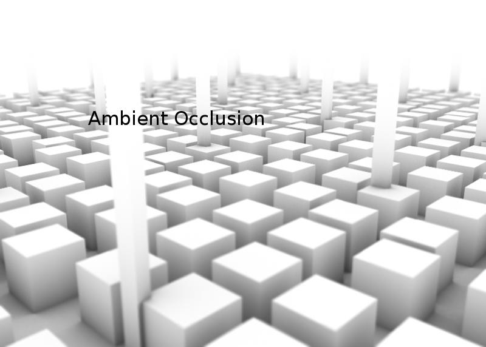
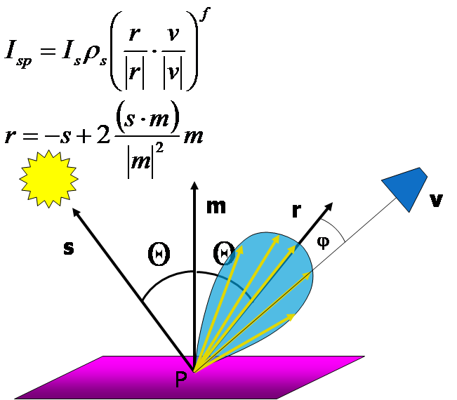

## TODO: Подготавливаем проект

Для тестирования освещения мы должны подготовить объекты на сцене. Лучше всего использовать несколько объектов:

* хотя бы один объект с гранями, такой как куб
* хотя бы один объект с гладкой поверхностью, такой как сфера
* возможно, какой-либо гладкий объект невыпуклой формы, такой как тор или бутылка Клейна

Для начала мы будем использовать только куб.

## Закон Ламберта и модель освещения Lambert

Согласно Wikipedia, [Закон Ламберта](https://ru.wikipedia.org/wiki/%D0%97%D0%B0%D0%BA%D0%BE%D0%BD_%D0%9B%D0%B0%D0%BC%D0%B1%D0%B5%D1%80%D1%82%D0%B0) - физический закон, согласно которому яркость рассеивающей свет (диффузной) поверхности одинакова во всех направлениях. Из этого закона следует формула для расчёта силы света, рассеиваемого плоской площадкой, пропорционально интенсивности излучения источника света, коэффициенту рассеивания материала и косинусу угла, под которым падает поток света:


### Нормали к поверхности

Для корректного расчёта освещения по закону Ламберта нужны дополнительные сведения о поверхности — перпендикуляры к точкам поверхности единичной длины. Такие перпендикуляры называются *нормалями*, а процесс деления вектора на собственную длину ради получения вектора единичной длины называется *нормализацией*. Процесс нормализации выполняет, например, функция `glm::normalize` библиотеки GLM, принимающая единственным параметром нормализуемый вектор.

Нормали используются для расчёта рассеянной силы света GL_DIFFUSE по закону Ламберта: зная вектор нормали и вектор направления света, несложно вычислить угол падения лучей на поверхность. Принято вычислять нормали на CPU, и на GPU передавать готовые нормали как атрибут каждой вершины.

Как рассчитать нормаль к грани? Согласно одной из аксиом геометрии, три точки однозначно задают плоскость, и одновременно задают треугольник, лежащий на этой плоскости. Нормали к плоскости всегда имеют одно направление, то есть для всех трёх вершин плоской треугольной грани поверхности следовало бы задать в качестве атрибута "нормаль" одно и то же значение:


Такой подход позволит реализовать вычисление и передачу нормалей для любой поверхности с известными плоскими гранями, например, для икосаэдра:


Однако, существуют и гладкие поверхности. Простейшим примером является сфера:


OpenGL не имеет примитивов для рисования по-настоящему гладких поверхностей. Но треугольники вместе с закраской треугольников фрагментным шейдером позволяют имитировать гладкость. Идея состоит в том, чтобы каждая нормаль каждой вершины треугольника имела собственное значение, равное значению нормали к касательной плоскости к данной точке поверхности. Тогда освещение вершин будет разным, и интерполяция освещения создаст иллюзию гладкости.

Для сферы вектора нормалей к касательным плоскостям поверхностей будут выглядеть примерно следующим образом:


### Отдельная матрица преобразования для нормалей

Для нормалей в шейдер потребуется передавать особую матрицу преобразования. Способ преобразования нормалей будет отличаться от преобразования точек поверхности. Поскольку нормаль является вектором единичной длины, то трансформации scale и translate для неё бесполезны; кроме того, неоднородное масштабирование может нарушить главное свойство нормали — перпендикулярность к плоскости, касающейся поверхности в вершине:

 

Корректную матрицу трансформации нормалей можно получить способом, обозначенным в [ответе на вопрос "What is the gl_NormalMatrix and gl_ModelViewMatrix in shaders?" на stackoverflow](http://stackoverflow.com/questions/23210843/what-is-the-gl-normalmatrix-and-gl-modelviewmatrix-in-shaders):

```glsl
mat4 normal_matrix = transpose(inverse(u_world_matrix))
```

Мы не можем получить матрицу преобразования нормалей средствами шейдеров, поскольку в GLSL нет дорогостоящей операции обращения матрицы. Вместо того, чтобы вычислять обратную матрицу для каждой вершины и каждого фрагмента, мы будем передавать матрицу нормалей через uniform-переменную, вычисляя её силами центрального процессора с помощью GLM:

```cpp
glm::mat4 getNormalMatrix(const glm::mat4 &modelView)
{
    return glm::transpose(glm::inverse(modelView));
}
```

## TODO: Добавляем модель освещения Ламберта

### Добавляем точечный источник света

### Интерполяция по Гуро

## Задание cg9.1: добавить направленный источник света

Добавьте в программу поддержку направленных

## Задание cg9.2: передача цвета материала

## Модель освещения Фонга (Phong)

В расчёте освещения по модели Фонга участвуют следующие сущности и свойства:

* цвет источника света (цвет также задаёт интенсивность, например, источник с цветом `{1, 1, 1, 1}` интенсивнее, чем `{0.5, 0.5, 0.5, 1`).
* цвет материала (может быть разным для разных категорий освещения, например, медь имеет красновато-оранжевый цвет, но блики света на медной поверхности жёлтые)
* взаимное положение источника света и поверхности

В модели освещения Фонга финальный цвет фрагмента выбирается путём вычисления суммарного эффекта трёх категорий освещения: фоновый свет (ambient light), рассеянный свет (diffuse light) и блики (specular light). 
Вот так выглядят три компонента и результат их сложения:


>RGBA-цвета всех трёх категорий освещения попросту складываются по компонентам, и полученные в результате Red, Green, Blue компоненты обрезаются в границах `[0, 1]`. В результате очень ярко освещённый белым источником светло-жёлтый объект может стать просто белым, поскольку его цвет `{5.3, 3.2, 1.1, 1}` будет обрезан до белого цвета `{1, 1, 1, 1}`.

### Расчёт освещения от окружения (ambient light)

Расчёт рассеянного освещения по закону Ламберта даёт неприятный эффект: обратная по отношению к источнику света сторона объекта не освещена. В реальном мире рассеянный свет отражается множество раз от различны объектов даже те поверхности, на которые не попадают прямые лучи от источника света.

Таким образом, хорошая модель освещения должна учитывать свет, рассеянный окружением объекта. Такая компонента цвета называется ambient. Есть два популярных способа вычислить эту компоненту:

* принять за константу: считать, что в пределах одной сцены ambient цвет одинаков в любой точке
* вычислять трассировкой лучей: выпускать лучи из объекта (например, в 6 направлениях вперёд/назад/влево/вправо/вверх/вниз) и считать, сколько лучей не пересекается с другими объектами: чем больше лучей уходит в бесконечность без пересечений, тем интенсивнее ambient light

Второй способ расчёта известен также как ambient occlusion, и его эффект изображён ниже:



Мы не будем использовать ambient occlusion, т.к. для нас это ненужное усложнение. Вместо ambient occlusion мы будем использовать константный ambient light.

## Интерполяция по Фонгу

### Задание cg9.3: переключение метода интерполяции

Расположите источники света на сцене так, чтобы на объектах (на кубе и на сфере) были видны яркие блики.

### Расчёт световых бликов (specular light)

Модель Фонга по сравнению с простой моделью Ламберта вносит третью компоненту — световые блики, которые проявляются, когда угол падения лучей на тело практически равен углу отражения луча, попадающего в камеру. Вычислить прибавку цвета от бликов можно по следующей формуле:



## Направленные и точечные источники света

В современном OpenGL параметры источника света полностью определяются в шейдере. Тем не менее, исторически принято выделять три разных типа источников света:

- бесконечно удалённый направленный (такой, как Солнце или Луна)
- точечный источник на фиксированной позиции (такой, как светлячок)
- прожекторный источник (*англ. spotlight), то есть точечный источник, свет от которого образует коническую форму

## Передача в шейдер параметров источника света и материала
