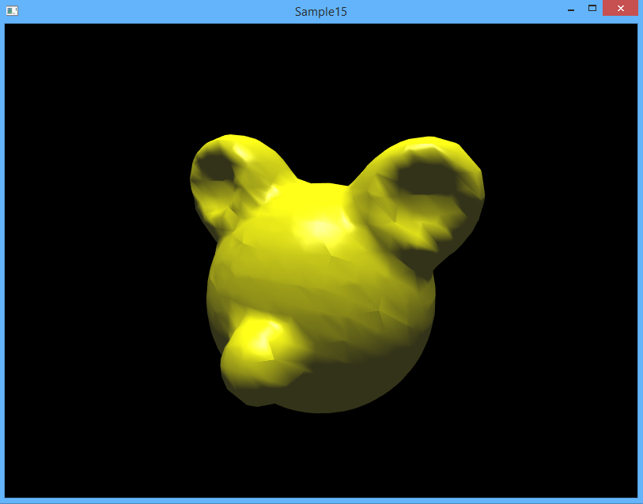
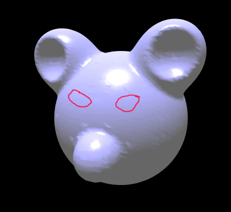

## Подготовка проекта

* Обновите или клонируйте репозиторий [github.com/cg-course-2018/QtLabs2D](https://github.com/cg-course-2018/QtLabs2D)
* Переключитесь на ветку "sample15", создайте от неё новую ветку, уникальную для вас - например, "sample15_%ФАМИЛИЯ%"
* Откройте QtLabs2D.sln, соберите и запустите проект Sample15
* Вы увидите следующее:

С помощью горячих клавиш WASD вы можете управлять камерой

## Задание cg15.1 - подобрать степень детализации

>Подсказки можно найти по комментариям `// TODO: (cg15.1)` в коде

Инициализация изоповерхности происходит в методе `IsosurfaceScene::initializeObjects()`. В текущей версии детализация поверхности достаточно плохая. Требуется подобрать значение константы cubeSize под возможности вашего компьютера, чтобы расчёт занимал не более 1-2 секунд.

## Задание cg15.2 - нарисовать красные глаза

Нужно нарисовать красные глаза и добавить для них глазницы.

Доработки можно выполнить в методе `IsosurfaceScene::initializeObjects()`. Требуется:

* путём добавление новых источников потенциала поля (объектов класса IsoPointSource) создать на голове, отображаемой в программе, углубления для глаз
* для визуализации зрачков добавить на сцену две новых полигональных сетки, полученных путём триангуляции сферы
  * для триангуляции сферы используйте функцию "utils::tesselateSphere"
  * два новых узла будут храниться в поле типа "SceneGraphNodePtr" подобно полю "m_surfaceMesh"

## Задание cg15.3 - заменить бинарный поиск точки пересечения на линейную интерполяцию

На данный момент в коде метода `IsoSurface::getPointAtThresholdOnEdge` запускается бинарный поиск точки пересечения одиночного ребра и изоповерхности. Поиск выполняется рекурсивно методом `IsoSurface::getPointAtThresholdBetween`.

* Ознакомьтесь с комментариями в этих методах, изучите их код
* Затем замените рекурсивный бинарный поиск пересечения на линейную интерполяцию между двумя вершинами ребра
    * Для линейной интерполяции пригодится функция [glm::mix](http://glm.g-truc.net/0.9.9/api/a00143.html#ga8e93f374aae27d1a88b921860351f8d4)
    * Коэффициент линейной интерполяции можно вычислить, используя известный потенциал поля в двух вершинах ребра и пороговое значение потенциала, которое хранится в поле `m_threshold`

<!-- ## Задание cg15.3 - изменить функцию поля -->
