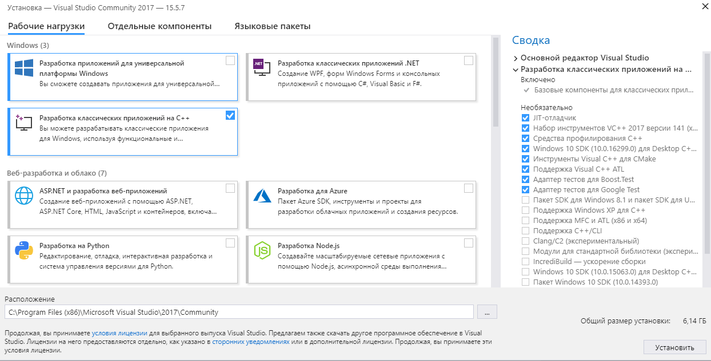
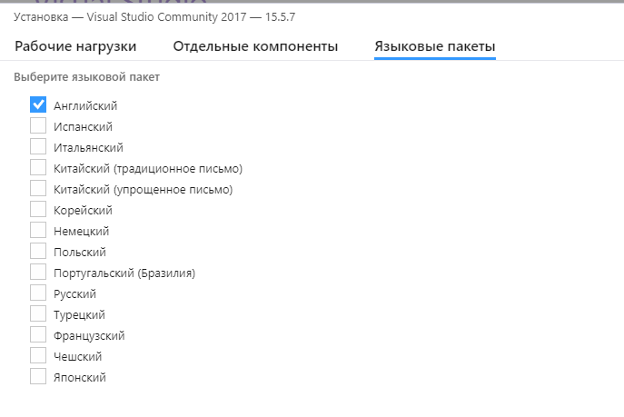
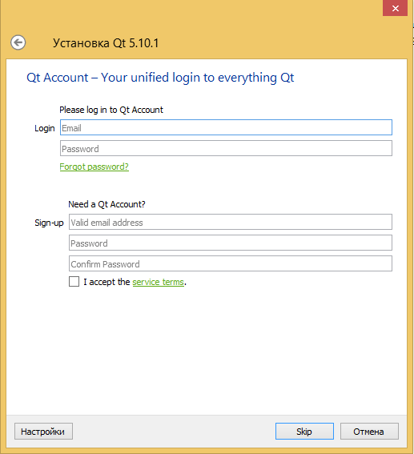
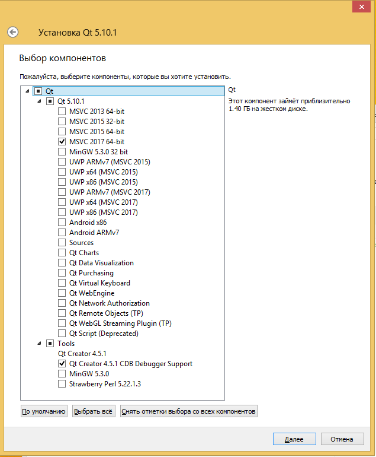

## Установка Visual Studio 2017

Microsoft предоставляет несколько редакций Visual Studio: большинство из них платные, но мы будем использовать бесплатную редакцию - Community Edition.

>Редакция Community Edition предназначена для инди-разработчиков, обучающихся и для разработчиков OpenSource проектов. Для коммерческой разработки в команде потребуются другие редакции либо среда MonoDevelop.

Загрузите онлайн-инсталлятор Visual Studio 2017 Community Edition: [visualstudio.com/downloads](https://www.visualstudio.com/downloads/)

После загрузки запустите (на медленных машинах запуск может быть долгим).
В установщике выберите один компонент - “Разработка классических приложений на C++”:



На вкладке языковых пакетов уберите пакет “Русский”, выберите “Английский” - с англоязычным интерфейсом гораздо легче найти решение какой-либо проблемы в Интернете:



Запустите установку Visual Studio. Процесс установки может занять 1-2 часа.

После установки Visual Studio вы можете установить плагины, загрузив их с сайта visualstudio и запустив:

* [ClangFormat](https://marketplace.visualstudio.com/items?itemName=LLVMExtensions.ClangFormat)
* [C++ Debugger Visualizers for VS2017](https://marketplace.visualstudio.com/items?itemName=ArkadyShapkin.CDebuggerVisualizersforVS2017)

## Установка Git

Git - это OpenSource система контроля версий, представленная пакетом инструментов командной строки.
Скачайте и установите Git для Windows: https://git-scm.com/download/win

Для более комфортной работы с git вы можете установить какой-нибудь графический клиент для Git:

* Source Tree (https://www.sourcetreeapp.com/)
* Tortoise Git (https://tortoisegit.org/)
* клиент для работы с Github (https://desktop.github.com/).

## Установка Qt

Загрузить Qt 5.10 можно по адресу [download.qt.io/archive/qt/5.10/5.10.1/](https://download.qt.io/archive/qt/5.10/5.10.1/) (файл "qt-opensource-windows-x86-5.10.1.exe"). После загрузки пройдите через стандартные шаги установщика.

Чтобы избежать регистрации на сайте Qt Project, вы можете просто стереть email в соответствующем окне, и кнопка Skip станет активной.



При установке Qt потребуется установить два компонента: Qt для VS2017 в x64 версии и интеграцию с CDB для QtCreator:



Кроме того, потребуется плагин к Visual Studio для разработки на Qt, который можно загрузить на [download.qt.io/official_releases/vsaddin/](https://download.qt.io/official_releases/vsaddin/) (файл "qt-vsaddin-msvc2017-2.2.0.vsix").

## Установка CMake

Для сборки примеров потребуется CMake. Свои работы также рекомендуется делать с помощью CMake.

- Скачайте Cmake [с официального сайта](https://cmake.org/download/)
- При установке не забудьте поменять опцию, чтобы путь к CMake был добавлен в переменную [PATH](http://superuser.com/questions/284342/what-are-path-and-other-environment-variables-and-how-can-i-set-or-use-them)


>Переменные окружения, такие как [PATH](http://superuser.com/questions/284342/what-are-path-and-other-environment-variables-and-how-can-i-set-or-use-them), передаются приложению при старте. Если вы поменяли переменную PATH, изменения вступят в силу после перезапуска программ.

## Установка и использование vcpkg

>Подробное описание vcpkg и список пакетов можно найти здесь: [blogs.msdn.microsoft.com/vcblog/2016/09/19/vcpkg-a-tool-to-acquire-and-build-c-open-source-libraries-on-windows](https://blogs.msdn.microsoft.com/vcblog/2016/09/19/vcpkg-a-tool-to-acquire-and-build-c-open-source-libraries-on-windows/)

Пакетный менеджер vcpkg распространяется в исходниках и собирается на машине разработчика. Для сборки потребуется установленная Visual Studio с инструментами C++ разработчика.

Порядок установки описан в консольных командах:

```
:: Клонируем репозиторий vcpkg (ветка master)
git clone https://github.com/Microsoft/vcpkg

:: Переходим в каталог клона репозитория
cd vcpkg

:: Выполняем скрипт для сборки vcpkg
powershell -exec bypass scripts\bootstrap.ps1
:: Теперь в корне репозитория лежит vcpkg.exe, который можно вызывать
::  из каталога либо добавить в переменную окружения PATH.
```

После того, как вы получили `vcpkg.exe`, вы можете устанавливать пакеты командой `install`.

В частности, нам потребуется установить GLBinding и GLM:

```
vcpkg install glbinding:x86-windows glm:x86-windows
```

В команде, представленной выше, имена пакетов перечисляются по порядку, а в качестве суффикса используется так называемый "триплет": `имя_пакета:триплет`.

- Имя пакета задаёт одно из множества имён доступных библиотек, полный список есть в [блоге Visual C++ Team](https://blogs.msdn.microsoft.com/vcblog/2016/09/19/vcpkg-a-tool-to-acquire-and-build-c-open-source-libraries-on-windows/)
- Триплет задаёт архитектуру и режим сборки

Доступные триплеты:

```
x86-windows
x64-windows-staticx
x86-windows
x86-windows-static
arm-uwp
x64-uwp
x86-uwp
```

Для данного курса рекомендуются триплеты `x86-windows` для сборки 32-битной версии программы и `x64-windows` для сборки 64-битной версии. Вместо явного указания триплета для каждой библиотеки можно разом указать триплет для всех:

```
vcpkg --triplet x86-windows glbinding glm
```

Последняя, но крайне важная деталь: включите автоматическую интеграцию пакетов vcpkg во все проекты Visual C++:

```
:: Включаем интеграцию во все проекты Visual C++ в системе.
:: При первом запуске нужны права администратора.
vcpkg integrate install

:: Удаляем интеграцию - если она вам помешала.
vcpkg integrate remove
```
