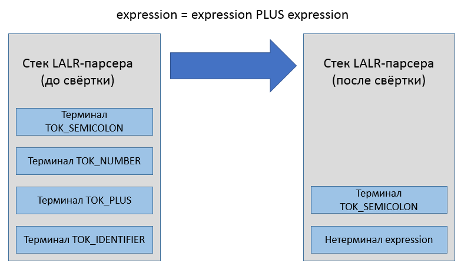
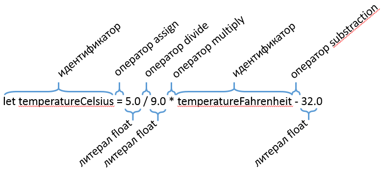
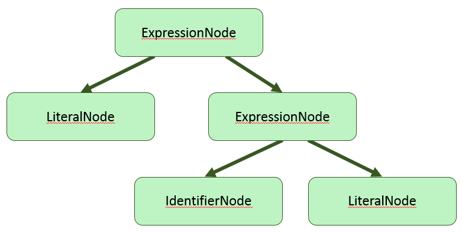

## Что такое Lemon parser generator?

Lemon &mdash; генератор синтаксических анализаторов (parser generator), разработанный автором СУБД SQLite (Dr. Richard Hipp), и доступный без лицензии как общественное достояние. Генераторы парсеров генерируют код автомата для [восходящего разбора по принципу сдвига и свёртки (shift-reduce)](shift-reduce.html).

Ещё до появления Lemon использовались генераторы парсеров UNIX Yacc и GNU Bison. Они не устроили автора SQLite, и он написал в целом похожий на GNU Bison генератор парсеров, учитывая прошлые ошибки проектирования:

- Bison и Yacc генерируют блокирующую функцию разбора, которая при вызове хочет получать весь файл сразу путём последовательного запроса токенов. Но в интерпретаторе SQL этого файла ещё просто нет, есть только отдельные строки!
- Bison и Yacc не позволяют выполнить указанный программистом код при выбрасывании значения из стека автомата, что может спровоцировать утечки памяти, если в стеке лежат указатели.
- Bison и Yacc генерируют не самый удобный и чистый код на C

## Установка

Lemon состоит из двух файлов: 

## Интерфейс командной строки

Синтаксис вызова lemon следующий:

```
lemon <опции> <входной файл *.y или *.lemon>
```

Список опций командной строки:

```
  -c           Не применять сжатие к таблице контекстных действий правил.
  -D<string>   Объявить макрос, используемый в директивах %ifdef.
  -g           Генерировать парсер грамматики без контекстных действий.
  -m           Генерировать файл, совместимый с makeheaders.
  -l           Не добавлять в код директивы #line.
  -p           Печатать конфликты, решённые автоматически за счёт приоритета операторов
  -q           (Тихий режим) не записывать файл отчёта Grammar.out
  -b           Печатать в отчёте (файл Grammar.out) только ключевую информацию.
  -r           Не сортировать и не менять номера состояний
  -s           Распечатать в консоль статистику сгенерированного парсера.
  -x           Распечатать версию утилиты.
  -T<string>   Указать свой файл-шаблон для генератора кода.
  -f<string>   Игнорируется. (Заготовка на будущее для опций компилятора '-f')
  -I<string>   Игнорируется. (Заготовка на будущее для опций компилятора '-I')
  -O<string>   Игнорируется. (Заготовка на будущее для опций компилятора '-O')
  -W<string>   Игнорируется. (Заготовка на будущее для опций компилятора '-W')
```

> Подробнее об утилите makeheaders сказано здесь: [hwaci.com/sw/mkhdr/](http://www.hwaci.com/sw/mkhdr/).

## Определение грамматики

Описание грамматики составляется в файле с расширением "*.y" либо "*.lemon". Файл содержит список директив и правил грамматики, с помощью которых можно собрать дерево разбора либо абстрактное синтаксическое дерево, как только парсер получит извне последовательность токенов. Некоторые правила грамматики содержат императивные действия, заключённые в фигурные скобки:

```
// Разрешены однострочные комментарии в стиле C++
// Все директивы начинаются с символа %
%name ParseCalcGrammar

// Код в блоке директивы include попадёт в начало генерируемого файла "*.c"
%include {
#include "Token.h
#include "CalcParser.h"
#include <assert.h>
#include <math.h>
} // end %include

translation_unit ::= expression(A).
{
    // В фигурных скобках находится императивный код,
    //  срабатывающий в момент свёртки символов по правилу
    pParse->PrintResult(A.value);
}
```

Действия в фигурных скобках могут ссылаться на терминальные и нетерминальные символы, используя нотацию вида `expression(A)` для придания символу имени `A`, или любого другого имени. Когда правило грамматики однозначно распознаётся, оно "сворачивается", а связанное действие выполняется. Если быть точным, исходный код действия копируется в сгенерированный код парсера, попадая внутрь какого-то блока кода внутри функции Parse, и получая доступ к именованным символам, терминальным и нетерминальным. Задача действия &mdash; прочитать значения ячеек стека, соответствующих символам в правой части правила, и заполнить ячейку стека, соответствующую конструируемому символу в левой части.



### Разделение на токены

На первом шаге разбора формальных языков текст разбивается на лексические токены. Вы можете выполнять этот шаг любым удобным способом, и Lemon в этом не помощник &mdash; он всего лишь объявляет целочисленные идентификаторы токенов для каждого терминального символа, описанного в грамматике. Ядро сгенерированного парсера ожидает, что токены поступают один за другим последоватеьно, формируя виртуальный (либо реальный) поток токенов, которые и разбираются по грамматике.



Задача лексера/сканнера &mdash; создать поток токенов. Каждая категория токенов имеет свой идентификатор, такой как TOK_LEFT_PAREN, TOK_CLASS_KEYWORD и другие. Каждый токен имеет связанное с ним значение, дополняющее идентификатор токена. Примером служит, например, токен TOK_NUMBER со значением "1234". Все токены используют один и тот же тип для хранения своих значений, и этот тип определён директивой `%token_type` (по-умолчанию `int`). Дополнительная информация о токене может выглядеть так:

```cpp
#pragma once

struct Token
{
    // Позиция в исходном коде.
    unsigned position;
    // Числовое значение литерала (0 для остальных токенов).
    double value;
};
```

### Восходящий разбор в стиле shift-reduce

Более низкоуровневое правило грамматики должно сворачиваться раньше, чем более высокоуровневое правило. То есть, с точки зрения деревьев разбора грамматики, листовые узлы создаются перед родительскими узлами. Поэтому действия правил должны придерживаться стратегии передачи значений из листовых узлов в родительские узлы. В процедурном стиле этого можно добиться, используя обобщённую структуру, представляющую узел дерева. Например, для простой грамматики калькулятора подойдёт такая структура:

```cpp
struct Expression
{
    double value; // числовое значение
    int operationNo; // идентификатор операции +, -, *, / или %
    Expression *pLeft; // необязательный левый дочерний  узел
    Expression *pRight; // необязательный правый дочерний узел
};
```

В объектно-ориентированном стиле принят паттерн, известный как Abstract Syntax Tree. Вместо универсальной структуры, описывающей узел разбора, используются конкретные классы, наследуемые от одного или нескольких базовых интерфейсов: IExpressionAst, IStatementAst, IDeclarationAst.

```cpp
interface IExpression
{
    double Evaluate(RuntimeEnvironment &env) = 0;
};

class BinaryOperationNode : public IExpression
{
public:
    // в свойствах класса - информация об операторе и двух операндах,
    //  также имеющих тип IExpression
};

class LiteralNode : public IExpression
{
public:
    // в свойствах класса - тип и значение литерала
};

class IdentifierNode : public IExpression
{
public:
    // в свойствах класса - строковое имя и указатель на объект,
    //  на который ссылается идентификатор
};
```



## Процедурный интерфейс генерируемого кода

Все типы токенов в Lemon получают целочисленные идентификаторы, представленные как набор макросов. Для управления генерацией имён макросов в lemon есть директива "token_prefix". Директива "token_type" указывает строку, которая будет именем типа токена.

```
// All token codes are small integers with #defines that begin with "TK_"
%token_prefix TK_

// The type of the data attached to each token is Token.  This is also the
// default type for non-terminals.
//
%token_type {Token}
%default_type {Token}
```

Предполагаем, что структура Token объявлена в "Token.h":

```cpp
#pragma once

struct Token
{
    // position in source code.
    unsigned position;
    // token value (always 0 for most tokens).
    double value;
};

// Для языка C заменяем 'struct Token' на простой 'Token'
typedef struct Token Token;
```

После генерации набор токенов выглядит следующим образом:

```cpp
// Токен 0 зарезервирован под конец файла
// enum не используется по историческим причинам.
#define TK_PLUS                             1
#define TK_MINUS                            2
#define TK_STAR                             3
#define TK_SLASH                            4
#define TK_PERCENT                          5
#define TK_LPAREN                           6
#define TK_RPAREN                           7
#define TK_NUMBER                           8
```

> Числовые значения токенов выбирает именно синтаксический анализатор, а не лексический. Дело в том, что для лексического анализатора токены &mdash; это выходные значения, и их изменение не меняет таблицу переходов в конечном автомате, который может быть внутри лексического анализатора. Для синтаксического анализатора токены становятся терминальными символами, и их числовые коды попадают в таблицу переходов парсера как входные сигналы автомата. Также в таблицу попадают числовые коды нетерминальных символов (объявленных в левой части правил грамматики).

Lemon генерирует код, который позволяет держать в памяти множество парсеров одновременно, и использовать их по мере поступления токенов. Эта особенность очень важна для СУБД SQLite, которая обрабатывает SQL-код из множества присоединившихся клиентов. Имена сгенерированных функций зависят от директивы "name". Пример использования директивы:

```
// The name of the generated procedure that implements the parser
// is as follows:
%name ParseCalcGrammar
```

В данном случае процедурный интерфейс парсера будет выглядеть так:

```cpp
void *ParseCalcGrammarAlloc(void *(*mallocProc)(size_t));
void ParseCalcGrammar(void*, int, Token);
void ParseCalcGrammarFree(
  void *parser,               /* The parser to be deleted */
  void (*freeProc)(void*)     /* Function used to reclaim memory */);
#ifndef NDEBUG
void ParseCalcGrammarTrace(FILE * TraceFILE, char * zTracePrompt);
#endif
```

- Функция "ParseCalcGrammarAlloc" создаёт новое состояние парсера подобно конструкторам в C++, и она принимает "mallocProc" &mdash; указатель на функцию, выделяющую память
- Функция "ParseCalcGrammar" получает на вход токен и продвигает состояние shift-reduce парсера вперёд на один shift и несколько reduce
- Функция "ParseCalcGrammarFree" работает как деструктор, очищая состояние парсера и затем удаляя его через предоставленную функцию освобождения памяти "freeProc"
- В отладочном режиме сборки также доступна функция "ParseCalcGrammarTrace", которая устанавливает файл, куда lemon будет записывать отладочную информацию. Нетрудно догадаться, что для вывода отладочной информации в консоль достаточно передать вместо файла объект "stderr" или "stdout".

Контекстные действия, добавленные к правилам грамматики, будут встроены в функцию ParseCalcGrammar вперемешку с генерируемым кодом парсера. Возникает вопрос &mdash; как из действий обратиться к остальным объектам программы, если в функции ParseCalcGrammar доступны лишь параметры этой функции? Для проброса внешнего контекста в функцию ParseCalcGrammar предназначена директива "extra_argument", позволяющая избегать использования глобальных переменных (тем самым позволяя иметь множество объектов-парсеров, существующих и работающих совместно).

```cpp
// The generated parser function takes a 4th argument as follows:
%extra_argument {ParserState *pState}
```

Теперь в контекстных действиях правил будет доступна переменная "pState", а сигнатура функции ParseCalcGrammar изменится:

```cpp
void ParseCalcGrammar(void*, int, Token, ParserState *);
```

## Объектный фасад к процедурному коду

В ООП принято привязывать методы к объекту. В языке C++ каждый метод к тому же получает неявный параметр this. В то же время lemon генерирует процедурный код на языке C89 (совместимый с C++). Превратить неудобный процедурный интерфейс в удобный объектно-ориентированный можно с помощью шаблона проектирования "Фасад". Рассмотрим, как это сделать.

В первую очередь, следует заставить lemon выдать код на языке C++. Генератор lemon умеет генерировать только код на C89, но ничто не мешает просто переименовать файл из "*.c" в "*.cpp". Сделать это можно с помощью Shell-скрипта для Linux/OSX либо аналогичного Bat-скрипта для Windows:

```bash
#!/usr/bin/env bash

# Опции командной строки lemon:
# -q (Quite) чтобы избежать вывода отчёта о генерации кода в CalcGrammar.out
# -l чтобы не добавлять директивы препроцессора #line при генерации кода
# -s чтобы написать краткую сводку о результатах генерации парсера
lemon -q -s -l CalcGrammar.lemon
rm -f CalcGrammar.cpp
mv CalcGrammar.c CalcGrammar.cpp
```

Интерфейс класса будет выглядеть следующим образом:

```
#pragma once

struct Token;

/// Фасад для созданного утилитой lemon парсера,
///  предоставляющий объектно-ориентированный интерфейс
class ICalcParser
{
public:
    virtual ~ICalcParser() = default;

    virtual bool Advance(int tokenId, Token const& tokenData) = 0;
#ifndef NDEBUG
    virtual void StartDebugTrace(FILE *output) = 0;
#endif
};
```

Реализация будет содержать ещё несколько публичных методов, необходимых для внутренних целей парсера: из кода, сгенерированного lemon, мы можем обращаться к классу CCalcParser только через публичные методы. Чтобы передавать нужную информацию в CCalcParser, следует модифицировать грамматику:

```cpp
// Сгенерированная функция продвижения состояния парсера будет принимать 4-й аргумент
%extra_argument {CCalcParser *pParse}

// Этот блок кода запускается при синтаксической ошибке.
%syntax_error {
    (void)yymajor; // глушим предупреждения.
    pParse->OnError(TOKEN); // переменная TOKEN имеет тип, указанный в директиве '%token_type'
}

// Этот блок кода запускается при переполнении стека LALR-парсера
%stack_overflow {
    (void)yypMinor; // глушим предупреждения.
    pParse->OnStackOverflow();
}

// Деструктор будет выполняться перед выбросом токена со стека,
//  в данном случае мы просто глушим предупреждения.
%token_destructor {
    (void)yypParser;
    (void)yypminor;
    (void)pParse;
}

translation_unit ::= expression(A).
{
    // Печатаем результат выражения
    pParse->PrintResult(A.value);
}
```

С учётом изменений в грамматике, реализация интерфейса ICalcParser будет выглядеть так:

```cpp
#pragma once
#include "ICalcParser.h"

#include <string>

struct Token;

class CCalcParser : public ICalcParser
{
public:
    CCalcParser();
    ~CCalcParser();

    bool Advance(int tokenId, Token const& tokenData) final;
#ifndef NDEBUG
    void StartDebugTrace(FILE *output) final;
#endif

    void OnError(Token const& token);
    void OnStackOverflow();
    void PrintResult(double value);

private:
#ifndef NDEBUG
    // Префиксом отладочных сообщений владеет C++ код,
    //  даже если префикс - пустая строка
    std::string m_tracePrompt;
#endif
    bool m_isErrorState = false;
    void *m_parser = nullptr;
};
```

При создании фасада мы не будем трогать генерируемые файлы "CalcGrammar.h" и "CalcGrammar.cpp". Чтобы использовать функции из "CalcGrammar.cpp", достаточно сделать эквивалентные объявления функций и использовать их &mdash; реализации функций будут подставлены в на стадии компоновки. Это позволяет создать реализацию фасада парсера:

```cpp
#include "CalcParser.h"
#include "Token.h"
#include <stdlib.h>
#include <new>
#include <iostream>


// pre-declaration of generated functions.
void *ParseCalcGrammarAlloc(void *(*mallocProc)(size_t));
void ParseCalcGrammar(void*, int, Token, CCalcParser*);
void ParseCalcGrammarFree(
  void *p,                    /* The parser to be deleted */
  void (*freeProc)(void*)     /* Function used to reclaim memory */);
#ifndef NDEBUG
void ParseCalcGrammarTrace(FILE * TraceFILE, char * zTracePrompt);
#endif


CCalcParser::CCalcParser()
{
    // Лямбда-функция allocate не захватывает переменных,
    //  и может быть преобразована в указатель на функцию
    auto allocate = [](size_t size) -> void* {
        return new (std::nothrow) char[size];
    };
    m_parser = ParseCalcGrammarAlloc(allocate);
}

CCalcParser::~CCalcParser()
{
    // Лямбда-функция retain не захватывает переменных,
    //  и может быть преобразована в указатель на функцию
    auto retain = [](void *pointer) -> void {
        auto array = reinterpret_cast<char *>(pointer);
        delete[] array;
    };
    ParseCalcGrammarFree(m_parser, retain);
}

bool CCalcParser::Advance(int tokenId, const Token &tokenData)
{
    ParseCalcGrammar(m_parser, tokenId, tokenData, this);
    return !m_isErrorState;
}

#ifndef NDEBUG
void CCalcParser::StartDebugTrace(FILE *output)
{
    m_tracePrompt = "";
    ParseCalcGrammarTrace(output, &m_tracePrompt[0]);
}
#endif

void CCalcParser::OnError(const Token &token)
{
    std::cerr << "Syntax error at position " << token.position << std::endl;
    m_isErrorState = true;
}

void CCalcParser::OnStackOverflow()
{
    std::cerr << "LALR parser stack overflow occured." << std::endl;
    m_isErrorState = true;
}

void CCalcParser::PrintResult(double value)
{
    std::cerr << value << std::endl;
}
```

<!--TODO: https://www.sqlite.org/src/doc/trunk/doc/lemon.html-->
<!--TODO: контроль приоритетов операторов -->
<!--TODO: обработка ошибок -->
<!--TODO: генерация AST с помощью шаблонов -->
<!--TODO: Shell Parser, part I: https://brskari.wordpress.com/2012/04/29/writing-a-basic-shell-using-flex-and-lemon-part-1/ -->
<!--TODO: Shell Parser, part II: https://brskari.wordpress.com/2012/04/30/writing-a-simple-shell-using-flex-and-lemon-part-2/ -->
<!--TODO: http://souptonuts.sourceforge.net/readme_lemon_tutorial.html -->
