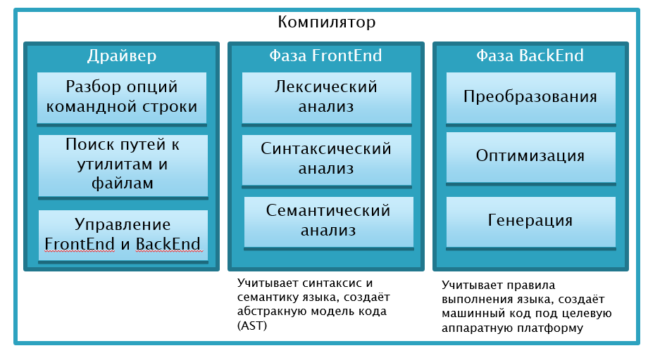

Задача &mdash; написать компилятор минимального жизнеспособного процедурного языка программирования. Компилятор должен представлять из себя консольную программу, которая получает в аргументах командной строки путь к единственному файлу с исходным кодом, обрабатывает его и после успешной обработки создаёт исполняемый файл.

## Техническое задание

 1. Ознакомиться со спецификацией (англ. language reference) одного из реальных языков, который будет взят за основу своего языка:
     - Python: [docs.python.org/3/reference](https://docs.python.org/3/reference)
     - Javascript: [ecma-international.org/publications/standards/Ecma-262.htm](http://www.ecma-international.org/publications/standards/Ecma-262.htm)
     - Golang: [golang.org/ref/spec](https://golang.org/ref/spec)
     - ANSI C: [softeng.polito.it/tongji/AP/C-reference-language.pdf](http://softeng.polito.it/tongji/AP/C-reference-language.pdf), [en.cppreference.com/w/c](http://en.cppreference.com/w/c)
 2. Составить 5-10 небольших программ на языке, взятом за основу, использующих как можно более ограниченное процедурное подмножество языка
 3. Спроектировать компилятор
    - Составить список возможностей, которые формируют минимальный возможный язык. Учесть обязательные требования: поддержу выражений с арифметическими, логическими и сравнительными операторами; переменных и присваивания; подпрограмм (функций) с параметрами и возвращаемым значением
    - Составить список поддерживаемых типов данных. Учесть обязательные требования: поддержку чисел с плавающей точкой, строк, а также массивов либо пользовательских структур
 4. Составить дорожную карту (roadmap) проекта в виде таблицы, которая бы ответила на вопросы
    - сколько итераций и каковы их сроки сдачи (deadline)?
    - что получает пользователь в конце каждой итерации?
    - как это выглядит?
    - какие задачи надо выполнить в итерации, чтобы пользователь смог получить обещаное?
 5. Реализовать компилятор, содержащий в себе драйвер, фронтенд и бекенд.
     - Фронтенд должен выполнять лексическую, синтаксическую и семантическую стадию анализа, на выходе создавать AST.
     - Можно использовать LLVM и его промежуточный язык LLVM-IR как набор готовых компонентов для бекенда, в этом случае бекенд должен выполнять преобразование AST в промежуточный код, оптимизатор промежуточного кода и генератор машинного кода из промежуточног
     - Можно разработывать бекенд без промежуточного кода, в этом случае используется ассемблер целевой платформы, и придётся реализовать оптимизатор ассемблерного кода
     - Драйвер должен уметь превращать объектный файл, созданный в бекенде, в исполняемый файл путём вызова компоновщика или иным способом.

На схеме показаны два ключевых компонента компилятора и управляющий ими драйвер:

Кроме этих компонентов предстоит написать библиотеку времени выполнения языка (runtime library) и набор функциональных тестов.

## Процесс написания компилятора

Компилятор можно разработать по методологии "водопад" либо по гибким методологиям.

В методологии "водопад" процесс разработки выглядит как последовательное движение по ТЗ, описанному выше. Перед каждым этапом нужно тщательно проектировать, изучать критически готовые примеры и теоретические материалы. Если пренебречь проектированием, проект наверняка пойдёт в неправильную сторону и не будет сдан в сроки.

В методологии agile вы за один короткий спринт реализуете минимальный рабочий прототип, а затем слоями накладываете новую функциональность. Проектирование, изучение теории и готовых примеров выполняется перед каждым спринтом. Если пренебречь проектированием, спринт наверняка будет потрачен впустую, что задержит сдачу проекта.

Для тех, кто предпочитает agile, есть примерный план послойного наращивания функционала:

 1. Компилятор уровня калькулятора с поддержкой `+`, `-`, `*`, `/`, учётом неявного приоритета и с основными компонентами компилятора: парсером на основе рекурсивного спуска, AST и бекендом, использующим для вычисления стек. Пользователь может использовать компилятор как калькулятор.
 2. Компилятор с инструкциями (одна на строку) и переменными, на этом спринте можно улучшить грамматику, реализацию парсера, добавить лексер, улучшить генератор кода. Пользователь может использовать компилятор как калькулятор с переменными.
 3. Компилятор структурного языка (с циклами и ветвлениями), на этом спринте потребуется улучшить грамматику и парсер, а в бекенде разобраться с генерацией программы с корректным графом потока выполнения (control flow graph)
 4. ...

## Командная работа

## Примеры небольших программ

## Литература

- [Статья "А что такое Compiler Frontend?"](what_is_frontend.md)
- [Статья "А что такое Compiler Backend?"](what_is_backend.md)
