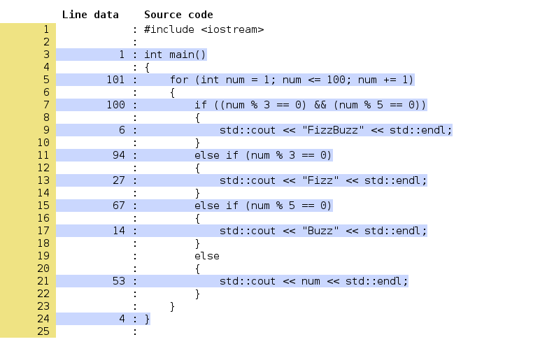
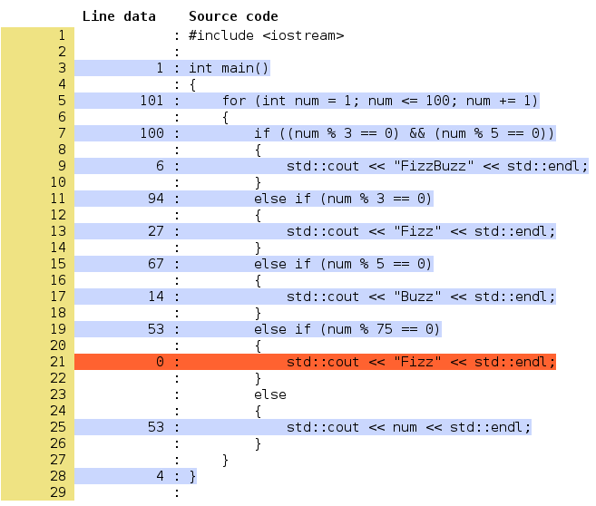
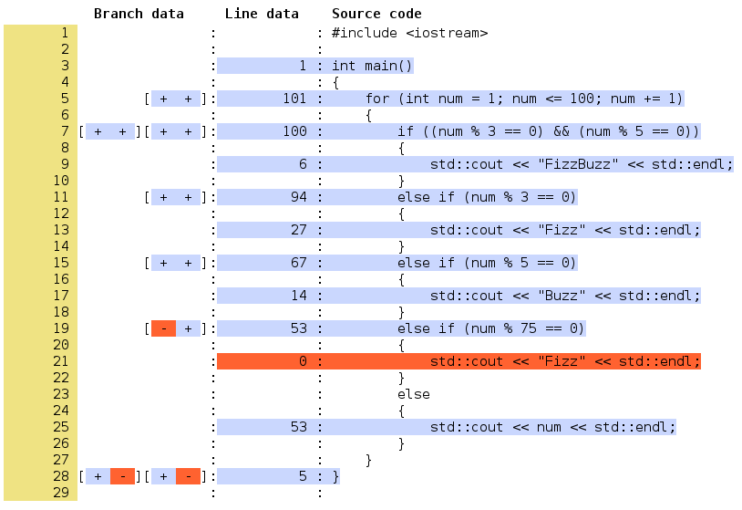
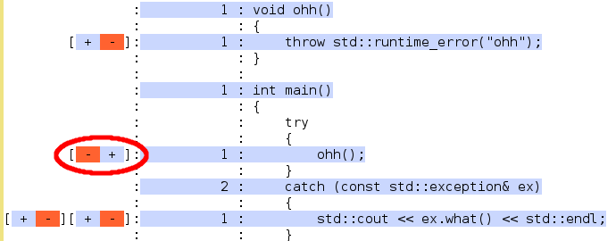

>GCC - это GNU Compilers Collection, набор компиляторов проекта GNU. Прежде всего это компиляторы C/C++ (`gcc` и `g++`). GCC входит в тройку лидирующих C/C++ компиляторов: GCC, Clang, MSVC.

## Установка gcov и lcov на Linux

Вместе с GCC распространяется утилита командной строки "gcov". Если у вас есть установленный GCC, то и gcov тоже есть. Проверить можно консольной командой, попросив gcov распечатать свою версию:

```bash
gcov --version
```

Утилита "lcov" (графический интерфейс для gcov) устанавливается отдельно. В Ubuntu/Debian установить можно с помощью apt. Затем стоит проверить работоспособность lcov, запустим его в командной строке.

```bash
sudo apt install lcov
lcov --version
```

## Установка gcov и lcov на Windows

Вместе с [пакетом программ MinGW64](https://sourceforge.net/projects/mingw-w64/) (это порт GCC для Windows) распространяется утилита командной строки "gcov". Если MinGW64 у вас установлен и добавлен в переменную окружения `%PATH%`, то и gcov тоже есть. Проверить можно консольной командой, попросив gcov распечатать свою версию:

```bash
gcov --version
```

Если при запуске в терминале вы получаете сообщение, что программа `gcov` не найдена, значит, вам нужно проверить установку

1. Убедитесь, что MinGW64 установлен - вы можете [загрузить MinGW64 с sourceforge.net](https://sourceforge.net/projects/mingw-w64/)
2. Убедитесь, что путь к подкаталогу `bin` установленного `MinGW` добавлен в переменную окружения `%PATH%`
    - инструкция по настройке `%PATH%` есть на [computerhope.com](https://www.computerhope.com/issues/ch000549.htm)

## Компилируем мини-программу с анализом Coverage

Создайте файл `fizzbuzz.cpp` и скопируйте или перепишите в него код:

```cpp
#include <iostream>

int main()
{
    for (int num = 1; num <= 100; num += 1)
    {
        if ((num % 3 == 0) && (num % 5 == 0))
        {
            std::cout << "FizzBuzz" << std::endl;
        }
        else if (num % 3 == 0)
        {
            std::cout << "Fizz" << std::endl;
        }
        else if (num % 5 == 0)
        {
            std::cout << "Buzz" << std::endl;
        }
        else
        {
            std::cout << num << std::endl;
        }
    }
}
```

Теперь откройте терминал в каталоге, где находится `fizzbuzz.cpp`, и скомпилируйте программу одной командой:

```bash
g++ --coverage fizzbuzz.cpp -o fizzbuzz
```

Если компиляция не удалась, прочитайте текст ошибки и исправьте ошибку. Если всё в порядке, то в каталоге появится ещё два файла: исполняемый файл `fizzbuzz` и файл `fizzbuzz.gcno`, содержащий базовую информацию для запуска Code Coverage.

Теперь надо запустить программу, чтобы в процессе работы она записала информацию о фактическом покрытии кода на данном запуске. В UNIX и в Windows запуск выглядит по-разному:

```bash
# В Windows введите имя файла
fizzbuzz.exe

# В Unix введите относительный путь, начиная с текущего каталога "."
./fizzbuzz
```

После завершения работы программы вы увидите в каталоге файл `fizzbuzz.gcda`, который и содержит информацию о фактическом покрытии кода.

## Составляем отчёт о Code Coverage с помощью lcov

После предыдущего шага у нас есть всё, что надо для lcov, и теперь стало намного проще! Введите в терминале команду lcov с несколькими опциями:

```bash
lcov -t "fizzbuzz" -o fizzbuzz.info -c -d .  
```

Пояснения по поводу опций:

- `-t <имя>` устанавливает имя отчёта, при измерении покрытия кода тестами можно указать имя теста или набора тестов
- `-o <имя>` устанавливает имя выходного файла с промежуточной информацией
- `-c` указывает, что lcov должен использовать существующие данные о coverage
- `-d <путь>` устанавливает каталог, в котором надо искать данные о coverage, и мы передаём текущий каталог "."

Теперь можно сгенерировать отчёт в виде HTML-страницы с помощью утилиты `genhtml`, входящей в состав пакета программ lcov:

```bash
# -o <путь> задаёт имя каталога, где будет размещён отчёт
genhtml -o report fizzbuzz.info
```

Теперь вы можете перейти в каталог `report`, открыть файл `index.html` в браузере и посмотреть отчёт. Вы увидите страницу, на которой показан статичный отчёт о покрытии различных каталогов, и можно перейти по ссылкам для просмотра отдельных каталогов:


Вы можете перейти к конкретному файлу и посмотреть покрытие этого файла:



## Отчёт о непокрытых строках

Изменим программу, чтобы в ней появился недостижимый код:

Теперь выполним все команды для компиляции, запуска, сбора данных и сборки отчёта:

```bash
g++ --coverage fizzbuzz.cpp -o fizzbuzz
./fizzbuzz
lcov -t "fizzbuzz" -o fizzbuzz.info -c -d .
genhtml -o report fizzbuzz.info
```

Обновите страницу отчёта в браузере - и вы увидите, что теперь Code Coverage достигает лишь 91%:


Вы можете перейти к файлу и посмотреть, какие именно строки оказались непокрытыми:



## Отчёт о покрытии ветвлений

>Источник: ["generating branch coverage data for lcov"](https://stackoverflow.com/questions/12360167/)

Для получения отчёта с информацией о выборе ветвлений надо добавить параметр `--rc lcov_branch_coverage=1` как для вызова `lcov`, так и для вызова `genhtml`:

```cpp
lcov -t "fizzbuzz" -o fizzbuzz.info -c -d . --rc lcov_branch_coverage=1
genhtml -o report fizzbuzz.info --rc lcov_branch_coverage=1
```

Теперь вы можете повторно открыть `index.html` и познакомиться с новой информацией. Знаки `[- +]` возле `else if (num % 75 == 0)` означают, что программа ни разу не зашла в первую ветку (ветку then), но заходила во вторую (ветку else). В остальных ветвлениях if/else программа заходила в разное время в обе ветки.



У любопытных людей может возникнуть вопрос: почему в конце функции main тоже написано `[+ -]`? Это правильный вопрос, детектив. Дело в том, что каждая функция может быть завершена либо нормальным способом (вернув что-либо на инструкции return), либо выбросом исключения. Если немного модифицировать программу, написав всегда бросающую исключение функцию `ohh`, то branch coverage для вызова `ohh()` изменится на `[- +]`: функция ни разу не завершилась нормально, но как минимум один раз завершилась с выбросом исключения:


