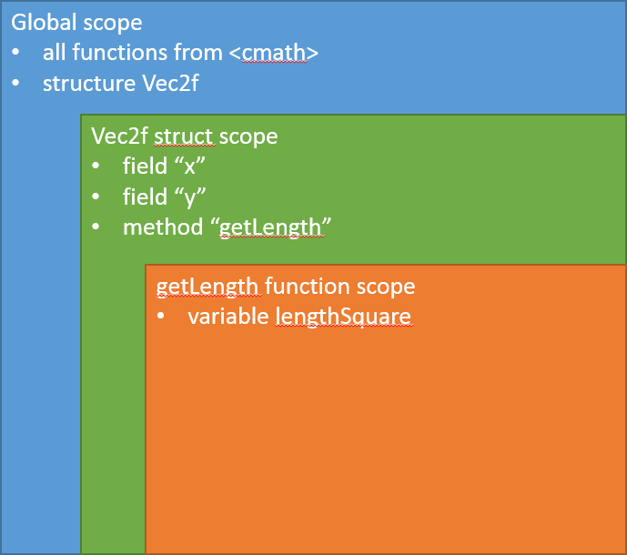

## Методы

Методы - это функции, объявление которых размещено внутри определения класса или структуры. В список переменных, доступных для метода, неявно попадают все поля структуры или класса, в котором он объявлен. Другими словами, в список областей видимости метода попадает область видимости структуры.

Взгляните на пример:

```cpp
#include <cmath>

struct Vec2f
{
	float x = 0;
	float y = 0;

	// Объявление метода с именем getLength
	//  1) метод - это функция, привязанная к объекту
	//  2) полное имя метода: "Vec2f::getLength"
	// Метод имеет квалификатор "const", потому что он не меняет
	//  значения полей и не вызывает другие не-const методы.
	float getLength() const
	{
		const float lengthSquare = x * x + y * y;
		return std::sqrt(lengthSquare);
	}
};
```

Методу `Vec2f::getLength` доступны все символы (т.е. переменные, функции, типы данных), которые были объявлены в одной из трёх областей видимости. При наличии символов с одинаковыми идентификаторами один символ перекрывает другой, т.к. поиск происходит от внутренней области видимости к внешней.

Понять идею проще на схеме. В ней область видимости названа по-английски: **scope**.



Поднимаясь по схеме от внутренней области видимости к внешней, легко понять, какие имена символов доступны в методе getLength:

 1. локальная переменная "lengthSquare"
 2. поля Vec2f под именами "x" и "y"
 3. всё, что есть в глобальной области видимости

К слову, в других методах структуры Vec2f переменная "lengthSquare" будет недоступна, а поля "x" и "y" будут доступны.

## Конструкторы

Конструктор - это специальный метод, который вызывается автоматически при выполнении инструкции объвления переменной. При этом память под переменную уже выделена заранее, т.к. память под все локальные переменные выделяется на стеке программы в момент вызова функции. Конструктор позволяет выполнить сложный код для инициализации переменной.

Посмотрите на простой пример. В нём есть проблема: и поля, и параметры конструктора названы одинаково. В результате в области видимости конструктора доступны только параметры, и своими именами они перекрывают поля!

```cpp
struct Vec2f
{
	float x = 0;
	float y = 0;

	// Имя метода-конструктора совпадает с именем типа, возвращаемый тип отсутствует
	Vec2f(float x, float y)
	{
		// поля x, y перекрыты, что делать?
	}
};
```

Язык C++ предлагает два решения. Первый способ - использовать косвенное обращение к полям через привязанный к методу объект. Указатель на него доступен по ключевому слову `this`:

```cpp
struct Vec2f
{
	float x = 0;
	float y = 0;

	Vec2f(float x, float y)
	{
		// Обращаемся к полю через указатель this
		this->x = x;
		this->y = y;
	}
};
```

Второй путь считается более правильным: мы используем специальную возможность конструкторов - "списки инициализации конструктора" (*англ.* constructor initializer lists). Списки инициализации - это список, разделённый запятыми и начинающийся с ":". Элемент списка инициализации выглядит как `field(expression)`, т.е. для каждого выбранного программистом поля можно указать выражение, инициализирующее его. Имя переменной является выражением. Поэтому мы инициализируем поле его параметром:

```cpp
struct Vec2f
{
	float x = 0;
	float y = 0;

	Vec2f(float x, float y)
		: x(x) // Перекрытия имён нет, т.к. согласно синтаксису C++
		, y(y) //  перед скобками может стоять только имя поля.
	{
	}
};
```

## Объявление и определение методов

C++ требует, чтобы каждый метод структуры или класса был упомянут в определении этой структуры или класса. Но допускается писать лишь объявление метода, о определение размещать где-нибудь в другом месте:

```cpp
// Определение структуры Vec2f содержит
// - объявление конструктора
// - объявление метода getLength
struct Vec2f
{
	float x = 0;
	float y = 0;

	Vec2f(float x, float y);
	float getLength() const;
};

// Определение конструктора (добавлен квалификатор "Vec2f::")
Vec2f::Vec2f(float x, float y)
	: x(x)
	, y(y)
{
}

// Определение метода getLength (добавлен квалификатор "Vec2f::")
float Vec2f::getLength() const
{
	const float lengthSquare = x * x + y * y;
	return std::sqrt(lengthSquare);
}
```

## Классы и структуры

В C++ есть ключевое слово `class` - это практически аналог ключевого слова `struct`. Оба ключевых слова объявляют тип данных, и разница между ними есть только на стыке наследования и инкапсуляции. Других различий `class` и `struct` не существует.

## Основы инкапсуляции

В C++ можно блокировать доступ к полям извне, но сохранять доступ для методов. Для этого введены три области доступа

 1. `public` - символ в этой области доступен извне
 2. `private` - символ из этой области доступен лишь собственных в методах
 3. `protected` - используется редко, о нём можете прочитать в документации

Давайте сделаем поля типа Vec2f недоступными извне. Также мы заменим ключевое слово struct на class - это не меняет смысла программы, но считается хорошим тоном использовать struct только если все поля доступны публично.

```cpp
class Vec2f
{
public: // начало списка публичных методов и полей
	Vec2f(float x, float y)
		: x(x)
		, y(y)
	{
	}

	float getLength() const
	{
		// Здесь поля x/y доступны, т.к. это внутренний метод
		const float lengthSquare = x * x + y * y;
		return std::sqrt(lengthSquare);
	}

private: // начало списка недоступных извне методов и полей
	float x = 0;
	float y = 0;
};

// ! ОШИБКА КОМПИЛЯЦИИ !
// Поля x/y недоступны для внешней функции
void printVector(const Vec2f& v)
{
	std::cout << "[" << v.x << "," << v.y << "]";
}
```

Запомните несколько хороших правил:

- Используйте struct, если все поля публичные и не зависят друг от друга; используйте class, если между полями должны соблюдаться закономерности (например, поле "площадь" круга должно быть)

## Основы наследования

В C++ новый тип может наследовать все поля и методы другого типа. Для этого достаточно указать структуру или класс в списке базовых типов. Такой приём используется в SFML

```cpp
class 
```

## Основы полиморфизма: виртуальные методы и их перегрузка
