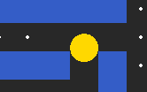
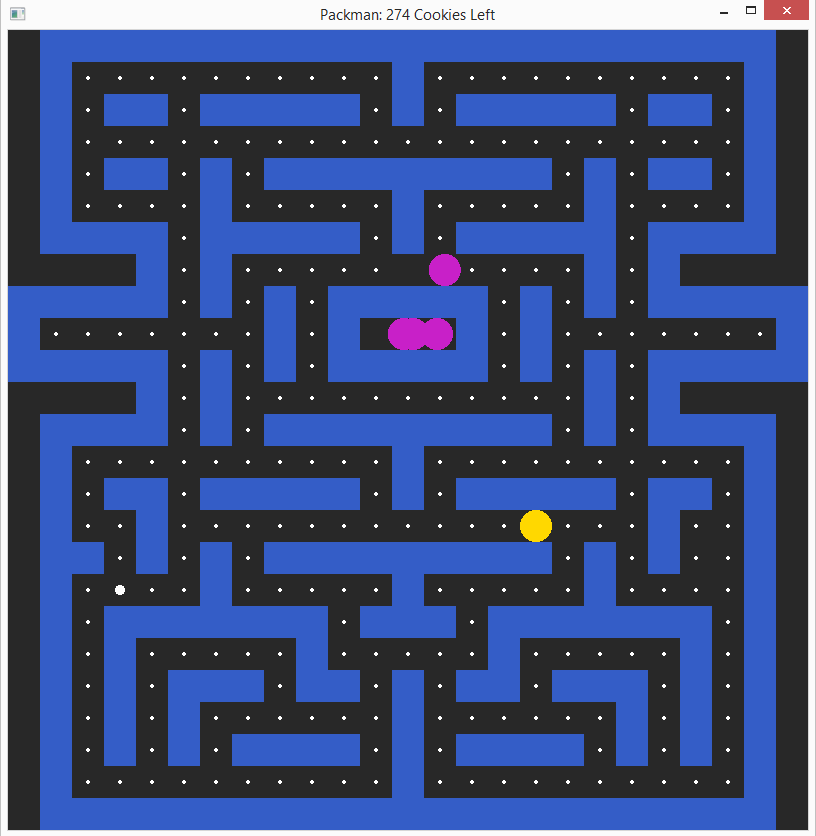

## Счётчик съеденного печенья

Мы будем считать, сколько печенья было съедено персонажем. Эти данные будут связаны со структурой Packman. Поскольку количество печенья не может быть отрицательным, то для хранения данных мы применим тип `unsigned`:

```cpp
struct Packman
{
    sf::CircleShape shape;
    Direction direction;
    unsigned eatenCookies;
};

// обнуляем количество при инициализации
void initializePackman(Packman &packman)
{
    packman.direction = Direction::NONE;
    packman.shape.setRadius(PACKMAN_RADIUS);
    packman.shape.setFillColor(PACKMAN_COLOR);
    packman.shape.setPosition(getPackmanStartPosition());
    packman.eatenCookies = 0;
}
```

Использовать этот счётчик мы пока что не будем. В будущем с его помощью можно будет реализовать вывод количества очков, быстрый подсчёт оставшегося печенья (для определения момента победы) или даже таблицу рекордов.

## Поедание печенья

В рамках геймплея клона Packman можно задумать два способа поглощения печенья:

- персонаж поглощает всё печенье, которого он достиг
- персонаж поглощает печенье в направлении своего движения

Мы применим первый способ поглощения как более простой в реализации. Реализация поглощения печенья будет похожа на определение пересечений со стенами лабиринта. В целях улучшения читаемости мы выделим реализацию в отдельную функцию, и назовём её `eat all cookies in bounds`:

```cpp
unsigned eatAllCookiesInBounds(Field &field, const sf::FloatRect &bounds)
{
    unsigned cookiesCount = 0;
    for (size_t i = 0, n = field.width * field.height; i < n; i++)
    {
        Cell &cell = field.cells[i];
        if (cell.category != CellCategory::COOKIE)
        {
            continue;
        }
        if (cell.bounds.intersects(bounds))
        {
            ++cookiesCount;
            cell.category = CellCategory::EMPTY;
        }
    }
    return cookiesCount;
}
```

Такая реализация влечёт за собой серьёзный недостаток: персонаж поедает печенье слишком рано, как будто он использует телекинез. На иллюстрации ниже персонаж уже съел печенье вокруг, хотя ещё не достиг самого печенья — достигнута была лишь граница ячейки, содержащей печенье:



Исправить проблему можно как минимум двумя путями:

- проверять пересечение с центра печенья с границами пакмана
- требовать, чтобы область пересечения пакмана и ячейки с печеньем имела достаточно большую площадь

Мы воспользуемся первым способом, поскольку он легко реализуется с помощью второй версии перегрузки `sf::FloatRect::intersects()`, позволяющей получить область пересечения двух прямоугольников:

```cpp
sf::FloatRect intersection;
// Нужно не просто пересекаться с печеньем, но и иметь
// достаточную площадь пересечения.
if (cell.bounds.intersects(bounds, intersection))
{
    // в переменной intersection теперь лежит область пересечения
}
```

Мы также введём константу MIN_COOKIE_OVERLAP_AREA для хранения минимально необходимой области пересечения. Опытным путём можно выяснить, что будет достаточно площади 400px, что эквивалентно квадрату 20x20 или прямоугольнику 32x12.5:

```cpp
static const float MIN_COOKIE_OVERLAP_AREA = 400.f;

unsigned eatAllCookiesInBounds(Field &field, const sf::FloatRect &bounds)
{
    unsigned cookiesCount = 0;
    for (size_t i = 0, n = field.width * field.height; i < n; i++)
    {
        Cell &cell = field.cells[i];
        if (cell.category != CellCategory::COOKIE)
        {
            continue;
        }
        sf::FloatRect intersection;
        // Нужно не просто пересекаться с печеньем, но и иметь
        // достаточную площадь пересечения.
        if (cell.bounds.intersects(bounds, intersection)
                && (getArea(intersection) >= MIN_COOKIE_OVERLAP_AREA))
        {
            ++cookiesCount;
            cell.category = CellCategory::EMPTY;
        }
    }
    return cookiesCount;
}
```

## Определение состояния победы

В оригинальной игре победа наступает, когда пакман съедает всё печенье (включая суперпеченье). Определить данную ситуацию можно разными способами. Мы будем вычитать из общего количества печенья количество, съеденное пакманом. Для определения общего количество печенья на поле опишем функцию, которая производит подсчёт с помощью цикла:

```cpp
unsigned countRemainingCookies(const Field &field)
{
    unsigned result = 0;
    for (size_t offset = 0; offset < field.width * field.height; offset++)
    {
        const Cell &cell = field.cells[offset];
        switch (cell.category)
        {
        case CellCategory::COOKIE:
        case CellCategory::SUPERCOOKIE:
            ++result;
            break;
        default:
            break;
        }
    }

    return result;
}
```

Для хранения изначального количества заведём в структуре GameScene новое поле. Также заведём перечислимый тип GameState для хранения состояния игры:

```cpp
enum struct GameState
{
    Playing,
    PlayerWon,
};

struct GameScene
{
    Field field;
    Packman packman;
    Ghost blinky;
    Ghost pinky;
    Ghost inky;
    Ghost clyde;
    unsigned totalCookieCount;
    GameState state;
};

void initializeGameScene(GameScene &scene)
{
    // ...
    scene.totalCookieCount = countRemainingCookies(scene.field);
    scene.state = GameState::Playing;
}
```

В методе updateGameScene добавим две проверки:

- первая отвечает за обновление сцены только в игровом состоянии GameState::Playing
- вторая переводит сцену в состояние GameState::PlayerWon

```cpp
static unsigned getRemainingCookies(const GameScene &scene)
{
    return scene.totalCookieCount - scene.packman.eatenCookies;
}

void updateGameScene(GameScene &scene, float elapsedTime)
{
    if (scene.state == GameState::Playing)
    {
        updatePackman(scene.packman, elapsedTime, scene.field);
        updateGhost(scene.blinky, elapsedTime, scene.field);
        updateGhost(scene.pinky, elapsedTime, scene.field);
        updateGhost(scene.inky, elapsedTime, scene.field);
        updateGhost(scene.clyde, elapsedTime, scene.field);

        // Проверяем наступление победы.
        if (getRemainingCookies(scene) == 0)
        {
            scene.state = GameState::PlayerWon;
        }
    }
}
```

## Обновление заголовка окна

Чтобы обеспечить пользователю актуальную информацию, мы воспользуемся возможностью смены заголовка окна. Для получения актуального заголовка опишем новую функцию:

```cpp
std::string getGameSceneWindowTitle(const GameScene &scene)
{
    std::string title;
    if (scene.state == GameState::Playing)
    {
        unsigned cookiesLeft = getRemainingCookies(scene);
        title = "Packman: " + std::to_string(cookiesLeft) + " Cookies Left";
    }
    else
    {
        title = "Packman: Congratulations, You Won!";
    }
    return title;
}
```

Для установки заголовка модифицируем функцию main. Заголовок будет меняться на каждом кадре — возможно, это и не самое эффективное решение, но рисование поля всё равно будет дороже смены заголовка, поэтому мы не станем сравнивать новый заголовок со старым и будем просто вызывать `window.setTitle()` на каждом кадре:

```cpp
int main(int, char *[])
{
    sf::RenderWindow window(sf::VideoMode(800, 800), "Packman");
    sf::Clock clock;
    GameScene scene;
    initializeGameScene(scene);

    while (window.isOpen())
    {
        handleEvents(window);
        update(clock, scene);
        window.setTitle(getGameSceneWindowTitle(scene));
        render(window, scene);
    }

    return 0;
}
```

## Результат

Напоминаем, что пример к статье [доступен на github](https://github.com/ps-group/sfml-packman/tree/master/packman_6)


