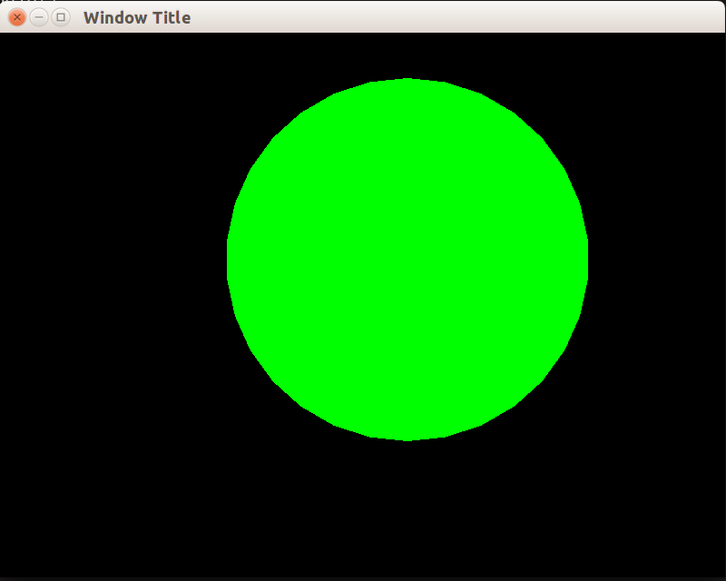
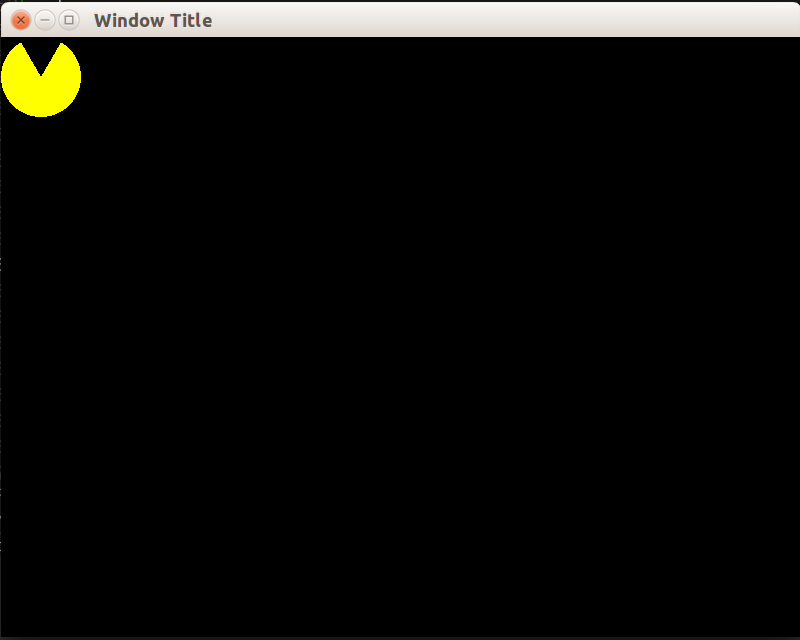

### Изучаем устройство sf::CircleShape

Исходный код класса sf::CircleShape можно [просмотреть на github.com](https://github.com/SFML/SFML/blob/master/src/SFML/Graphics/CircleShape.cpp).

Из анализа кода ясно, что круг представлен как правильный многоугольник с числом вершин, равным `m_pointCount`. По умолчанию, это правильный 30-угольник. То есть, круг рисуется приближённо, и это легко заметить при выводе круга радиусом 120px:



В исходном коде нетрудно извлечь функцию, которая возвращает точку на окружности:

```cpp
Vector2f CircleShape::getPoint(std::size_t index) const
{
    static const float pi = 3.141592654f;

    float angle = index * 2 * pi / m_pointCount - pi / 2;
    float x = std::cos(angle) * m_radius;
    float y = std::sin(angle) * m_radius;

    return Vector2f(m_radius + x, m_radius + y);
}
```

Адаптируем эту функцию под свои нужды:

```cpp
/// angle - polar angle in degrees
sf::Vector2f GetRadialPoint(float angle, float radius)
{
    static const float pi = 3.141592654f;

    float angleRadians = (angle * pi / 180) - pi / 2;
    float x = std::cos(angleRadians) * radius;
    float y = std::sin(angleRadians) * radius;

    return sf::Vector2f(radius + x, radius + y);
}
```

### Реализуем пакмана через sf::ConvexShape

Класс sf::ConvexShape подходит для любого выпуклого многоугольника. Но фигура пакмана — невыпуклый многоугольник. Поэтому мы используем две фигуры `sf::ConvexShape`: одну для верхней половины, другую для нижней.

Для удобства также заведём функцию, копирующую точки из контейнера `std::vector` в объект класса `sf::ConvexShape`:

```cpp
void assignShape(sf::ConvexShape & shape, std::vector<sf::Vector2f> const& points)
{
    const unsigned pointCount = unsigned(points.size());
    shape.setPointCount(pointCount);
    for (unsigned i = 0; i < pointCount; ++i)
    {
        shape.setPoint(i, points[i]);
    }
}
```

Теперь можно реализовать функцию для инициализации двух фигур, составляющих пакмана:

##### вычисление фигуры пакмана
```cpp
void initPackmanShape(sf::ConvexShape & topPart, sf::ConvexShape & bottomPart)
{
    const float radius = 40;
    std::vector<sf::Vector2f> points;
    sf::Vector2f center(radius, radius);

    for (float angle = 30.f; angle <= 180.f; angle += 5.f)
    {
        points.push_back(GetRadialPoint(angle, radius));
    }
    points.push_back(center);
    AssignShape(topPart, points);
    points.clear();

    for (float angle = 180.f; angle <= 330.f; angle += 5.f)
    {
        points.push_back(GetRadialPoint(angle, radius));
    }
    points.push_back(center);
    AssignShape(bottomPart, points);

    topPart.setFillColor(sf::Color::Yellow);
    bottomPart.setFillColor(sf::Color::Yellow);
}
```

Инициализация программы и основной цикл будут выглядеть так:

##### листинг из функции main()
```cpp
sf::RenderWindow window(sf::VideoMode(800, 600), "Window Title");

sf::ConvexShape packmanTop;
sf::ConvexShape packmanBottom;
InitPackmanShape(packmanTop, packmanBottom);

while (window.isOpen())
{
    sf::Event event;
    while (window.pollEvent(event))
    {
        if (event.type == sf::Event::Closed)
        {
            window.close();
        }
    }
    window.clear();
    window.draw(packmanTop);
    window.draw(packmanBottom);
    window.display();
}
```

Получаем такую картинку:


### Улучшаем детали

Сейчас пакман имеет два недостатка:

- края фигуры неровные, т.к. не работает попиксельное сглаживание
- "рот" оказался сверху, а должен быть справа

это легко исправить:

- в функции `GetRadialPoint` изменим формулу вычисления `angleRadians`:

```diff
-float angleRadians = (angle * pi / 180) - pi / 2;
+float angleRadians = (angle * pi / 180);
```

- изменим параметры по умолчанию, используемые при создании окна в функции `main()`
```cpp
sf::ContextSettings settings;
settings.antialiasingLevel = 8;

sf::RenderWindow window(sf::VideoMode(800, 600), "Window Title", sf::Style::Default, settings);
```

Результат:


