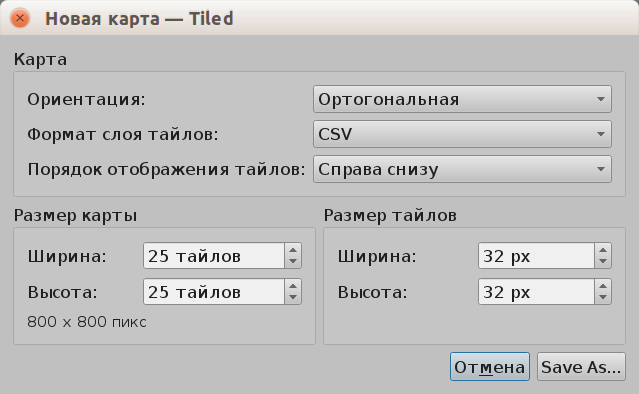
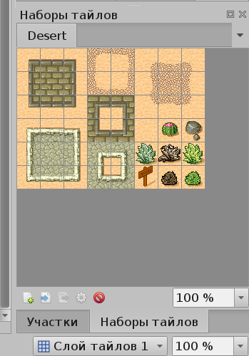
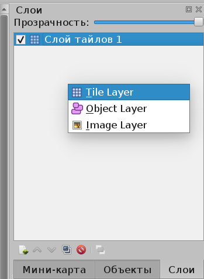
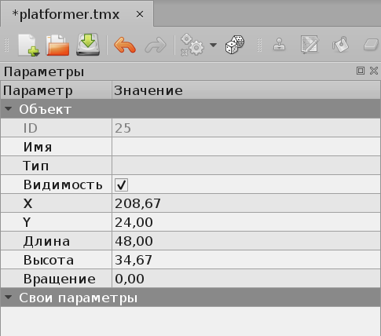
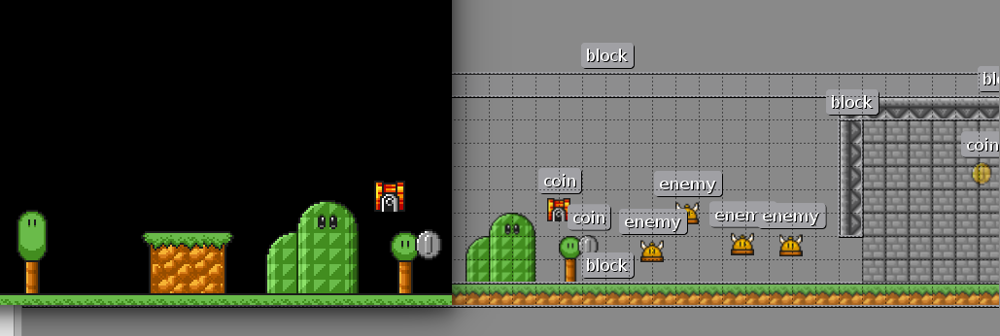

Самый простой способ задать карту — объявить массив, например, такой:

```cpp
const char MAP_DATA[] =
    "#############"
    "#   @     . #"
    "#      .    #"
    "#############";
```

Для простой аркадной игры это нормально, но когда в игре должно быть несколько уровней, разные противники, разные бонусы — требуется решение получше. Можно написать свой редактор карт, но это большой объём работ. Проще использовать универсальный редатор карт Tiled, и научиться интерпретировать созданные им карты в игровом движке.

- Сайт Tiled Map Editor: [www.mapeditor.org](http://www.mapeditor.org/)
- Созданные файлы имеют расширение `*.tmx` и внутри содержат XML

## Создание карты

Для создания карты воспользуйтесь меню "Файл>Создать".

- измените ориентацию на "Ортогональную", если, конечно, не собираетесь писать изометрическую игру
- если ваша версия Tiled позволяет, измените сразу же формат слоя на XML, иначе оставьте CSV

> В новых версиях Tiled формат слоя XML недоступен при создании, но может быть установлен позже — в этом случае выберите, например, CSV (т.е. Comma Separated Values). Формат слоя тайлов не меняет главного — карта TMX всё равно остаётся XML-документом, меняется лишь представление узла, содержащего данные о тайлах.



После создания карты её свойства можно изменить, для этого вызовите меню "Карта>Свойства карты...". Нам потребуется изменить формат слоя на XML, иначе наш простой парсер не сможет его обработать


## Добавляем тайлы

Далее нам надо добавить тайлы в меню "Карта>Добавить внешний набор тайлов...". Набор тайлов для редактора сохраняется в файле с расширением `*.tsx` и в находящемся рядом с ним изображении. Добавленные тайлы окажутся внизу правой панели



> Tileset — это набор тайлов (*англ.* tile — плитка), связанных общей тематикой и подходящих друг к другу без заметных швов в тех местах, где тайлы соединяются друг с другом. Искать наборы готовых тайлов можно на сайте [opengameart.org](http://opengameart.org/), проще всего задать поисковику запрос ["tileset site:opengameart.org"](https://yandex.ru/yandsearch?&clid=2186621&text=tileset%20site%3Aopengameart.org&lr=41)

Тайлы объединяются в слои, и каждый новый слой рисуется поверх другого (например, полупрорачный и не везде заполненный слой травы рисуется поверх слоя земли). Слои редактируются вверху правой панели



## Объекты

Если файлы являются только фоном, то объекты активно участвуют в игровой логике. Объект — это квадратная, круглая или многоугольная область. Чтобы создавать объекты, сперва создайте слой объектов на панели слоёв. После станет доступна панель инструментов объектов


> У области есть имя и набор произвольных свойств, что позволяет использовать области как маркеры мест, в которых потом появится игрок, противники или бонусы. Также можно превратить область в физическое препятствие, или считать областью случайного появления противников, или расположить там портал, при достижении которого происходит переход на новый уровень. Обработкой объектов занимается движок игры.

Выберите на этой панели кнопку "Вставить прямоугольник", и разместите его где угодно на карте. Когда вы отпустите кнопку мыши, новая прямоугольная область окажется выбрана, а в левой панели будут доступны её свойства



Поля "Имя" и "Тип" хранят строки, в которых удобно задавать категорию объекта (например, тип юнита игры или бонуса, который он представляет). Впоследствии игра считает эти строковые свойства и сможет выбрать, какой объект надо создать в указанном месте.

## Разбор карты в программе

Для разбора карты в формате XML мы воспользуемся библиотекой [Tinyxml2](https://github.com/leethomason/tinyxml2), файлы исходного кода tinyxml2.cpp и tinyxml2.h мы можем просто скопировать в проект.

Для удобства можно использовать готовый компонент, способный загружать XML в память, проводить базовую валидацию карты и предоставлять доступ к объектам и тайлам. Компонент представляет собой файлы `TmxLevel.h` и `TmxLevel.cpp`, содержащий структуры `TmxObject` и `TmxLayer`, а также класс TmxLevel, выполняющий загрузки и хранение слоёв и объектов.

Продемонстрируем объявление TmxObject:

```cpp
// В картах TMX объект - это область на карте, имеющая имя, тип,
//  границы, набор пользовательских свойств (в формате ключ-значение)
//  и текстурные координаты.
// Текстурные координаты позволяют связать с объектом спрайт,
//  использующий основную текстуру карты как источник данных.
struct TmxObject
{
    int GetPropertyInt(const std::string &propertyName);
    float GetPropertyFloat(const std::string &propertyName);
    std::string GetPropertyString(const std::string &propertyName);

    void MoveBy(const sf::Vector2f &movement);
    void MoveTo(const sf::Vector2f &position);

    std::string name;
    std::string type;
    sf::FloatRect rect;
    std::map<std::string, std::string> properties;

    sf::Sprite sprite;
};
```

Данная структура содержит поле Sprite, которое содержит графическое представление объекта (текстурой спрайта служит единая текстура TMX-карты). Спрайт можно использовать для рисования объекта:

```cpp
pLogic->level.Draw(target);
for (const TmxObject &coin : pLogic->coins)
{
    target.draw(coin.sprite);
}
for (const TmxObject &enemy : pLogic->enemies)
{
    target.draw(enemy.sprite);
}
target.draw(pLogic->player.sprite);
```

Методы MoveTo и MoveBy можно использовать для перемещения к заданной точке / на заданное расстояние соответственно:

```cpp
TmxObject &player = pLogic->player;
const Vector2f movement = Round(GetPlayerDirection() * PLAYER_SPEED);
player.MoveBy(movement)
```

Слой представлен следующей структурой:

```cpp
// В картах TMX слой - это набор тайлов (спрайтов),
//  из которых складывается ландшафт карты.
// Слоёв может быть несколько, что позволяет нарисовать,
//  например, слой травы поверх слоя земли.
struct TmxLayer
{
    sf::Uint8 opacity = 0;
    std::vector<sf::Sprite> tiles;
};
```

Рисовать слой отдельно не требуется, поскольку это статичный элемент карты, и с рисованием слоёв вполне справляется класс TmxLevel:

```cpp
class TmxLevel
{
  public:
    // Загружает данные из TMX в память объекта.
    bool LoadFromFile(const std::string &filepath);

    TmxObject GetFirstObject(const std::string &name) const;
    std::vector<TmxObject> GetAllObjects(const std::string &name) const;
    sf::Vector2i GetTileSize() const;
    float GetTilemapWidth() const;
    float GetTilemapHeight() const;
    sf::Vector2f GetTilemapSize() const;

    // Рисует все слои тайлов один за другим,
    //  но не рисует объекты (рисованием которых должна заниматься игра).
    // Принимает любую цель для рисования, например, sf::RenderWindow.
    void Draw(sf::RenderTarget &target) const;

  private:
    int m_width = 0;
    int m_height = 0;
    int m_tileWidth = 0;
    int m_tileHeight = 0;
    int m_firstTileID = 0;
    sf::Texture m_tilesetImage;
    std::vector<TmxObject> m_objects;
    std::vector<TmxLayer> m_layers;
};
```

Помимо рисования всех статических элементов карты, данный класс даёт доступ к набору объектов на карте, а также к размеру карты, что даёт возможность использовать их остальной игровой логике. Метод для загрузки карты может выбросить исключение, и его лучше обработать в функции main, как показано ниже — это обеспечит выход из программы с предупреждающим сообщением из консоли и ненулевым кодом возврата, сообщающим системе об ошибке во входных данных.

```cpp
int main(int argc, char *argv[])
{
    (void)argc;
    (void)argv;

    try
    {
        // NOTE: Если при загрузке карты будет выброшено исключение,
        //  то память утечёт. Избавиться от этого можно с помощью
        //  замены new/delete на make_unique и unique_ptr.
        GameView *pGameView = NewGameView({800, 600});
        GameScene *pGameScene = NewGameScene();

        // Аргумент типа `GameLogic*` будет преобразован в `void*`.
        EnterGameLoop(*pGameView, UpdateGameScene, DrawGameScene, pGameScene);
    }
    catch (const std::exception &ex)
    {
        std::cerr << ex.what() << std::endl;
        return 1;
    }

    return 0;
}
```

Метод `TmxLevel::Draw` был оптимизирован для ускоренного рисования карт огромного размера: невидимые тайлы отсекаются с помощью проверки пересечения с прямоугольником карты.

```cpp
void TmxLevel::Draw(sf::RenderTarget &target) const
{
    const sf::FloatRect viewportRect = target.getView().getViewport();

    // Draw all tiles (and don't draw objects)
    for (const auto &layer : m_layers)
    {
        for (const auto &tile : layer.tiles)
        {
            if (viewportRect.intersects(tile.getLocalBounds()))
            {
                target.draw(tile);
            }
        }
    }
}
```

## Ограничения класса загрузчика

- Класс не умеет загружать форматы слоя тайлов, отличные от XML, поэтому не забудьте выставит данный формат для всех карт уровней, которые собираетесь загружать в игре.
- Класс не умеет обрабатывать более одного атласа тайлов (tilesheet)
- Класс не умеет загружать изометрические карты


## Пример (с исходным кодом)

Для демонстрации возможностей загрузчика [на github размещено минимальное приложение](https://github.com/ps-group/sfml-tmx-parser) на C++ с SFML, загружающее карту и позволяющее передвигаться по ней (без учёта столкновений с препятствиями):

- `src/TmxLevel.h` and `src/TmxLevel.cpp` — `*.tmx` file parser
- `lib/tinyxml2/tinyxml2.h` and `lib/tinyxml2/tinyxml2.cpp` — external library Tinyxml2 used to parse TMX format
- `src/GameScene.h`, `src/GameScene.cpp`, `src/GameView.h`, `src/GameView.cpp`, `src/main.cpp` — small demo application

Чтобы убедиться, что мы воспроизводим карту правильно, пиксель-в-пиксель, сделаем скриншот игры на фоне редактора, где открыта та же карта:


