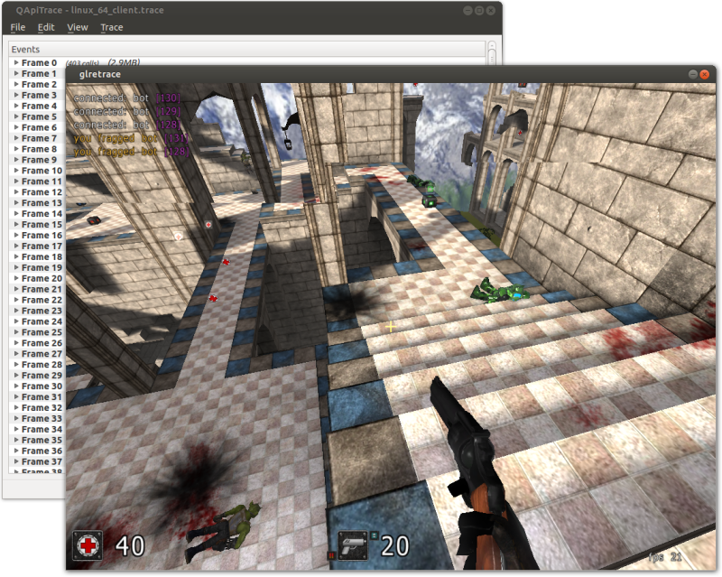
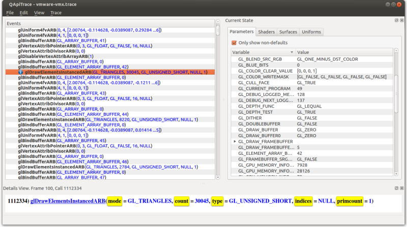

[Apitrace](http://apitrace.github.io/#about) &mdash; пакет программ с открытым исходным кодом, позволяющий отлаживать работу с OpenGL и DirectX. Ссылки:

- [Страница apitrace на github.io](http://apitrace.github.io/#about)
- [Сборки Apitrace для Windows](https://people.freedesktop.org/~jrfonseca/apitrace/) (выбирайте сборку через MSVC, а не MinGW)
- для Ubuntu можно собрать apitrace из исходного кода или найти пакет в Ubuntu PPA

Утилита крайне полезна для отладки проблем с текстурами или шейдерами.

## Как использовать QApitrace

В составе пакета есть `apitrace` &mdash; утилита командной строки, и `qapitrace` &mdash; графический фронтенд для этой утилиты. Вам, скорее всего, нужен фронтенд `qapitrace`, запускайте именно его.

Пункт меню `File>New` открывает диалог, в котором можно выбрать программу для запуска и указать для неё аргументы. Есть подводные камни:

- В диалоге невозможно явно указать переменные окружения (хотя, наверное, ваша программа их и не требует)
- В диалоге невозможно явно указать рабочую директорию (с которой будут начинаться все относительные пути в вашей программе, такие как `res/earth.bmp`). Более того, рабочая директория наследуется от самой утилиты `qapitrace`. И если ваша программа ищет файлы рядом с собой по относительным путям, вам придётся запустить qapitrace по абсолютному пути из директории, где находится ваша программа (например, с помощью Far Manager). В результате рабочей директорией как для qapitrace, так и для вашей программы станет директория вашей программы.

После запуска начнётся трассировка всех вызовов OpenGL и API оконной системы в файл трассировки. После завершения работы программы вы сможете проиграть этот файл снова, как ролик. Будьте внимательны: размер файла трассировки растёт очень быстро, не держите трассируемую программу запущеной долгое время.

## Что умеет QApitrace

- может записать replay всех вызовов OpenGL со всеми параметрами, а потом совершить эти вызовы снова, тем самым воспроизводя исходную картинку кадр за кадром
- может показать последовательность вызовов и их аргументы. Это позволяет найти и исправить ошибки, связанные с неверным порядком инициализации компонентов программы или неверными аргументами.
- может показать текущее состояние OpenGL после очередного вызова. Это позволит обнаружить ситуации, когда текстура вдруг оказалась перевёрнутой. Посмотреть список активных текстур можно на вкладке `Surfaces` в панели `Current State`:

