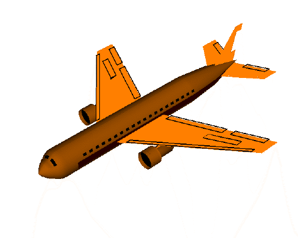
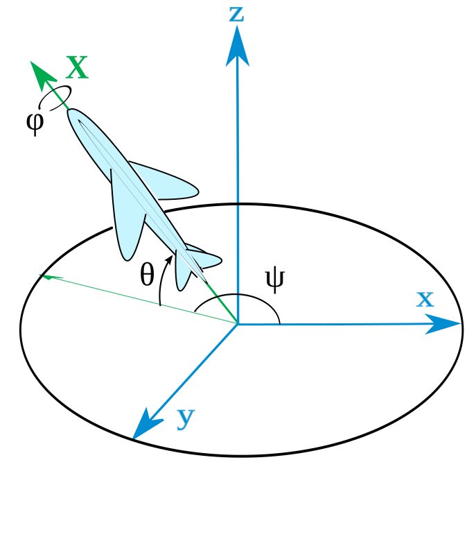

## Повороты (без квантерионов)

Заголовок `<glm/gtx/rotate_vector.hpp>` [предоставляет следующее API](http://glm.g-truc.net/0.9.8/api/a00224.html):

- поворачивает 2D вектор на заданный угол:

```cpp
vec2 glm::rotate(vec2 const &v, float angle);
```

- поворачивает 3D вектор на заданный угол вокруг заданной оси (представленной орт-вектором):

```cpp
vec3 glm::rotate(vec3 const& v, float angle, vec3 const& normal);
```

- поворачивают 3D вектор на заданный угол вокруг осей Ox, Oy, Oz соответственно:

```cpp
vec3 glm::rotateX(vec3 const &v, float angle);
vec3 glm::rotateY(vec3 const &v, float angle);
vec3 glm::rotateZ(vec3 const &v, float angle);
```

## Переход к квантерионам и обратно

Заголовок <glm/gtc/quaternion.hpp> [предоставляет следующее API](http://glm.g-truc.net/0.9.8/api/a00172.html):

- функция создаёт кватернион на основе оси вращения и угла поворота:

```cpp
quat glm::angleAxis(float angle, vec3 const& axis);
```

- с помощью оператора умножения можно применить к вектору вращение, хранимое в квантерионе:

```cpp
vec3 unrotated = ...;
quat orientation = ...;
vec3 rotated = unrotated * orientation;
```

- функция превращает кватернион в эквивалентную матрицу поворота:

```cpp
mat4 glm::mat4_cast(quat const& orientation);
```

## Углы Эйлера и кватернионы

В трёхмерном пространстве любую трансформацию поворота можно представить в виде [трёх углов Эйлера](https://ru.wikipedia.org/wiki/%D0%A3%D0%B3%D0%BB%D1%8B_%D0%AD%D0%B9%D0%BB%D0%B5%D1%80%D0%B0). Это возможно благодаря теореме Эйлера, согласно которой любой поворот вокруг произвольной оси можно представить как комбинацию трёх углов, последовательно поворачивающих тело вокруг базовых осей Ox, Oy, Oz.

Тройка углов Эйлера и кватернион являются двумя эквивалентными представлениями некоторой трансформации поворота. Этот факт отражён в GLM:

- конструктор quat, принимающий vec3, формирует кватернион
- функция `glm::eulerAngles` проводит обратную операцию &mdash; получение углов Эйлера из заданного кватерниона

```cpp
quat(vec3 const& eulerAngles);
vec3 glm::eulerAngles(quat const& quaternion);
```

## Авиационно-космическое представление ориентаци

Ориентация в авиационных терминах задаётся тремя углами:

- угол тангажа (*англ.* pitch, *греч. буква* θ)


- угол крена (*англ.* roll, *греч. буква* ϕ)


- угол рысканья (*англ.* yaw, *греч. буква* ψ)



Авиационные углы имеют огромное преимущество &mdash; исходные оси Ox, Oy, Oz фиксированы в мировых координатах (или в координатах диспетчерской станции аэропорта), и ориентация камеры задаётся лишь последовательным применением авиационных углов для получения вектора курса полёта (*англ.* heading):

- сначала считаем курс равным орту оси Ox (т.е. вектору `{1, 0, 0}`)
- поворачиваем курс на угол рысканья (yaw, ψ) вокруг оси Oy
- вычисляем нормаль к плоскости, образованной вектором курса и вектором Oy (назовём эту нормаль "right")
- поворачиваем курс на угол тангажа (pitch, θ) вокруг "right"
- вычисляем нормаль к плоскости, образованной вектором курса и вектором "right" (назовём эту нормаль "up")
- поворачиваем вектор "up" вокруг вектора курса на угол крена (roll, ϕ)
- теперь у нас есть вектор курса (heading, или front) и вектор направления вверх (up), и мы можем использовать уже привычную операцию lookAt для получения матрицы поворота

Данный метод проиллюстрирован на изображении:



Также в GLM есть функции для преобразования между yaw, pitch, roll и другими представлениями:

- функция [из заголовочного файла](http://glm.g-truc.net/0.9.8/api/a00190.html) `<glm/gtx/euler_angles.hpp>` преобразует углы yaw, pitch, roll в матрицу поворота:

```cpp
mat4 glm::yawPitchRoll(float yaw, float pitch, float roll);
```

- функция из заголовочного файла `<glm/gtc/quaternion.hpp>` преобразует матрицу поворота в кватернион; соединив её с предыдущей функцией, получим функцию для преобразования yaw, pitch, roll в кватернион:

```cpp
quat glm::quat_cast(mat4 const& rotationMatrix);

// Пример:
const float yaw = ...;
const float pitch = ...;
const float roll = ...;
const quat orientation = glm::quat_cast(glm::yawPitchRoll(yaw, pitch, roll));
```

## Пересечение луча и объектов

В библиотеке GLM есть заголовок `<glm/gtx/intersect.hpp>`, который [предоставляет средства](http://glm.g-truc.net/0.9.8/api/a00200.html) для поиска пересечения между лучом и геометрическими телами:

- функция intersectRayPlane определяет пересечение луча и плоскости
- функция intersectRaySphere определяет пересечение луча и сферы
- функция intersectRayTriangle определяет пересечение луча и треугольника
- все функции имеют входные параметры, используемые для расчёта, и выходные параметры, такие как дистанция пересечения (от начала луча)
- параметр rayDirection должен быть нормализованным вектором

```cpp
bool glm::intersectRayPlane(vec3 const& rayOrigin, vec3 const& rayDirection, vec3 const& planeOrigin, vec3 const& planeNormal, float &intersectionDistance);

bool glm::intersectRaySphere(vec3 const& rayOrigin, vec3 const& rayDirection, vec3 const& sphereCenter, float sphereRadiusSquare, float &intersectionDistance);

bool glm::intersectRaySphere(vec3 const& rayOrigin, vec3 const& rayDirection, vec3 const& sphereCenter, float sphereRadiusSquare, vec3 &intersectionPosition, vec3 &intersectionNormal);

bool glm::intersectRayTriangle(vec3 const& rayOrigin, vec3 const& rayDirection, vec3 const& vert0, vec3 const& vert1, vec3 const& vert2, float &baryPosition);
```

## Класс CTransform3D

Для удобства разделения трансформации на части было бы удобно представлять трансформацию трёхмерного объекта не в виде матрицы, а в виде структуры из нескольких составляющих, позволяющих получить матрицу:

```cpp
#pragma once
#include <glm/vec3.hpp>
#include <glm/vec4.hpp>
#include <glm/matrix.hpp>
#include <glm/gtc/quaternion.hpp>

// Преобразует координаты из локальных в мировые в следующем порядке:
//  - сначала вершины масштабируются
//    например, единичный цилиндр превращается в диск или в трубку
//  - затем поворачиваются
//    т.е. тела ориентируются в пространстве
//  - затем переносятся
//    т.е. задаётся положение тела
// изменив порядок, мы изменили бы значение трансформаций.
class CTransform3D
{
public:
    // Конструирует трансформацию с
    //  - единичным масштабированием;
    //  - нулевым вращением вокруг оси Oy;
    //  - нулевой позицией.
    CTransform3D();

    // Преобразует исходную трансформацию в матрицу 4x4.
    glm::mat4 ToMat4()const;

    glm::vec3 m_sizeScale;
    glm::quat m_orientation;
    glm::vec3 m_position;
};
```

Реализация методов данного класса относительно проста. Однако, следует учесть, что компоненты трансформации применяются в строго определённом порядке, при изменении которого компоненты потеряют свой текущий смысл и обретут какой-либо иной &mdash; например, компонент поворота, применённый после компонента перемещения, перестанет быть ориентацией тела и станет поворотом вокруг центра.

```cpp
#include "libchapter4_private.h"
#include "Transform.h"

using namespace glm;

CTransform3D::CTransform3D()
    : m_sizeScale(glm::vec3(1))
    , m_orientation(glm::angleAxis(0.f, glm::vec3(0, 1, 0)))
{
}

mat4 CTransform3D::ToMat4() const
{
    const mat4 scaleMatrix = scale(mat4(), m_sizeScale);
    const mat4 rotationMatrix = mat4_cast(m_orientation);
    const mat4 translateMatrix = translate(mat4(), m_position);

    return translateMatrix * rotationMatrix * scaleMatrix;
}
```
