## Способы рисования сферы

Чтобы аппроксимировать сферу треугольной сеткой, нам потребуется:

- определиться с алгоритмом построения сетки
- вычислить вершины треугольников и атрибуты вершин (например, нормали)
- проиндексировать вершины, составив из них полосу треугольников

Один из способов приближения сферы &mdash; это детализация икосаэдра. Среди всех правильных Платоновых тел икосаэдр ближе всего к сфере, кроме того, его грани уже являются треугольниками. Каждая грань может быть разделена на 3 подграни: достаточно составить из этой грани и точки на поверхности сферы тетраэдр, а потом взять три других грани полученного тетраэдра, а изначальную грань отбросить.

Детализация икосаэдра является работоспособным, но слишком сложный способ: нам придётся сначала решать задачу триангуляции икосаэдра, а потом её и задачу детализации граней. Кроме того, такой способ не подходит для любых других тел, кроме сферы. Однако, есть более совершенный метод UV-параметризации, с помощью которого можно нарисовать любое тело вращения.

[Тела вращения](https://ru.wikipedia.org/wiki/%D0%A2%D0%B5%D0%BB%D0%B0_%D0%B2%D1%80%D0%B0%D1%89%D0%B5%D0%BD%D0%B8%D1%8F) могут быть созданы путём вращения некоторой фигуры, состоящей из кривой и отрезка прямой, вокруг её прямой стороны:

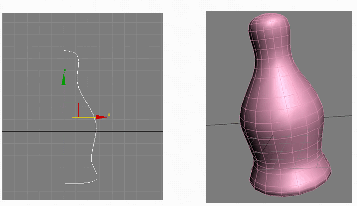

UV параметризация вводит два дополнительных параметра, "u" и "v". Параметр "u" создаёт деления на "меридиане" тела вращения &mdash; то есть на линии, проходящей вдоль оси вращения тела. Параметр "v" создаёт деления на "параллели", то есть на линии, оборачивающей тело вращения подобно экватору или параллели глобуса.

## UV-параметризация сферы

В географии принято разделять глобус двумя типами линий &mdash; параллелями (параллель фиксирована определённой широтой) и меридианами (меридиан фиксирован определённой долготой).

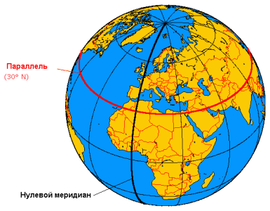

Этот подход хорошо сочетается с UV-параметризацией: мы будем делить сферу так же, как параллели и меридианы делят глобус, и обозначим широту как "φ", а долготу как "λ". Сделав несколько построений и применив тригонометрические правила, можно получить формулы, выводящие трёхмерный вектор (x, y, z) из двумерного вектора (u, v):

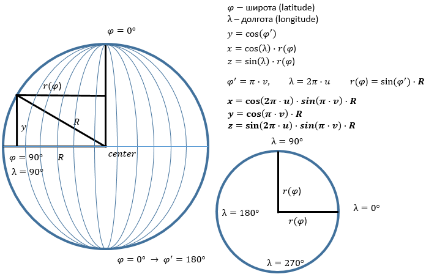

Полученный нами способ триагуляции аналогичен построению графика двумерной функции из прошлого примера. Только теперь вместо прямого вычисления (x, z) и вывода из них координаты "y" мы вводим сетку параметров (u, v) и выводим из них (x, y, z)

## Класс CIdentitySphere

Определение класса в целом похоже на CSolidFunctionSurface из предыдущей статьи, но в конструктор CIdentitySphere предаётся число делений по параллелям и по меридианам сферы, что позволяет задать детализацию сферы при её конструировании.

```cpp
// Вершина с трёхмерной позицией и нормалью.
struct SVertexP3N
{
    glm::vec3 position;
    glm::vec3 normal;
};

class CIdentitySphere final : public IBody
{
public:
    CIdentitySphere(unsigned slices, unsigned stacks);

    void Update(float) final {}
    void Draw()const final;

private:
    void Tesselate(unsigned slices, unsigned stacks);ч

    std::vector<SVertexP3N> m_vertices;
    std::vector<uint32_t> m_indicies;
};
```

Вспомогательные функции CalculateTriangleStripIndicies (для распределения вершин по треугольникм) и DoWithBindedArrays (для привязк массивов данных к OpenGL) не изменились в сравнении с прошлым примером. Реализации конструктора и метода Draw просты:

```cpp
CIdentitySphere::CIdentitySphere(unsigned slices, unsigned stacks)
{
    Tesselate(slices, stacks);
}

void CIdentitySphere::Draw() const
{
    DoWithBindedArrays(m_vertices, [this] {
        glDrawElements(GL_TRIANGLE_STRIP, GLsizei(m_indicies.size()),
                       GL_UNSIGNED_INT, m_indicies.data());
    });
}
```

В методе Tesselate теперь вместо итерирования по `(x,z)` и вычисления `y` происходит итерирование по промежуточным параметрам `(u,v)` и вычисление ширины (latitude), долготы (longitude), а затем и позиции вершины `(x,y,z)`. Вычисление нормали выполняется легко, так как радиус, проведённый к точке сферы, уже перпендикулярен поверхности, а в единичной сфере радиус ещё и равен единице (т.е. не требует нормализации); это наблюдение проиллюстрировано на картинке:


```cpp
void CIdentitySphere::Tesselate(unsigned slices, unsigned stacks)
{
    assert((slices >= MIN_PRECISION) && (stacks >= MIN_PRECISION));
    m_vertices.reserve(slices * stacks);
    // вычисляем позиции вершин.
    for (unsigned ci = 0; ci < slices; ++ci)
    {
        const float u = float(ci) / float(slices - 1);
        for (unsigned ri = 0; ri < stacks; ++ri)
        {
            const float v = float(ri) / float(stacks - 1);

            SVertexP3N vertex;
            vertex.position = GetPositionOnSphere(u, v);

            // Нормаль к сфере - это нормализованный вектор радиуса к данной точке
            // Поскольку координаты центра равны 0, координаты вектора радиуса
            // будут равны координатам вершины.
            // Благодаря радиусу, равному 1, нормализация не требуется.
            vertex.normal = vertex.position;

            m_vertices.push_back(vertex);
        }
    }

    CalculateTriangleStripIndicies(m_indicies, slices, stacks);
}
```

Вспомогательная функция GetPositionOnSphere() по заданным `(u,v)` возвращает позицию вершины на единичной сфере, согласно ранее сделаному построению:

```cpp
glm::vec3 GetPositionOnSphere(float u, float v)
{
    const float radius = 1.f;
    const float latitude = float(M_PI) * (1.f - v); // 흅∙(ퟎ.ퟓ-풗)
    const float longitude = float(2.0 * M_PI) * u; // ퟐ흅∙풖
    const float latitudeRadius = radius * sinf(latitude);

    return { cosf(longitude) * latitudeRadius,
             cosf(latitude) * radius,
             sinf(longitude) * latitudeRadius };
}
```

После добавления сферы в класс сцены с белым материалом мы получаем:

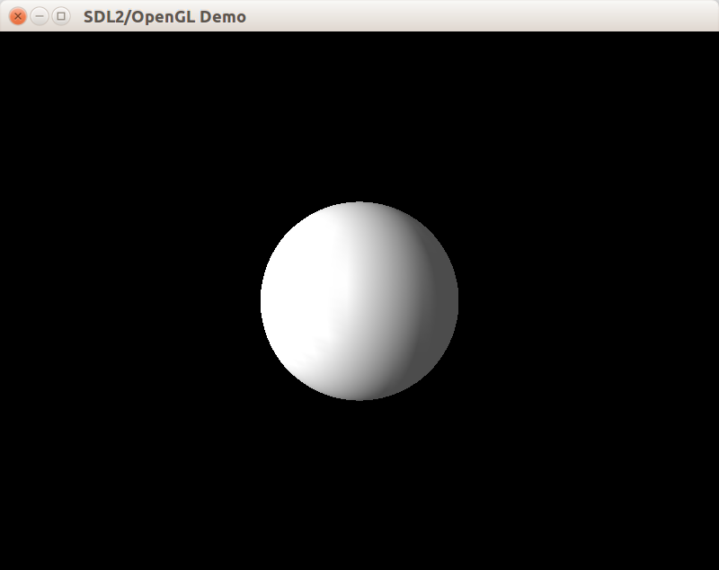

## Загрузка изображения как текстуры

Настало время украсить поверхность сферы текстурой. Для примера мы возьмём текстуру Земли:


В OpenGL текстуры хранятся в видеопамяти, и загружаются программистом как массивы пикселей с помощью функции [glTexImage2D](https://www.opengl.org/sdk/docs/man2/xhtml/glTexImage2D.xml). Чтобы получить массив пикселей из файла изображения средствами SDL2, нам потребуется загрузить объект [SDL_Surface](http://wiki.libsdl.org/SDL_Surface). Сделать это можно несколькими способами:

- с помощью функции [SDL_LoadBMP](http://wiki.libsdl.org/SDL_LoadBMP) можно загрузить изображения в формате BMP
- мы можем установить дополнительный модуль [SDL_image](http://www.libsdl.org/projects/SDL_image/) и получить поддержку загрузки изображений в форматах PNG, JPEG, WEBP и TIFF с помощью функции [IMG_Load](https://www.libsdl.org/projects/SDL_image/docs/SDL_image_frame.html)

Формат BMP практически никак не сжимает данные о пикселях изображения: при размере 1000x1000 и формате пикселей RGBA размер файла будет порядка 4МБ (или чуть меньше в режиме RLE encoding). Чтобы избежать настолько ограниченного формата, установите SDL_image: для этого достаточно распаковать загруженный архив и совместить подкаталоги include, lib, bin с подкаталогами ранее установленной библиотеки SDL2.

Нам нужно обеспечить автоматическое управление памятью и обрабатывать ситуации, когда текстуру загрузить не удалось. Благодаря следованию правилам современного C++ и применению умных указателей, мы можем использовать механизм исключений и не бояться утечек ресурсов. Добавим обработку фатальных исключений программы в main:

#### main.cpp

```cpp
#include "stdafx.h"
#include "Window.h"
#include <SDL2/SDL.h>

namespace
{
const glm::ivec2 WINDOW_SIZE = {800, 600};
const char WINDOW_TITLE[] = "OpenGL Demo #11 (skybox + earth)";
const char ERROR_TITLE[] = "Fatal Error";
}

int main(int, char *[])
{
    try
    {
        CWindow window;
        window.Show(WINDOW_TITLE, WINDOW_SIZE);
        window.DoGameLoop();
    }
    catch (const std::exception &ex)
    {
        SDL_ShowSimpleMessageBox(SDL_MESSAGEBOX_ERROR, ERROR_TITLE,
                                 ex.what(), nullptr);
    }

    return 0;
}
```

## Класс CFilesystemUtils

Этот класс будет предоставлять удобный интерфейс для загрузки ресурсов, построенный на основе Boost.Filesystem. Кроме того, класс займётся поиском ресурсов по относительным путям. Продемонстрируем определение этого класса:

```cpp
#pragma once
#include "Utils.h"
#include <string>
#include <boost/filesystem/path.hpp>

class CFilesystemUtils
{
public:
    CFilesystemUtils() = delete;

    static boost::filesystem::path GetResourceAbspath(const boost::filesystem::path &path);
    static std::string LoadFileAsString(const boost::filesystem::path &path);
    static SDLSurfacePtr LoadImage(const boost::filesystem::path &path);
};
```

Развернуть относительный путь в абсолютный можно двумя способами:

- если вы знаете точное местоположение корневого каталога, от которого отсчитываются относительные пути ресурсов, то можно использовать функцию `boost::filesystem::absolute(relativePath, rootDir)`
- если вы не знаете местоположение корневого каталога и воспользуетесь относительным путём, система сама развернёт путь с учётом текущего каталога (см. [Working Directory на en.wikipedia.org](https://en.wikipedia.org/wiki/Working_directory)) процесса программы.

Путь к текущему каталогу формируется простыми правилами, однако, новички в программировании всё равно часто путаются. Кроме того, выбор этого каталога может зависеть от действий пользователя. Куда надёжнее использовать путь к каталогу, в котором лежит исполняемый файл программы.

Мы воспользуемся универсальной функцией, которая определяет путь исполняемому файла на Windows, Linux и MacOSX, используя API операционной системы:

```cpp
#include <boost/filesystem/operations.hpp>
#ifdef _WIN32
#include <sdkddkver.h>
#include <Windows.h>
#endif

const size_t FILE_RESERVE_SIZE = 4096;
const size_t MAX_PATH_SIZE = 4096;

// Возвращает путь к текущему исполняемому файлу,
// .exe на Windows, ELF на Linux, MachO на MacOSX
std::string GetExecutablePath()
{
    char buffer[MAX_PATH_SIZE];
    size_t size = sizeof(buffer);
#if defined(_WIN32)
    size = size_t(::GetModuleFileNameA(nullptr, buffer, DWORD(size)));
#elif defined(__linux__)
    ssize_t result = readlink("/proc/self/exe", buffer, size);
    if (result <= 0)
    {
        throw std::runtime_error("Unexpected error on readlink()");
    }
    size = size_t(result);
#elif defined(__apple__)
    uint32_t sizeU32 = uint32_t(size);
    if (_NSGetExecutablePath(buffer, &sizeU32) != 0)
    {
        throw std::runtime_error("Unexpected error on _NSGetExecutablePath()");
    }
    size = size_t(sizeU32);
#endif
    return std::string(buffer, size_t(size));
}
```

Полученный путь можно преобразовать в объект `boost::filesystem::path`, и затем получить родительский каталог для этого пути методом `.parent_path()`. Если мы добавим проверку существования сформированного пути, то мы можем написать универсальный статический метод класса CFilesystemUtils, который получает произвольный путь (возможно, относительный) и возвращает абсолютный путь.

```cpp
namespace fs = boost::filesystem;

boost::filesystem::path CFilesystemUtils::GetResourceAbspath(const boost::filesystem::path &currentPath)
{
    if (currentPath.is_absolute())
    {
        return currentPath;
    }

    const fs::path executableDir = fs::path(GetExecutablePath()).parent_path();
    const fs::path currentDir = fs::current_path();
    for (const auto &dir : {executableDir, currentDir})
    {
        fs::path abspath = fs::absolute(currentPath, dir);
        if (fs::exists(abspath))
        {
            return abspath;
        }
    }
    throw std::runtime_error("Resource not found: " + currentPath.generic_string());
}
```

Также нам пригодится статический метод, которая построчно загружает файл и помещает содержимое в экземпляр `std::string`:

```cpp
std::string CFilesystemUtils::LoadFileAsString(const boost::filesystem::path &path)
{
    const fs::path abspath = GetResourceAbspath(path);

    std::ifstream input;
    input.open(path.native());
    if (!input.is_open())
    {
        throw std::runtime_error("Cannot open for reading: " + path.generic_string());
    }

    std::string text;
    text.reserve(FILE_RESERVE_SIZE);
    input.exceptions(std::ios::badbit);

    std::string line;
    while (std::getline(input, line))
    {
        text.append(line);
        text.append("\n");
    }

    return text;
}
```

Наконец, мы подготовим метод, который вызывает IMG_Load для загрузки изображения из файла в SDL_Surface. Чтобы обеспечить правильную работу с кириллическими и просто юникодными путями, нам потребуется преобразовать путь в однобайтовую строку в формате UTF-8 &mdash; именно в таком виде SDL принимает все пути к файлам.

```cpp
// Функция преобразует путь в родном для системы формате в UTF-8.
//  Библиотека SDL2 принимает пути в UTF-8 на всех платформах.
std::string ConvertPathToUtf8(const boost::filesystem::path &path)
{
#ifdef _WIN32
    std::wstring_convert<std::codecvt_utf8<wchar_t>> converter;
    return converter.to_bytes(path.native());
#else // unix-платформы.
    return path.native();
#endif
}

SDLSurfacePtr CFilesystemUtils::LoadImage(const boost::filesystem::path &path)
{
    const std::string pathUtf8 = ConvertPathToUtf8(GetResourceAbspath(path));
    SDLSurfacePtr pSurface(IMG_Load(pathUtf8.c_str()));
    if (!pSurface)
    {
        throw std::runtime_error("Cannot find texture at " + path.generic_string());
    }

	return pSurface;
}
```

Выше используется тип данных SDLSurfacePtr, который мы объявим как специализацию unique_ptr для SDL_Surface:

```cpp
namespace detail
{
struct SDLSurfaceDeleter
{
    void operator()(SDL_Surface *ptr)
    {
        SDL_FreeSurface(ptr);
    }
};
}

using SDLSurfacePtr = std::unique_ptr<SDL_Surface, detail::SDLSurfaceDeleter>;
```

## Класс CTexture2D

Класс загузки и хранения для двумерной текстуры должен выполнять две задачи:

- предоставлять RAII интерфейс управления OpenGL-объектом "текстура", для которого видеодрайвер выдаёт уникальный идентификатор типа unsigned
- выполнять как привязку текстуры к состоянию OpenGL, так и отмену ранее совершённой привязки

В OpenGL для привязки единственной текстуры к текущему контексту применяется функция [glBindTexture](https://msdn.microsoft.com/en-us/library/windows/desktop/dd318364%28v=vs.85%29.aspx). Заметим, что в более поздних версиях OpenGL были введены более удачные альтернативы, позволяющие использовать одновременно более одной текстуры; эти альтернативы имеют критическое значение для многих спецэффектов, но не интересуют нас в рамках данной статьи.

```cpp
// Привязка текстуры с индексом m_textureId к состоянию OpenGL
// Только одна текстура может быть привязана в один момент времени
// таким способом
glBindTexture(GL_TEXTURE_2D, m_textureId);

// Отвязка текстуры от состояния OpenGL, теперь в состоянии OpenGL
// нет привязанной текстуры
glBindTexture(GL_TEXTURE_2D, 0);
```

Последовательный вызов bind/unbind вполне приемлем для процедурного стиля программирования, но вызывает проблемы в программах, где возможен выброс исключений. Поэтому мы добавим к классу CTexture2D метод DoWhileBinded, принимающий функтор и выполняющий его в тот момент, когда текстура привязана к состоянию OpenGL.

#### Texture2D.h

```cpp
#pragma once
#include <boost/noncopyable.hpp>
#include <boost/scope_exit.hpp>
#include <string>
#include <memory>

class CTexture2D;
using CTexture2DUniquePtr = std::unique_ptr<CTexture2D>;

/// Класс владеет текстурой типа GL_TEXTURE_2D,
///    у которой есть две координаты "s" и "t",
///    и позволяет привязывать её к контексту OpenGL
class CTexture2D : private boost::noncopyable
{
public:
    CTexture2D();
    ~CTexture2D();

    void Bind()const;
    static void Unbind();

    template <class TFunction>
    void DoWhileBinded(TFunction && fn)const
    {
        Bind();
        // При выходе из функции гарантированно выполняем Unbind.
        BOOST_SCOPE_EXIT_ALL(&) {
            Unbind();
        };
        fn();
    }

private:
    unsigned m_textureId = 0;
};
```

В этом примере мы использовали макрос [BOOST_SCOPE_EXIT_ALL](http://www.boost.org/doc/libs/1_52_0/libs/scope_exit/doc/html/BOOST_SCOPE_EXIT_ALL.html), который доступен в библиотеках Boost, но только для компиляторов с поддержкой C++11. Макрос служит хорошей альтернативой написанию небольших RAII-классов.

Создание, удаление и привязка текстуры реализуются просто:

```cpp
#include "stdafx.h"
#include "Texture2D.h"

CTexture2D::CTexture2D()
{
    glGenTextures(1, &m_textureId);
}

CTexture2D::~CTexture2D()
{
    glDeleteTextures(1, &m_textureId);
}

void CTexture2D::Bind() const
{
    glBindTexture(GL_TEXTURE_2D, m_textureId);
}

void CTexture2D::Unbind()
{
    glBindTexture(GL_TEXTURE_2D, 0);
}
```

## Параметры наложения текстуры

Для того, чтобы нарисовать прямоугольник с наложенной на него текстурой, необходимо включить режим наложения двухмерной текстуры при помощи вызова функции glEnable с параметром GL_TEXTURE_2D, выбрать нужный текстурный объект при помощи glBindTexure, а затем

- либо привязать массив, содержащий текстурные координаты каждой вершины примитива, с помощью [glTexCoordPointer](https://www.opengl.org/sdk/docs/man2/xhtml/glTexCoordPointer.xml)
- либо задать текстурные координаты внутри glBegin/glEnd для каждо вершины отдельно с помощью семейства функций [glTexCoord*](https://www.opengl.org/sdk/docs/man2/xhtml/glTexCoord.xml)
- либо иным способом передать этот атрибут для каждой вершины

Текстурные координаты определяют способ наложения всей текстуры или её фрагмента на поверхность. Общий принцип проиллюстрирован ниже:

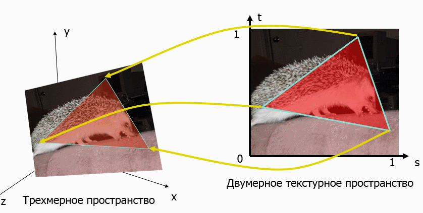

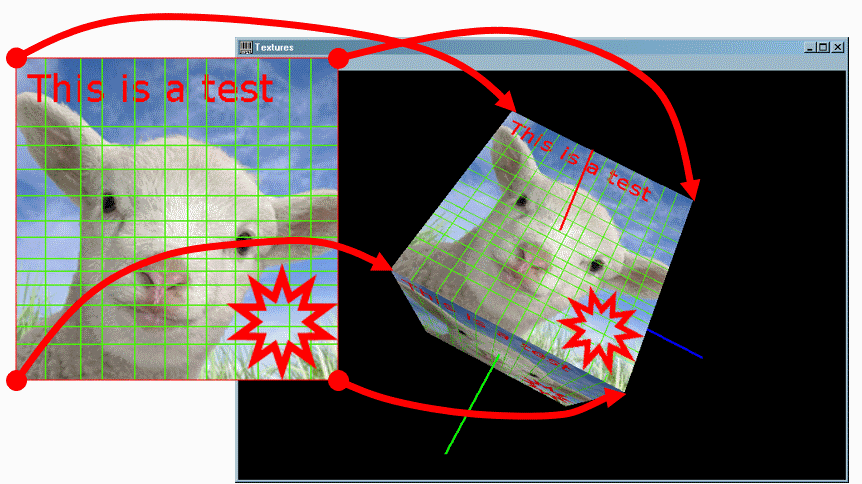

Текстурные координаты задаются в текстурном пространстве, задающем отображение текстурного изображения на диапазон координат от 0 до 1.

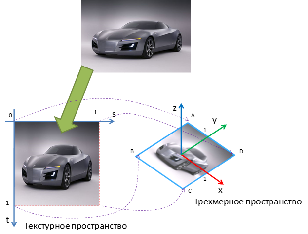

Есть ряд параметров, влияющих на наложение текстуры

- оборачивание (wrapping), задающее поведение при выходе текстурных координат за границы [0;1]:


- параметры адаптации текстуры при её масштабировании (filtering):
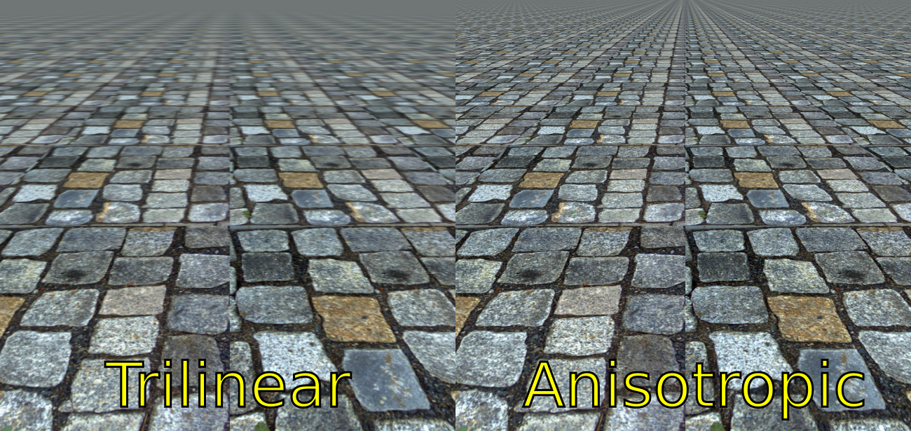

Подробнее о параметрах текстуры можно прочитать в статье на [open.gl/textures](https://open.gl/textures). В рамках данного примера мы не используем дополнительные параметры.

## Класс для загрузки текстур

Класс CTexture2DLoader будет выполнять загрузку текстурного объекта из файла изображения, и кидать исключение в случае неудачной загрузки. Также будет возможность выбрать параметры, применяемые к текстуре, перед загрузкой.

```cpp
enum class TextureWrapMode
{
	REPEAT,
	CLAMP_TO_EDGE,

	// Значение по умолчанию в OpenGL - GL_REPEAT.
	DEFAULT_VALUE = REPEAT,
};

/// Класс загружает текстуру типа GL_TEXTURE_2D,
///    из изображений *.bmp, *.jpg, *.png и любых других форматов,
///    с которыми работает модуль SDL_image.
class CTexture2DLoader
{
public:
    CTexture2DUniquePtr Load(const boost::filesystem::path &path);

    void SetWrapMode(TextureWrapMode wrap);
    void SetWrapMode(TextureWrapMode wrapS, TextureWrapMode wrapT);

private:
    TextureWrapMode m_wrapS = TextureWrapMode::DEFAULT_VALUE;
    TextureWrapMode m_wrapT = TextureWrapMode::DEFAULT_VALUE;
};
```

Мы напишем вспомогательный статический метод `CUtils::FlipSurfaceVertically`, который обращается к пикселям SDL_Surface и зеркалирует их по вертикали. В результате текстура не окажется перевёрнутой из-за того, что OpenGL считает точкой отсчёта в текстуре левый нижний угол, а не левый верхний.

```cpp
void CUtils::FlipSurfaceVertically(SDL_Surface &surface)
{
    const auto rowSize = size_t(surface.w * surface.format->BytesPerPixel);
    std::vector<uint8_t> row(rowSize);

    // Зеркально отражаем пиксели по оси Y,
    //  если число строк пикселей в изображении нечётное,
    //  центральная строка остаётся нетронутой.
    for (size_t y = 0, height = size_t(surface.h); y < height / 2; ++y)
    {
        auto *pixels = reinterpret_cast<uint8_t*>(surface.pixels);
        auto *upperRow = pixels + rowSize * y;
        auto *lowerRow = pixels + rowSize * (height - y - 1);
        std::memcpy(row.data(), upperRow, rowSize);
        std::memcpy(upperRow, lowerRow, rowSize);
        std::memcpy(lowerRow, row.data(), rowSize);
    }
}
```

Теперь реализуем загрузку изображения сначала в оперативную память в виде матрицы пикселей, а затем и в видеопамять в виде текстуры OpenGL:

```cpp
CTexture2DUniquePtr CTexture2DLoader::Load(const path &path)
{
	SDLSurfacePtr pSurface = CFilesystemUtils::LoadImage(path);

	// Все изображения будем конвертировать в RGB или RGBA,
	//  в зависимости от наличия альфа-канала в исходном изображении.
	const bool hasAlpha = SDL_ISPIXELFORMAT_ALPHA(pSurface->format->format);
	const GLenum pixelFormat = hasAlpha ? GL_RGBA : GL_RGB;
	const uint32_t requiredFormat = hasAlpha
		? SDL_PIXELFORMAT_ABGR8888
		: SDL_PIXELFORMAT_RGB24;
	if (pSurface->format->format != requiredFormat)
	{
		pSurface.reset(SDL_ConvertSurfaceFormat(pSurface.get(), requiredFormat, 0));
	}

	// В системе координат OpenGL отсчёт идёт с нижней левой точки,
	//  а не с верхней левой, поэтому переворачиваем изображение.
	CUtils::FlipSurfaceVertically(*pSurface);

	auto pTexture = std::make_unique<CTexture2D>();
	pTexture->DoWhileBinded([&] {
		glTexImage2D(GL_TEXTURE_2D, 0, GLint(pixelFormat), pSurface->w, pSurface->h,
			0, pixelFormat, GL_UNSIGNED_BYTE, pSurface->pixels);
		glTexParameteri(GL_TEXTURE_2D, GL_TEXTURE_MIN_FILTER, GL_LINEAR);
		glTexParameteri(GL_TEXTURE_2D, GL_TEXTURE_MAG_FILTER, GL_LINEAR);
		glTexParameteri(GL_TEXTURE_2D, GL_TEXTURE_WRAP_S, GLint(ConvertEnum(m_wrapS)));
		glTexParameteri(GL_TEXTURE_2D, GL_TEXTURE_WRAP_T, GLint(ConvertEnum(m_wrapT)));
	});

	return pTexture;
}

void CTexture2DLoader::SetWrapMode(TextureWrapMode wrap)
{
	m_wrapS = wrap;
	m_wrapT = wrap;
}

void CTexture2DLoader::SetWrapMode(TextureWrapMode wrapS, TextureWrapMode wrapT)
{
	m_wrapS = wrapS;
	m_wrapT = wrapT;
}
```

## Наложение текстуры на объемные объекты

Визуализация объемного объекта в OpenGL сводится в визуализации плоских граней, аппроксимирующих поверхность данного объекта, поэтому принципиальных различий от наложения текстуры на плоские объекты нет. Основная наша задача – задать текстурные координаты вершин граней, чтобы получить желаемый результат.

Рассмотрим в данном примере расчет текстурных координат для сферы и куба, поскольку для таких фигур расчет текстурных координат выполняется достаточно просто. При наложении текстуры на более сложные объекты автоматический расчет текстурных координат, как правило, слишком сложен или не дает желаемых результатов. Поэтому дизайнеры трехмерных моделей выполняют наложение текстуры вручную при помощи специальных программ. Данная технология получила название UV mapping (U и V – распространенное имя для координатных осей в двухмерном текстурном пространстве):

UV mapping напрямую сочетается с UV-параметризацией. Благодаря этому, внедрить текстурные координаты в класс сферы для нас будет очень легко:

- SVertexP3N нужно расширить (и переименовать в SVertexP3NT2)
- в функции DoWithBindedArrays надо добавить привязку GL_TEXTURE_COORD_ARRAY

## Структура SMeshP3NT3

Чтобы отделить логику триангуляции сферы от представлвения вершин, опишем в отдельной паре H-CPP структуру SMeshP3NT3. Таким будет заголовок:

```cpp
#pragma once

#include <glm/fwd.hpp>
#include <glm/vec2.hpp>
#include <glm/vec3.hpp>
#include <vector>

enum class MeshType
{
    Triangles,
    TriangleFan,
    TriangleStrip,
};

// Вершина с трёхмерной позицией, нормалью и 2D координатами текстуры.
struct SVertexP3NT2
{
    glm::vec3 position;
    glm::vec2 texCoord;
    glm::vec3 normal;
};

// Сетка вершин с трёхмерной позицией, нормалью и 2D коодинатами текстуры.
struct SMeshP3NT2
{
    std::vector<SVertexP3NT2> m_vertices;
    std::vector<uint32_t> m_indicies;
    MeshType m_meshType = MeshType::Triangles;

    // Очищает вершины и индексы, устанавливает тип примитива.
    void Clear(MeshType meshType);

    // Рисует сетку примитивов, используя массивы индексов и вершин.
    void Draw()const;
};
```

В реализации нам потребуется привязать массивы атрибутов вершин, а затем нарисовать нужную группу примитивов (отдельные треугольники, полосу треугольников или веер треугольников):

```cpp
#include "stdafx.h"
#include "MeshP3NT2.h"

namespace
{
/// Привязывает вершины к состоянию OpenGL,
/// затем вызывает 'callback'.
template <class T>
void DoWithBindedArrays(const std::vector<SVertexP3NT2> &vertices, T && callback)
{
    // Включаем режим vertex array и normal array.
    glEnableClientState(GL_TEXTURE_COORD_ARRAY);
    glEnableClientState(GL_VERTEX_ARRAY);
    glEnableClientState(GL_NORMAL_ARRAY);

    // Выполняем привязку vertex array и normal array
    const size_t stride = sizeof(SVertexP3NT2);
    glNormalPointer(GL_FLOAT, stride, glm::value_ptr(vertices[0].normal));
    glVertexPointer(3, GL_FLOAT, stride, glm::value_ptr(vertices[0].position));
    glTexCoordPointer(2, GL_FLOAT, stride, glm::value_ptr(vertices[0].texCoord));

    // Выполняем внешнюю функцию.
    callback();

    // Выключаем режим vertex array и normal array.
    glDisableClientState(GL_TEXTURE_COORD_ARRAY);
    glDisableClientState(GL_VERTEX_ARRAY);
    glDisableClientState(GL_NORMAL_ARRAY);
}

GLenum GetPrimitiveType(MeshType type)
{
    switch (type)
    {
    case MeshType::Triangles:
        return GL_TRIANGLES;
    case MeshType::TriangleFan:
        return GL_TRIANGLE_FAN;
    case MeshType::TriangleStrip:
        return GL_TRIANGLE_STRIP;
    default:
        throw std::logic_error("Unhandled mesh type");
    }
}
}

void SMeshP3NT2::Clear(MeshType meshType)
{
    m_meshType = meshType;
    m_indicies.clear();
    m_vertices.clear();
}

void SMeshP3NT2::Draw() const
{
    DoWithBindedArrays(m_vertices, [this] {
        GLenum primitive = GetPrimitiveType(m_meshType);
        glDrawElements(primitive, GLsizei(m_indicies.size()),
                       GL_UNSIGNED_INT, m_indicies.data());
    });
}
```

## Обновлённый класс CIdentitySphere

После модификаций определение этого класс будет выглядеть следующим образом:

```cpp
#pragma once

#include "MeshP3NT2.h"
#include "libchapter2.h"

class CIdentitySphere final : public ISceneObject
{
public:
    CIdentitySphere(unsigned slices, unsigned stacks);

    void Update(float) final {}
    void Draw()const final;

private:
    void Tesselate(unsigned slices, unsigned stacks);

    SMeshP3NT2 m_mesh;
};
```

В методе Tesselate надо передать `(1-u,v)` как две текстурные координаты. В этом трюке и заключается выгода UV-параметризации: нам не надо вычислять, как наложить текстуру на тело вращения.

```cpp
#include "stdafx.h"
#include "IdentitySphere.h"
#include <algorithm>

namespace
{
const unsigned MIN_PRECISION = 4;

void CalculateTriangleStripIndicies(std::vector<uint32_t> &indicies,
                                    unsigned columnCount, unsigned rowCount)
{
    indicies.clear();
    indicies.reserve((columnCount - 1) * rowCount * 2);
    // вычисляем индексы вершин.
    for (unsigned ci = 0; ci < columnCount - 1; ++ci)
    {
        if (ci % 2 == 0)
        {
            for (unsigned ri = 0; ri < rowCount; ++ri)
            {
                unsigned index = ci * rowCount + ri;
                indicies.push_back(index + rowCount);
                indicies.push_back(index);
            }
        }
        else
        {
            for (unsigned ri = rowCount - 1; ri < rowCount; --ri)
            {
                unsigned index = ci * rowCount + ri;
                indicies.push_back(index);
                indicies.push_back(index + rowCount);
            }
        }
    }
}

glm::vec3 GetPositionOnSphere(float u, float v)
{
    const float radius = 1.f;
    const float latitude = float(M_PI) * (1.f - v); // 흅∙(ퟎ.ퟓ-풗)
    const float longitude = float(2.0 * M_PI) * u; // ퟐ흅∙풖
    const float latitudeRadius = radius * sinf(latitude);

    return { cosf(longitude) * latitudeRadius,
             cosf(latitude) * radius,
             sinf(longitude) * latitudeRadius };
}
}

CIdentitySphere::CIdentitySphere(unsigned slices, unsigned stacks)
{
    Tesselate(slices, stacks);
}

void CIdentitySphere::Draw() const
{
    m_mesh.Draw();
}

void CIdentitySphere::Tesselate(unsigned slices, unsigned stacks)
{
    assert((slices >= MIN_PRECISION) && (stacks >= MIN_PRECISION));

    m_mesh.Clear(MeshType::TriangleStrip);
    m_mesh.m_vertices.reserve(slices * stacks);
    // вычисляем позиции вершин.
    for (unsigned ci = 0; ci < slices; ++ci)
    {
        const float u = float(ci) / float(slices - 1);
        for (unsigned ri = 0; ri < stacks; ++ri)
        {
            const float v = float(ri) / float(stacks - 1);

            SVertexP3NT2 vertex;
            vertex.position = GetPositionOnSphere(u, v);

            // Нормаль к сфере - это нормализованный вектор радиуса к данной точке
            // Поскольку координаты центра равны 0, координаты вектора радиуса
            // будут равны координатам вершины.
            // Благодаря радиусу, равному 1, нормализация не требуется.
            vertex.normal = vertex.position;

            // Обе текстурные координаты должны плавно изменяться от 0 до 1,
            // натягивая прямоугольную картинку на тело вращения.
            // При UV-параметризации текстурными координатами будут u и v.
            vertex.texCoord = {1.f - u, v};

            m_mesh.m_vertices.push_back(vertex);
        }
    }

    CalculateTriangleStripIndicies(m_mesh.m_indicies, slices, stacks);
}
```

Загрузить текстуру для сферы в поле `CWindow::m_pEarthTexture` можно в методе OnWindowInit. В OnDrawWindow потребуется применить текстуру при рисованиию

```cpp
void CWindow::OnWindowInit(const glm::ivec2 &size)
{
    (void)size;
    SetupOpenGLState();

    CTexture2DLoader loader;
    loader.SetWrapMode(TextureWrapMode::REPEAT);
    m_pEarthTexture = loader.Load(EARTH_TEX_PATH);
}

void CWindow::OnUpdateWindow(float deltaSeconds)
{
    m_camera.Update(deltaSeconds);
    m_decoratedSphere.Update(deltaSeconds);
}

void CWindow::OnDrawWindow(const glm::ivec2 &size)
{
    SetupView(size);

    m_sunlight.Setup();
    m_material.Setup();
    m_pEarthTexture->DoWhileBinded([&] {
        m_decoratedSphere.Draw();
    });
}
```

После этого этапа получаем следующий результат:


## Готовым текстурный атлас для SkyBox

Для вывода коробки, рисующей окружающую среду вокруг камеры, нам потребуется несколько изображений.

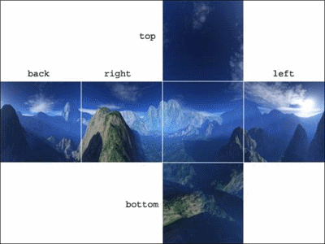

Если хранить каждое изображение как отдельную текстуру, может возникнуть ряд проблем:

- может усложниться структура кода
- из-за постоянного переключения текстур на каждом кадре может снизиться производительность программы
- некоторые реализации OpenGL требуют, чтобы ширина и высота текстуры всегда были степенями двойки (2, 4, 8, ..., 512, 1024 и т.д.); соблюдать эти требования вручную достаточно сложно

Для обхода этой проблемы мы реализуем идею [текстурного атласа](https://en.wikipedia.org/wiki/Texture_atlas), позволяющего хранить целую серию мелких изображений. Эта идея также известна как Sprite Sheet, и она широко практикуется в мире Cocos2d-x:

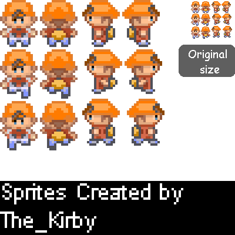

Для упаковки текстур в такой атлас и вывода информации об упакованных изображениях в XML потребуется программа-упаковщик. В примерах был использован форк открытой программы [Cheetah-Texture-Packer](https://github.com/sergey-shambir/Cheetah-Texture-Packer).

Полученный Texture Atlas есть в репозитории в файлах `galaxy.plist` и `galaxy.png`. Для загрузки атласа был написан класс CTexture2DAtlas, а также вспомогатлеьный класс CPropertyListParser, который с помощью библиотеки TinyXML загружает XML-описание спрайта и передаёт атласу информацию о фреймах. Изучить реализацию этих классов вы можете самостоятельно, а ниже приведено только определение класса:

```cpp
/// Класс хранит атлас текстур,
///    который представляет из себя склеенную из нескольких текстур
///    единую текстуру, а также хранит данные для разделения этой
///    текстуры на прямоугольники с помощью текстурных координат.
/// Формат текстур совместим с cocos2d-x, и может быть создан
///    с помощью github.com/sergey-shambir/Cheetah-Texture-Packer
class CTexture2DAtlas : private boost::noncopyable
{
public:
    CTexture2DAtlas(const boost::filesystem::path &xmlPath,
                    CTexture2DLoader loader = CTexture2DLoader());

    const CTexture2D &GetTexture()const;
    CFloatRect GetFrameRect(const std::string &frameName)const;

private:
    std::unordered_map<std::string, CFloatRect> m_frames;
    CTexture2DUniquePtr m_pTexture;
};
```

## Разработка куба для SkyBox

Мы обновим класс CIdentityCube, чтобы покрыть потребности Sky Box, которому нужны текстурные координаты на вершинах куба.

```cpp
#pragma once

#include "MeshP3NT2.h"
#include "libchapter2.h"
#include <vector>
#include <array>

enum class CubeFace
{
    Front = 0,
    Back,
    Top,
    Bottom,
    Left,
    Right,

    NumFaces
};

class CIdentityCube : public ISceneObject
{
public:
    void Update(float) final;
    void Draw()const final;

    void SetFaceTextureRect(CubeFace face, const CFloatRect &rect);

private:
    void Triangulate();

    static const size_t FACES_COUNT = static_cast<size_t>(CubeFace::NumFaces);

    SMeshP3NT2 m_mesh;
    std::array<CFloatRect, FACES_COUNT> m_textureRects;
    bool m_isDirty = true;
};
```

При выводе куба следует аккуратно накладывать текстуры, чтобы каждый из шести участков попал на свою грань куба, и чтобы ни одна текстура на грани не оказалась повёрнутой. В противном случае швы текстур между гранями не будут сочетаться, как на примере ниже:

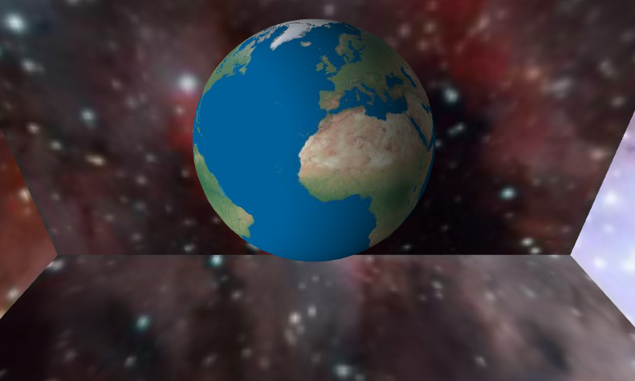

Визуализируем наложение текстуры, сформированной в виде развёртки куба, на куб:

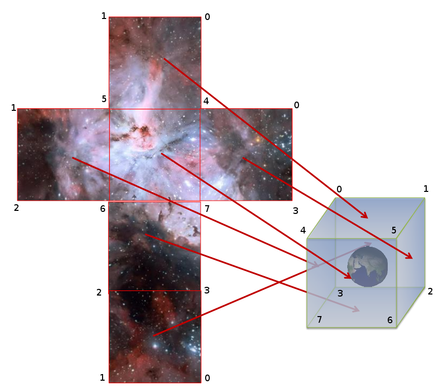

Пользуясь этой визуализацией, можно написать корректную реализацию единичного куба:

```cpp
#include "stdafx.h"
#include "IdentityCube.h"

#include <stdint.h>

namespace
{
struct SCubeFace
{
    uint16_t vertexIndex1;
    uint16_t vertexIndex2;
    uint16_t vertexIndex3;
    uint16_t vertexIndex4;
    uint16_t faceIndex;
};

// Вершины куба служат материалом для формирования треугольников,
// составляющих грани куба.
const glm::vec3 CUBE_VERTICIES[] = {
    {-1, +1, -1},
    {+1, +1, -1},
    {+1, -1, -1},
    {-1, -1, -1},
    {-1, +1, +1},
    {+1, +1, +1},
    {+1, -1, +1},
    {-1, -1, +1},
};

// Привыкаем использовать 16-битный unsigned short,
// чтобы экономить память на фигурах с тысячами вершин.
const SCubeFace CUBE_FACES[] = {
    {2, 3, 0, 1, static_cast<uint16_t>(CubeFace::Front)},
    {6, 2, 1, 5, static_cast<uint16_t>(CubeFace::Left)},
    {6, 7, 3, 2, static_cast<uint16_t>(CubeFace::Bottom)},
    {3, 7, 4, 0, static_cast<uint16_t>(CubeFace::Right)},
    {1, 0, 4, 5, static_cast<uint16_t>(CubeFace::Top)},
    {5, 4, 7, 6, static_cast<uint16_t>(CubeFace::Back)},
};
}

void CIdentityCube::Update(float)
{
    if (m_isDirty)
    {
        Triangulate();
        m_isDirty = false;
    }
}

void CIdentityCube::Draw() const
{
    m_mesh.Draw();
}

void CIdentityCube::SetFaceTextureRect(CubeFace face, const CFloatRect &rect)
{
    const size_t index = static_cast<size_t>(face);
    m_textureRects[index] = rect;
    m_isDirty = true;
}

void CIdentityCube::Triangulate()
{
    m_mesh.Clear(MeshType::Triangles);
    for (const SCubeFace &face : CUBE_FACES)
    {
        const CFloatRect texRect = m_textureRects[face.faceIndex];
        const glm::vec3 &coord1 = CUBE_VERTICIES[face.vertexIndex1];
        const glm::vec3 &coord2 = CUBE_VERTICIES[face.vertexIndex2];
        const glm::vec3 &coord3 = CUBE_VERTICIES[face.vertexIndex3];
        const glm::vec3 &coord4 = CUBE_VERTICIES[face.vertexIndex4];
        const glm::vec3 normal = glm::normalize(
                    glm::cross(coord2 - coord1, coord3 - coord1));

        const SVertexP3NT2 v1 = { coord1, texRect.GetTopLeft(), normal};
        const SVertexP3NT2 v2 = { coord2, texRect.GetTopRight(), normal};
        const SVertexP3NT2 v3 = { coord3, texRect.GetBottomRight(), normal};
        const SVertexP3NT2 v4 = { coord4, texRect.GetBottomLeft(), normal};

        const uint32_t fromIndex = uint32_t(m_mesh.m_vertices.size());
        m_mesh.m_vertices.push_back(v1);
        m_mesh.m_vertices.push_back(v2);
        m_mesh.m_vertices.push_back(v3);
        m_mesh.m_vertices.push_back(v4);
        m_mesh.m_indicies.push_back(fromIndex + 0);
        m_mesh.m_indicies.push_back(fromIndex + 1);
        m_mesh.m_indicies.push_back(fromIndex + 2);
        m_mesh.m_indicies.push_back(fromIndex + 0);
        m_mesh.m_indicies.push_back(fromIndex + 2);
        m_mesh.m_indicies.push_back(fromIndex + 3);
    }
}
```

## Класс CSkyBox

Данный класс не будет универсальным: он будет знать о конкретном текстурном атласе и использовать его для наложения текстуры на куб; также он будет использовать текущую матрицу моделирования-вида для рисования граней куба вокруг камеры на равном удалении независимо от поворота и положения камеры. Рассмотрим определение класса:

```cpp
#pragma once

#include "IdentityCube.h"
#include "libchapter2.h"
#include <boost/noncopyable.hpp>

class CSkybox final : public ISceneObject
{
public:
    CSkybox();
    void Update(float dt) final;
    void Draw()const final;

private:
    CIdentityCube m_cube;
    CTexture2DAtlas m_atlas;
};
```

Реализация класса CSkyBox будет выглядеть следующим образом:

```cpp
#include "stdafx.h"
#include "Skybox.h"
#include <stdint.h>

namespace
{
const char TEXTURE_ATLAS[] = "res/galaxy/galaxy.plist";
const std::pair<CubeFace, const char *> FRAME_MAPPING[] = {
    { CubeFace::Front, "galaxy_front.png" },
    { CubeFace::Back, "galaxy_back.png" },
    { CubeFace::Top, "galaxy_top.png" },
    { CubeFace::Bottom, "galaxy_bottom.png" },
    { CubeFace::Left, "galaxy_left.png" },
    { CubeFace::Right, "galaxy_right.png" },
};

// Устанавливает трансформацию так, чтобы рисование происходило
// в локальных координатах камеры, с сохранением вращения и
// масштабирования системы координат камеры.
template<class T>
void DoAtCameraPosition(T && callback)
{
    glm::mat4 modelView;
    glGetFloatv(GL_MODELVIEW_MATRIX, glm::value_ptr(modelView));

    // Обнуляем перемещение в матрице аффинного преобразования
    modelView[3][0] = 0.f;
    modelView[3][1] = 0.f;
    modelView[3][2] = 0.f;

    glPushMatrix();
    glLoadMatrixf(glm::value_ptr(modelView));
    callback();
    glPopMatrix();
}

CTexture2DLoader MakeTextureLoader()
{
    CTexture2DLoader loader;
    loader.SetWrapMode(TextureWrapMode::CLAMP_TO_EDGE);
    return loader;
}
}

CSkybox::CSkybox()
    : m_atlas(CFilesystemUtils::GetResourceAbspath(TEXTURE_ATLAS),
              MakeTextureLoader())
{
    for (const auto &pair : FRAME_MAPPING)
    {
        CFloatRect texRect = m_atlas.GetFrameRect(pair.second);
        m_cube.SetFaceTextureRect(pair.first, texRect);
    }
}

void CSkybox::Update(float dt)
{
    m_cube.Update(dt);
}

void CSkybox::Draw() const
{
    m_atlas.GetTexture().DoWhileBinded([this] {
        // Инвертируем передние и задние грани, потому что
        // на поверхность SkyBox мы всегда смотрим изнутри.
        glDisable(GL_LIGHTING);
        glDepthMask(GL_FALSE);
        glFrontFace(GL_CW);
        DoAtCameraPosition([this] {
            m_cube.Draw();
        });
        glFrontFace(GL_CCW);
        glDepthMask(GL_TRUE);
        glEnable(GL_LIGHTING);
    });
}
```

Код метода CSkyBox::Draw требует пояснений.

Во-первых, рисование куба мы будем выполнять, предварительно отключив модификацию буфера глубины при помощи функции glDepthMask(GL_FALSE) при отключенном тесте глубины. Благодаря этому содержимое буфера глубины после рисования sky box останется неизменным, при этом все фрагменты куба пройдут тест глубины. По этой же причине sky box должен быть нарисован первым, чтобы не стереть нарисованные до него объекты.

Во-вторых, центр куба привязан к точке наблюдателя. Это значит, что какой бы мы размер стороны куба ни выбрали, картинка не будет зависеть от длины стороны куба. Для того, чтобы привязать точку наблюдения к точке наблюдателя, необходимо заполнить нулями первые три элемента в четвертом столбце матрицы моделирования-вида.

В-третьих, здесь мы используем режим оборачивания текстурных координат GL_CLAMP_TO_EDGE. Его эффект проиллюстрирован ниже:


## Результат

Вы можете взять [полный пример к статье на github](https://github.com/PS-Group/cg_course_examples/tree/master/chapter_2/lesson_11). А вот так выглядит окно после запуска:

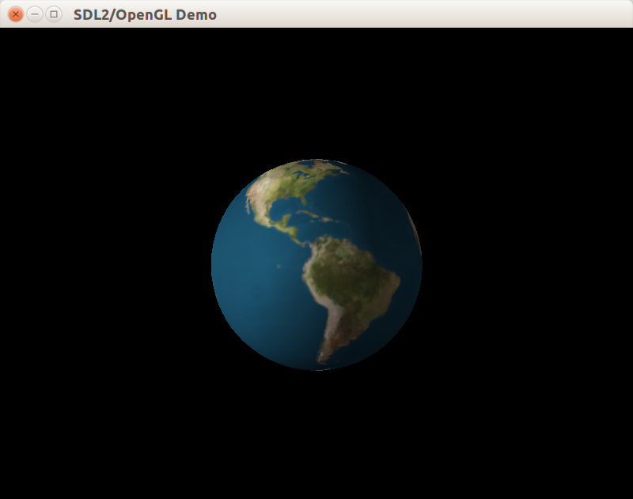

## Ссылки

- [Статья о параметрах наложения текстур (opengl-tutorial.org)](http://www.opengl-tutorial.org/ru/beginners-tutorials/tutorial-5-a-textured-cube/)
］껩］鯗Ｈ鯗
