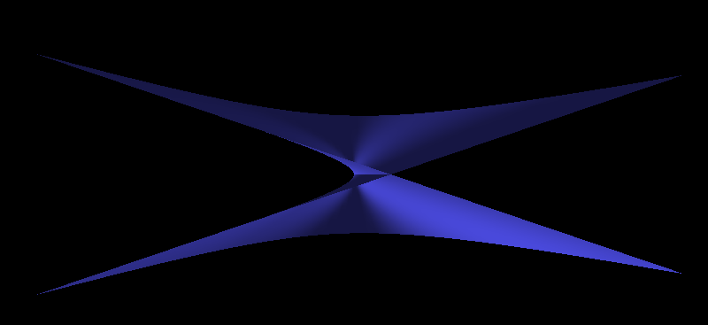
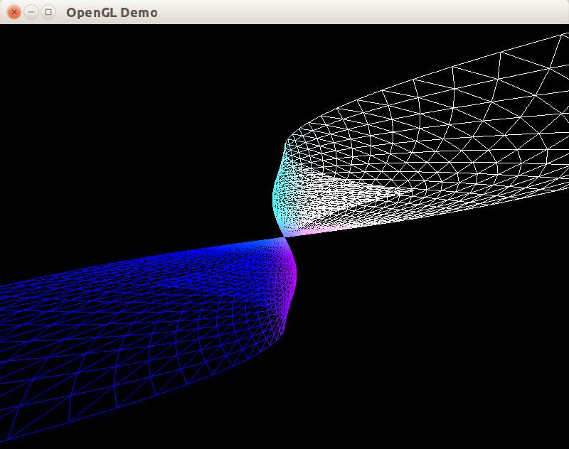
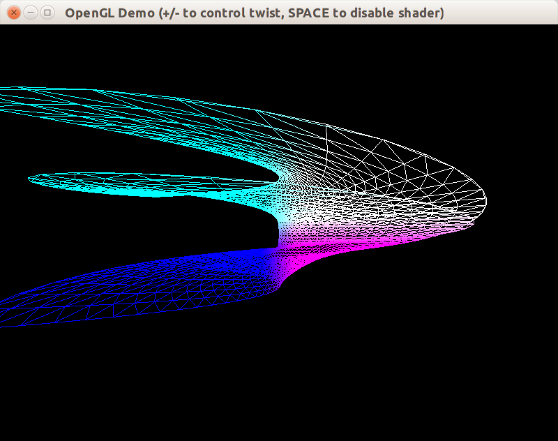

Приложения могут объявлять в шейдерах собственные uniform-переменные и устанавливать их значения. Uniform-переменные будут использоваться шейдерной программой в режиме «только для чтения» для каждой вершины и каждого фрагмента. Мы рассмотрим пример шейдера, выполняющего «закручивание» вершин произвольного объекта вокруг оси y. Действие шейдера мы оценим на примере специального тела &mdash; [Зонтика Уитни](https://en.wikipedia.org/wiki/Whitney_umbrella):



## Класс CWhitneyUmbrella

Для этой поверхности нам не нужны текстурные координаты, поэтому мы используем следующее объявление вершины:

```cpp
// Вершина с трёхмерной позицией и нормалью.
struct SVertexP3N
{
    glm::vec3 position;
    glm::vec3 normal;
};
```

Объявление класса поверхности будет похоже на объявление класса CIdentitySphere, рассмотренного ранее:

```glsl
// Класс поверхности "Зонтик Уитни"
// https://en.wikipedia.org/wiki/Whitney_umbrella
class CWhitneyUmbrella
{
public:
    CWhitneyUmbrella(unsigned slices, unsigned stacks);

    void Draw()const;

private:
    void Tesselate(unsigned slices, unsigned stacks);

    std::vector<SVertexP3N> m_vertices;
    std::vector<uint32_t> m_indicies;
};
```

Реализации методов уже были рассмотрены ранее на примере сферы, мы затронем только два отличия Зонтика Уитни от сферы. Во-первых, здесь используется другая функция получения точки (x,y,z) по (u,v) координатам:

```cpp
glm::vec3 GetSurfacePoint(float u, float v)
{
    // Приводим параметры из диапазона [0..1] к диапазону [-3..3]
    u = 6.f * (u - 0.5f);
    v = 6.f * (v - 0.5f);
    return { u * v, u, v * v };
}
```

Во-вторых, для единичной сферы нормали рассчитываются простейшим способом, потому что любой вектор радиуса от центра к точке на сфере уже является нормалью сферы. Для произвольной поверхности можно применить численный метод на основе векторного произведения сторон треугольника, касающегося поверхности в заданной точке:

```cpp
void CWhitneyUmbrella::Tesselate(unsigned slices, unsigned stacks)
{
    assert((slices >= MIN_PRECISION) && (stacks >= MIN_PRECISION));
    m_vertices.reserve(slices * stacks);
    // вычисляем позиции вершин.
    for (unsigned ci = 0; ci < slices; ++ci)
    {
        const float u = (float(ci) / float(slices - 1));
        for (unsigned ri = 0; ri < stacks; ++ri)
        {
            const float v = (float(ri) / float(stacks - 1));

            SVertexP3N vertex;
            vertex.position = GetSurfacePoint(u, v);

            // Нормаль к поверхности можно расчитать численным методом,
            // для этого достаточно вычислить значение функции, задающей
            // преобразование (u, v)->(x, y, z), для (u + delta, v) и
            // (u, v + delta), а затем вычислить векторное произведение
            // сторон полученного треугольника
            glm::vec3 dir1 = GetSurfacePoint(u + UV_DELTA, v) - vertex.position;
            glm::vec3 dir2 = GetSurfacePoint(u, v + UV_DELTA) - vertex.position;
            vertex.normal = glm::normalize(glm::cross(dir1, dir2));

            m_vertices.push_back(vertex);
        }
    }

    CalculateTriangleStripIndicies(m_indicies, slices, stacks);
}
```

## Листинг twist.vert

Представленный шейдер будет использовать uniform-переменную TWIST, которая определяет коэффициент закручивания. Если TWIST равно 0, закручивание не происходит.

```glsl
uniform float TWIST;
void main()
{
    // Calculate rotation angle
    float angle = gl_Vertex.y * TWIST;
    // calculate sin(angle) and cos(angle)
    float sa = sin(angle);
    float ca = cos(angle);
    /*
      Rotate vertex around Y axis:
      x' = x * cos(angle) - z * sin(angle)
      y' = y;
      z' = x * sin(angle) + z * cos(angle);
      w' = w;
    */
    vec4 twistedCoord = vec4(
        gl_Vertex.x * ca - gl_Vertex.z * sa,
        gl_Vertex.y,
        gl_Vertex.x * sa + gl_Vertex.z * ca,
        gl_Vertex.w
    );
    vec4 position = gl_ModelViewProjectionMatrix * twistedCoord;
    // Transform twisted coordinate
    gl_Position = position;
    // Calculate color to add shades on surface
    gl_FrontColor = (position + vec4(1.0)) * 0.5;
}
```

##  Передача параметров шейдерной программе через uniform-переменные

Шейдер может получить доступ к состоянию OpenGL через встроенные uniform-переменные,
начинающиеся с префикса «gl_». Например, к текущей матрице моделирования-вида можно
обратиться по имени gl_ModelViewMatrix. Приложение также могут определять свои uniform-переменные и использовать специальные команды OpenGL для установки их значений. Общее количество встроенных uniform-переменных, доступных вершинному и фрагментному процессорам, не может быть больше некоторого установленного реализацией OpenGL максимума, задаваемого в компонентах размера float (тип vec2, например, состоит из двух компонентов типа float).

Следующий код выводит количество uniform-компонентов, доступных вершинному и
фрагментному процессору:

```cpp
// Определение класса 
class CProgramInfo
{
public:
    static int GetMaxVertexUniforms();
    static int GetMaxFragmentUniforms();
};

// Определение методов
int CProgramInfo::GetMaxVertexUniforms()
{
    GLint result;
    glGetIntegerv(GL_MAX_VERTEX_UNIFORM_COMPONENTS, &result);
    return result;
}

int CProgramInfo::GetMaxFragmentUniforms()
{
    GLint result;
    glGetIntegerv(GL_MAX_FRAGMENT_UNIFORM_COMPONENTS, &result);
    return result;
}
```

Например, видеокарта nVidia GeForce 7600 GS поддерживает не более 1024 uniform-компонентов для вершинного шейдера и не более 2048 uniform-компонентов для фрагментного шейдера. Много это или мало? Рассмотрим несколько примеров:

- через 2048 uniform-компонент можно передать фрагментному шейдеру массив коэффициентов для огромного фильтра свертки размером 45x45.
- через 1024 uniform-компоненты можно передать вершинному шейдеру, выполняющему скелетную анимацию трехмерной модели, информацию о, примерно, 80 матрицах размером 4*3, задающих трансформацию 80 «костей» скелета, чего более чем достаточно для анимирования человекообразных существ.

## Получаем доступ к переменной TWIST

В приведённом выше шейдере объявлена uniform-переменная TWIST, задающая коэффициент закручивания вершины в зависимости от ее координаты y. Для того, чтобы передать шейдеру значение данной uniform-переменной, необходимо определить целочисленное «расположение» (*англ.* «location») этой переменной. По своей роли целочисленное «расположение» похоже на указатель или итератор в языке C++, и точно так же оно предоставляет доступ к переменной на чтение и на запись.

Есть несколько способов определить «расположение». Рассмотрим два способа:

- можно после компоновки программы вызывать функцию glGetUniformLocation, передав ей дескриптор программного объекта и строку, задающую имя uniform-переменной. Если такой переменной нет среди активных uniform-переменных программы, либо имя начинается с зарезервированного префикса «gl_», функция вернет значение, равное -1.
- начиная с OpenGL 4.3, программисту доступен [явный выбор расположения переменной (opengl.org)](https://www.opengl.org/wiki/Layout_Qualifier_(GLSL)#Explicit_uniform_location), который объявляется следующи образом:

```glsl
// Requires OpenGL 4.3+ !!
layout(location = 2) uniform mat4 modelToWorldMatrix;
```

Поскольку OpenGL 4.3 доступен далеко не на всех системах, мы воспользуемся функцией `glGetUniformLocation`, и добавим два новых метода в класс CShaderProgram.

Также следует заметить, что `glGetUniformLocation` возвращает расположение только для активных пользовательских переменных. Uniform-переменная является активной, если ее значение используется в шейдере. Компилятор может отбросить некоторые переменные, если в процессе компиляции выяснится, что их значение не оказывает никакого влияния на работу шейдера.

#### Изменения в CShaderProgram

```cpp

class CShaderProgram : private boost::noncopyable
{
public:
    // конструктор и методы для сборки

    CProgramUniform FindUniform(const char *name)const;

    // остальные методы и данные
};

CProgramUniform CShaderProgram::FindUniform(const char *name) const
{
    int location = glGetUniformLocation(m_programId, name);
    if (location == -1)
    {
        throw std::invalid_argument("Wrong shader variable name: " + std::string(name));
    }
    return CProgramUniform(location);
}
```

Класс CProgramUniform оборачивает целочисленное расположение переменной и предоставляет средства для установки значения переменной. Структуру этого класса мы рассмотрим позже.

## Получаем информацию об активных uniform-переменных программы

Разработаем класс CProgramInfo, в котором будет размещаться функционал по сбору и выводу информации о программе.

```cpp
#pragma once
#include <string>

class CProgramInfo
{
public:
    static int GetMaxVertexUniforms();
    static int GetMaxFragmentUniforms();

    explicit CProgramInfo(unsigned programId);

    /// Возвращает количество uniform-переменных в активной программе.
    unsigned GetUniformCount()const;

    /// Выводит информацию о uniform-переменной в поток stream.
    void PrintUniformInfo(unsigned index, std::ostream &stream)const;

    /// Выводим информацию о всех uniform-переменных программы.
    void PrintProgramInfo(std::ostream &stream)const;

private:
    unsigned m_programId = 0;
};
```

В конструкторе мы просто сохраняем идентификатор программы, а в методе GetUniformCount запрашиваем число активных (т.е. сохранившихся после компиляции) пользовательских uniform-переменных с помощью функции из семейства функций [glGetProgram*](https://www.opengl.org/sdk/docs/man/html/glGetProgram.xhtml), получающих значения свойств программы.

```cpp
CProgramInfo::CProgramInfo(unsigned programId)
    : m_programId(programId)
{
}

unsigned CProgramInfo::GetUniformCount() const
{
    GLint count = 0;
    glGetProgramiv(m_programId, GL_ACTIVE_UNIFORMS, &count);

    return unsigned(count);
}
```

Метод вывода информации о uniform-переменной с заданным индексом в поток вывода.

```cpp
void CProgramInfo::PrintUniformInfo(unsigned index, std::ostream &stream) const
{
    GLint uniformArraySize = 0;
    GLenum uniformType = 0;
    char nameBuffer[256];
    GLsizei nameLength = 0;
    glGetActiveUniform(m_programId, index, GLsizei(sizeof(nameBuffer)),
                       &nameLength, &uniformArraySize, &uniformType,
                       reinterpret_cast<GLchar *>(nameBuffer));
    std::string name(nameBuffer, size_t(nameLength));
    // Выводим имя и тип переменной.
    stream << TypeToString(uniformType) << " " << name;
    // Если это массив, выводим его размер.
    if (uniformArraySize != 1)
    {
        stream << "[" << uniformArraySize << "]";
    }

    // Если это не встроенная переменная, то выводим ее расположение
    if (name.length() > 3 && name.substr(0, 3) != "gl_")
    {
        GLint location = glGetUniformLocation(m_programId, name.c_str());
        stream << " at " << location;
    }
}
```

Вспомогательная функция TypeToString переводит целочисленный идентификатор типа данных GLSL в строковое название этого типа:

```cpp

namespace
{
// Преобразует идентификатор типа данных GLSL в строку
std::string TypeToString(GLenum type)
{
    const std::pair<GLenum, const char *> TYPE_MAPPING[] =
    {
        {GL_FLOAT, "float"},
        {GL_FLOAT_VEC2, "vec2"},
        {GL_FLOAT_VEC3, "vec3"},
        {GL_FLOAT_VEC4, "vec4"},
        {GL_INT, "int"},
        {GL_INT_VEC2, "ivec2"},
        {GL_INT_VEC3, "ivec3"},
        {GL_INT_VEC4, "ivec4"},
        {GL_BOOL, "bool"},
        {GL_BOOL_VEC2, "bvec2"},
        {GL_BOOL_VEC3, "bvec3"},
        {GL_BOOL_VEC4, "bvec4"},
        {GL_FLOAT_MAT2, "mat2"},
        {GL_FLOAT_MAT3, "mat3"},
        {GL_FLOAT_MAT4, "mat4"},
        {GL_FLOAT_MAT2x3, "mat2x3"},
        {GL_FLOAT_MAT2x4, "mat2x4"},
        {GL_FLOAT_MAT3x2, "mat3x2"},
        {GL_FLOAT_MAT3x4, "mat3x4"},
        {GL_FLOAT_MAT4x2, "mat4x2"},
        {GL_FLOAT_MAT4x3, "mat4x3"},
        {GL_SAMPLER_1D, "sampler1D"},
        {GL_SAMPLER_2D, "sampler2D"},
        {GL_SAMPLER_3D, "sampler3D"},
        {GL_SAMPLER_CUBE, "samplerCube"},
        {GL_SAMPLER_1D_SHADOW, "sampler1DShadow"},
        {GL_SAMPLER_2D_SHADOW, "sampelr2DShadow"}
    };
    for (const auto &pair : TYPE_MAPPING)
    {
        if (pair.first == type)
        {
            return pair.second;
        }
    }
    throw std::invalid_argument("Unknown variable type " + std::to_string(type));
}
}
```

И, наконец, общий метод, печатающий информацию о программе в поток. Эту информацию легко перенаправить в стандартный поток вывода или стандартный поток ошибок, передав в метод параметр `std::cout` или `std::cerr` соответственно:

```cpp
void CProgramInfo::PrintProgramInfo(std::ostream &stream) const
{
    const GLuint uniformCount = GetUniformCount();
    stream << "Program id: " << m_programId << "\n";
    stream << " Active uniform count: " << uniformCount << "\n";
    for (GLuint uniform = 0; uniform < uniformCount; ++uniform)
    {
        stream << "  ";
        PrintUniformInfo(uniform, stream);
        stream << "\n";
    }
}
```

Наш класс CShaderProgram не позволяет напрямую получить целочисленный id программы. Вместо этого мы добавим метод, конструирующий и возвращающий объект CProgramInfo по значению. Передача по значению оправдана, т.к. CProgramInfo не имеет виртуальных методов, имеет тривиальный конструктор и хранит только число типа `unsigned`, т.к. размер экземпляра типа равен 4 байтам на большинстве платформ.

```cpp
CProgramInfo CShaderProgram::GetProgramInfo() const
{
    return CProgramInfo(m_programId);
}
```

Подключим получение и вывод информации о программе в конструкторе класса CWindowClient после компоновки шейдерной программы:

```cpp
const std::string twistShader = CFilesystemUtils::LoadFileAsString("res/twist.vert");
m_programTwist.CompileShader(twistShader, ShaderType::Vertex);
m_programTwist.Link();

std::cerr << "-- TWIST program info ---" << std::endl;
CProgramInfo info = m_programTwist.GetProgramInfo();
info.PrintProgramInfo(std::cerr);
std::cerr << "-------------------------" << std::endl;
```

После запуска получаем следующий вывод:

```
-- TWIST program info ---
Program id: 1
 Active uniform count: 2
  mat4 gl_ModelViewProjectionMatrixTranspose
  float TWIST at 0
-------------------------
```

## Установка значения uniform-переменной

Запрашивать информацию о программе или расположение uniform-переменных можно сразу после того, как программа была скомпонована (*англ.* linked). Однако, получать и устанавливать значения uniform-переменных можно только после вызова glUseProgram всё время, пока программа используется.

Класс CProgramUniform служит только для записи uniform-переменной без чтения. API OpenGL позволяет узнать установленное ранее значение, но мы используем OpenGL как средство вывода графических данных и не нуждаемся в обратной связи в данном случае. Если же потребуется отладить работу с OpenGL, отладчик APITrace позволит отследить состояние uniform-переменных.

Класс CProgramUniform объявлен следующим образом:

```cpp
#pragma once
#include <glm/fwd.hpp>

class CShaderProgram;

class CProgramUniform
{
public:
    explicit CProgramUniform(int location);

    void operator =(int value);
    void operator =(float value);
    void operator =(const glm::vec2 &value);
    void operator =(const glm::ivec2 &value);
    void operator =(const glm::vec3 &value);
    void operator =(const glm::vec4 &value);
    void operator =(const glm::mat3 &value);
    void operator =(const glm::mat4 &value);

    // Блокируем случайное использование других типов.
    void operator =(bool) = delete;
    void operator =(double value) = delete;
    void operator =(unsigned value) = delete;
    void operator =(const void *) = delete;

private:
    int m_location = -1;
};
```

В реализации этого класса каждый оператор присваивания вызывает нужную функцию из семейства функций [glUniform*](https://www.khronos.org/opengles/sdk/docs/man/xhtml/glUniform.xml):

```cpp
CProgramUniform::CProgramUniform(int location)
    : m_location(location)
{
}

void CProgramUniform::operator =(int value)
{
    glUniform1i(m_location, value);
}

void CProgramUniform::operator =(float value)
{
    glUniform1f(m_location, value);
}

void CProgramUniform::operator =(const glm::vec2 &value)
{
    glUniform2fv(m_location, 1, glm::value_ptr(value));
}

void CProgramUniform::operator =(const glm::ivec2 &value)
{
    glUniform2iv(m_location, 1, glm::value_ptr(value));
}

void CProgramUniform::operator =(const glm::vec3 &value)
{
    glUniform3fv(m_location, 1, glm::value_ptr(value));
}

void CProgramUniform::operator =(const glm::vec4 &value)
{
    glUniform4fv(m_location, 1, glm::value_ptr(value));
}

void CProgramUniform::operator =(const glm::mat3 &value)
{
    glUniformMatrix3fv(m_location, 1, false, glm::value_ptr(value));
}

void CProgramUniform::operator =(const glm::mat4 &value)
{
    glUniformMatrix4fv(m_location, 1, false, glm::value_ptr(value));
}
```

Установим значение uniform-переменной TWIST в `0.5f` и выведем Зонтик Уитни с использованием шейдера `twist.vert` в режиме Wireframe:

```cpp
m_programTwist.Use();
CProgramUniform twist = m_programTwist.FindUniform("TWIST");
twist = 0.5f;

// Если программа активна, используем её и рисуем поверхность
// в режиме Wireframe.
if (m_programEnabled)
{
    m_programTwist.Use();
    CProgramUniform twist = m_programTwist.FindUniform("TWIST");
    twist = m_twistController.GetCurrentValue();

    glPolygonMode(GL_FRONT_AND_BACK, GL_LINE);
    m_umbrellaObj.Draw();
    glPolygonMode(GL_FRONT_AND_BACK, GL_FILL);
}
else
{
    m_programFixed.Use();
    m_umbrellaObj.Draw();
}
```

Получим такое изображение:



## Плавное изменения uniform-переменной TWIST

Мы добавим вспомогательный класс, чтобы позволить пользователю программы с помощью клавиш. Класс предоставляет методы Update, OnKeyDown и метод для получения текущего значения параметра twist:

```cpp
#pragma once
#include <SDL2/SDL_events.h>

class CTwistValueController
{
public:
    void Update(float deltaSeconds);
    bool OnKeyDown(const SDL_KeyboardEvent &event);

    float GetCurrentValue()const;

private:
    float m_currentTwistValue = 0;
    float m_nextTwistValue = 0;
};
```

В полях m_nextTwistValue и m_currentTwistValue хранится соответственно ожидаемое и догоняющее значения twist. Это позволяет сделать плавную анимацию изменения закручивания с помощью небольшого обновления `m_currentTwistValue` на каждом кадре. В то же время поле `m_nextTwistValue` хранит мгновенно изменяемое значение twist, которое увеличивается при нажатии клавиши "+" и уменьшается при нажатии "-".

Методы OnKeyDown и GetCurrentValue реализованы просто:

```cpp
namespace
{
const float MIN_TWIST = -2.f;
const float MAX_TWIST = 2.f;
const float NEXT_TWIST_STEP = 0.2f;
const float TWIST_CHANGE_SPEED = 1.f;
}

bool CTwistValueController::OnKeyDown(const SDL_KeyboardEvent &event)
{
    switch (event.keysym.sym)
    {
    // обрабатываем "=", потому что клавиша "+" - это "="+Shift
    case SDLK_EQUALS:
    case SDLK_PLUS:
        m_nextTwistValue = std::min(m_nextTwistValue + NEXT_TWIST_STEP, MAX_TWIST);
        return true;
    case SDLK_MINUS:
        m_nextTwistValue = std::max(m_nextTwistValue - NEXT_TWIST_STEP, MIN_TWIST);
        return true;
    default:
        return false;
    }
}

float CTwistValueController::GetCurrentValue() const
{
    return m_currentTwistValue;
}
```

Метод Update реализует основную фишку класса: если значения m_currentTwistValue и m_nextTwistValue различаются, то значение m_currentTwistValue чуть-чуть изменится в сторону m_nextTwistValue, при этом прирост значения зависит от параметра метода `deltaSeconds`:

```cpp
// При каждом вызове Update величина twist "догоняет" назначенное значение.
void CTwistValueController::Update(float deltaSeconds)
{
    const float twistDiff = fabsf(m_nextTwistValue - m_currentTwistValue);
    if (twistDiff > std::numeric_limits<float>::epsilon())
    {
        const float sign = (m_nextTwistValue > m_currentTwistValue) ? 1 : -1;
        const float growth = deltaSeconds * TWIST_CHANGE_SPEED;
        if (growth > twistDiff)
        {
            // расчётный прирост выше, чем реальная разница
            // между значениями, и мы просто присваиваем
            m_currentTwistValue = m_nextTwistValue;
        }
        else
        {
            // прибавляем небольшой прирост к текущему значению twist.
            m_currentTwistValue += sign * growth;
        }
    }
}
```

## Результат

Программа обрабатывает три способа для управления шейдером:

- "+" ("=") увеличивает параметр закручивания
- "-" уменьшает параметр закручивания
- "Пробел" отключает шейдер закручивания и включает фиксированный конвейер

Для удобства информация о сочетаниях клавиш добавлена в заголовок окна, определяемый в функци `main`:

```cpp
int main(int, char *[])
{
    try
    {
        CWindow window;
        window.Show("OpenGL Demo (+/- to control twist, SPACE to disable shader)", {800, 600});
        CWindowClient client(window);
        window.DoMainLoop();
    }
    catch (const std::exception &ex)
    {
        const char *title = "Fatal Error";
        const char *message = ex.what();
        SDL_ShowSimpleMessageBox(SDL_MESSAGEBOX_ERROR, title, message, nullptr);
    }

    return 0;
}
```

После запуска программы мы получаем следующее:



