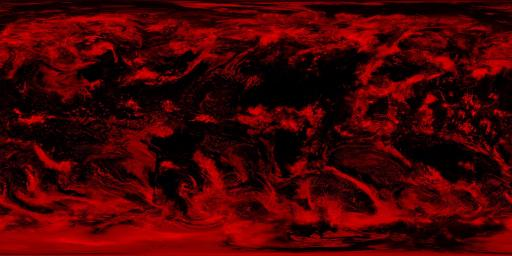
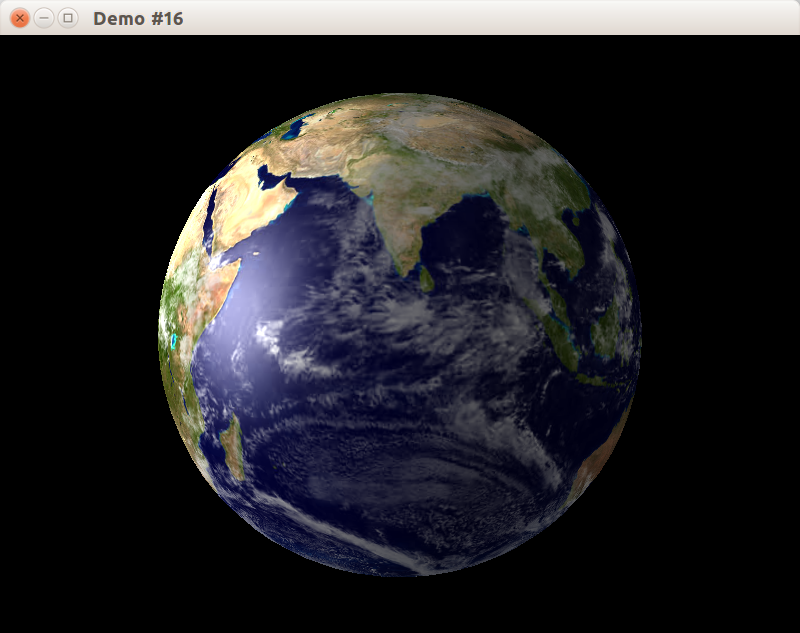
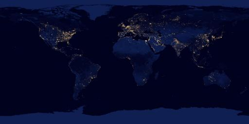
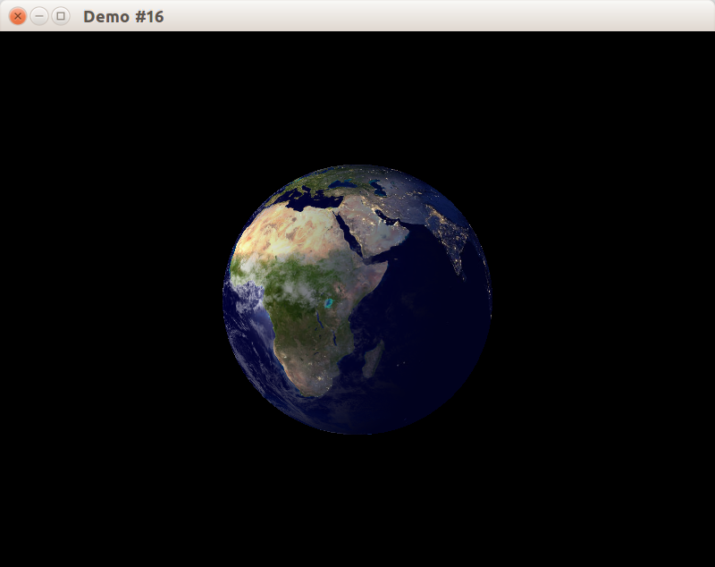

## Выборка данных из текстуры во фрагментном шейдере

Фрагментный и вершинный шейдеры могут осуществлять выборки значений из текстур. В стандарте OpenGL не зафиксировано, в каком виде должны быть реализованы текстурные модули, поэтому доступ к текстурам осуществляется при помощи специального интерфейса – дискретизатора (*англ.* sampler).

Существуют следующие типы дискретизаторов:

- sampler1D
- sampler2D
- sampler3D
- samplerCube
- sampler1DShadow
- sampler2DShadow

Чтобы в шейдерной программе использовать дискретизатор, необходимо объявить uniform- переменную одного из перечисленных выше типов. Например, объявить дискретизатор для доступа к двухмерной текстуре можно следующим образом:

```glsl
uniform sampler2D mainTexture;
```

Для чтения данных из дискретизатора используются функции texture* и shadow* (см. спецификацию языка GLSL). Например, для того, чтобы просто считать значение из двухмерной текстуры можно воспользоваться функцией

```glsl
vec4 texture2D(sampler2D sampler, vec2 coord [, float bias]);
```

Данная функция считывает значение из текстуры, связанной с 2D-дискретизатором sampler, из позиции, задаваемой 2D координатой coord. При использовании данной функции во фрагментном шейдере опциональный параметр «bias» добавляется к вычисленному уровню детализации текстуры (mip-уровню).

Рассмотрим примеры шейдеров, выполняющих наложение текстуры на примитив аналогично тому, как это делает стандартный конвейер OpenGL. Для простоты ограничимся использованием только одной текстуры, а также не будем учитывать значение матрицы, задающей преобразования текстурных координат.

## Разрабатываем каркас приложения

Для демонстрации наложения текстуры мы воспользуемся одним из предыдущих примеров, в котором на сферу накладывалась текстура Земли. Однако, ради лучшего разделения кода мы выделим класс CEarthProgramContext, который будет загружать и настраивать не только шейдерную программу для рисования Земли, но и всё данные этой программы:

### EarthProgramContext.h

```cpp
#pragma once
#include "libchapter3.h"

class CEarthProgramContext
{
public:
    CEarthProgramContext();

    void Use();

private:
    CTexture2DUniquePtr m_pEarthTexture;
    CShaderProgram m_programEarth;
};
```

### EarthProgramContext.cpp

```cpp
#include "stdafx.h"
#include "EarthProgramContext.h"

CEarthProgramContext::CEarthProgramContext()
{
    std::string path = CFilesystemUtils::GetResourceAbspath("res/img/earth_colormap.jpg");
    m_pEarthTexture = LoadTexture2D(path);

    const std::string vertShader = CFilesystemUtils::LoadFileAsString("res/copytexture.vert");
    const std::string fragShader = CFilesystemUtils::LoadFileAsString("res/copytexture.frag");
    m_programEarth.CompileShader(vertShader, ShaderType::Vertex);
    m_programEarth.CompileShader(fragShader, ShaderType::Fragment);
    m_programEarth.Link();
}

void CEarthProgramContext::Use()
{
    m_pEarthTexture->Bind();

    m_programEarth.Use();
    m_programEarth.FindUniform("colormap") = 0;
}
```

### Вращение сферы

Применение шейдерной программы и отображение сферы будет выполняться в классе CWindowClient. На сцене присутствует сфера (с белым материалом) и источник света. Для большей наглядности сфера получит вращение вокруг своей оси.

Ниже показано определение класса CWindowClient:

```cpp
#pragma once
#include "libchapter3.h"
#include "IdentitySphere.h"
#include "EarthProgramContext.h"
#include <vector>

class CWindowClient
        : public CAbstractWindowClient
{
public:
    CWindowClient(CWindow &window);

protected:
    // IWindowClient interface
    void OnUpdateWindow(float deltaSeconds) override;
    void OnKeyDown(const SDL_KeyboardEvent &) override;
    void OnKeyUp(const SDL_KeyboardEvent &) override;

private:
    void CheckOpenGLVersion();
    void UpdateRotation(float deltaSeconds);
    void SetupView(const glm::ivec2 &size);

    CIdentitySphere m_sphereObj;
    CCamera m_camera;
    CPhongModelMaterial m_sphereMat;
    CDirectedLightSource m_sunlight;
    CEarthProgramContext m_programContext;
    glm::mat4 m_earthTransform;
};
```

В реализации, помимо прочего, проверяется версия OpenGL: для работы шейдеров и поддержки нескольких текстур достаточно верси 2.0

```cpp
void CWindowClient::CheckOpenGLVersion()
{
    // Мы требуем наличия OpenGL 2.0
    // В OpenGL 2.0 шейдерные программы вошли в спецификацию API.
    // Ещё в OpenGL 1.2 мультитекстурирование также вошло в спецификацию,
    // см. http://opengl.org/registry/specs/ARB/multitexture.txt
    if (!GLEW_VERSION_2_0)
    {
        throw std::runtime_error("Sorry, but OpenGL 2.0 is not available");
    }
}
```

Полный листинг `WindowClient.cpp` представлен ниже:

```
#include "stdafx.h"
#include "WindowClient.h"

namespace
{
const float CAMERA_INITIAL_ROTATION = 0.1f;
const float CAMERA_INITIAL_DISTANCE = 3;
const int SPHERE_PRECISION = 40;

void SetupOpenGLState()
{
    // включаем механизмы трёхмерного мира.
    glEnable(GL_DEPTH_TEST);
    glEnable(GL_CULL_FACE);
    glFrontFace(GL_CCW);
    glCullFace(GL_BACK);
}

template <class T>
void DoWithTransform(const glm::mat4 &mat, T && callback)
{
    glPushMatrix();
    glMultMatrixf(glm::value_ptr(mat));
    callback();
    glPopMatrix();
}

void SetupModelViewProjection(const glm::mat4 &modelView, const glm::mat4 &projection)
{
    glLoadMatrixf(glm::value_ptr(modelView));
    glMatrixMode(GL_PROJECTION);
    glLoadMatrixf(glm::value_ptr(projection));
    glMatrixMode(GL_MODELVIEW);
}
}

CWindowClient::CWindowClient(CWindow &window)
    : CAbstractWindowClient(window)
    , m_sphereObj(SPHERE_PRECISION, SPHERE_PRECISION)
    , m_camera(CAMERA_INITIAL_ROTATION, CAMERA_INITIAL_DISTANCE)
    , m_sunlight(GL_LIGHT0)
{
    const glm::vec3 SUNLIGHT_DIRECTION = {-1.f, 0.2f, 0.7f};
    const glm::vec4 WHITE_RGBA = {1, 1, 1, 1};
    const glm::vec4 BLACK_RGBA = {0, 0, 0, 1};

    window.SetBackgroundColor(BLACK_RGBA);
    CheckOpenGLVersion();
    SetupOpenGLState();

    m_sphereMat.SetDiffuse(WHITE_RGBA);
    m_sphereMat.SetAmbient(WHITE_RGBA);
    m_sphereMat.SetSpecular(0.7f * WHITE_RGBA);
    m_sphereMat.SetShininess(30);

    m_sunlight.SetDirection(SUNLIGHT_DIRECTION);
    m_sunlight.SetDiffuse(WHITE_RGBA);
    m_sunlight.SetAmbient(0.4f * WHITE_RGBA);
    m_sunlight.SetSpecular(WHITE_RGBA);
}

void CWindowClient::OnUpdateWindow(float deltaSeconds)
{
    UpdateRotation(deltaSeconds);
    m_camera.Update(deltaSeconds);
    SetupView(GetWindow().GetWindowSize());

    m_sphereMat.Setup();
    m_sunlight.Setup();
    m_programContext.Use();

    DoWithTransform(m_earthTransform, [&] {
        m_sphereObj.Draw();
    });
}

void CWindowClient::OnKeyDown(const SDL_KeyboardEvent &event)
{
    m_camera.OnKeyDown(event);
}

void CWindowClient::OnKeyUp(const SDL_KeyboardEvent &event)
{
    m_camera.OnKeyUp(event);
}

void CWindowClient::CheckOpenGLVersion()
{
    // Мы требуем наличия OpenGL 2.0
    // В OpenGL 2.0 шейдерные программы вошли в спецификацию API.
    // Ещё в OpenGL 1.2 мультитекстурирование также вошло в спецификацию,
    // см. http://opengl.org/registry/specs/ARB/multitexture.txt
    if (!GLEW_VERSION_2_0)
    {
        throw std::runtime_error("Sorry, but OpenGL 2.0 is not available");
    }
}

void CWindowClient::UpdateRotation(float deltaSeconds)
{
    const float ROTATION_SPEED = 0.2f;
    const float deltaRotation = ROTATION_SPEED * deltaSeconds;
    m_earthTransform = glm::rotate(m_earthTransform, deltaRotation,
                                   glm::vec3(0, 1, 0));
}

void CWindowClient::SetupView(const glm::ivec2 &size)
{
    const glm::mat4 mv = m_camera.GetViewTransform();

    // Матрица перспективного преобразования вычисляется функцией
    // glm::perspective, принимающей угол обзора, соотношение ширины
    // и высоты окна, расстояния до ближней и дальней плоскостей отсечения.
    const float fieldOfView = glm::radians(70.f);
    const float aspect = float(size.x) / float(size.y);
    const float zNear = 0.01f;
    const float zFar = 100.f;
    const glm::mat4 proj = glm::perspective(fieldOfView, aspect, zNear, zFar);

    glViewport(0, 0, size.x, size.y);
    SetupModelViewProjection(mv, proj);
}
```

## Простые шейдеры, применяющие текстуры

В первом варианте шейдеров пиксели текстуры будут напрямую копироваться на поверхность, без учёта освещения и без добавления дополнительных деталей. Вершинный шейдер просто копирует значение во встроенную varying-переменную gl_TexCoord:

### Шейдер copytexture.vert
```glsl
void main()
{
    // Transform the vertex:
    // gl_Position = gl_ModelViewProjectionMatrix * gl_Vertex
    gl_Position = ftransform();
    // Copy texture coordinates from gl_MultiTexCoord0 vertex attribute
    // to gl_TexCoord[0] varying variable
    gl_TexCoord[0] = gl_MultiTexCoord0;
}
```

Фрагментный шейдер использует функцию texture2D для получения цвета фрагмента из цвета соответствующего пикселя текстуры.

### Шейдер copytexture.frag
```glsl
uniform sampler2D colormap;

void main()
{
    // Calculate fragment color by fetching the texture
    gl_FragColor = texture2D(colormap, gl_TexCoord[0].st);
}
```

В результате получаем сферу, на которой текстура наложена как простая карта цветов, без дополнительной обработки и без освещения:


Для проверки работоспособности шейдеров можно внести какое-нибудь осмысленное искажение цветов во фрагментный шейдер. Например, инвертировать каждый компонент цвета текстуры:

```glsl
uniform sampler2D mainTexture;

void main()
{
    // Calculate fragment color by fetching the texture
    gl_FragColor = vec4(1.0) - texture2D(mainTexture, gl_TexCoord[0].st);
}
```


## Выборка данных из нескольких текстур

Доработаем программу таким образом, чтобы помимо текстуры земной поверхности, на сферу были нанесены облака.

Поскольку цвет облаков, преимущественно, белый, либо серый, отводить 24-битное изображение для их хранения было бы расточительно. Поэтому на хранение информации об облачности можно отвести всего 8 бит. Как же разумно распорядиться оставшимися разрядами? Одним из возможных вариантов решения данной задачи является хранение дополнительной информации о земной поверхности. Например, о том, принадлежит ли данная точка сферы суше или воде. Используя эту информацию, фрагментный шейдер при расчете освещения мог бы использовать различные модели освещения для суши и воды.

Используемая нами дополнительная текстура Земли пока что кодирует лишь маску облаков и выглядит следующим образом (показана уменьшенная копия):



Красный канал изображения хранит инвертированную интенсивность облаков, т.е. чем ближе значение канала в данном пикселе к нулю, тем выше облачность. В соответствии с этим обновим фрагментный шейдер:

### Шейдер cloud_earth.frag

```glsl
uniform sampler2D colormap;
uniform sampler2D surfaceDataMap;

void main()
{
    // Get base color by fetching the texture
    vec4 color = texture2D(colormap, gl_TexCoord[0].st);
    // Extract surface data where each channel has own meaning
    vec4 surfaceData = texture2D(surfaceDataMap, gl_TexCoord[0].st);
    // Red channel keeps cloud luminance
    float cloudGray = surfaceData.r;
    vec4 cloudsColor = vec4(cloudGray, cloudGray, cloudGray, 0.0);
    gl_FragColor = color + cloudsColor;
}
```

Для выборки из нескольких текстур мы воспользуемся расширением GL_ARB_multitexture, которое вошло в стандарт OpenGL 1.2, но может быть недоступно на Windows без установленных драйверов (т.к. программная реализация OpenGL для Windows не развивается и обеспечивает только версию OpenGL 1.1).

Этот механизм мультитекстурирования основан на концепции "слотов" для прикрепления текстур, число которых фиксировано реализацией. Можно предполагать, что на большинстве видеокарт доступно как минимум 8 слотов текстур, и этого более чем достаточно для симуляции различных материалов.

- для включения слота используется функция-команда [glActiveTexture(GLenum slot)](https://www.opengl.org/sdk/docs/man/docbook4/xhtml/glActiveTexture.xml), после вызова которой все вызовы glBindTexture будут привязывать текстуру к слоту с указанным номером

```cpp
CEarthProgramContext::CEarthProgramContext()
{
    std::string path = CFilesystemUtils::GetResourceAbspath("res/img/earth_colormap.jpg");
    m_pEarthTexture = LoadTexture2D(path);
    path = CFilesystemUtils::GetResourceAbspath("res/img/earth_clouds.jpg");
    m_pCloudTexture = LoadTexture2D(path);

    const std::string vertShader = CFilesystemUtils::LoadFileAsString("res/copytexture.vert");
    const std::string fragShader = CFilesystemUtils::LoadFileAsString("res/cloud_earth.frag");
    m_programEarth.CompileShader(vertShader, ShaderType::Vertex);
    m_programEarth.CompileShader(fragShader, ShaderType::Fragment);
    m_programEarth.Link();
}

void CEarthProgramContext::Use()
{
    // переключаемся на текстурный слот #1
    glActiveTexture(GL_TEXTURE1);
    m_pCloudTexture->Bind();
    // переключаемся обратно на текстурный слот #0
    // перед началом рендеринга активным будет именно этот слот.
    glActiveTexture(GL_TEXTURE0);
    m_pEarthTexture->Bind();

    m_programEarth.Use();
    m_programEarth.FindUniform("colormap") = 0; // GL_TEXTURE0
    m_programEarth.FindUniform("surfaceDataMap") = 1; // GL_TEXTURE1
}
```


## Добавляем освещение по модели Фонга

В данный момент планета отображается без учёта освещения от Солнца. Теперь мы совместим показанный в одном из прошлых примеров шейдер для расчёта освещения по Фонгу с уже написанным шейдером.

В вершинном шейдере будут объявлены две varying-переменные для нормали и для направления на камеру, чтобы рассчитывать интенсивность освещения по модели Фонга попиксельно, и тем самым получать плавную освещённость без артефактов. Также происходит копирование текстурных координат.

```glsl
varying vec3 normal;
varying vec3 viewDir;

void main(void)
{
    viewDir = vec3(gl_ModelViewMatrix * gl_Vertex);
    normal = normalize(gl_NormalMatrix * gl_Normal);
    gl_Position = ftransform();
    gl_TexCoord[0] = gl_MultiTexCoord0;
}
```

Этот шейдер теперь будет использоваться вместо `copytexture.vert` в классе CEarthProgramContext:

```cpp
const std::string vertShader = CFilesystemUtils::LoadFileAsString("res/cloud_earth.vert");
const std::string fragShader = CFilesystemUtils::LoadFileAsString("res/cloud_earth.frag");
```

Мы также добавим фрагментный шейдер, в котором выполняется одновременно освещение по модели Фонга и уже рассмотренное ранее совмещение двух текстур (цветовой карты поверхности Земли и карты облаков).

В данном шейдере мы применим пользовательские структуры. В GLSL нет указателей и ссылок, но это не мешает объявить структуру как соединение нескольких полей в единую сущность, и возвращать структуру из функции. Структура понадобится нам для функции GetLight0Factors, которая рассчитывает для источника света `GL_LIGHT0` коэффициенты уменьшения diffuse и specular компонентов освещения, зависящие от углов между наблюдателем, нормалью и направлением на источник света. После занесения данных в поля структуры мы также сделаем `clamp(x, 0.0, 1.0)` для каждого поля, поскольку

- интенсивность не может быть отрицательной
- коэффициент уменьшения не может быть меньше 1, иначе он ничего не уменьшает

```glsl
struct LightFactors
{
    float diffuse;
    float specular;
};

LightFactors GetLight0Factors()
{
    vec3 viewDirection = normalize(-viewDir);
    vec3 fixedNormal = normalize(normal);
    // Fix lightDirection for both directed and undirected light sources.
    vec3 delta = gl_LightSource[0].position.w * viewDirection;
    vec3 lightDirection = normalize(gl_LightSource[0].position.xyz + delta);

    vec3 reflectDirection = normalize(-reflect(lightDirection, fixedNormal));

    LightFactors result;
    result.diffuse = max(dot(fixedNormal, lightDirection), 0.0);
    float base = max(dot(reflectDirection, viewDirection), 0.0);
    result.specular = pow(base, gl_FrontMaterial.shininess / 4.0);

    result.diffuse = clamp(result.diffuse, 0.0, 1.0);
    result.specular = clamp(result.specular, 0.0, 1.0);

    return result;
}
```

### Функция mix

При совмещении цветов облаков и поверхности земли мы применим фунцию mix.

```glsl
float mix(float x, float y, float a)
vec2 mix(vec2 x, vec2 y, vec2 a)
vec3 mix(vec3 x, vec3 y, vec3 a)
vec4 mix(vec4 x, vec4 y, vec4 a)
```

Функция mix возвращает результат линейного смешения между x и y, то есть произведение `x * (1 - a)`, сложенное с произведением `y * a`. Входные параметры могут быть скалярами или векторами с плавающей запятой. В случае использования векторов операция совершается покомпонентно.

```glsl
float mix(float x, float y, float a)
vec2 mix(vec2 x, vec2 y, float a)
vec3 mix(vec3 x, vec3 y, float a)
vec4 mix(vec4 x, vec4 y, float a)
```

Есть также перегрузка функции `mix`, в которой третий параметр всегда является скаляром с плавающей точкой.

### Шейдер cloud_earth.frag

```glsl
uniform sampler2D colormap;
uniform sampler2D surfaceDataMap;

varying vec3 normal;
varying vec3 viewDir;

struct LightFactors
{
    float diffuse;
    float specular;
};

LightFactors GetLight0Factors()
{
    vec3 viewDirection = normalize(-viewDir);
    vec3 fixedNormal = normalize(normal);
    // Fix lightDirection for both directed and undirected light sources.
    vec3 delta = gl_LightSource[0].position.w * viewDirection;
    vec3 lightDirection = normalize(gl_LightSource[0].position.xyz + delta);

    vec3 reflectDirection = normalize(-reflect(lightDirection, fixedNormal));

    LightFactors result;
    result.diffuse = max(dot(fixedNormal, lightDirection), 0.0);
    float base = max(dot(reflectDirection, viewDirection), 0.0);
    result.specular = pow(base, gl_FrontMaterial.shininess / 4.0);

    result.diffuse = clamp(result.diffuse, 0.0, 1.0);
    result.specular = clamp(result.specular, 0.0, 1.0);

    return result;
}

void main()
{
    LightFactors factors = GetLight0Factors();

    // Get base color by fetching the texture
    vec4 color = texture2D(colormap, gl_TexCoord[0].st);
    // Extract surface data where each channel has own meaning
    vec4 surfaceData = texture2D(surfaceDataMap, gl_TexCoord[0].st);
    // Red channel keeps cloud luminance
    float cloudGray = surfaceData.r;

    vec4 diffuseColor = mix(color, vec4(factors.diffuse), cloudGray);
    vec4 diffuseIntensity = diffuseColor * factors.diffuse
            * gl_FrontLightProduct[0].diffuse;

    vec4 ambientColor = mix(color, vec4(1.0), cloudGray);
    vec4 ambientIntensity = ambientColor
            * gl_FrontLightProduct[0].ambient;

    vec4 specularIntensity = factors.specular
            * gl_FrontLightProduct[0].specular;

    gl_FragColor = ambientIntensity + diffuseIntensity + specularIntensity;
}
```


## Разный расчёт освещения для суши и воды

На данном этапе материал планеты имеет компоненту освещения specular, который даёт блик как на поверхности Земли, так и на воде. Более реалистичным выглядит применение компоненты освещения specular только для водной поверхности. Чтобы это реализовать, мы добавим маску водной поверхности в зелёный канал изображения, использованного ранее для облаков (показана уменьшенная копия текстуры):


Во фрагментном шейдере будем получать интенсивность воды (т.е. 0.0 для суши и 1.0 для воды) в переменную `waterFactor`, на которую умножается величина бликовой (specular) компоненты освещения:

```glsl
void main()
{
    LightFactors factors = GetLight0Factors();

    // Get base color by fetching the texture
    vec4 color = texture2D(colormap, gl_TexCoord[0].st);
    // Extract surface data where each channel has own meaning
    vec4 surfaceData = texture2D(surfaceDataMap, gl_TexCoord[0].st);
    // Red channel keeps cloud luminance
    float cloudGray = surfaceData.r;
    // Green channel keeps 1 for water and 0 for earth.
    float waterFactor = surfaceData.g;

    vec4 diffuseColor = mix(color, vec4(factors.diffuse), cloudGray);
    vec4 diffuseIntensity = diffuseColor * factors.diffuse
            * gl_FrontLightProduct[0].diffuse;

    vec4 ambientColor = mix(color, vec4(1.0), cloudGray);
    vec4 ambientIntensity = ambientColor
            * gl_FrontLightProduct[0].ambient;

    vec4 specularIntensity = waterFactor * factors.specular
            * gl_FrontLightProduct[0].specular;

    gl_FragColor = ambientIntensity + diffuseIntensity + specularIntensity;
}
```

Таким будет результат:



## Добавляем ночную Землю

Ночью Земля светится огнями тысяч городов:



Мы доработаем шейдер, чтобы накладывать текстуру ночной Земли на ту часть планеты, которая повёрнута обратной стороной к источнику света, симулирующему Солнце.

### Добавляем текстуру ночной Земли

В класс CEarthProgramContext мы добавим новое поле `CTexture2DUniquePtr m_pNightTexture;`. Инициализировать его будем также в конструкторе:

```cpp
CEarthProgramContext::CEarthProgramContext()
{
    std::string path = CFilesystemUtils::GetResourceAbspath("res/img/earth_colormap.jpg");
    m_pEarthTexture = LoadTexture2D(path);
    path = CFilesystemUtils::GetResourceAbspath("res/img/earth_clouds.jpg");
    m_pCloudTexture = LoadTexture2D(path);
    path = CFilesystemUtils::GetResourceAbspath("res/img/earth_at_night.jpg");
    m_pNightTexture = LoadTexture2D(path);
    // ...остальной код пропущен
}
```

При применении программы к контексту OpenGL будем использовать текстурный слот с индексом 2:

```cpp

void CEarthProgramContext::Use()
{
    // переключаемся на текстурный слот #2
    glActiveTexture(GL_TEXTURE2);
    m_pNightTexture->Bind();
    // переключаемся на текстурный слот #1
    glActiveTexture(GL_TEXTURE1);
    m_pCloudTexture->Bind();
    // переключаемся обратно на текстурный слот #0
    // перед началом рендеринга активным будет именно этот слот.
    glActiveTexture(GL_TEXTURE0);
    m_pEarthTexture->Bind();

    m_programEarth.Use();
    m_programEarth.FindUniform("colormap") = 0; // GL_TEXTURE0
    m_programEarth.FindUniform("surfaceDataMap") = 1; // GL_TEXTURE1
    m_programEarth.FindUniform("nightColormap") = 2; // GL_TEXTURE2
}
```

### Изменяем фрагментный шейдер

Внутри фрагментного шейдера потребуется сделать несколько изменений:

- компоненту освещения ambient лучше убрать, т.к. теперь мы используем разные текстуры для ночной и дневной сторон Земли, а модель ambient рассчитана как унифицированное добавление к цвету, грубо компенсирующее рассеянное освещение окружающей среды
- для запроса данных текстуры заведём новую uniform-переменную:

```
// ...other uniforms...
uniform sampler2D nightColormap;

// ...varying variables, structures and functions...

void main()
{
    LightFactors factors = GetLight0Factors();

    // Get base color by fetching the texture
    vec4 color = texture2D(colormap, gl_TexCoord[0].st);
    // Get night earth color by fetching the texture
    vec4 nightColor = texture2D(nightColormap, gl_TexCoord[0].st);
    // Extract surface data where each channel has own meaning
    vec4 surfaceData = texture2D(surfaceDataMap, gl_TexCoord[0].st);
    // Red channel keeps cloud luminance
    float cloudGray = surfaceData.r;
    // Green channel keeps 1 for water and 0 for earth.
    float waterFactor = surfaceData.g;

    vec4 diffuseColor = mix(color, vec4(factors.diffuse), cloudGray);
    vec4 diffuseIntensity = mix(nightColor, diffuseColor, vec4(factors.diffuse))
            * gl_FrontLightProduct[0].diffuse;

    vec4 specularIntensity = waterFactor * factors.specular
            * gl_FrontLightProduct[0].specular;

    gl_FragColor = diffuseIntensity + specularIntensity;
}
```

## Результат

После запуска получим изображение, где дневная сторона Земли плавно переходит в ночную, на которой горит множество огней больших городов.



Полный код к данной статье вы можете найти [в каталоге примера в репозитории на github](https://github.com/PS-Group/cg_course_examples/tree/master/lesson_16).
