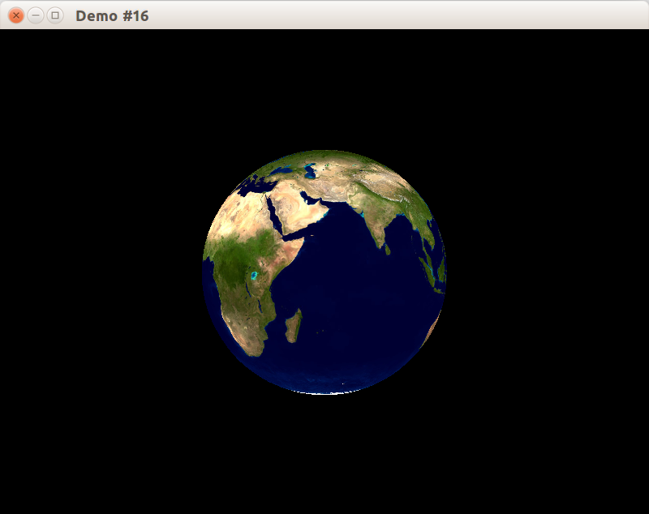
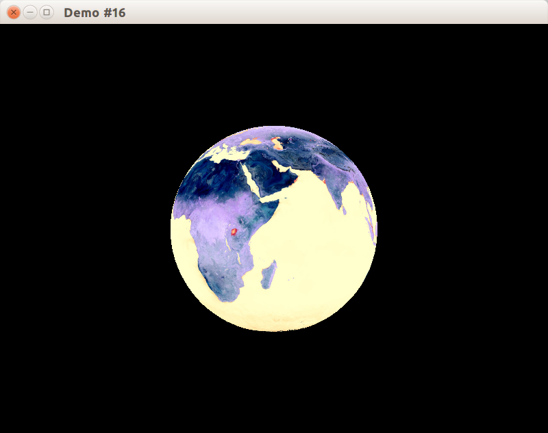

## Выборка данных из текстуры во фрагментном шейдере

Фрагментный и вершинный шейдеры могут осуществлять выборки значений из текстур. В стандарте OpenGL не зафиксировано, в каком виде должны быть реализованы текстурные модули, поэтому доступ к текстурам осуществляется при помощи специального интерфейса – дискретизатора (*англ.* sampler).

Существуют следующие типы дискретизаторов:

- sampler1D
- sampler2D
- sampler3D
- samplerCube
- sampler1DShadow
- sampler2DShadow

Чтобы в шейдерной программе использовать дискретизатор, необходимо объявить uniform- переменную одного из перечиленных выше типов. Например, объявить дискретизатор для доступа к двухмерной текстуре можно следующим образом:

```glsl
uniform sampler2D mainTexture;
```

Для чтения данных из дискретизатора используются функции texture* и shadow* (см. спецификацию языка GLSL). Например, для того, чтобы просто считать значение из двухмерной текстуры можно воспользоваться функцией

```glsl
vec4 texture2D(sampler2D sampler, vec2 coord [, float bias]);
```

Данная функция считывает значение из текстуры, связанной с 2D-дискретизатором sampler, из позиции, задаваемой 2D координатой coord. При использовании данной функции во фрагментном шейдере опциональный параметр «bias» добавляется к вычисленному уровню детализации текстуры (mip-уровню).

Рассмотрим примеры шейдеров, выполняющих наложение текстуры на примитив аналогично тому, как это делает сдандартный конвейер OpenGL. Для простоты ограничимся использованием только одной текстуры, а также не будем учитывать значение матрицы, задающей преобразования текстурных координат.

## Разрабатываем каркас приложения

Для демонстрации наложения текстуры мы воспользуемся одним из предыдущих примеров, в котором на сферу накладывалась текстура Земли. Непосредственно операции с текстурой будут выглядеть так:

```cpp
class CWindowClient : public CAbstractWindowClient
{
public:
    // ... публичный интерфейс

private:
    CTexture2DUniquePtr m_pEarthTexture;
    // ... остальные поля
};

CWindowClient::CWindowClient(CWindow &window)
{
    // ... инициализация полей класса

    std::string path = CFilesystemUtils::GetResourceAbspath("res/img/earth.bmp");
    m_pEarthTexture = LoadTexture2DFromBMP(path);
}

void CWindowClient::OnUpdateWindow(float deltaSeconds)
{
    // ... настройка камеры и освещения

    m_programQueue.front()->Use();
    m_pEarthTexture->DoWhileBinded([this]{
        m_sphereObj.Draw();
    });
}
```

Запустив программу, убедимся, что сфера действительно рисуется:


## Простые шейдеры, применяющие текстуры

В первом варианте шейдеров пиксели текстуры будут напрямую копироваться на поверхность, без учёта освещения и без добавления дополнительных деталей. Вершинный шейдер просто копирует значение во встроенную varying-переменную gl_TexCoord:

```glsl
void main()
{
    // Transform the vertex:
    // gl_Position = gl_ModelViewProjectionMatrix * gl_Vertex
    gl_Position = ftransform();
    // Copy texture coordinates from gl_MultiTexCoord0 vertex attribute
    // to gl_TexCoord[0] varying variable
    gl_TexCoord[0] = gl_MultiTexCoord0;
}
```

Фрагментный шейдер использует функцию texture2D для получения цвета фрагмента из цвета соответствующего пикселя текстуры.

```glsl
uniform sampler2D mainTexture;

void main()
{
    // Calculate fragment color by fetching the texture
    gl_FragColor = texture2D(mainTexture, gl_TexCoord[0].st);
}
```

В результате получаем сферу, на которой текстура наложена как простая карта цветов, без дополнительной обработки и без освещения:



Для проверки работоспособности шейдеров можно внести какое-нибудь осмысленное искажение цветов во фрагментный шейдер. Например, инвертировать каждый компонент цвета текстуры:

```glsl
uniform sampler2D mainTexture;

void main()
{
    // Calculate fragment color by fetching the texture
    gl_FragColor = 1.0 - texture2D(mainTexture, gl_TexCoord[0].st);
}
```



## Выборка данных из нескольких текстур

Доработаем программу таким образом, чтобы помимо текстуры земной поверхности, на сферу была нанесена текстура облаков.

Поскольку цвет облаков, преимущественно, белый, либо серый, отводить 24-битное изображение для их хранения было бы расточительно. Поэтому на хранение информации об облачности можно отвести всего 8 бит. Как же разумно распорядиться оставшимися разрядами? Одним из возможных вариантов решения данной задачи является хранение дополнительной информации о земной поверхности. Например, о том, принадлежит ли данная точка сферы суше или воде. Используя эту информацию, фрагментный шейдер при расчете освещения мог бы использовать различные модели освещения для суши и воды. 

Информацию об облачности можно закодировать в одном цветовом канале (например, в красном), а информацию о суше/воде – в зеленом. Синий и альфа каналы могли бы использоваться для хранения карты нормалей. Для хранения нормального вектора в случае положительной координаты z достаточно лишь координат x и y. Координату z можно вычислить по формуле:

z = √(1 - (x^2+y^2)

Используемая нами дополнительная текстура Земли выглядит следующим образом:


