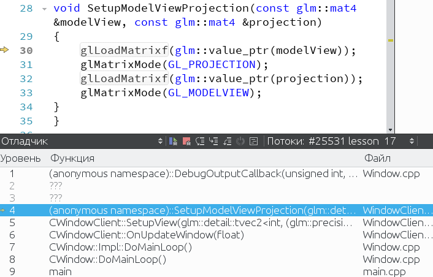
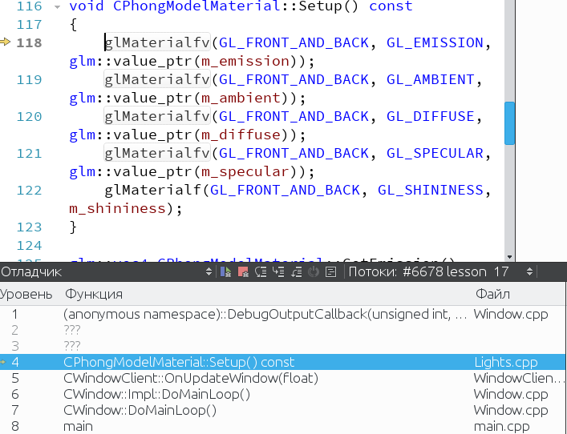
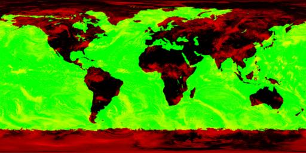

С приходом OpenGL 3.0 началась новая эпоха: старые способы рисования, предшествующие появлению шейдеров и массивов вершин, были объявлены устаревшими, и у программиста появилась возможность отказаться от устаревших функций ещё при создании контекста OpenGL.

В OpenGL для настольных компьютеров программисту достпен выбор между двумя профилям:

- Core Profile, в котором для рисования необходимо установить вершинный и фрагментный шейдер, а glBegin и glEnd недоступны
- Compatibility Profile, в котором работают все возможности как новых, так и старых версий OpenGL.

В OpenGL ES, который используется в мобильных устройствах, включая смартфоны и планшеты, доступен только режим Core Profile, а устаревшая функциональность не реализована в видеодрайвере.

В WebGL, который реализован современными браузерами, ради совместимости со смартфонами Compatibility Profile также недоступен.

## Включаем Core Profile

Наша задача на сегодня &mdash; взять предыдущий пример рендеринга планеты Земля и портировать его на Core Profile, заменив ранее использованную устаревшую функциональность на современные подходы.

Для начала дополним класс CWindow, обеспечив возможность выбора профиля OpenGL путём передачи в конструктор параметра. Чтобы запретить возможность использования устаревшей функциональности, потребуется:

- перед созданием контекста добавить к атрибуту SDL_GL_CONTEXT_FLAGS флаг SDL_GL_CONTEXT_FORWARD_COMPATIBLE_FLAG, который сообщает видеодрайверу, что приложение готово к отказу от устаревших возможностей
- установить атрибут SDL_GL_CONTEXT_PROFILE_MASK в значение SDL_GL_CONTEXT_PROFILE_CORE
- явно выбрать версию контекста OpenGL, например, 3.1 или 4.0
- запустить приложение

```cpp
// ---------  Window.h --------

enum class ContextProfile : uint8_t
{
    // Compatibility profile without exact version
    Compatibility,
    // OpenGL 3.1 with forward compatibility.
    RobustOpenGL_3_1,
    // OpenGL 3.2 with forward compatibility.
    RobustOpenGL_3_2,
    // OpenGL 4.0 with forward compatibility.
    RobustOpenGL_4_0,
};

class CWindow : private boost::noncopyable
{
public:
    CWindow(ContextProfile profile = ContextProfile::Compatibility);
    // ...
};

// --------- Window.cpp --------


CWindow::CWindow(ContextProfile profile)
    : m_pImpl(new Impl(profile))
{
}

class CWindow::Impl
{
public:
    Impl(ContextProfile profile)
        : m_profile(profile)
    {
    }

    void Show(const std::string &title, const glm::ivec2 &size)
    {
		m_size = size;

		CUtils::InitOnceSDL2();

        // Выбираем версию и параметры совместимости OpenGL.
        SetupProfileAttributes(m_profile);

        // Специальное значение SDL_WINDOWPOS_CENTERED вместо x и y заставит SDL2
        // разместить окно в центре монитора по осям x и y.
        // Для использования OpenGL вы ДОЛЖНЫ указать флаг SDL_WINDOW_OPENGL.
        m_pWindow.reset(SDL_CreateWindow(title.c_str(), SDL_WINDOWPOS_CENTERED, SDL_WINDOWPOS_CENTERED,
                                         size.x, size.y, SDL_WINDOW_OPENGL | SDL_WINDOW_RESIZABLE));
        if (!m_pWindow)
        {
            const std::string reason = SDL_GetError();
            throw std::runtime_error("Cannot create window: " + reason);
        }

        // Создаём контекст OpenGL, связанный с окном.
		m_pGLContext.reset(SDL_GL_CreateContext(m_pWindow.get()));
		if (!m_pGLContext)
		{
			CUtils::ValidateSDL2Errors();
		}
		CUtils::InitOnceGLEW();
    }

    // ...
};

void SetupProfileAttributes(ContextProfile profile)
{
    // Включаем режим сглаживания с помощью субпиксельного рендеринга.
    SDL_GL_SetAttribute(SDL_GL_MULTISAMPLEBUFFERS, 1);
    SDL_GL_SetAttribute(SDL_GL_MULTISAMPLESAMPLES, 4);

    // Выбираем версию и параметры совместимости контекста
    bool makeRobust = true;
    switch (profile)
    {
    case ContextProfile::Compatibility:
        makeRobust = false;
        break;
    case ContextProfile::RobustOpenGL_3_1:
        SDL_GL_SetAttribute(SDL_GL_CONTEXT_MAJOR_VERSION, 3);
        SDL_GL_SetAttribute(SDL_GL_CONTEXT_MINOR_VERSION, 1);
        break;
    case ContextProfile::RobustOpenGL_3_2:
        SDL_GL_SetAttribute(SDL_GL_CONTEXT_MAJOR_VERSION, 3);
        SDL_GL_SetAttribute(SDL_GL_CONTEXT_MINOR_VERSION, 2);
        break;
    case ContextProfile::RobustOpenGL_4_0:
        SDL_GL_SetAttribute(SDL_GL_CONTEXT_MAJOR_VERSION, 4);
        SDL_GL_SetAttribute(SDL_GL_CONTEXT_MINOR_VERSION, 0);
        break;
    }

    if (makeRobust)
    {
        // Отключаем поддержку старых средств из старых версий OpenGL
        SDL_GL_SetAttribute(SDL_GL_CONTEXT_PROFILE_MASK, SDL_GL_CONTEXT_PROFILE_CORE);
        SDL_GL_SetAttribute(SDL_GL_CONTEXT_FLAGS, SDL_GL_CONTEXT_FORWARD_COMPATIBLE_FLAG);
    }
    else
    {
        // Включаем поддержку расширений для обратной совместимости
        // со старыми версиями OpenGL.
        SDL_GL_SetAttribute(SDL_GL_CONTEXT_PROFILE_MASK, SDL_GL_CONTEXT_PROFILE_COMPATIBILITY);
    }
}
```

Теперь изменим функцию main, чтобы использовать Core Profile:

```cpp
#include "stdafx.h"
#include "WindowClient.h"
#include <SDL2/SDL.h>

int main(int, char *[])
{
    try
    {
        CWindow window(ContextProfile::RobustOpenGL_3_2);
        window.Show("Demo #17", {800, 600});
        CWindowClient client(window);
        window.DoMainLoop();
    }
    catch (const std::exception &ex)
    {
        const char *title = "Fatal Error";
        const char *message = ex.what();
        SDL_ShowSimpleMessageBox(SDL_MESSAGEBOX_ERROR, title, message, nullptr);
    }

    return 0;
}
```

После запуска после проверки кода возврата `glGetError()` будет выброшено исключение. Оно будет поймано в main, и мы получим сообщение, которое указывает, что программа применила недопустимую операцию (вызвала функцию, убранную из выбранной версии OpenGL), или передала неверный параметр:


## Начинаем отладку

Чтобы не гадать и не искать в документации OpenGL все возможные ошибки, мы воспользуемся возможностью отладки OpenGL с помощью расширения [GL_ARB_debug_output](https://www.opengl.org/registry/specs/ARB/debug_output.txt).

Чтобы включить этот режим, мы должны явно указать при создании контекста необходимость его отладки. Для этого добавим ещё один параметр в конструктор CWindow:

```cpp
enum class ContextMode : uint8_t
{
    // No special context settings.
    Normal,
    // Use debug context.
    Debug,
};


class CWindow : private boost::noncopyable
{
public:
    CWindow(ContextProfile profile = ContextProfile::Compatibility,
            ContextMode mode = ContextMode::Normal);
    // ...
};

// ... передаём ContextMode в Impl и сохраняем в поле ...
// ... также изменим функцию SetupProfileAttributes ...

void SetupProfileAttributes(ContextProfile profile, ContextMode mode)
{
    // Включаем режим сглаживания с помощью субпиксельного рендеринга.
    SDL_GL_SetAttribute(SDL_GL_MULTISAMPLEBUFFERS, 1);
    SDL_GL_SetAttribute(SDL_GL_MULTISAMPLESAMPLES, 4);

    // Выбираем версию и параметры совместимости контекста
    bool makeRobust = true;
    switch (profile)
    {
    case ContextProfile::Compatibility:
        makeRobust = false;
        break;
    case ContextProfile::RobustOpenGL_3_1:
        SDL_GL_SetAttribute(SDL_GL_CONTEXT_MAJOR_VERSION, 3);
        SDL_GL_SetAttribute(SDL_GL_CONTEXT_MINOR_VERSION, 1);
        break;
    case ContextProfile::RobustOpenGL_3_2:
        SDL_GL_SetAttribute(SDL_GL_CONTEXT_MAJOR_VERSION, 3);
        SDL_GL_SetAttribute(SDL_GL_CONTEXT_MINOR_VERSION, 2);
        break;
    case ContextProfile::RobustOpenGL_4_0:
        SDL_GL_SetAttribute(SDL_GL_CONTEXT_MAJOR_VERSION, 4);
        SDL_GL_SetAttribute(SDL_GL_CONTEXT_MINOR_VERSION, 0);
        break;
    }

    unsigned flags = 0;
    if (mode == ContextMode::Debug)
    {
        // Включаем поддержку отладочных средств
        //  в создаваемом контексте OpenGL.
        flags |= SDL_GL_CONTEXT_DEBUG_FLAG;
    }
    if (makeRobust)
    {
        // Отключаем поддержку старых средств из старых версий OpenGL
        SDL_GL_SetAttribute(SDL_GL_CONTEXT_PROFILE_MASK, SDL_GL_CONTEXT_PROFILE_CORE);
        flags |= SDL_GL_CONTEXT_FORWARD_COMPATIBLE_FLAG;
    }
    else
    {
        // Включаем поддержку расширений для обратной совместимости
        // со старыми версиями OpenGL.
        SDL_GL_SetAttribute(SDL_GL_CONTEXT_PROFILE_MASK, SDL_GL_CONTEXT_PROFILE_COMPATIBILITY);
    }
}
```

Теперь в конце метода Show мы можем добавить вызов вспомогательной функции, которая с помощью функций [glDebugMessageCallback](https://www.opengl.org/sdk/docs/man/html/glDebugMessageCallback.xhtml) и [glDebugMessageControl](https://www.opengl.org/sdk/docs/man/html/glDebugMessageControl.xhtml) настроит обработку сообщений об ошибке, созданных видеодрайвером.

```

void CWindow::Impl::Show(const std::string &title, const glm::ivec2 &size)
{
    // ...

    // Устанавливаем функцию обработки отладочных сообщений.
    if (m_contextMode == ContextMode::Debug)
    {
        SetupDebugOutputCallback();
    }
}

void DebugOutputCallback(GLenum /*source*/,
                         GLenum type,
                         GLuint id,
                         GLenum /*severity*/,
                         GLsizei /*length*/,
                         const GLchar* message,
                         const void* /*userParam*/)
{
    // Отсекаем все сообщения, кроме ошибок
    if (type != GL_DEBUG_TYPE_ERROR)
    {
        return;
    }
    std::string formatted = "OpenGL error #" + std::to_string(id) + ": " + message;
    std::cerr << formatted << std::endl;
}

void SetupDebugOutputCallback()
{
    if (!GLEW_ARB_debug_output)
    {
        throw std::runtime_error("Cannot use debug output:"
                                 " it isn't supported by videodriver");
    }

    glEnable(GL_DEBUG_OUTPUT);

    // Синхронный режим позволяет узнать в отладчике контекст,
    //  в котором произошла ошибка.
    // Режим может понизить производительность, но на фоне
    //  других потерь Debug-сборки это несущественно.
    glEnable(GL_DEBUG_OUTPUT_SYNCHRONOUS);

    glDebugMessageCallback(DebugOutputCallback, nullptr);
    // Указываем видеодрайверу выдать только один тип сообщений,
    //  GL_DEBUG_TYPE_ERROR.
    glDebugMessageControl(GL_DONT_CARE, GL_DEBUG_TYPE_ERROR, GL_DONT_CARE, 0, nullptr, GL_TRUE);
}
```

И теперь, после установки точки останова (*англ.* breakpoint) внутри DebugOutputCallback мы после запуска на отладку получим отличный стек вызовов (*англ.* stacktrace) непосредственно в момент ошибки!



## Избавляемся от матриц GL_MODELVIEW и GL_PROJECT

Из скриншота выше и документации OpenGL несложно сделать вывод, что функции `glLoadMatrix*`, `glMatrixMode` и другие недоступны в современном OpenGL в режиме Core Profile.

Теперь программист обязан самостоятельно передавать эти матрицы через uniform-переменные, или же не передавать, если они ему не нужны в условиях решаемой задачи. Что касается производителей видеокарт, то для них отказ от матриц в глобальном состоянии OpenGL позволяет улучшить параллелизм графического конвейера.

Однако, помимо превращения в матриц в uniform-переменные мы должны также решить, как вычислять матрицу для трансформации нормали, которую раньше видеодрайвер услужливо заносил в переменую `gl_NormalMatrix`.

Если же задаться вопросом, зачем вообще для нормалей нужна отдельная матрица трансформации, то ответ следующий: поскольку нормаль является вектором единичной длины, то трансформации scale и translate для неё бесполезны; кроме того, неоднородное масштабирование может нарушить главное свойство нормали &mdash перпендикулярность к плоскости, касающейся поверхности в вершине:


Корректную матрицу трансформации нормалей можно получить способом, обозначенным в [ответе на вопрос "What is the gl_NormalMatrix and gl_ModelViewMatrix in shaders?" на stackoverflow](http://stackoverflow.com/questions/23210843/what-is-the-gl-normalmatrix-and-gl-modelviewmatrix-in-shaders):

```glsl
transpose(inverse(gl_ModelViewMatrix))
```

К счастью, в GLSL нет дорогостоящего обращения матрицы. Вычислять обратную матрицу для каждой вершины и каждого фрагмента снова нерационально, и мы будем передавать матрицу нормалей через uniform-переменную, вычисляя её силами центрального процессора с помощью GLM:

```cpp
glm::mat4 GetNormalMatrix(const glm::mat4 &modelView)
{
    return glm::transpose(glm::inverse(modelView));
}
```

После отказа от матриц шейдеры будут переписаны способом, показанным ниже.

- переменные из вершинного во фрагментный шейдер передаются явно через varying-переменные, единственное исключение &mdash; `gl_Position`
- стандартные атрибуты вершины (позиция, нормаль, текстурные координаты) отсутствуют, и все атрибуты передаются через универсальные переменные-атрибуты со спецификатором `attribute`; значение этой переменной задаётся для каждой вершины путём передачи массивов вершинных данных
- матрицы передаются через `uniform`-переменные

Кроме того, мы заменим ключевые слова `attribute` и `varying` на `in` и `out` соответственно. Такая замена ключевых слов произошла в GLSL версии 1.30, который соответствует OpenGL Core Profile 3.0. Чтобы отметить совместимость с GLSL 1.30 непосредственно в исходном коде шейдера, используется директива `#version 130`.

Новый вершинный шейдер (фрагментный шейдер рассмотрим ниже):

```glsl
#version 130
// GLSL version 130 enabled with OpenGL Core Profile 3.0.
//  - `attribute` renamed to `in` for vertex shader
//  - `varying` renamed to `out` for vertex shader

in vec3 vertex;
in vec3 normal;
in vec2 textureUV;

out vec2 fragTextureUV;
out vec3 fragNormal;
out vec3 fragPosInViewSpace;

uniform mat4 modelView;
uniform mat4 normalModelView;
uniform mat4 projection;

void main(void)
{
    vec4 posInViewSpace = modelView * vec4(vertex, 1.0);

    fragPosInViewSpace = vec3(posInViewSpace);
    fragNormal = normalize(vec3(normalModelView * vec4(normal, 1.0)));
    fragTextureUV = textureUV;
    gl_Position = projection * posInViewSpace;
}
```

## Адаптируем C++ к новым механизмам работы с матрицами

Мы уберём отдельную матрицу `CWindowClient::m_earthTransform`, и добавим три матрицы model, view и projection в `CEarthProgramContext`:

```cpp
class CEarthProgramContext
{
public:
    // ...

    const glm::mat4 &GetModel()const;
    const glm::mat4 &GetView()const;
    const glm::mat4 &GetProjection()const;
    void SetModel(const glm::mat4 &value);
    void SetView(const glm::mat4 &value);
    void SetProjection(const glm::mat4 &value);

private:
    // ...

    glm::mat4 m_model;
    glm::mat4 m_view;
    glm::mat4 m_projection;
}

void CEarthProgramContext::Use()
{
    // ...

    m_programEarth.FindUniform("modelView") = m_view * m_model;
    m_programEarth.FindUniform("projection") = m_projection;
}
```

После изменений следующая ошибка будет сообщена в функции применения материалов. Значит, замена матриц на uniform-переменные прошла успешно.



## Заменяем свет и материалы

Проанализируем, как мы использовали информацию об источнике света и о материалах в шейдерах

- в вершинном шейдере эта информация вообще не используется
- во фрагментном шейдере мы используем `gl_LightSource[0].position` &mdash; четырёхкомпонентный вектор, хранящий точку (позицию точечного/прожекторного источника света) или вектор (в случае направленного источника света)
- мы используем `gl_FrontMaterial.shininess` для возведения в степень угла между направлением идеально отражённого луча и направлением на источник света (согласно модели освещения Фонга)
- также используется `gl_FrontLightProduct` для получения уже готового результата покомпонентного перемножения цвета материала и цвета источника света, как для `diffuse`, так и для `specular` компонент

Поскольку цвета материала и источника света в любом случае будут покомпонентно перемножены, нет смысла изначально их разделять. То есть мы можем считать собственный цвет материала всегда белым, и задавать цвет источника света; если цвет должен отличаться от белого, его можно задать добавлением текстуры или атрибута цвета для каждой вершины.

Компоненту `shininess` материала можно сделать константой, потому что для блестящих материалов эта компонента обычно одинакова. Если материал не блестит, это можно решить с помощью текстуры, задающей значение specular-компоненты материала для разных участков поверхности; подобная текстура уже была использована ранее под видом карты водной поверхности:



Таким образом, равномерно распределённые по поверхности параметры материала полностью исчезают. Задавать параметры источника света в GLSL будем следующим образом:

```glsl
struct LightSource
{
    // (x, y, z, 1) means positioned light.
    // (x, y, z, 0) means directed light.
    vec4 position;
    vec4 diffuse;
    vec4 specular;
};

uniform LightSource light0;
```

Чтобы иметь возможность получить четырёхкомпонентный вектор position, добавим в интерфейс ILightSource новый метод. Реализацию этого метода для направленного и точечного источников составить нетрудно, и мы оставим её вне статьи.

```cpp
class ILightSource
{
public:
    virtual glm::vec4 GetUniformPosition() const = 0;
}
```

Позиция источника света нуждается в преобразовании в координаты камеры. Чтобы выполнить преобразование, фрагментный шейдер будет использовать uniform-переменную, хранящую матрицу трансформации вида, для преобразования направления на источник света:

```glsl
// Fix lightDirection for both directed and undirected light sources.
vec3 delta = light0.position.w * viewDirection;
vec4 lightPosInViewSpace = view * light0.position;
vec3 lightDirection = normalize(lightPosInViewSpace.xyz + delta);
```

Наконец, мы заменим ключевое слово `varying` на `in`. Заметим, что ключевое слово `varying` ранее использовалось для одних и тех же переменных в вершинном и фрагментном шейдере, поскольку выходные переменные вершинного шейдера являются входными для фрагментного. После замены `varying` на `in` и `out` язык стал выразительнее: теперь ясно, что именно соединяет два типа шейдеров.

После модификации фрагментный шейдер будет выглядеть следующим образом:

```glsl
#version 130
// GLSL version 130 enabled with OpenGL Core Profile 3.0.
//  - `varying` renamed to `in` for fragment shader

struct LightSource
{
    // (x, y, z, 1) means positioned light.
    // (x, y, z, 0) means directed light.
    vec4 position;
    vec4 diffuse;
    vec4 specular;
};

struct LightFactors
{
    float diffuse;
    float specular;
};

const float SHININESS = 10.0;

uniform LightSource light0;
uniform sampler2D colormap;
uniform sampler2D surfaceDataMap;
uniform sampler2D nightColormap;
uniform mat4 view;

in vec2 fragTextureUV;
in vec3 fragNormal;
in vec3 fragViewDirection;

LightFactors GetLight0Factors()
{
    vec3 viewDirection = normalize(-fragViewDirection);
    vec3 fixedNormal = normalize(fragNormal);
    // Fix lightDirection for both directed and undirected light sources.
    vec3 delta = light0.position.w * viewDirection;
    vec4 lightPosInViewSpace = view * light0.position;
    vec3 lightDirection = normalize(lightPosInViewSpace.xyz + delta);

    vec3 reflectDirection = normalize(-reflect(lightDirection, fixedNormal));

    LightFactors result;
    result.diffuse = max(dot(fixedNormal, lightDirection), 0.0);
    float base = max(dot(reflectDirection, viewDirection), 0.0);
    result.specular = pow(base, SHININESS);

    result.diffuse = clamp(result.diffuse, 0.0, 1.0);
    result.specular = clamp(result.specular, 0.0, 1.0);

    return result;
}

void main()
{
    LightFactors factors = GetLight0Factors();

    // Get base color by fetching the texture
    vec4 color = texture2D(colormap, fragTextureUV.st);
    // Get night earth color by fetching the texture
    vec4 nightColor = texture2D(nightColormap, fragTextureUV.st);
    // Extract surface data where each channel has own meaning
    vec4 surfaceData = texture2D(surfaceDataMap, fragTextureUV.st);
    // Red channel keeps cloud luminance
    float cloudGray = surfaceData.r;
    // Green channel keeps 1 for water and 0 for earth.
    float waterFactor = surfaceData.g;

    vec4 diffuseColor = mix(color, vec4(factors.diffuse), cloudGray);
    vec4 diffuseIntensity = mix(nightColor, diffuseColor,vec4(factors.diffuse))
            * light0.diffuse;

    vec4 specularIntensity = waterFactor * factors.specular
            * light0.specular;

    gl_FragColor = diffuseIntensity + specularIntensity;
}
```

## Хранение массивов вершин на стороне сервера

Переход на Core Profile сулит ещё ряд изменений, связанных со способом передачи вершин. Чтобы здраво оценить эти изменения, перечислим способы передачи вершинных данных, появивлявшиеся в версиях OpenGL 1.0-1.5.

- Immediate Mode, то есть установка параметров и добавление вершин между glBegin и glEnd; недостатком такого метода является огромное число вызовов API видеодрайвера, пропорциональное числу вершин и частоте вывода кадров
- Display List, то есть сохранение группы команд OpenGL в единый объект-команду, который затем можно выполнять множество раз; недостатком такого метода является существенное усложнение модели работы видеодрайвера; кроме того, число вызовов API по-прежнему пропорционально числу вершин
- Vertex Arrays Binding, то есть привязка массивов вершинных данных; недостатком такого метода является копирование массивов данных из оперативной памяти в видеопамять на каждом кадре
- Ещё одно решение было предоставлено в виде расширения [GL_ARB_vertex_buffer_object](https://www.opengl.org/registry/specs/ARB/vertex_buffer_object.txt), которое стало частью спецификации OpenGL в версии 1.5.

Четвёртый способ является модификацией третьего, позволяющей избежать постоянного копирования данных. Оба метода работают с массивами данных, заранее сформированных приложением:


В OpenGL 3.0 было решено убрать из спецификации OpenGL первые три способа, так как они приводят к появлению ненужных накладных расходов и излишнего копирования данных.

При использовании четвёртого способа используются те же вызовы API, что и для Vertex Arrays Binding, но теперь блоки данных не копируются, а сохраняются внутри буферных объектов (buffer objects), представляющих из себя просто массивы байт в видеопамяти. Приложению предоставляется API, при помощи которого можно записывать и считывать данные из буферов, как при помощи специальных команд OpenGL ([glBufferData](https://www.opengl.org/sdk/docs/man2/xhtml/glBufferData.xml), [glBufferSubData](https://www.opengl.org/sdk/docs/man2/xhtml/glBufferSubData.xml), [glGetBufferSubData](https://www.opengl.org/sdk/docs/man2/xhtml/glGetBufferSubData.xml)), так и путем получения указателя на местоположение буфера в ОЗУ.

Последний подход называется «отображением» буфера (mapping a buffer). Когда приложение выполняет отображение буфера, оно получает указатель на блок памяти, в который отображены данные буфера. Когда приложение завершит операции чтение или запись в этот блок памяти, оно должно отключить отображение буфера (unmap the buffer), прежде чем получит возможность использовать этот буфер в качестве источника данных. Отображение буфера часто позволяет приложениям избавиться от излишнего копирования данных, которое бы понадобилось при ином способе доступа к буферу, тем самым повысив производительность.

## Разрабатываем класс для работы с буфером в видеопамяти

Для облегчения работы с буферными объектами разработаем несколько классов, управляющих временем жизни буферных объектов, а также предоставляющих различные операции над ними.

## Интерфейс IRenderer

Интерфейс IRenderer3D будет связывать между собой классы для вывода вершин и программу на GLSL, использующую атрибуты вершин. Мы можем реализовать этот интерфейс для другого шейдера, в котором компоненты называются иначе или даже отсутствуют, и програма продолжит работать без изменения исходных массивов вершинных данных.

```cpp
#pragma once
#include <glm/fwd.hpp>
#include <cstdlib>

class IRenderer3D
{
public:
    virtual ~IRenderer3D() = default;

    virtual void SetTexCoord2DOffset(size_t offset, size_t stride) = 0;
    virtual void SetPosition3DOffset(size_t offset, size_t stride) = 0;
    virtual void SetNormalOffset(size_t offset, size_t stride) = 0;
};
```

## Реализация IRenderer &mdash; класс CEarthRenderer3D

## Разрабатываем класс CMeshP3NT2

Для получения смещения от начала структуры данных до нужного поля существует стандартный макрос [offsetof](http://www.cplusplus.com/reference/cstddef/offsetof/).

## Исправляем инициализацию GLEW

После всех предыдущих исправлений на некоторых платформах можно всё ещё наблюдать появление `GL_INVALID_ENUM`. Если использовать дихотомию по исходному коду, можно обнаружить, что ошибка возникает непосредственно после вызова `void CUtils::InitOnceGLEW()`. Причина данной ошибки объясняется в [вопросе "OpenGL: glGetError() returns invalid enum after call to glewInit()" на stackoverflow](http://stackoverflow.com/questions/10857335/). Для исправления мы можем просто сбросить флаг ошибки контекста OpenGL:

```cpp
void CUtils::InitOnceGLEW()
{
	static bool didInit = false;
	if (!didInit)
	{
		glewExperimental = GL_TRUE;
		GLenum status = glewInit();
		if (status != GLEW_OK)
		{
            const std::string errorStr = reinterpret_cast<const char *>(glewGetErrorString(status));
            throw std::runtime_error("GLEW initialization failed: "
                                     + errorStr);
		}

        // GLEW при инициализации использует вызов glGetString,
        //   недопустимый для Core Profile.
        // Вызываем glGetError(), чтобы очистить буфер ошибки OpenGL.
        //   http://stackoverflow.com/questions/10857335/
        glGetError();
	}
}
```

## Результат

После запуска получим изображение, где дневная сторона Земли плавно переходит в ночную, на которой горит множество огней больших городов.


Полный код к данной статье вы можете найти [в каталоге примера в репозитории на github](https://github.com/PS-Group/cg_course_examples/tree/master/lesson_17).

## Ссылки

- [Статья о привязке обобщённых атрибутов вершин к буферам в видеопамяти (vbomesh.blogspot.ru)](http://vbomesh.blogspot.ru/2013/01/vbo.html)
- [Вопрос "glVertexAttribPointer raising GL_INVALID_OPERATION" (stackoverflow.com)](http://stackoverflow.com/questions/13403807/)
