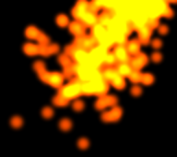

В данном примере мы реализуем один из ключевых способ создания спецэффектов &mdash; симуляцию трёхмерной системы частиц-спрайтов.


## Генератор частиц

Наш генератор частиц будет построен на основе [генератора 2D-частиц из 1-й главы](/opengl/lesson_5.md). Мы используем тот же самый способ генерации частиц &mdash; средства из заголовочного файла [random](http://en.cppreference.com/w/cpp/numeric/random).

Некоторые случайные значения будут заданы нормальным распределением:


Чтобы ограничить диапазон значений нормального распределения, мы воспользуемся классом CClampedNormalDistribution, также рассмотренным ранее. Определение класса подробно прокоментировано:

```cpp
// Класс источника частиц, создающего частицы,
//  вылетающие из заданного в заданном направлении.
// Случайным вариациям поддаются:
//  - дистанция от источника частиц, на которой появляется частица
//  - отклонение направления частицы от направления источника
//  - скорость частицы
//  - время жизни частицы
//  - интервал между генерацией двух частиц
class CParticleEmitter
{
public:
    CParticleEmitter();

    // @param dt - разница во времени с предыдущим вызовом Advance.
    void Advance(float dt);
    bool IsEmitReady()const;
    CParticle Emit();

    // Задаёт центр источника частиц.
    void SetPosition(const glm::vec3 &value);

    // Задаёт разброс расстояния от места появления частицы до центра источника.
    void SetDistanceRange(float minValue, float maxValue);

    // Задаёт направление вылета частиц.
    void SetDirection(const glm::vec3 &value);

    // Задаёт максимальный угол отклонения направления частицы
    //  от основного направления вылета частиц.
    void SetMaxDeviationAngle(float value);

    // Задаёт разброс времени жизни частиц.
    void SetLifetimeRange(float minValue, float maxValue);

    // Задаёт разброс времени между вылетом двух частиц.
    void SetEmitIntervalRange(float minValue, float maxValue);

    // Задаёт разброс скорости частицы.
    void SetSpeedRange(float minValue, float maxValue);

private:
    using linear_random_float = std::uniform_real_distribution<float>;
    using normal_random_float = CClampedNormalDistribution;

    glm::vec3 MakeRandomDirection();

    float m_elapsedSeconds = 0;
    float m_nextEmitTime = 0;
    glm::vec3 m_position;
    glm::vec3 m_direction = glm::vec3(0, 1, 0);
    linear_random_float m_distanceRange;
    linear_random_float m_deviationAngleRange;
    normal_random_float m_lifetimeRange;
    normal_random_float m_emitIntervalRange;
    normal_random_float m_speedRange;
    std::mt19937 m_random;
};
```

Реализации конструктора, метода-команды Advance и метода-запроса IsEmitReady не отличаются от аналогичного генератора из 1-й главы:

```cpp
CParticleEmitter::CParticleEmitter()
{
    std::random_device rd;
    m_random.seed(rd());
}

void CParticleEmitter::Advance(float dt)
{
    m_elapsedSeconds += dt;
}

bool CParticleEmitter::IsEmitReady() const
{
    return m_elapsedSeconds > m_nextEmitTime;
}
```

Однако, генерация частицы теперь устроена иным образом:

```cpp
CParticle CParticleEmitter::Emit()
{
    // Увеличиваем время следующего вылета частицы.
    m_nextEmitTime += m_emitIntervalRange(m_random);

    const vec3 direction = MakeRandomDirection();
    const vec3 position = m_position + direction * m_distanceRange(m_random);
    const vec3 velocity = direction * m_speedRange(m_random);
    const float lifetime = m_lifetimeRange(m_random);

    return CParticle(position, velocity, lifetime);
}

glm::vec3 CParticleEmitter::MakeRandomDirection()
{
    vec3 dir = m_direction;

    // Данный вектор будет ортогонален вектору dir, что несложно проверить,
    //  вычислив векторное произведение dir и normal.
    vec3 normal = glm::normalize(vec3(dir.y + dir.z, -dir.x, -dir.x));

    // Поворачиваем normal на произвольный угол (в диапазоне -M_PI..M_PI)
    //  вокруг вектора dir, чтобы получить случайную ось вращения.
    linear_random_float distribution(float(-M_PI), float(M_PI));
    normal = glm::rotate(normal, distribution(m_random), dir);

    // Поворачиваем dir вокруг повёрнутого normal (по-прежнему ортогонального)
    //  на случайный угол, ограниченный максимальным углом отклонения.
    const float deviationAngle = m_deviationAngleRange(m_random);
    dir = glm::rotate(dir, deviationAngle, normal);

    return dir;
}
```

## Вид отдельной частицы

Выпускаемые генератором частицы теперь будут устроены проще, потому что нам потребуется рисовать большое (свыше 1000) число частиц. Частица будет хранить лишь основные характеристики:

```cpp
class CParticle
{
public:
    CParticle(const glm::vec3 &position,
              const glm::vec3 &velocity,
              float lifetime)
        : m_position(position)
        , m_velocity(velocity)
        , m_lifetime(lifetime)
    {
    }

    void Advance(float deltaSeconds, const glm::vec3 &acceleration)
    {
        m_lifetime -= deltaSeconds;
        m_velocity += acceleration * deltaSeconds;
        m_position += m_velocity * deltaSeconds;
    }

    glm::vec3 GetPosition()const
    {
        return m_position;
    }

    bool IsAlive()const
    {
        return (m_lifetime > std::numeric_limits<float>::epsilon());
    }

private:
    glm::vec3 m_position;
    glm::vec3 m_velocity;
    float m_lifetime = 0;
};
```

Визуально частица будет представлять из себя *спрайт*, то есть прямоугольник с натянутой на него текстурой. Текстура не должна быть большой &mdash; 16x16 или 32x32 будет вполне достаточно. Ниже показан пример одной из текстур в четырёхкратном увеличении:


Текстура обладает альфа-каналом, то есть полупрозрачна. При выводе в режиме смешивания с формулой смешивания `particleAlpha * particleColor + destColor` цвета частиц складываются, что приводит к визуальному сложению интенсивности свечения этих частиц:



Включить такой режим вывода можно двумя командами (метод работает как в Core Profile, так и в старых версиях OpenGL):

```cpp
glEnable(GL_BLEND);
glBlendFunc(GL_SRC_ALPHA, GL_ONE);
```

## Расширение EXT_draw_instanced

## Ссылки

- [Реализация пояса астероидов с помощью Instanced Drawing (learnopengl.com)](http://learnopengl.com/#!Advanced-OpenGL/Instancing)
- [Использование BillBoard для реализации индикатора здоровья юнита (opengl-tutorial.org)](http://www.opengl-tutorial.org/intermediate-tutorials/billboards-particles/billboards/)
- [Рендеринг травы с помощью инстансинга трёх пересекающихся спрайтов (steps3d.narod.ru)](http://steps3d.narod.ru/tutorials/grass-tutorial.html)