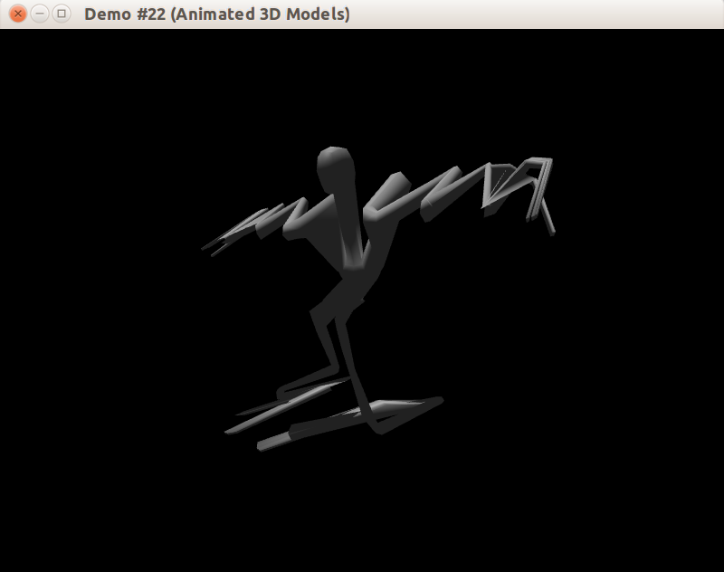

## Что к чему

Далее статье будут использованы краткие фразы, за которыми скрыто следующее:

- *матрица кости* (bone matrix) &mdash; финальная матрица преобразования координат вершин для покрытия костей вершинами сетки, которая загружается на вершинный шейдер
- *матрица смещения* (offset matrix) &mdash; матрица перехода из системы координат треугольной сетки в систему координат кости, также известна как обратная матрица позы привязки
- *матрица узла* (node matrix) &mdash; матрица перехода из системы координат узла графа сцены к его родительскому узлу
- *поза привязки* (bind position или rest position) &mdash; положение костей модели без применения каких-либо анимаций

Слова "кость" ("bone") и "сустав" ("joint") означают различные вещи в анатомии, но в рамках компьютерной графики обычно означают одно и то же и могут использоваться вперемешку.

## Кости и узлы графа сцены

В Assimp (да и во многих форматах 3D-моделей) сцена представлена иерархическим деревом узлов, в котором есть корневой узел и множество зависимых от него. Сами по себе узлы сцены не обязательно имеют визуальное представление, но они хранят данные о трансформациях и иерархии, важные для визуализации других сущностей сцены, таких как сетки треугольников, камеры, источники света.

## Применение анимации

Как и в обработке видео, в скелетной анимации данные распределены по кадрам. Хранить данные о 24 или 60 кадрах в секунду было бы достаточно дорого, и хранятся данные лишь о ключевых кадрах. В промежуточные моменты времени игровой движок должен совершить интерполяцию данных кадра. Данные ключевого кадра для скелетной анимации содержат информацию о транформациях на данном кадре для каждой кости модели. Трансформация &mdash; это

- 3D-вектор масштабирования, задающего размер
- Кватернион поворота, задающего ориентацию
- 3D-вектор перемещения, задающего положение кости в пространстве

Применение трансформаций должно быть тщательно спроектировано и закодировано без существенных ошибок, иначе в лучшем случае вы получите неправильный рендеринг модели. Например, так выглядит модель человека, отрисованная с ошибками в расчётах трансформаций костей:

## Ссылки

- [Статья "Doing animations in OpenGL" (blogspot.com)](http://ephenationopengl.blogspot.com/2012/06/doing-animations-in-opengl.html)
- [Вопрос "Skeletal animation with Assimp and glm" (gamedev.stackexchange.com)](http://gamedev.stackexchange.com/questions/67664/skeletal-animation-with-assimp-and-glm/67670)
- [Tutorial 17 : Rotations (opengl-tutorial.org)](http://www.opengl-tutorial.org/intermediate-tutorials/tutorial-17-quaternions/)
- [Статья "Основы скелетной анимации" (steps3d.narod.ru)](http://steps3d.narod.ru/tutorials/skeletal-animation-tutorial.html)
