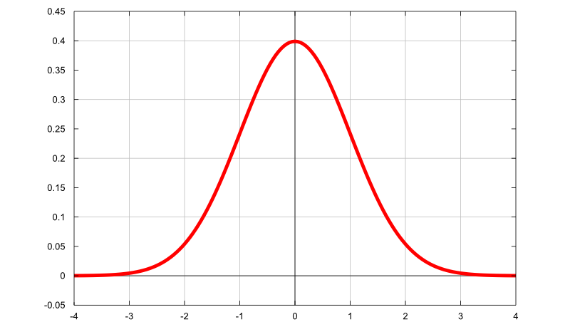
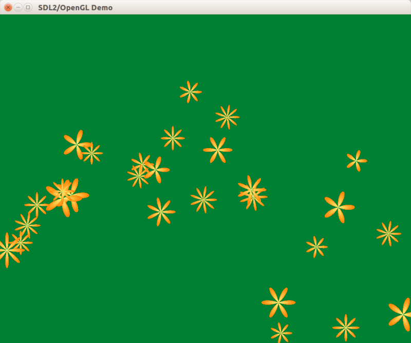

В прошлых уроках мы применяли линейную алгебру и тригонометрию. Теперь пришло время теории вероятностей: именно она позволяет симулировать связанную физическими законами систему из множества простых частиц, таких как дым, огонь, молния, дождь, брызги воды, пар или облака.

Используемый способ будет неэффективен в плане производительности &mdash; в будущем мы глубже изучим OpenGL и повысим производительность системы частиц.

## Случайность в C и C++11

В дискретном мире компьютеров нет абсолютно случайных чисел. Современные операционные системы позволяет получить *почти* случайные числа &mdash; настолько хорошие, что их даже можно использовать в криптографии. Но скорость получения криптографически случайных чисел низкая, а скорость регенерации пула этих чисел конечная.

Играм не нужна криптографически надёжная случайность. Традиционный подход &mdash; получать случайное число на основе времени запуска подпрограммы, и считать это число *семенем* (*англ.* seed), позволяющим вырастить целую последовательность чисел, зависимость которых друг от друга трудно проследить снаружи. Такие последовательности называются псевдо-случайными (*англ.* pseudo-random).

В C++14 есть два стандартных способа генерации псевдослучайных чисел:

- функции `rand()` и `srand`, часть стандарта C89, дают доступ к глобальной для программы последовательности случайных чисел
- заголовок `<random>`, часть стандарта C++11, даёт классы для создания множества независимых последовательностей и множества семян для них, также он даёт готовые средства для деформирования случайности

## Случайный интервал чисел

Допустим, мы хотим изменять число лепестков цветка &mdash; с линейным распределением случайности. Мы также хотим изменять время жизни цветков от появления до исчезновения, и тут есть нюанс: мы хотим, чтобы большинство цветков имело среднее время жизни, а на краях допустимого интервала жизни оказывались лишь единицы. Этого можно добиться с помощью нормального распределения случайных чисел:



Другой вопрос &mdash; как хранить допустимый интервал `[minValue, maxValue]`, представляющий границы случайной последовательности?

- использовать `glm::vec2` не стоит, потому что неочевидно, что означают `x` и `y`
- для `std::pair<float, float>` это более наглядно, но придётся писать отдельные функции и хранить отдельно данные для реализации самой последовательности в этих границах

Третий вопрос &mdash; как хранить информацию о самой последовательности, и куда поместить метод для получения нового числа? Можно создать свой шаблонный класс `CRandomSequence<T>`, и реализовать в нём разные распределения (линейное и нормальное). В конечном счёте вы получите... аналог того, что уже есть в STL.

STL предоставляет готовые классы [`std::uniform_int_distribution<T>`](http://en.cppreference.com/w/cpp/numeric/random/uniform_int_distribution), [`std::uniform_real_distribution<T>`](http://en.cppreference.com/w/cpp/numeric/random/uniform_real_distribution) и [`std::normal_distribution<T>`](http://en.cppreference.com/w/cpp/numeric/random/normal_distribution), которые решают сразу три задачи: задают случайное распределение, хранят границы диапазона случайных чисел и позволяют получить новое случайное число на основе предыдущего, которое сохраняется внутри распределения.

## Применение случайных интервалов

Случайные распределения STL содержат все нужные данные и методы, но не имеют одного: источника исходных случайных чисел неограниченного диапазона. Для этой цели в STL служат два отдельных класса: [`std::random_device`](http://en.cppreference.com/w/cpp/numeric/random/random_device), дающий новое истинно случайное семя, и `std::mt19937`, позволяющий из семени получить псевдослучайную последовательность неограниченного диапазона. Распределение является функтором, который при вызове принимает ссылку на источник случайности &mdash; либо на сам `std::random_device`, либо на перемешиватель `std::mt19937`. Поскольку перемешиватель работает быстрее, следует использовать именно его при вызове функтора.

Сайт [cppreference.com](http://en.cppreference.com) предлагает следующий способ:

```cpp
#include <iostream>
#include <string>
#include <random>

int main()
{
    // Запрашивает почти случайное число через API ОС.
    std::random_device rd;
    // Движок "перемешивания", дающий из одного семени rd() целую цепочку
    std::mt19937 engine(rd());

    // линейное распределение целых чисел на интервале [1..6]
    std::uniform_int_distribution<int> uniform_dist(1, 6);
    int mean = uniform_dist(engine);
    std::cout << "Randomly-chosen mean: " << mean << '\n';
}
```

## Ограничиваем нормальное распределение

Особенность нормального распределения в том, что оно не имеет границ &mdash; значения могут быть любым числам диапазона float, но вероятность появления чисел за пределами определённого интервала очень низкая. Поэтому параметры конструктора `normal_distribution<T>` принимают отнюдь не минимальное и максимальное значение, а математическое ожидание и среднеквадратическое отклонение. Если мы попробуем генерировать временные интервалы распределением `normal_distribution(min, max)`, мы иногда будем получать отрицательные интервалы времени.

В [ответе на stackoverflow.com](http://stackoverflow.com/questions/28618900) есть отличное объяснение свойств нормального распределения и способа уместить его в определённый диапазон float. Именно так мы и сделаем:

```cpp
// Создано на основе http://stackoverflow.com/questions/28618900
class CClampedNormalDistribution
{
    std::normal_distribution<float> m_distribution;
    float m_min = 0.f;
    float m_max = 0.f;
public:
    // m_distribution требует два параметра:
    // `mean`, т.е. медианное значение и одновременно мат. ожидание
    // `stddev`, т.е. стандартное отклонение (дисперсию)
    // мы выводим эти параметры из min/max.
    void param(float min, float max)
    {
        using param_type = std::normal_distribution<float>::param_type;
        const float mean = (min + max) / 2.f;
        const float stddev = (max - min) / 6.f;
        m_distribution.param(param_type(mean, stddev));
        m_min = min;
        m_max = max;
    }

    // Нормальное распределение выдаёт значения на всём диапазоне float
    // Но мы режем значения, выпадающие из диапазона [min, max]
    // Статистически, будет выброшено около 0.3% значений.
    float operator ()(std::mt19937 &random) {
        while (true) {
            float number = m_distribution(random);
            if (number >= m_min && number <= m_max)
                return number;
        }
    }
};
```

## Цветок-частица

Добавим класс `CFlowerParticle`, который расширяет `CMovableFlower` новыми свойствами. Нам нужны два новых свойства: двумерный вектор скорости перемещения (*англ.* velocity) и оставшееся время жизни частицы, после истечения которого частица просто исчезает.

```cpp
class CFlowerParticle : public CMovableFlower
{
public:
    // @param dt - разница во времени с предыдущим вызовом Advance.
    // @param acceleration - ускорение, действующее на частицу.
    void Advance(float dt, const glm::vec2 &acceleration);
    bool IsAlive()const;

    glm::vec2 GetVelocity() const;
    void SetVelocity(const glm::vec2 &GetVelocity);
    void SetLifetime(float lifetime);

private:
    glm::vec2 m_velocity;
    float m_lifetime = 0;
};
```

Вместо getter-метода GetLifetime был добавлен более удобный метод `IsAlive`, проверяющий оставшееся время жизни:

```cpp
bool CFlowerParticle::IsAlive() const
{
    const float epsilon = std::numeric_limits<float>::epsilon();
    return m_lifetime > epsilon;
}
```

Метод Advance принимает прошедший интервал времени и ускорение. В данный момент ускорение всегда постоянное &mdash; его порождает сила гравитации. Это можно изменить в будущем, если добавить вентилятор или другой объект, воздействующий на цветы.

```cpp
void CFlowerParticle::Advance(float dt, const glm::vec2 &acceleration)
{
    m_lifetime -= dt;
    m_velocity += dt * acceleration;
    SetPosition(m_velocity + GetPosition());
}
```

## Система частиц

Добавим класс, реализующий систему из множества частиц. Система собирает воедино сами частицы, законы симулируемого мира и источник новых частиц. В качестве частиц выступит класс `CFlowerParticle`, а для генерации новых частиц мы применим класс `CParticleEmitter`, который будет описан позднее. Пока что утвердим его интерфейс:

```cpp
class CParticleEmitter
{
public:
    CParticleEmitter();

    // @param dt - разница во времени с предыдущим вызовом Advance.
    void Advance(float dt);
    bool IsEmitReady()const;
    std::unique_ptr<CFlowerParticle> Emit();
};
```

Источник частиц продвигается вперёд во времени при вызове метода Advance. При этом он может войти в статус готовности генерации, и тогда IsEmitReady вернёт true. Если в такой ситуации вызвать Emit(), источник частиц сгенерирует частицу. Учтите: за один кадр может возникнуть несколько частиц, если частота их генерации превышает частоту кадров. Поэтому IsEmitReady и Emit следует вызывать в цикле.

Собирающий класс системы частиц относительно прост и выглядит так:

```cpp
class CParticleSystem
{
public:
    CParticleSystem();
    ~CParticleSystem();

    void SetEmitter(std::unique_ptr<CParticleEmitter> && pEmitter);

    // @param dt - разница во времени с предыдущим вызовом Advance.
    void Advance(float dt);
    void Draw();

private:
    std::unique_ptr<CParticleEmitter> m_pEmitter;
    std::vector<std::unique_ptr<CFlowerParticle>> m_flowers;
};
```

Конструктор, деструктор и сеттер свойства emitter строятся достаточно просто:

```cpp
CParticleSystem::CParticleSystem() = default;
CParticleSystem::~CParticleSystem() = default;

void CParticleSystem::SetEmitter(std::unique_ptr<CParticleEmitter> &&pEmitter)
{
    m_pEmitter = std::move(pEmitter);
}
```

При рисовании мы должны обойти список живых цветов и нарисовать их. При вызове Advance нужно сгенерировать новые частицы, затем продвинуть в будущее на время `deltaSeconds` состояние каждого цветка и в конце удалить отжившие своё цветы. Это можно сделать с помощью цикла while, цикла range-based for и алгоритмов remove_if/erase:

```cpp
void CParticleSystem::Advance(float dt)
{
    // Генерируем новые частицы
    m_pEmitter->Advance(dt);
    // За 1 кадр может появиться несколько новых частиц.
    while (m_pEmitter->IsEmitReady())
    {
        m_flowers.emplace_back(m_pEmitter->Emit());
    }
    // Продвигаем время жизни всех цветов.
    for (const auto &pFlower : m_flowers)
    {
        pFlower->Advance(dt, GRAVITY);
    }
    // Удаляем устаревшие цветы.
    auto pred = [](const auto &pFlower) {
        return !pFlower->IsAlive();
    };
    auto newEnd = std::remove_if(m_flowers.begin(), m_flowers.end(), pred);
    m_flowers.erase(newEnd, m_flowers.end());
}

void CParticleSystem::Draw()
{
    for (const auto &pFlower : m_flowers)
    {
        pFlower->Draw();
    }
}
```

## Источник частиц

Источник частиц будет испускать частицы с помощью случайных распределений. Также  ему нужна позиция, т.е. точка возникновения цветов, а ещё объект `std::mt19937`, создающий исходную псевдослучайную последовательность, которая затем обрабатывается распределениям. Класс имеет достаточно много свойств, потому что мы хотим настраивать множество параметров генерации частиц.

```cpp
class CParticleEmitter
{
public:
    CParticleEmitter();

    // @param dt - разница во времени с предыдущим вызовом Advance.
    void Advance(float dt);
    bool IsEmitReady()const;
    std::unique_ptr<CFlowerParticle> Emit();

    void SetPosition(const glm::vec2 &value);
    void SetLifetimeRange(float minValue, float maxValue);
    void SetRadiusRange(float minValue, float maxValue);
    void SetPetalsCountRangle(int minValue, int maxValue);
    void SetEmitIntervalRange(float minValue, float maxValue);
    void SetSpeedRange(float minValue, float maxValue);
    void SetAngleRange(float minValue, float maxValue);

private:
    using linear_random_float = std::uniform_real_distribution<float>;
    using normal_random_float = CClampedNormalDistribution;
    using linear_random_int = std::uniform_int_distribution<int>;

    float m_elapsedSeconds = 0;
    float m_nextEmitTime = 0;
    glm::vec2 m_position;
    normal_random_float m_lifetimeRange;
    linear_random_float m_radiusRange;
    linear_random_int m_petalsCountRange;
    normal_random_float m_emitIntervalRange;
    normal_random_float m_speedRange;
    normal_random_float m_angleRange;
    std::mt19937 m_random;
};
```

Реализация методов-сеттеров примерно одинакова:

```cpp
void CParticleEmitter::SetPosition(const glm::vec2 &value)
{
    m_position = value;
}

void CParticleEmitter::SetLifetimeRange(float minValue, float maxValue)
{
    m_lifetimeRange.param(minValue, maxValue);
}

// и так далее
```

Определение интервала испускания частиц устроено следующим образом: в методе Advance мы прибавляем прошедшее время к `m_elapsedSeconds`, а затем отнимаем время `m_nextEmitTime`, пока есть возможность, и каждый раз порождаем частицу. При этом следующее значение `m_nextEmitTime` определяется случайным распределением.

```cpp
void CParticleEmitter::Advance(float dt)
{
    m_elapsedSeconds += dt;
    std::cerr << "m_elapsedSeconds increased, is " << m_elapsedSeconds << std::endl;
}

bool CParticleEmitter::IsEmitReady() const
{
    return m_elapsedSeconds > m_nextEmitTime;
}

std::unique_ptr<CFlowerParticle> CParticleEmitter::Emit()
{
    // Определяем время появления следующей частицы.
    m_elapsedSeconds -= m_nextEmitTime;
    m_nextEmitTime = m_emitIntervalRange(m_random);
    // Остальной код отвечает за генерацию новой частицы
    // Чтобы обеспечить basic exception safety, выделение памяти
    // следует разместить в начале метода Emit.
}
```

Весь метод Emit выглядит так:

```cpp
std::unique_ptr<CFlowerParticle> CParticleEmitter::Emit()
{
    const glm::vec3 LIGHT_YELLOW = { 1.f, 1.f, 0.5f};
    const glm::vec3 ORANGE = {1.f, 0.5f, 0.f};

    auto pFlower = std::make_unique<CFlowerParticle>();

    // Определяем время появления следующей частицы.
    m_elapsedSeconds -= m_nextEmitTime;
    m_nextEmitTime = m_emitIntervalRange(m_random);

    const float speed = m_speedRange(m_random);
    const float angle = m_angleRange(m_random);
    const glm::vec2 velocity = { speed * sinf(angle), speed * cosf(angle) };
    const float maxRadius = m_radiusRange(m_random);
    const int petalsCount = m_petalsCountRange(m_random);

    pFlower->SetLifetime(m_lifetimeRange(m_random));
    pFlower->SetVelocity(velocity);
    pFlower->SetCenterColor(LIGHT_YELLOW);
    pFlower->SetPetalColor(ORANGE);
    pFlower->SetPosition(m_position);
    pFlower->SetupShape(0.3f * maxRadius, maxRadius, petalsCount);

    return pFlower;
}
```

## Изменения в классе CWindow

В классе `CWindow` сложным будет только конструктор, остальное стало проще или не изменилось с предыдущей версии. Дело в том, что вся логика перенесена в класс `CParticleSystem`, и остаётся только настроить её в конструкторе.

#### класс CWindow

```cpp
class CWindow : public CAbstractInputControlWindow
{
public:
    CWindow();

protected:
    // CAbstractWindow interface
    void OnUpdateWindow(float deltaSeconds) override;
    void OnDrawWindow(const glm::ivec2 &size) override;

private:
    void SetupView(const glm::ivec2 &size);

    CParticleSystem m_system;
};
```

### методы CWindow

```cpp
CWindow::CWindow()
{
    auto pEmitter = std::make_unique<CParticleEmitter>();
    pEmitter->SetPosition({0, 600});
    pEmitter->SetAngleRange(0.7f * float(M_PI), 0.9f * float(M_PI));
    pEmitter->SetEmitIntervalRange(0.04f, 0.12f);
    pEmitter->SetLifetimeRange(10.f, 20.f);
    pEmitter->SetPetalsCountRangle(5, 9);
    pEmitter->SetRadiusRange(40.f, 75.f);
    pEmitter->SetSpeedRange(8.f, 15.f);
    m_system.SetEmitter(std::move(pEmitter));

    SetBackgroundColor(QUIET_GREEN);
}

void CWindow::OnUpdateWindow(float deltaSeconds)
{
    m_system.Advance(deltaSeconds);
}

void CWindow::OnDrawWindow(const glm::ivec2 &size)
{
    SetupView(size);
    m_system.Draw();
}
```

## Финальная версия

Реализацию можно улучшить: сейчас цветки имеют одинаковый цвет, который также можно задать случайным распределением. Для этого придётся определить новый тип распределения, который получает два `glm::vec3` в качестве границ диапазона и интерполирует их покомпонентно путём соединения трёх линейных распределений типа float.

Подумайте, как ещё можно улучшить систему частиц. Для начала возьмите [полный пример к уроку на github](https://github.com/PS-Group/cg_course_examples/tree/master/lesson_05). Вот так он выглядит:


