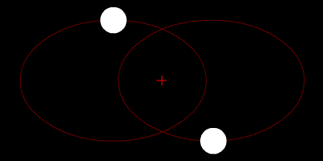
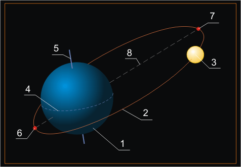
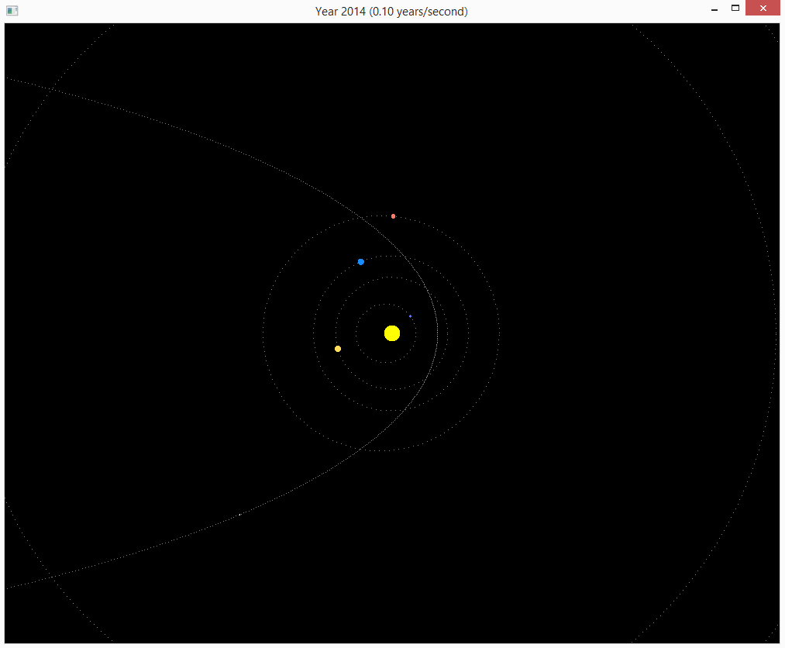

## Заголовок окна

Для удобства мы будем выводить в заголовке окна информацию о скорости симуляции солнечной системы. Для этого следует внести изменения в класс CAbstractWindow, добавив новый метод SetTitle, использующий свободную функцию [SDL_SetWindowTitle](http://wiki.libsdl.org/SDL_SetWindowTitle) для изменения заголовка окна:

```cpp
// в заголовочном файле
class CAbstractWindow : private boost::noncopyable
{
public:
    // ... публичная секция не меняется

protected:
    void SetBackgroundColor(glm::vec4 const& color);
    void SetTitle(const std::string &title);
    // ... остальная часть определения класса не меняется
};

// в файле реализации

class CAbstractWindow::Impl
{
public:
    // ... начало публичной секции
    void SetBackgroundColor(const glm::vec4 &color)
    {
        m_clearColor = color;
    }

    void SetTitle(const std::string &title)
    {
        SDL_SetWindowTitle(m_pWindow.get(), title.c_str());
    }
    // ... остальная часть определения класса не меняетсяs
};

void CAbstractWindow::SetTitle(const std::string &title)
{
    m_pImpl->SetTitle(title);
}
```

## Задача двух тел

[Задача двух тел (ru.wikipedia.org)](https://ru.wikipedia.org/wiki/%D0%97%D0%B0%D0%B4%D0%B0%D1%87%D0%B0_%D0%B4%D0%B2%D1%83%D1%85_%D1%82%D0%B5%D0%BB) состоит в том, чтобы определить движение двух точечных частиц, которые взаимодействуют только друг с другом. Движение Луны и Земли вокруг их общего центра масс можно описать как задачу двух тел, если пренебречь гравитационным влиянием Солнца и других планет солнечной системы.



Прелесть задачи двух тел в том, что она прекрасно решается аналитически: достаточно знать зависимость силы притяжения или, например, силы кулоновского отталкивания от координат тел. Движение космических тел по эллиптической орбите в задаче двух тел описывается [уравнением Кеплера (ru.wikipedia.org)](https://ru.wikipedia.org/wiki/Уравнение_Кеплера):

`E - e * sin(E) = M`

- E &mdash; эксцентрическая аномалия (параметр, из которого выводится переменная величина удалённости тела от точки, вокруг которой оно вращается)
- e &mdash; эксцентриситет орбиты, то есть степень отклонения эллиптической орбиты от правильной окружности
- M &mdash; длина участка орбиты, пройденного с момента последнего прохождения перицентра (в солнечной системе перицентры планет называются перигелиями)

На данной иллюстрации перицентр (перигелий) орбиты тела под числом 3 обозначен числом 6, а апоцентр &mdash; числом 7:



## Задача трёх (и более) тел

К сожалению, при добавлении в систему Луна-Земля влияния Солнца, а также при добавлении любого третьего тела в систему из двух тел задача нахождения координат в любой момент времени становится неразрешимой аналитическими методами. Иными словами, не существует способа с помощью решения системы уравнений точно определить траектории в системе из трёх тел.

Отсутсвие точного решения не мешает искать приближённые решения с помощью численного решения приближённых уравнений. То есть на практике задачу двух тел можно решить с любой заданной точностью &mdash; но невозможно решить *абсолютно* точно, за исключением некоторых частных случаев.

## Движение планет по эллиптическим орбитам

В солнечной системе присутствует как минимум Солнце и 8 планет (Меркурий, Венера, Земля, Марс, Юпитер, Сатурн, Уран, Нептун). Однако, для визуализации движения планет по их орбитам мы можем пренебречь взаимным влиянием планет и разбить Солнечную Систему на 8 подсистем "Солнце-планета".

В каждой подсистеме "Солнце-планета" путём численного решения уравнения Кеплера можно определить зависимость координат планеты от времени. Для этих целей создадим вспомогательный класс CEllipticOrbit:

```cpp
#pragma once

#include <glm/mat4x4.hpp>
#include <glm/vec2.hpp>
#include <cmath>

class CEllipticOrbit
{
public:
    CEllipticOrbit(
        double const& largeAxis,     // большая полуось эллипса
        double const& eccentricity,  // эксцентриситет орбиты
        double const& meanMotion,    // среднее движение (градуcов за единицу времени)
        double const& periapsisEpoch // начальная эпоха прохождения через перигелий
        ):
    m_largeAxis(largeAxis),
    m_eccentricity(eccentricity),
    m_meanMotion(meanMotion),
    m_periapsisEpoch(periapsisEpoch)
    {
    }

    double Eccentricity()const;
    double LargeAxis()const;

    glm::vec2 PlanetPosition2D(double const& time)const;

private:
    double MeanAnomaly(const double &time)const;
    double EccentricityAnomaly(const double &time)const;
    double TrueAnomaly(const double &eccentricityAnomaly)const;
    double RadiusVectorLength(const double &eccentricityAnomaly)const;

    double m_largeAxis;
    double m_eccentricity;
    double m_meanMotion;
    double m_periapsisEpoch;
};
```

## Численное решение уравнения Кеплера

Численные методы поиска корней уравнений позволяют найти решения уравнения с заданной степенью точности. Если вспомнить, что числа в памяти компьютера сами по себе ограничены в точности представления, то несложно сделать вывод, что в дискретном мире компьютеров численное решение по своей точности мало чем отличается от аналитического. Какая разница, как вы находите √2, если √2 невозможно точно представить как `float` или `double`?

Именно поэтому мы воспольуемся численным алгоритмом поиска корней под названием [метод Халли](https://en.wikipedia.org/wiki/Halley's_method). Для сокращения кода воспользуемся готовой реализацией этого алгоритма в функции `boost::math::tools::halley_iterate`.

Для запуска этой функции мы должны сформировать функтор, который будет для заданного параметра x возвращать кортеж из трёх значений:

- значение функции для аргумента x
- значение первой производной этой функции для аргумента x
- значение второй производной этой функции для аргумента x

В C++98 нам бы пришлось писать новый класс с перегруженным оператором вызова, но в C++11 мы можем применить лямбда-функции:

```cpp
// Матчасть взята отсюда: http://www.astronet.ru/db/msg/1190817/node21.html#ll60

// Уравнение кеплера, задающее связь между эксцентрической аномалией,
// эксцентриситетом орбиты и средней аномалией
//      M = E - e * sin(E)
// где M - средняя аномалия, e - эксцентриситет орбиты, E - эксцентрическая аномалия
// уравнение `M = E - e * sin(E)` преобразуется так, чтобы слева было число 0,
// а справа - некоторая функция F(E):
//      0 = E - M - e * sin(E)
// Функтор возвращает функцию от E, а также две её производные функции.
//      F(E) = E - M - e * sin(E)
//      F'(E) = 1 - e * cos(E)
//      F''(E) = e * sin(E)
using FunctionSnapshot = boost::math::tuple<double, double, double>;
using EquationFunction = std::function<FunctionSnapshot(const double &x)>;

EquationFunction MakeKeplerEquationFunction(double meanAnomaly, double eccentricity)
{
    return [=](const double &x) {
        return boost::math::make_tuple(
                    // функция
                    x - meanAnomaly - eccentricity * sin(x),
                    // её первая производная
                    1 - eccentricity * cos(x),
                    // её вторая производная
                    eccentricity * sin(x));
    };
}
```

Теперь можно написать функцию-обёртку, использующую функтор с алгоритмом "метод Халли":

```cpp
// Функция выполняет численое решение уравнения кеплера,
// вычисляя эксцентрическую аномалию
// при известных средней аномалии и эксцентриситете орбиты
// В качестве решения используется метод Halley
// (http://en.wikipedia.org/wiki/Halley's_method),
// используя соответствующие алгоритмы библиотеки boost.
double SolveKeplerEquation(double const& meanAnomaly, double const& eccentricity)
{
    const int digits = (std::numeric_limits<double>::digits) >> 1;
    // ограничиваем максимальное число итераций,
    // поскольку мы рисуем систему планет в реальном времени.
    boost::uintmax_t maxIteractions = 1000;

    return boost::math::tools::halley_iterate(
        MakeKeplerEquationFunction(meanAnomaly, eccentricity),
        meanAnomaly,                // первое приближение корня
        meanAnomaly - eccentricity, // минимальное значение корня
        meanAnomaly + eccentricity, // максимальное значение корня
        digits,                     // число разрядов
        maxIteractions);            // наибольшее число итераций
}
```

Теперь, обладая способом решения уравнения Кеплера для заданного момента времени, мы можем реализовать остальные методы. Кроме того, мы добавим релизацию геттеров свойств:

```cpp


double CEllipticOrbit::Eccentricity() const
{
    return m_eccentricity;
}

double CEllipticOrbit::LargeAxis() const
{
    return m_largeAxis;
}

double CEllipticOrbit::MeanAnomaly(const double &time) const
{
    const double anomaly = 2 * M_PI * m_meanMotion * (time - m_periapsisEpoch);
    const double wrappedAnomaly = fmod(anomaly, M_PI + M_PI);
    return wrappedAnomaly;
}

double CEllipticOrbit::EccentricityAnomaly(const double &time) const
{
    return SolveKeplerEquation(MeanAnomaly(time), m_eccentricity);
}

double CEllipticOrbit::TrueAnomaly(const double &eccentricityAnomaly) const
{
    // Тангенс половинчатого угла
    const double tg_v_2 = sqrt((1 + m_eccentricity) / (1 - m_eccentricity)) * tan(eccentricityAnomaly / 2);
    // Половинчатый угол
    const double v_2 = atan(tg_v_2);
    // Истинная аномалия
    return v_2 + v_2;
}

double CEllipticOrbit::RadiusVectorLength(const double &eccentricityAnomaly) const
{
    return m_largeAxis * (1 - m_eccentricity * cos(eccentricityAnomaly));
}

glm::vec2 CEllipticOrbit::PlanetPosition2D(const double &time) const
{
    const double e = EccentricityAnomaly(time);
    const float r = float(RadiusVectorLength(e));
    const float v = float(TrueAnomaly(e));
    return { r * cosf(v), r * sinf(v) };
}
```

## Реализуем класс CSolarSystem

Теперь мы добавим класс, инкапсулирующий в себе информацию о Солнце, планетах и взаимодействии между ними. В целом он будет похож на класс CParticleSystem, хотя законы движения кардинально изменились: больше нет никакой случайности и хаотичности, на смену им пришли законы небесной механики.

Так выглядит объявление CSolarSystem:

```cpp
#pragma once

#include "EllipticOrbit.h"
#include <glm/vec3.hpp>

class CSolarSystem
{
public:
    CSolarSystem();

    void Update(float deltaTime);
    void Draw();

    float GetViewScale()const;
    float GetTimeSpeed()const;
    unsigned GetYear()const;
    void ZoomIn();
    void ZoomOut();
    void SpeedupTime();
    void SlowdownTime();

private:
    void DrawSun();
    void DrawOrbit(const CEllipticOrbit &orbit);
    void DrawPlanets();

    float m_time;
    float m_timeSpeed;
    float m_viewScale;

    struct PlanetInfo
    {
        CEllipticOrbit orbit;
        glm::vec3 color;
        float size;
    };
    std::vector<PlanetInfo> m_planets;
};
```

В конструкторе CSolarSystem зададим все 8 планет, планетоид Плутон и комету Галлея:

```cpp
namespace
{
const float DEFAULT_TIME_SPEED = 0.1f;
// 40 пикселей на астрономическую единицу
const float DEFAULT_SCALE = 100.f;

double GetRadians(double degrees, double seconds = 0)
{
    return glm::radians(degrees + seconds / 60.0);
}

glm::vec3 FromRGB(unsigned colorCode)
{
    unsigned r = (colorCode >> 16) % 256;
    unsigned g = (colorCode >> 8) % 256;
    unsigned b = colorCode % 256;

    return { float(r) / 255.f, float(g) / 255.f, float(b) / 255.f };
}

const glm::vec3 MERCURY_COLOR = FromRGB(0x5B71FF);
const glm::vec3 VENUS_COLOR = FromRGB(0xFFDB59);
const glm::vec3 EARTH_COLOR = FromRGB(0x168EFF);
const glm::vec3 MARS_COLOR = FromRGB(0xFF7A68);
const glm::vec3 JUPITER_COLOR = FromRGB(0x897AFF);
const glm::vec3 SATURN_COLOR = FromRGB(0x47FF81);
const glm::vec3 URANUS_COLOR = FromRGB(0xFFF463);
const glm::vec3 NEPTUNE_COLOR = FromRGB(0xFFF463);
const glm::vec3 PLUTO_COLOR = FromRGB(0xFFF463);
const glm::vec3 COMET_COLOR = FromRGB(0xFFFFFF);
}

CSolarSystem::CSolarSystem()
    : m_time(0)
    , m_timeSpeed(DEFAULT_TIME_SPEED)
    , m_viewScale(DEFAULT_SCALE)
{
    m_planets =
    {
        {CEllipticOrbit(0.387, 0.206, 1 / 0.241, GetRadians(7, 0)), MERCURY_COLOR, 1},
        {CEllipticOrbit(0.723, 0.007, 1 / 0.635, GetRadians(3, 24)), VENUS_COLOR, 3},
        {CEllipticOrbit(1.000, 0.017, 1 / 1.000, GetRadians(0)), EARTH_COLOR, 3},
        {CEllipticOrbit(1.524, 0.093, 1 / 1.881, GetRadians(1, 1)), MARS_COLOR, 2},
        {CEllipticOrbit(5.203, 0.048, 1 / 11.862, GetRadians(1, 18)), JUPITER_COLOR, 6},
        {CEllipticOrbit(6.539, 0.056, 1 / 20.658, GetRadians(2, 29)), SATURN_COLOR, 5},
        {CEllipticOrbit(19.190, 0.048, 1 / 84.800, GetRadians(0, 45)), URANUS_COLOR, 5},
        {CEllipticOrbit(30.081, 0.009, 1 / 154.232, GetRadians(1, 47)), NEPTUNE_COLOR, 5},
        {CEllipticOrbit(38.525, 0.249, 1 / 247.305, GetRadians(17, 9)), PLUTO_COLOR, 1},
        {CEllipticOrbit(17.800, 0.967, 1 / 75.300, GetRadians(162, 3)), COMET_COLOR, 0.5},
    };

}
```

Теперь добавим реализации Update и Draw. Планеты и Солнце мы будем рисовать как точки фиксированного размера, а орбиты &mdash; с помощью пунктирной линии. В любом случае, параметры эллипса орбиты и позицию планеты в заданный момент времени можно узнать у помощью объекта класса CElipticOrbit:

```cpp
void CSolarSystem::Update(float deltaTime)
{
    m_time += deltaTime * m_timeSpeed;
}

void CSolarSystem::Draw()
{
    DrawSun();
    DrawPlanets();
}

void CSolarSystem::DrawSun()
{
    glPointSize(2.f * sqrtf(m_viewScale));
    glBegin(GL_POINTS);
    {
        glColor3f(1, 1, 0);
        glVertex2d(0, 0);
    }
    glEnd();
}

void CSolarSystem::DrawOrbit(const CEllipticOrbit &orbit)
{
    glDisable(GL_POINT_SMOOTH);
    glPointSize(1);
    glColor3f(0.5, 0.5, 0.5);
    glBegin(GL_POINTS);
    {
        // const float period = 2 * M_PI / orbit.MeanMotion();
        const float a = float(orbit.LargeAxis());
        const float e = float(orbit.Eccentricity());
        const float step = float(2 * M_PI) / (a * m_viewScale);
        const float c = e * a;
        const float k = sqrtf(1.f - e * e);
        const float b = k * a;
        const float centerX = -c;
        const float centerY = 0;

        float time = 0;
        while (time < float(2 * M_PI))
        {
            glVertex2f(centerX + a * cosf(time), centerY + b * sinf(time));
            time += step;
        }
    }
    glEnd();
}

void CSolarSystem::DrawPlanets()
{
    for (PlanetInfo const& planet : m_planets)
    {
        DrawOrbit(planet.orbit);

        glColor3fv(glm::value_ptr(planet.color));

        glEnable(GL_POINT_SMOOTH);
        glPointSize(planet.size * sqrtf(m_viewScale) / 4.f);
        glBegin(GL_POINTS);
        {
            glm::vec2 pos = planet.orbit.PlanetPosition2D(double(m_time));
            glVertex2f(pos.x, pos.y);
        }
        glEnd();
    }
}
```

Методы для запроса свойств и управляющие методы для изменения масштаба и скорости течения времени можно реализовать так:

```cpp

namespace
{
const float MIN_TIME_SPEED = -20;
const float MAX_TIME_SPEED = +20;
const float TIME_ADJUSTMENT = 0.02f;
const float MIN_SCALE = 5;
const float MAX_SCALE = 500;
const float SCALE_FACTOR = 1.f;
}

float CSolarSystem::GetViewScale() const
{
    return m_viewScale;
}

float CSolarSystem::GetTimeSpeed() const
{
    return m_timeSpeed;
}

unsigned CSolarSystem::GetYear() const
{
    return unsigned(m_time) + INITIAL_YEAR;
}

void CSolarSystem::ZoomIn()
{
    m_viewScale *= SCALE_FACTOR;
    if (m_viewScale > MAX_SCALE)
    {
        m_viewScale = MAX_SCALE;
    }
}

void CSolarSystem::ZoomOut()
{
    m_viewScale /= SCALE_FACTOR;
    if (m_viewScale < MIN_SCALE)
    {
        m_viewScale = MIN_SCALE;
    }
}

void CSolarSystem::SpeedupTime()
{
    m_timeSpeed = m_timeSpeed + TIME_ADJUSTMENT;
    if (m_timeSpeed > MAX_TIME_SPEED)
    {
        m_timeSpeed = MAX_TIME_SPEED;
    }

    m_timeSpeed = floorf(m_timeSpeed * 1000.f + 0.5f) / 1000.f;
}

void CSolarSystem::SlowdownTime()
{
    m_timeSpeed = m_timeSpeed - TIME_ADJUSTMENT;
    if (m_timeSpeed < MIN_TIME_SPEED)
    {
        m_timeSpeed = MIN_TIME_SPEED;
    }
    m_timeSpeed = floorf(m_timeSpeed * 1000.f + 0.5f) / 1000.f;
}
```

## Реализуем класс CWindow

Практически все возможности программы уже реализованы, в CWindow остаётся лишь управляющий код. Поэтому объявление класса CWindow будет кратким:

```cpp
#pragma once
#include "DispatchEvent.h"
#include "SolarSystem.h"
#include <vector>

class CWindow : public CAbstractInputControlWindow
{
public:
    CWindow();

protected:
    // CAbstractWindow interface
    void OnUpdateWindow(float deltaSeconds) override;
    void OnDrawWindow(const glm::ivec2 &size) override;
    // IInputEventAcceptor interface
    void OnKeyDown(const SDL_KeyboardEvent &) override;

private:
    void SetupView();

    CSolarSystem m_system;
    glm::ivec2 m_windowSize;
};
```

В первую очередь рассмотрим реализацию конструктора, обновления состояния и рисования сцены:

```cpp
namespace
{
const glm::vec4 BLACK = {0, 0, 0, 1};
}

CWindow::CWindow()
{
    SetBackgroundColor(BLACK);
    glEnable(GL_POINT_SMOOTH);
    glHint(GL_POINT_SMOOTH_HINT, GL_NICEST);
}

void CWindow::OnUpdateWindow(float deltaSeconds)
{
    m_system.Update(deltaSeconds);

    // обновляем заголовок окна
    char timeString[20];
    sprintf(timeString, "%.2f", double(m_system.GetTimeSpeed()));
    SetTitle("Year " + std::to_string(m_system.GetYear())
             + " (" + std::string(timeString) + " years/second)");
}

void CWindow::OnDrawWindow(const glm::ivec2 &size)
{
    m_windowSize = size;
    SetupView();
    m_system.Draw();
}
```

Метод SetupView подвергся модификациям: теперь матрица ортографического проецирования должна учитывать масштаб Солнечной Системы:

```cpp
void CWindow::SetupView()
{
    const float viewScale = m_system.GetViewScale();
    // Матрица ортографического проецирования изображения в трёхмерном пространстве
    // из параллелипипеда с размером, равным (size.X x size.Y x 2).
    const float halfWidth = float(m_windowSize.x) * 0.5f / viewScale;
    const float halfHeight = float(m_windowSize.y) * 0.5f / viewScale;
    const glm::mat4 matrix = glm::ortho<float>(-halfWidth, halfWidth, -halfHeight, halfHeight);
    glViewport(0, 0, m_windowSize.x, m_windowSize.y);
    glMatrixMode(GL_PROJECTION);
    glLoadMatrixf(glm::value_ptr(matrix));
    glMatrixMode(GL_MODELVIEW);
}
```

## Управляющие клавиши

Последним штрихом добавим в `CWindow::OnKeyDown` обработку управляющих клавиш. Список горячих клавиш:

- клавиша "+" (точнее, клавиша "=") увеличивает масштаб
- клавиша "-" уменьшает масштаб
- клавиша "влево" уменьшает скорость течения времени, и может даже обратить время вспять
- клавиша "вправо" увеличивает скорость течения времени

Поскольку вся необходимая работа уже проделана в классе CSolarSystem, в методе OnKeyDown мы просто отображаем события на методы:

```cpp
void CWindow::OnKeyDown(const SDL_KeyboardEvent &event)
{
    switch (event.keysym.sym)
    {
    case SDLK_LEFT:
        m_system.SlowdownTime();
        break;
    case SDLK_RIGHT:
        m_system.SpeedupTime();
        break;
    case SDLK_EQUALS:
        m_system.ZoomIn();
        SetupView();
        break;
    case SDLK_MINUS:
        m_system.ZoomOut();
        SetupView();
        break;
    }
}
```

## Финальная версия

[Полный пример к статье доступен на github](https://github.com/PS-Group/cg_course_examples/tree/master/lesson_06). Вот так выглядит окно после запуска:


