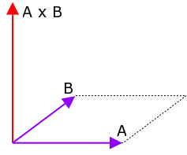
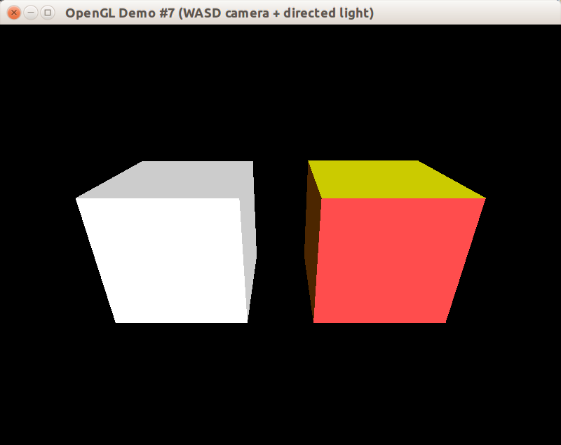
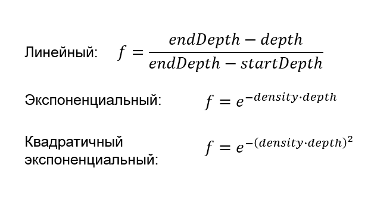
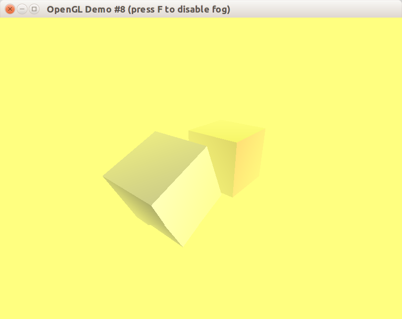
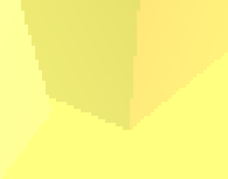
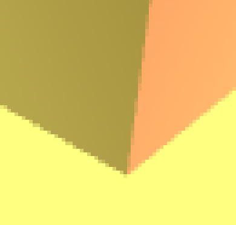
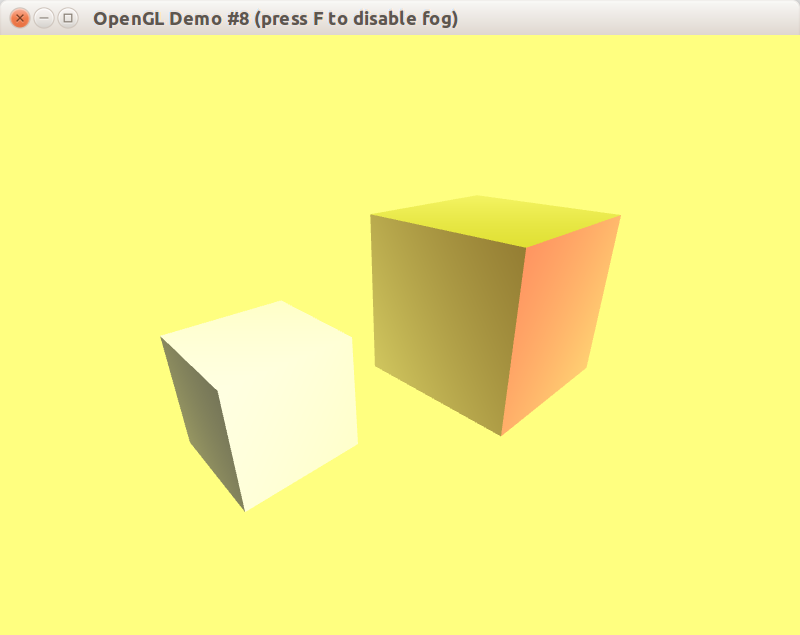

## Модель освещения в фиксированном конвейере OpenGL

Фиксированный конвейер OpenGL позволяет использовать определённую математическую модель симуляции освещения &mdash; [модель Фонга](https://ru.wikipedia.org/wiki/%D0%97%D0%B0%D1%82%D0%B5%D0%BD%D0%B5%D0%BD%D0%B8%D0%B5_%D0%BF%D0%BE_%D0%A4%D0%BE%D0%BD%D0%B3%D1%83), а также определённую модель интерполяции освещения по всему полигону &mdash; модель Гуро (хотя для интерполяции тоже есть своя модель Фонга). Существуют другие модели освещения и интерполяции, но в рамках фиксированного конвейера реализовать их не получится.

Одно из центральных звеньев модели освещения Фонга &mdash; это закон расчёта рассеянного освещения (*англ.* diffuse), также известный как закон Ламберта:


Закон Ламберта проявляет себя в простом наблюдении: чем меньше угол падения солнечных лучей, тем меньше освещена поверхность. Ночью угол падения отрицательный, т.е. путь солнечных лучей перекрывает поверхность где-то на другой стороне Земли. В результате рассеянный (диффузный) свет отсутствует вовсе.

## Компоненты освещения в модели Фонга

Расчёт рассеянного освещения по закону Ламберта даёт неприятный эффект: обратная по отношению к источнику света сторона объекта не освещена. В реальном мире рассеяный свет отражается от стен комнаты и освещает даже те поверхности, на которые не попадают прямые лучи от источника света. В фиксированном конвейере OpenGL этот эффект грубо эмулируется путём умножения "фонового" цвета материала на "фоновую" интенсивность источника света. Этот компонент цвета освещённой поверхности обозначается константой `GL_AMBIENT`.

Рассеяное освещение, рассчитаное по закону Ламберта, обозначается константой `GL_DIFFUSE`.

Также модель Фонга вносит третью компоненту &mdash; световые блики, которые проявляются, когда угол падения лучей на тело практически равен углу отражения луча, попадающего в камеру. Эта компонента освещения обозначается константой `GL_SPECULAR`:


Вот так выглядят три компонента и результат их сложения:


RGBA-цвета всех трёх компонент попросту складываются покомпонетно, и полученные в результате Red, Green, Blue компоненты обрезаются в границах `[0, 1]`. В результате очень ярко освещённый белым источником светло-жёлтый объект может стать просто белым &mdash; цвет `{5.3, 3.2, 1.1, 1}` будет обрезан до белого цвета `{1, 1, 1, 1}`.

Между прочим, в OpenGL есть ещё одна компонента освещения: GL_EMISSION. Она задаёт собственную светимость материала, не зависящую от освещения, и позволяет грубо симулировать светящиеся объекты. Компонента крайне редко используется, и мы не станем её рассматривать.

## 8 источников света

Фиксированный конвейер OpenGL позволяет симулировать не более 8 источников света, поскольку каждый активный источник даёт одинаковый и вполне заметный прирост трудозатрат на растеризацию трёхмерной сцены. Источники света обозначаются константами от `GL_LIGHT0` до `GL_LIGHT7`. В некоторых реализациях OpenGL доступны дополнительные источники с индексами от `GL_LIGHT8`, но написанный с их использованием код не будет работать на большинстве видеокарт.

Включить систему освещения или активировать отдельный источник можно функцией-командой `glEnable`.

```cpp
glEnable(GL_LIGHTING);
glEnable(GL_LIGHT0);
glEnable(GL_LIGHT1);
// рисование сцены
glDisable(GL_LIGHTING);
// рисование элементов сцены, не требующих освещения
```

Параметры источника света в OpenGL задаются при помощи семейства функций [glLight](https://www.opengl.org/sdk/docs/man2/xhtml/glLight.xml). К параметрам источника света относятся интенсивности диффузной, зеркальной и фоновой составляющих цвета, положение источника света (или направление на него), степень зеркального отражения для модели фонга. Для конических источников света можно задать величину угла разброса света. Кроме того, можно задать коэффициенты ослабления интенсивности света в зависимости от расстояния.

## Разрабатываем класс "Направленный источник света"

В OpenGL можно симулировать три разных типа источников света:

- бесконечно удалённый направленный (такой, как Солнце или Луна)
- точечный источник на фиксированной позиции (такой, как светлячок)
- прожекторный источник (*англ. spotlight), то есть точечный источник с ограничением распространения света некоторым конусом

Поэтому для начала введём интерфейс ILightSource и абстрактный класс CAbstractLightSource:

```cpp
#pragma once

#include <glm/fwd.hpp>
#include <glm/vec3.hpp>
#include <glm/vec4.hpp>
#include <boost/noncopyable.hpp>
#include <set>

class ILightSource
{
public:
    virtual ~ILightSource() = default;
    virtual void Setup()const = 0;

    virtual glm::vec4 GetAmbient() const = 0;
    virtual glm::vec4 GetDiffuse() const = 0;
    virtual glm::vec4 GetSpecular() const = 0;
    virtual void SetAmbient(const glm::vec4 &color) = 0;
    virtual void SetDiffuse(const glm::vec4 &color) = 0;
    virtual void SetSpecular(const glm::vec4 &color) = 0;
};

class CAbstractLightSource
        : public ILightSource
        , private boost::noncopyable
{
public:
    /// @param index - один из GL_LIGHT*
    CAbstractLightSource(unsigned index);
    ~CAbstractLightSource();

    glm::vec4 GetAmbient() const final;
    glm::vec4 GetDiffuse() const final;
    glm::vec4 GetSpecular() const final;
    void SetAmbient(const glm::vec4 &color) final;
    void SetDiffuse(const glm::vec4 &color) final;
    void SetSpecular(const glm::vec4 &color) final;

protected:
    void SetupImpl()const;
    unsigned GetIndex()const;

private:
    glm::vec4 m_ambient;
    glm::vec4 m_diffuse;
    glm::vec4 m_specular;
    unsigned m_index;
};
```

Релизация getter/setter методов тривиальна и не заслуживает отдельного рассмотрения. Зато мы рассмотрим определение метода SetupImpl:

```cpp
void CAbstractLightSource::SetupImpl() const
{
    // Включаем источник света с заданным индексом.
    // Источник действует только когда включен режим GL_LIGHTING!
    glEnable(GLenum(m_index));
    glLightfv(m_index, GL_AMBIENT, glm::value_ptr(m_ambient));
    glLightfv(m_index, GL_DIFFUSE, glm::value_ptr(m_diffuse));
    glLightfv(m_index, GL_SPECULAR, glm::value_ptr(m_specular));
}
```

Для установки параметров источника света используется семейство функций [glLight](https://www.opengl.org/sdk/docs/man2/xhtml/glLight.xml), выбранная функция `glLightfv`, как понятно из суффикса `fv` (float variadic), принимает начало массива float неопределённой длины. Длину массива видеодрайвер выбирает в зависимости от параметра источника света, указанного во втором параметре функции.

Как направленный источник света, так и точечный имеют единый параметр &mdash; четырёхкомпонентный вектор GL_POSITION. Здесь опять используется трюк с однородным представлением координат: точка {x, y, z, 1} делает источник света точечным, а вектор {x, y, z, 0} &mdash; направленным. Заложим эту разницу в исходном коде:

```cpp
class CDirectedLightSource : public CAbstractLightSource
{
public:
    /// @param index - один из GL_LIGHT*
    CDirectedLightSource(unsigned index);

    glm::vec3 GetDirection() const;
    void SetDirection(const glm::vec3 &value);

    void Setup() const override;

private:
    glm::vec4 m_direction;
};

// устанавливаем w-компоненту вектора в 0
CDirectedLightSource::CDirectedLightSource(unsigned index)
    : CAbstractLightSource(index)
    , m_direction(0, 0, 0, 0)
{
}

glm::vec3 CDirectedLightSource::GetDirection() const
{
    return {m_direction.x, m_direction.y, m_direction.z};
}

// не меняем w-компоненту вектора (по-прежнему 0)
void CDirectedLightSource::SetDirection(const glm::vec3 &value)
{
    m_direction.x = value.x;
    m_direction.y = value.y;
    m_direction.z = value.z;
}

void CDirectedLightSource::Setup() const
{
    SetupImpl();
    // Если GL_POSITION установить как (x, y, z, 0), т.е. как вектор
    // в однородных координатах, источник света будет направленным.
    glLightfv(GetIndex(), GL_POSITION, glm::value_ptr(m_direction));
}
```

## Разрабатываем класс "Точечный источник света"

Класс CPositionLightSource реализует интерфейс источника света, но, в свою очередь, может послужить базовым классом для прожекторного источника, который можно назвать, например, CSpotlightSource.

```cpp
class CPositionLightSource : public CAbstractLightSource
{
public:
    /// @param index - один из GL_LIGHT*
    CPositionLightSource(unsigned index);

    glm::vec3 GetPosition() const;
    void SetPosition(const glm::vec3 &value);

    void Setup() const override;

private:
    glm::vec4 m_position;
};

CPositionLightSource::CPositionLightSource(unsigned index)
    : CAbstractLightSource(index)
    , m_position(0, 0, 0, 1)
{
}

glm::vec3 CPositionLightSource::GetPosition() const
{
    return { m_position.x, m_position.y, m_position.z };
}

void CPositionLightSource::SetPosition(const glm::vec3 &value)
{
    m_position.x = value.x;
    m_position.y = value.y;
    m_position.z = value.z;
}

void CPositionLightSource::Setup() const
{
    SetupImpl();
    // Если GL_POSITION установить как (x, y, z, 1), т.е. как точку
    // в однородных координатах, источник света будет точечным.
    glLightfv(GetIndex(), GL_POSITION, glm::value_ptr(m_position));
}
```

В примере к этой статье нет класса CSpotlightSource. Вы можете реализовать его самостоятельно путём наследования CPositionLightSource и расширения его установкой и применением параметров GL_SPOT_DIRECTION, GL_SPOT_EXPONENT, GL_SPOT_CUTOFF. Больше информации можно найти [в статье на glprogramming.com](http://www.glprogramming.com/red/chapter05.html) в разделе "Spotlights".

## Добавляем источник света к окну

Добавим новое поле `m_sunlight` класса `CWindow`:

```cpp
class CWindow : public CAbstractInputControlWindow
{
public:
    // ...публичная секция класса

private:
    CDirectedLightSource m_sunlight;
    // ...остальные поля
};
```

Теперь можно настроить источник в конструкторе, и вывести его в OnDrawWindow. Заметим, что мы не будем устанавливать источнику света компоненту GL_SPECULAR, потому что она по своей природе предназначена для создания светового блика, но в фиксированном конвеере OpenGL для освещения используется интерполяция Гуро, из-за которой вся грань куба будет иметь одинаковый световой блик и окажется окрашенной в один цвет. Так будет выглядеть реализация конструктора и OnDrawWindow:

```cpp
const glm::vec4 WHITE_LIGHT = {1, 1, 1, 1};
const glm::vec3 SUNLIGHT_DIRECTION = {-1.f, 0.2f, 0.7f};

CWindow::CWindow()
    : m_camera(CAMERA_INITIAL_ROTATION, CAMERA_INITIAL_DISTANCE)
    , m_sunlight(GL_LIGHT0)
{
    SetBackgroundColor(BLACK);

    m_sunlight.SetDirection(SUNLIGHT_DIRECTION);
    m_sunlight.SetDiffuse(WHITE_LIGHT);
    m_sunlight.SetAmbient(0.1f * WHITE_LIGHT);
    // Из-за интерполяции освещения по Гуро
    // смысл Specular компоненты для куба теряется.
    // m_sunlight.SetSpecular(WHITE_LIGHT);
}

void CWindow::OnDrawWindow(const glm::ivec2 &size)
{
    SetupView(size);
    m_sunlight.Setup();

    // ...рисуем кубики
}
```

## Цветовые компоненты материала.

Для задания цветовых компонент материала в OpenGL существует семейство функция [glMaterial*](https://www.opengl.org/sdk/docs/man2/xhtml/glMaterial.xml). В случае, если вы используете такой метод задания материала, вы должны задать его вне блока glBegin/glEnd, и материал будет действовать на группы выводимых примитивов, пока его не изменят.

Но в OpenGL есть и другой способ задания материала, потенциально более гибкий и производительный: определение цвета материала по цветам вершин (не стоит забывать, что цвет вершины интерполируется по всей примитивной грани). Для включения режима "цвет как материал" следует включить флаг состояния драйвера `GL_COLOR_MATERIAL` и с помощью функции `glColorMaterial` выбрать, как отображать цвет фрагмента грани на компоненты цвета материала этого фрагмента. Это можно сделать в методе SetupOpenGLState:

```cpp
void SetupOpenGLState()
{
    // включаем механизмы трёхмерного мира.
    glEnable(GL_DEPTH_TEST);
    glEnable(GL_CULL_FACE);
    glFrontFace(GL_CCW);
    glCullFace(GL_BACK);

    // включаем систему освещения
    glEnable(GL_LIGHTING);

    // включаем применение цветов вершин как цвета материала.
    glEnable(GL_COLOR_MATERIAL);
    glColorMaterial(GL_FRONT, GL_AMBIENT_AND_DIFFUSE);
}
```

## Нормали к поверхности

Для корректного расчёта освещения фиксированному конвейеру нужны дополнительные сведения о поверхности &mdash; перпендикуляры к точкам поверхности единичной длины. Такие перпендикуляры называются *нормалями*, а процесс деления вектора на собственную длину ради получения вектора единичной длины называется *нормализацией*. Процесс нормализации выполняет, например, функция `glm::normalize` библиотеки GLM, принимающая единственным параметром нормализуемый вектор.

- нормали используются для расчёта рассеяной компоненты света GL_DIFFUSE по закону Ламберта: зная вектор нормали и вектор направления света, несложно вычислить угол падения лучей на поверхность
- нормали также используются для расчёта бликовой компоненты света GL_SPECULAR по модели Фонга: угол падения и угол отражения света вычисляются с помощью нормали к поверхности

Нормаль &mdash; это атрибут вершины, добавляемой в графический примитив, такой как GL_TRIANGLE, GL_TRIANGLE_STRIP, GL_TRIANGLE_FAN. Для её установки в Immediate Mode служит семейство функций [glNormal3*](https://www.opengl.org/sdk/docs/man2/xhtml/glNormal.xml).

Согласно одной из аксиом геометрии, три точки однозначно задают плоскость, и одновременно задают треугольник, лежащий на этой плоскости. Нормали к плоскости всегда имеют одно направление, то есть для всех трёх вершин треугольника следовало бы задать одну и ту же нормаль:


Однако, в OpenGL это правило можно нарушать: программист может задавать разные нормали разным вершинам треугольника, что приведёт к разным цветам на вершинах и интерполяци цвета по всей грани. Это позволяет, например, создать эффект "гладкости" тела, скрыв от наблюдателя тот факт, что тело собрано из треугольников. В данном случае нам не нужен эффект гладкой поверхности, поэтому нормаль к вершине мы будем вычислять с помощью нормализации [векторного произведения](https://ru.wikipedia.org/wiki/%D0%92%D0%B5%D0%BA%D1%82%D0%BE%D1%80%D0%BD%D0%BE%D0%B5_%D0%BF%D1%80%D0%BE%D0%B8%D0%B7%D0%B2%D0%B5%D0%B4%D0%B5%D0%BD%D0%B8%D0%B5) двух сторон треугольника.



Псевдокод вычисления нормали:

```cpp
const Vertex &v1 = CUBE_VERTICIES[vertexIndex1];
const Vertex &v2 = CUBE_VERTICIES[vertexIndex2];
const Vertex &v3 = CUBE_VERTICIES[vertexIndex3];
glm::vec3 normal = glm::normalize(glm::cross(v2 - v1, v3 - v1));
```

## Изменяем класс CIdentityCube

Мы добавим в класс определение и установку нормалей к граням с помощью векторного произведения. Мы также добавим возможность выборочно устанавливать цвета отдельных граней куба. Для выбора грани при установке цвета мы применим перечислимые типы (enum). Об особенностях и применении enum [есть отдельная статья](/sfml/mastering-enums.html). Интерфейс для установки цвета будет выглядеть следующим образом:

```cpp
enum class CubeFace
{
    Front = 0,
    Back,
    Top,
    Bottom,
    Left,
    Right,

    NumFaces
};

class CIdentityCube
{
public:
    CIdentityCube();
    void Update(float deltaTime);
    void Draw()const;

    void SetFaceColor(CubeFace face, const glm::vec3 &color);

private:
    static const size_t COLORS_COUNT = static_cast<size_t>(CubeFace::NumFaces);
    glm::vec3 m_colors[COLORS_COUNT];
};
```

Также нам нужно изменить описание граней куба, добавив новую структуру STriangleFace:

```cpp
struct STriangleFace
{
    uint16_t vertexIndex1;
    uint16_t vertexIndex2;
    uint16_t vertexIndex3;
    uint16_t colorIndex;
};

// Привыкаем использовать 16-битный unsigned short,
// чтобы экономить память на фигурах с тысячами вершин.
const STriangleFace CUBE_FACES[] = {
    {0, 1, 2, static_cast<uint16_t>(CubeFace::Back)},
    {0, 2, 3, static_cast<uint16_t>(CubeFace::Back)},
    {2, 1, 5, static_cast<uint16_t>(CubeFace::Right)},
    {2, 5, 6, static_cast<uint16_t>(CubeFace::Right)},
    {3, 2, 6, static_cast<uint16_t>(CubeFace::Bottom)},
    {3, 6, 7, static_cast<uint16_t>(CubeFace::Bottom)},
    {0, 3, 7, static_cast<uint16_t>(CubeFace::Left)},
    {0, 7, 4, static_cast<uint16_t>(CubeFace::Left)},
    {1, 0, 4, static_cast<uint16_t>(CubeFace::Top)},
    {1, 4, 5, static_cast<uint16_t>(CubeFace::Top)},
    {6, 5, 4, static_cast<uint16_t>(CubeFace::Front)},
    {6, 4, 7, static_cast<uint16_t>(CubeFace::Front)},
};
```

Мы изменим конструктор CIdentityCube, чтобы задать белый цвет цветом граней по умолчанию:

```cpp
CIdentityCube::CIdentityCube()
{
    // Используем белый цвет по умолчанию.
    for (glm::vec3 &color : m_colors)
    {
        color.x = 1;
        color.y = 1;
        color.z = 1;
    }
}

void CIdentityCube::SetFaceColor(CubeFace face, const glm::vec3 &color)
{
    const size_t index = static_cast<size_t>(face);
    assert(index < COLORS_COUNT);
    m_colors[index] = color;
}
```

И теперь можно реализовать метод Draw, не забыв о необходимости выбора цвета и нормали к грани куба:

```cpp
void CIdentityCube::Draw() const
{
    // менее оптимальный способ рисования: прямая отправка данных
    // могла бы работать быстрее, чем множество вызовов glColor/glVertex.
    glBegin(GL_TRIANGLES);

    for (const STriangleFace &face : CUBE_FACES)
    {
        const Vertex &v1 = CUBE_VERTICIES[face.vertexIndex1];
        const Vertex &v2 = CUBE_VERTICIES[face.vertexIndex2];
        const Vertex &v3 = CUBE_VERTICIES[face.vertexIndex3];
        glm::vec3 normal = glm::normalize(glm::cross(v2 - v1, v3 - v1));

        glColor3fv(glm::value_ptr(m_colors[face.colorIndex]));
        glNormal3fv(glm::value_ptr(normal));
        glVertex3fv(glm::value_ptr(v1));
        glVertex3fv(glm::value_ptr(v2));
        glVertex3fv(glm::value_ptr(v3));
    }
    glEnd();
}
```

## Запуск и проверка

После добавления источника света окно запущенной программы должно будет так:



Если же что-то не работает, используйте следующий чеклист:

- включено ли освещение командой `glEnable(GL_LIGHTING)`?
- включён ли i-й источник света командой `glEnable(GL_LIGHTi)`?
- установлены ли параметры источника света?
- установлен ли цвет материала с помощью [glMaterial](https://www.opengl.org/sdk/docs/man2/xhtml/glMaterial.xml) или [glColorMaterial](https://www.opengl.org/sdk/docs/man2/xhtml/glColorMaterial.xml)?
- правильно ли выбраны нормали граней объектов?
- установлена ли матрица GL_MODELVIEW камеры прежде, чем установлен источник света?

## Наложение тумана

OpenGL позволяет накладывать туман на выводимые примитивы. При этом цвет фрагмента
смешивается с цветом тумана с использованием коэффициента смешивания, зависящего от
расстояния от фрагмента до наблюдателя.

Для того, чтобы включить наложение тумана, необходимо вызвать функцию glEnable с
параметром GL_FOG. Для управления параметрами тумана служит семейство функций [glFog*](https://www.opengl.org/sdk/docs/man2/xhtml/glFog.xml), позволяющих задать цвет тумана (fog color), плотность (density), начальную и конечную дистанцию для линейного тумана (start depth и end depth).

В OpenGL коэффициент смешивания для тумана может быть рассчитан по одной из следующих формул:



Полученный коэффициент f приводится к диапазону от 0 до 1. На его основе результирующий цвет фрагмента вычисляется по следующей формуле:


Настройку окна выделим в отдельный метод "SetupFog", который будем вызывать в "OnDrawWindow". Также мы добавим обработку клавиши "F", которая должна включать и выключать отображение тумана, и изменим цвет фона с чёрного на цвет тумана (инача на чёрный фон туман накладываться не будет).

```cpp
// В класс CWindow добавим поле типа bool
class CWindow
{
    // ...
    bool m_isFogEnabled = true;
}

namespace
{
const glm::vec4 LIGHT_YELLOW_RGBA = {1.f, 1.f, 0.5f, 1.f};
// ...
}

CWindow::CWindow()
    : m_camera(CAMERA_INITIAL_ROTATION, CAMERA_INITIAL_DISTANCE)
    , m_sunlight(GL_LIGHT0)
{
    // цвет меняем на цвет тумана, потому что OpenGL
    // не накладывает туман на фон кадра
    SetBackgroundColor(LIGHT_YELLOW_RGBA);
    // ...
}

void CWindow::OnDrawWindow(const glm::ivec2 &size)
{
    SetupView(size);
    SetupFog();
    // ...
}

void CWindow::SetupFog()
{
    if (m_isFogEnabled)
    {
        const float density = 0.2f;
        glEnable(GL_FOG);
        glFogi(GL_FOG_MODE, GL_EXP2);
        glFogfv(GL_FOG_COLOR, glm::value_ptr(LIGHT_YELLOW_RGBA));
        glFogf(GL_FOG_DENSITY, density);
    }
    else
    {
        glDisable(GL_FOG);
    }
}

void CWindow::OnKeyDown(const SDL_KeyboardEvent &event)
{
    if (m_camera.OnKeyDown(event))
    {
        return;
    }
    if (event.keysym.sym == SDLK_f)
    {
        m_isFogEnabled = !m_isFogEnabled;
    }
}
```

Результат:



## Боремся с алиасингом

Если увеличить фрагмент изображения в 6 раз, можно заметить, что края фигур достаточно резкие (это явление называется алиасингом):



В двумерной графике для борьбы с алиасингом разработаны модифицированные алгоритмы рисования точек, линий и растровых изображений, которые сразу же заполняют буфер кадра со сглаживанием.

В трёхмерной графике такой подход затруднителен &mdash; примитивов и операций достаточно много, реализовать универсальный метод рисования со сглаживанием для каждого фрагмента практически невозможно. Однако, есть универсальное решение, работающее на уровне постобработки кадра: достаточно делить примитивы на фрагменты не на уровне пикселей, а на уровне подпикселей (subpixels), и затем выводить конечный цвет пикселя путём интерполяции входящих в него подпикселей.

Настраивать такой режим сглаживания следует ещё при создании окна. В библиотеке SDL2 за это отвечают два атрибута SDL_GL: "SDL_GL_MULTISAMPLEBUFFERS" и "SDL_GL_MULTISAMPLESAMPLES". Мы установим эти атрибуты в методе Show класса окна:

```cpp
class CAbstractWindow::Impl
{
public:
    void Show(const std::string &title, const glm::ivec2 &size)
    {
        m_size = size;

		CUtils::InitOnceSDL2();

        // Выбираем Compatiblity Profile
        SDL_GL_SetAttribute(SDL_GL_CONTEXT_PROFILE_MASK, SDL_GL_CONTEXT_PROFILE_COMPATIBILITY);

        // Включаем режим сглаживания с помощью субпиксельного рендеринга.
        SDL_GL_SetAttribute(SDL_GL_MULTISAMPLEBUFFERS, 1);
        SDL_GL_SetAttribute(SDL_GL_MULTISAMPLESAMPLES, 4);

        // ...
```

После таких изменений края становятся сглаженными, что можно заметить при увеличении фрагмента скриншота в 6 раз:



## Результат

Вы можете взять [полный пример к уроку на github](https://github.com/PS-Group/cg_course_examples/tree/master/chapter_2/lesson_08). А вот так выглядит окно после запуска:


