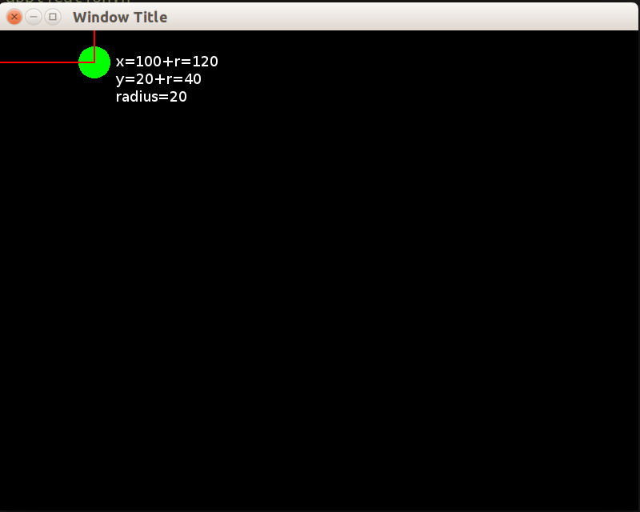

В этой статье в программе будут заложен основной цикл приложения. Пример к статье [доступен на github](https://github.com/ps-group/sfml-packman/tree/master/packman_1). Так он выглядит:


## Новый C++ проект

Для создания проекта в Visual Studio нужно выбрать один из шаблонов, указать имя и путь к директории проекта. Для наших целей подходят шаблоны "Console Application" и "Empty Project". Мы сделаем следующее:

- перейти к файлу, название которого совпадает с именем проекта &mdash; там была размещена функция `main()`
- переименовать этот файл в `main.cpp`, чтобы не путаться в дальнейшем
- добавить включение заголовочного файла ```SFML/Graphics.hpp```

```cpp
#include <SFML/Graphics.hpp>
```

Теперь нарисуем круг с помощью библиотеки SFML. В рамках первого примера можно просто поместить приведённый ниже код в тело функции main().

### Код рисования круга
```cpp
sf::RenderWindow window(sf::VideoMode(800, 600), "Window Title");
sf::CircleShape shape;
shape.setRadius(20);
shape.setFillColor(sf::Color::Green);
shape.setPosition(100, 0);

while (window.isOpen())
{
    sf::Event event;
    while (window.pollEvent(event))
    {
        if (event.type == sf::Event::Closed)
        {
            window.close();
        }
    }
    window.clear();
    window.draw(shape);
    window.display();
}
```

Этот код не будет собран, пока вы не подключите библиотеку SFML к проекту.

## Подключение SFML к проекту

На Windows рекомендуется использовать среду разработки Visual Studio и поставляемый с ней C++ компилятор "MSVC".

- [Статья о подключении SFML к Visual Studio](/sfml/sfml-vs2015.html)
- [F.A.Q. по Visual Studio](/sfml/vs2015-faq.html)

На Mac OS X рекомендуется использовать XCode и поставляемый с ним C++ комплилятор "Clang".

На Linux рекомендуется использовать CLion и системный C++ компилятор "GNU G++".

- [Подключение SFML к CLion (vasplace.blogspot.ru)](http://vasplace.blogspot.ru/2016/03/clion-sfml.html)

### Исследуем код

В листинге мы сделали несколько вещей:

- создали объект класса `sf::RenderWindow`, абстрагирующий работу с окном
- создали и настроили объект класса `sf::CircleShape`, абстрагирующий работу с фигурой &mdash; кругом
- запустили основной цикл игры

[Основной цикл игры (gameprogrammingpatterns.com)](http://gameprogrammingpatterns.com/game-loop.html) &mdash; это шаблон проектирования кода, который применяется практически в каждой игре. Он диктует, как должна выглядеть основная процедура игры (`main` в языках C/C++): сначала происходит инициализация, а затем начинается цикл, выход из которого происходит непосредственно перед закрытием приложения. Общая схема игрового цикла:


Основной цикл пока что очень прост:

 - перед рисованием кадра происходит опрос внешних событий. Если события есть, то метод `window.pollEvent` вернёт булево значение `true` и скопирует информацию о событии в 1-й аргумент.

```cpp
sf::Event event;
while (window.pollEvent(event))
{
    if (event.type == sf::Event::Closed)
    {
        window.close();
    }
}
```

 - игрового состояния в данный момент нет, поэтому обновлять нечего

 - после опроса событий окно очищается (заливается чёрным цветом), затем на нём рисуется фигура, затем очередной кадр отправляется операционной системе, которая отобразит кадр окна на экране

```cpp
window.clear();
window.draw(shape);
// метод display отдаёт кадр операционной системе, а также может ожидать
// сигнала вертикальной синхронизации монитора (vsync).
window.display();
```

Современные операционные системы обычно обновляют экран с частотой 60Гц, и такой же частоты ожидают от приложений. Поэтому на выполнение одной итерации цикла отведено `1.0 / 60.0 = 0.016(6)` секунд, то есть чуть более 16 миллисекунд. Естественно, все современные игры стремятся уложиться в этот интервал независимо от сложности моделируемого игрового мира.

### Система коодинат SFML

Отсчёт координат в SFML, как и в большинстве графических библиотек, начинается с левого верхнего угла.

- мы установили (100,20) как двумерную координату круга
- радиус круга сделали равным 20
- однако, центр круга расположен в точке (120,40), потому что метод `shape.setPosition` изменил положение левого верхнего угла фигуры.



### Разгружаем функцию main

Мы можем сделать функцию main более чистой, если выделим выполняемые ею задачи в отдельные функции. При этом каждая функция должна выполнять ровно одну подзадачу &mdash; это логично, ведь имя функции как раз и должно говорить о задаче, выполняемой этой функцией.

Введём дополнительные функции initPackman (инициализирует круг), render (рисуюет кадр) и handleEvents (обрабатывает нажатие на кнопку закрытия окна):

```cpp
#include <SFML/Graphics.hpp>

void initializePackman(sf::CircleShape & shape)
{
    shape.setRadius(20);
    shape.setFillColor(sf::Color::Green);
    shape.setPosition(100, 0);
}

void handleEvents(sf::RenderWindow & window)
{
    sf::Event event;
    while (window.pollEvent(event))
    {
        if (event.type == sf::Event::Closed)
        {
            window.close();
        }
    }
}

void render(sf::RenderWindow & window, sf::CircleShape & shape)
{
    window.clear();
    window.draw(shape);
    window.display();
}

int main(int, char *[])
{
    sf::RenderWindow window(sf::VideoMode(800, 600), "Window Title");
    sf::CircleShape packman;
    initializePackman(packman);

    while (window.isOpen())
    {
        handleEvents(window);
        render(window, packman);
    }

    return 0;
}
```

### Далее

- [Второй пример](2.html)
- [Руководство по работе с окном (sfml-dev.org)](http://www.sfml-dev.org/tutorials/2.4/window-window.php)
