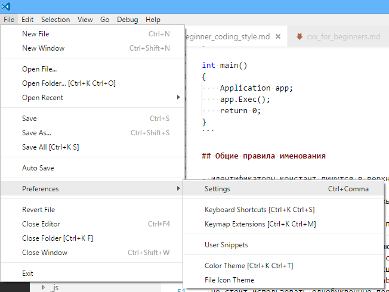

## Именование

Все названия должны быть сформированы из слов на английском языке. Транслит запрещён. Сокращений желательно избегать.

Допускается три формы именования:

- `UPPER_CASE` нотация, в которой все буквы в верхнем регистре, а слова разделяются подчёркиваниями
- `lowerCamelCase` (нижняя верблюжья нотация), в которой каждое слово начинается с большой буквы, кроме первого
- `UpperCamelCase` (верхняя верблюжья нотация), в которой каждое слово начинается с большой буквы

Каждый идентификатор должен быть простым и понятным именем символа (т.е. функции, переменной, структуры). Не используйте сокращений, потому что недостаток опыта помешает вам подобрать хорошие сокращения. Старайтесь не использовать цифры в идентификаторах. Не смешивайте camel case и подчёркивания.

Таблица именования в зависимости от типа идентификатора:

| Категория                        | Стиль          | Структура                                  |
|----------------------------------|----------------|--------------------------------------------|
| Глобальные константы             | UPPER_CASE     | Существительное (иногда с прилагательными) |
| Локальные константы и переменные | lowerCamelCase | Существительное (иногда с прилагательными) |
| Параметры функций                | lowerCamelCase | Существительное (иногда с прилагательными) |
| Функции                          | lowerCamelCase | Глагол (функция - это действие)            |
| Имена типов (структур и т.д.)    | UpperCamelCase | Существительное (иногда с прилагательными) |

Есть парочка исключений:

- идентификаторы математических функций можно писать без глагола в начале: `sin, cos, cartesian, cross, dot`
- если переменная или функция имеет тип bool (булево значение), то её название строится как вопрос на английском языке: `isFacedRight`, `isImageFile`, `doesFollow`.

## Запрещено использовать

### Не используйте глобальные переменные

Можно использовать глобальные константы, нельзя использовать глобальные переменные. Другими словами, изменяемые переменные надо объявлять внутри функций. Чтобы передать значение или переменную в другую функцию, передавайте её как параметр:

```cpp
// передача по изменяемой ссылке
void initTriangle(sf::ConvexShape& triangle)
{
    // устанавливаем число и позиции точек многоугольника 'triangle'
}

int main()
{
    sf::ConvexShape triangle;
    initTriangle(triangle);
}
```

### Не объявляйте переменные заранее без необходимости

Не нужно объявлять переменную в начале функции, если её можно объявить при первом вычислении. Но иногда объявлять заранее всё-таки приходится. В этом случае инициализируйте переменную (например, нулём):

```cpp
int abs(int value)
{
    int result = 0;
    if (value < 0)
    {
        result = -value;
    }
    else
    {
        result = value;
    }
    return result;
}
```

### Не объявляйте несколько переменных в одной строке

Чтобы не получилось такого:


### Не используйте "магические числа"

Не стоит писать в коде числа непонятного назначения, чтобы читающий код не задавался вопросами "почему 4?", "почему 37?", "что будет, если 36 заменить на 50 в этой строке?". Используйте именованные константы:

```cpp
// constexpr вычисляется при компиляции до запуска программы
constexpr float DEFAULT_SPEED = 0.2f;

// const вычисляется при выполнении программы
//  и затем не меняется в пределах функции.
// Для глобальной константы const вычисляется при запуске
//  до запуска функции main.
const sf::Vector2f GRAVITY = { 0, -10 };
```

### Не используйте `#define`

>Подробнее об этом рассказано на stackoverflow: [“static const” vs “#define” vs “enum”](https://stackoverflow.com/questions/1674032/).

Не используйте для объявления констант директивы препроцессора:

```cpp
// !! Дурной код !!
//  1) в C++ использовать макросы не принято
//  2) тип константы не задан, тип литерала - double, а не float
#define GRAVITY 9.8

// Лучше объявлять константы так:
constexpr float GRAVITY = 9.8f;
const sf::Vector2f VELOCITY{2.1f, 3.4f};

// Другой, менее популярный вариант
enum ScreenId
{
    // Первая константа enum равна нулю
    WelcomeScreen,
    // Вторая константа на 1 больше и равна 1
    GameScreen,
    // Третья константа на 1 больше и равна 3
    GameOverScreen,
};
```

## Форматирование

Для автоформатирования удобно использовать ClangFormat. ClangFormat - это утилита командной строки, но вы можете просто использовать плагин "C/C++" в Visual Studio Code. Аналогичные плагины есть для сред CLion и Visual Studio.

> Вы можете использовать готовый файл конфигурации clang-format: [gist.github.com/sergey-shambir/e605fd2b898d0bdae36aeff01f903dc4](https://gist.github.com/sergey-shambir/e605fd2b898d0bdae36aeff01f903dc4). Положите этот файл в корень проекта (файл обязательно должен называться `.clang-format`). Вы также можете заглянуть в [документацию ClangFormat](https://clang.llvm.org/docs/ClangFormat.html)

Убедитесь, что у вас включено автоформатирование при сохранении. Для этого откройте настройки VSCode и убедитесь, что в ваших настройках (справа) включена опция `"editor.formatOnSave": true`


