Следуйте инструкциям. Также выполните задания, указанные в тексте. Если при компиляции у вас возникнут ошибки, внимательно читайте текст ошибок в терминале.

## Простая программа со сборкой через CMake

>CMake — это система сборки. Нам она позволит не печатать каждый раз команды компиляции с нуля, тем более что команды будут становиться всё сложнее и сложнее.

- Создайте каталог `sfml.1` и откройте его в Visual Studio Code.
- Создайте в этом каталоге файл с именем `CMakeLists.txt`
- Скопируйте следующий текст в файл и сохраните в этом файле:

```cmake
# Минимальная версия CMake: 3.8
cmake_minimum_required(VERSION 3.8 FATAL_ERROR)

# Имя проекта: sfml-lab-1
project(sfml-lab-1)

# Подкаталог 00 содержит ещё один CMakeLists.txt
add_subdirectory(00)
```

Теперь создайте в каталоге `sfml.1` каталог `00`, в этом каталоге создайте ещё один файл с именем `CMakeLists.txt`. Сохраните в нём другой текст:

```cmake
# Добавляем исполняемый файл 00
# Он собирается из 1 файла исходного кода: main.cpp
add_executable(00 main.cpp)
```

Затем создайте файл `main.cpp` в каталоге `00` и напишите в нём любую простую программу, например:

```cpp
#include <iostream>

int main()
{
	int a = 0;
	int b = 0;
	std::cout << "enter two numbers:" << std::endl;
	std::cin >> a >> b;
	std::cout << "sum: " << (a + b) << std::endl;
}
```

1. Откройте терминал и введите команду `g++ 00/main.cpp -o 00.exe`. Убедитесь, что компиляция прошла успешно, затем выполните команду `00.exe`.
2. Удалите программу командой `del 00.exe`
3. Затем соберите программу с помощью CMake. Эта операция выполняется в два шага: конфигурирование + сборка.

> Внимание: в обеих командах ниже есть точка ".", она означает "использовать текущий каталог"

```cmake
cmake -G "MinGW Makefiles" .
cmake --build .
```

Вывод первой команды будет примерно таким:

```
D:\Projects\CppDistro\workspace>cmake -G "MinGW Makefiles" .
-- The C compiler identification is GNU 7.2.0
-- The CXX compiler identification is GNU 7.2.0
...
-- Configuring done
-- Generating done
-- Build files have been written to: D:/Projects/CppDistro/workspace
```

Вывод второй команды будет выглядеть так:

```
D:\Projects\CppDistro\workspace>cmake --build .
Scanning dependencies of target 00
[ 50%] Building CXX object 00/CMakeFiles/00.dir/main.cpp.obj
[100%] Linking CXX executable 00.exe
[100%] Built target 00
```

Если сборка была успешной, запустите `00\00.exe`, чтобы проверить, что программа доступна и работоспособна.

>Поздравляем, теперь вы умеете собирать проекты с помощью CMake!

## Закрепим результат с помощью git

Чтобы ваши достижения не потерялись, вам надо использовать систему контроля версий Git. В консоли введите следующие команды

```
git init
git add CMakeLists.txt
git add 00/CMakeLists.txt
git add 00/main.cpp
```

>Ни одна из команд `git add` не должна выводить сообщений. Если где-то было сообщение, значит, у вас возникла ошибка. В этом случае проверьте команду и введите её снова.

Теперь введите команду `git status` и посмотрите на её вывод. Зелёным цветом помечены файлы, добавленные под контроль версий, красным помечены остальные файлы. Если вывод команды у вас совпадает со скриншотом, можно продолжить.

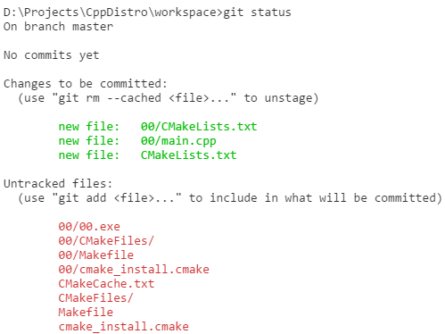

Пришло время зафиксировать свою первую версию! Введите команду `git commit -m "Added A+B program"`. Git зафиксирует версию и выведет краткий отчёт:

```
D:\Projects\CppDistro\workspace>git commit -m "Added A+B program"
[master (root-commit) 340778e] Added A+B program
 3 files changed, 16 insertions(+)
 create mode 100644 00/CMakeLists.txt
 create mode 100644 00/main.cpp
 create mode 100644 CMakeLists.txt
```

Возможно, git откажется выполнять фиксацию и предложит ввести свой email и имя. Ему нужны эти данные, чтобы у каждой версии был указан автор изменений. Вы можете ввести данные двумя командами, заменив `"ваш.email"` и `"ваше.имя"` на ваши email и имя, например `"admin@localhost.ru"` и `"Lavrentiy Pavlovich"`

```
git config --global user.email "ваш.email"
git config --global user.name "ваше.имя"
```

Теперь введите команду `git clean -fd`. О чудо! Все посторонние файлы, кроме исходного кода, теперь исчезли. Команда убрала всё, что не занесено под контроль версий.

## Простая программа с библиотекой SFML

Создать графическую программу немногим сложнее, чем консольную, благодаря SFML. Для начала создайте каталог `01`, и в нём создайте файл `CMakeLists.txt`, сохраните в нём текст:

```
add_executable(01 main.cpp)

set(SFML_STATIC_LIBRARIES TRUE)

find_package(Freetype)
find_package(JPEG)
find_package(SFML 2 COMPONENTS window graphics system)

target_compile_features(01 PUBLIC cxx_std_17)
target_compile_definitions(01 PRIVATE SFML_STATIC)

target_link_libraries(01 ${SFML_LIBRARIES} ${SFML_DEPENDENCIES})
```

Теперь создайте в каталоге `01` файл `main.cpp`, и аккуратно перепишите в него код:

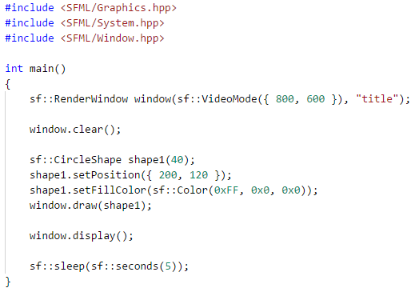

Теперь вернитесь к основному файлу `CMakeLists.txt` и добавьте строку `add_subdirectory(01)`, чтобы он выглядел так:

```cmake
cmake_minimum_required(VERSION 3.8 FATAL_ERROR)

project(cpp-samples)

add_subdirectory(00)
add_subdirectory(01)
```

После этого снова запустите CMake:

```cmake
cmake -G "MinGW Makefiles"
cmake --build .
```

Если сборка была успешной, запустите программу `01\01.exe`. На 5 секунд появится окно, а затем оно исчезнет.

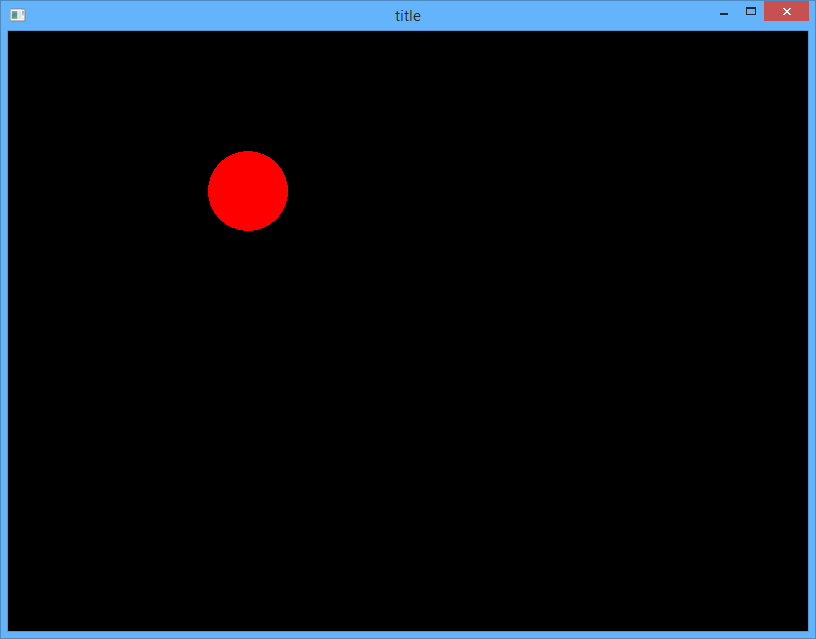

>Окно показывается, пока выполняется инструкция `sf::sleep(sf::seconds(5));`, а затем программа заканчивается и окно скрывается. В будущем мы научимся показывать окно столько, сколько захотим, и закрывать по нажатию на кнопку вверхнем правом углу окна.

Давайте разберём, что выполняет код:

1. Инструкция `sf::RenderWindow window(sf::VideoMode({800, 600}), "title")` объявляет переменную window, которая имеет тип "графическое окно", размеры 800x600 px и незамысловатый заголовок "title".
2. Вызов метода `window.clear()` очищает окно, а вызов `window.display()` выводит на экран то, что было нарисовано после очистки.
	- подробнее о методах `sf::RenderWindow` вы узнаете [в документации SFML (sfml-dev.org)](https://www.sfml-dev.org/documentation/2.4.2/classsf_1_1RenderWindow.php).
3. Инструкция `sf::CircleShape shape1(40)` объявляет переменную shape1 — круг размером 40px.
4. Вызовы `shape1.setPosition` и `shape1.setFillColor` задают позицию круга в пикселях и цвет в виде RGB-компонентов (Red, Green, Blue).
	- подробнее о методах `CircleShape` вы узнаете [на странице документации (sfml-dev.org)](https://www.sfml-dev.org/documentation/2.0/classsf_1_1CircleShape.php)

Теперь добавьте больше фигур:

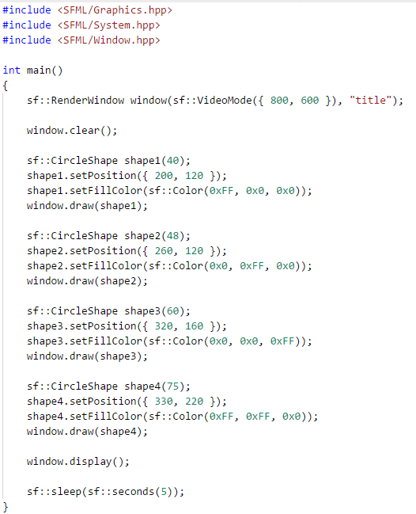

Запустите CMake, а затем программу:

```cmake
cmake --build .
01\01.exe
```

У вас должно получиться что-то такое:

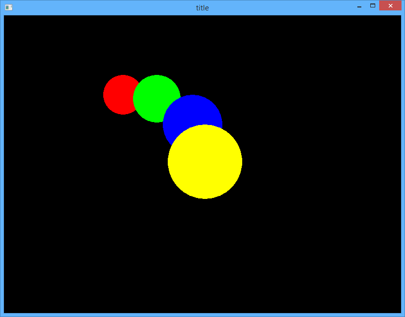

## Освоим прямоугольники (rectangles) и повороты (rotation)

SFML позволяет рисовать разные типы фигур, в том числе прямоугольники. Прямоугольным фигурам соответствует класс [sf::RectangleShape](https://www.sfml-dev.org/documentation/2.0/classsf_1_1RectangleShape.php).

Создайте каталог `02`, и в нём создайте файл `CMakeLists.txt` и сохраните текст:

```cmake
add_executable(02 main.cpp)

set(SFML_STATIC_LIBRARIES TRUE)

find_package(Freetype)
find_package(JPEG)
find_package(SFML 2 COMPONENTS window graphics system)

target_compile_features(02 PUBLIC cxx_std_17)
target_compile_definitions(02 PRIVATE SFML_STATIC)

target_link_libraries(02 ${SFML_LIBRARIES} ${SFML_DEPENDENCIES})
```

Теперь создайте в каталоге `02` файл `main.cpp`, и аккуратно перепишите в него код. Посмотрите на код: определите, где создаются два прямоугольника (*rectangle*) и где устанавливается поворот в градусах (*rotation*).

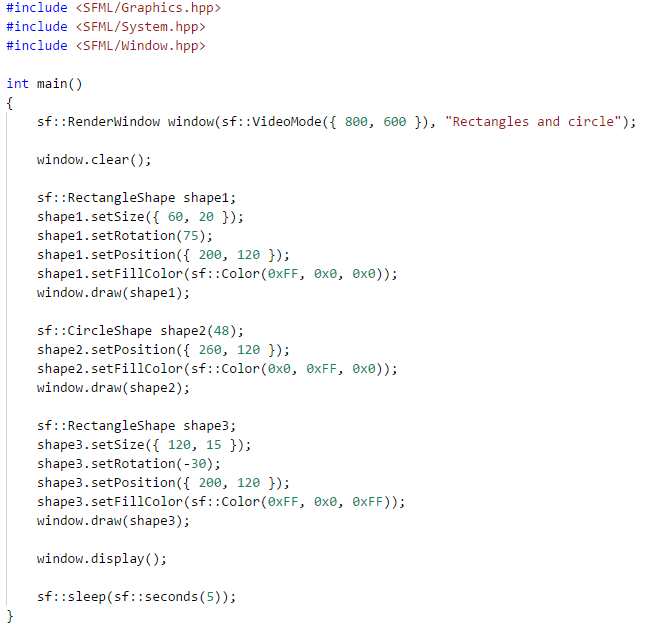

>По умолчанию фигуры поворачиваются относительно своего центра, но вы можете изменить это поведение с помощью метода `setOrigin`, доступного для любой фигуры. Подробнее об этом методе вы узнаете из документации SFML.

Теперь вернитесь к основному файлу `CMakeLists.txt` и добавьте строку `add_subdirectory(02)`, чтобы он выглядел так:

```cmake
cmake_minimum_required(VERSION 3.8 FATAL_ERROR)

project(cpp-samples)

add_subdirectory(00)
add_subdirectory(01)
add_subdirectory(02)
```

Соберите через CMake и запустите `02\02.exe`. Результат будет таким:

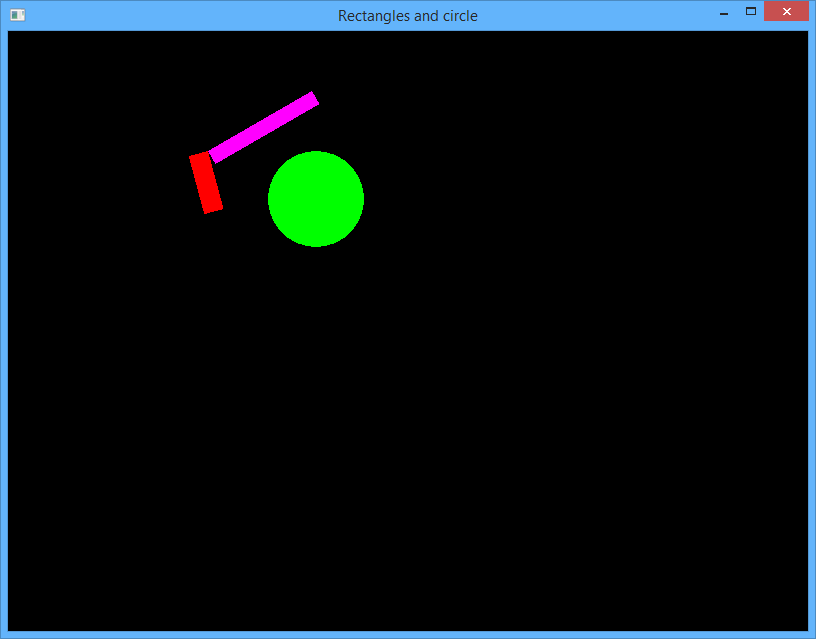

Теперь вам надо зафиксировать успех! В терминале выполните команды:

```
git init
git add CMakeLists.txt
git add 01/CMakeLists.txt
git add 01/main.cpp
git add 02/CMakeLists.txt
git add 02/main.cpp
git status
git commit -m "Added rectangles example"
```

Введите команду `git log`. Она покажет вам журнал изменений; этот журнал показывает все ранее зафиксированные версии. Выйти из просмотра лога можно с помощью горячей клавиши `Q`.

### Задание sfml1.1

Нарисуйте с помощью кругов и прямоугольников светофор такого вида:

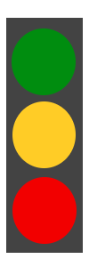

- Перед тем, как написать код, нарисуйте светофор на клетчатой бумаге — так вы сможете измерить координаты, на которых должны располагаться фигуры.
- Светофор должен быть нарисован ровно, без явных искажений.
- Размер окна должен быть немного больше размера светофора (отступ 10-20px)
- Когда вы сделаете задание, зафиксируйте его с помощью git.

### Задание sfml1.2

Нарисуйте фиругами свои инициалы в английской транскрипции.

- Например, если вас зовут "Fadeev Victor Andreevich", напишите фигурами три буквы: `FVA`.
- Перед тем, как написать код, нарисуйте эти буквы на клетчатой бумаге — так вы сможете измерить координаты, на которых должны располагаться буквы, и примерно оценить углы поворота.
- Нарисованные инициалы должны быть читаемые и аккуратные.
- Когда вы сделаете задание, зафиксируйте его с помощью git.

## Освоим выпуклые многоугольники (convex shapes)

SFML позволяет рисовать выпуклые многоугольники — то есть трапеции, треугольники, некоторые пятиугольники и так далее. Таким фигурам соответствует класс [sf::ConvexShape](https://www.sfml-dev.org/documentation/2.4.2/classsf_1_1ConvexShape.php).

Создайте каталог `03`, и в нём создайте файл `CMakeLists.txt`, сохраните текст:

```cmake
add_executable(03 main.cpp)

set(SFML_STATIC_LIBRARIES TRUE)

find_package(Freetype)
find_package(JPEG)
find_package(SFML 2 COMPONENTS window graphics system)

target_compile_features(03 PUBLIC cxx_std_17)
target_compile_definitions(03 PRIVATE SFML_STATIC)

target_link_libraries(03 ${SFML_LIBRARIES} ${SFML_DEPENDENCIES})
```

Теперь создайте в каталоге `03` файл `main.cpp`, и аккуратно перепишите в него код. Посмотрите на код: определите, где создаются два прямоугольника (*rectangle*) и где устанавливается поворот в градусах (*rotation*):

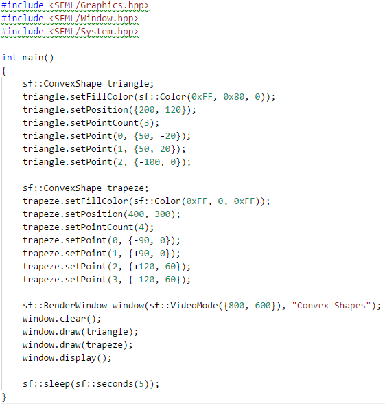

Теперь вернитесь к основному файлу `CMakeLists.txt` и добавьте строку `add_subdirectory(03)`, чтобы он выглядел так:

```cmake
cmake_minimum_required(VERSION 3.8 FATAL_ERROR)

project(cpp-samples)

add_subdirectory(00)
add_subdirectory(01)
add_subdirectory(02)
add_subdirectory(03)
```

Соберите через CMake и запустите `03\03.exe`. Результат будет таким:

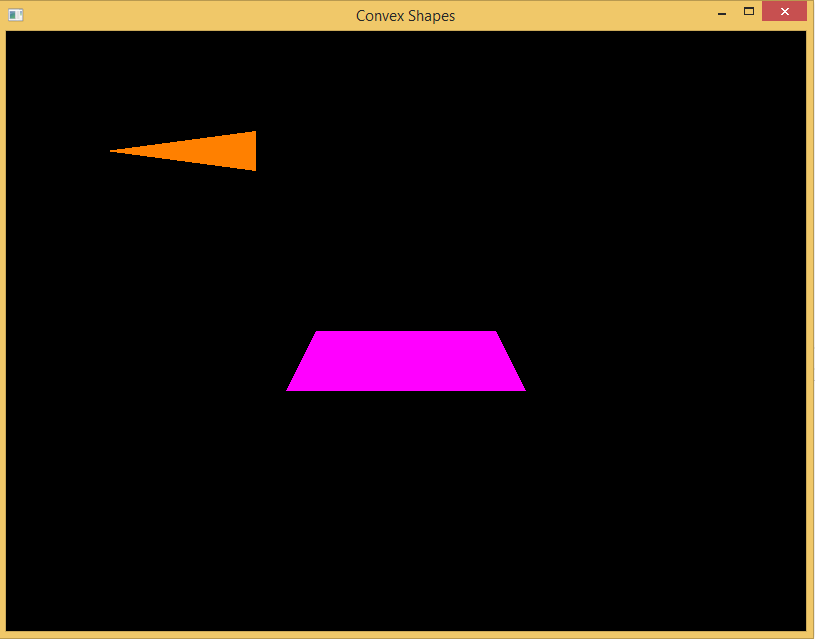

Если всё в порядке, зафиксируйте код с помощью Git (добавьте файлы и сделайте commit).

Введите команду `git log`, проверьте, что коммит присутствует. Выйти из просмотра лога можно с помощью горячей клавиши `Q`.

### Задание sfml1.3

Нарисуйте с помощью ConvexShape, RectangleShape и CircleShape домик такого вида:

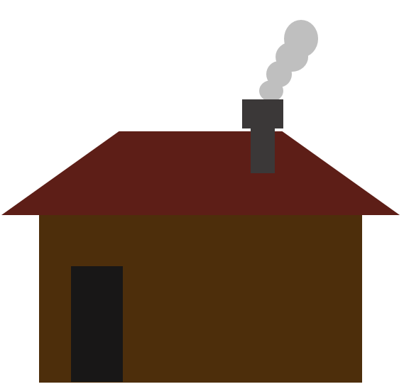

- Перед тем, как написать код, нарисуйте домик на клетчатой бумаге — так вы сможете измерить координаты, на которых должны располагаться фигуры, и определить координаты точек для выпуклых многоугольников.
- Домик должен быть нарисован ровно, без явных искажений.
- Когда вы сделаете задание, зафиксируйте его с помощью git.
