Создайте каталог с названием `sfml.2`. Откройте каталог в Visual Studio Code. Откройте терминал и убедитесь, что вы находитесь в этом каталоге:


Все упражнения и задания вы будете выполнять в подкаталогах каталога `sfml.2`: `sfml.2\00`, `sfml.2\01` и так далее.

Следуйте инструкциям. Также выполните задания, указанные в тексте. Если при компиляции у вас возникнут ошибки, внимательно читайте текст ошибок в терминале.

## Игра Fizz-Buzz

Когда американские дети изучают числа, они играют в игру Fizz-Buzz:

- ведущий считает от 1 до 100
- когда называют число, кратное трём, дети должны сказать "Fizz"
- если названо число, кратное 5, дети должны сказать "Buzz"
- если число кратно и 3, и 5, надо сказать "FizzBuzz"
- иначе надо назвать число

Давайте напишем программу, которая играет в FizzBuzz сама с собой!

Создайте в каталоге `sfml.2` файл `CMakeLists.txt`, перепишите в него текст:

```cmake
# Минимальная версия CMake: 3.8
cmake_minimum_required(VERSION 3.8 FATAL_ERROR)

# Имя проекта: sfml-lab-2
project(sfml-lab-2)

# Подкаталог 00 содержит ещё один CMakeLists.txt
add_subdirectory(00)
```

Создайте подкаталог `00` в каталоге `sfml.2`. В подкаталоге создайте ещё один файл `CMakeLists.txt`, и скопируйте в него текст:

```cmake
# Добавляем исполняемый файл 00
# Он собирается из 1 файла исходного кода: main.cpp
add_executable(00 main.cpp)

# включаем режим C++17 для цели сборки 00
target_compile_features(00 PUBLIC cxx_std_17)
```

Сейчас каталог должен выглядеть так:


Затем создайте файл `main.cpp` и опишите в нём псевдокод:

```cpp
#include <iostream>

int main()
{
    // в цикле от 1 до 100
    //  - если число кратно и 3, и 5, вывести FizzBuzz
    //  - иначе если число кратно 3, вывести Fizz
    //  - иначе если число кратно 5, вывести Buzz
    //  - иначе вывести число
}
```

### Цикл while

Теперь мы будем раскрывать псевдокод шаг за шагом. Снала разберёмся с циклами, которые в C++ представлены ключевыми словами `while` и `for`. Синтаксис:

```cpp
// цикл, пока выполняется условие
// тело - это одна инструкция или блок
while (условие) инструкция;

// цикл с блоком инструкций
while (условие)
{
    инструкция_1;
    инструкция_2;
}

// цикл выводит числа от 1 до 100
int num = 1;
// условие: пока num меньше или равно 100
while (num <= 100)
{
    std::cout << num << std::endl;
    // добавляем к числу 1
    // оператор += это сокращение от `num = num + 1`
    num += 1;
}
```

Последний цикл перепишите в main вместо комментария "в цикле от 1 до 100", а остальные комментарии пока поместите в тело цикла:


Соберите программу с помощью следующих команд:

```cpp
cmake -G "MinGW Makefiles"
cmake --build .
```

Если сборка прошла успешно и ошибок не было, запустите программу. Она должна просто вывести числа от 1 до 100 включительно.

### Цикл for

Цикл for имеет две формы: классическая и range-based. Мы рассмотрим классическую:

```cpp
for (начальное_действие; условие; действие_в_конце_итерации)
    инструкция_или_блок

// начальное действие: объявить переменную num, равную 1
// условие: пока num меньше или равно 100
// после каждого шага (итерации) цикла добавляем к num единицу
for (int num = 1; num <= 100; num += 1)
{
    // выводим num
    std::cout << num << std::endl;
}
```

Вернитесь к `main.cpp` и замените цикл while на цикл for:


Соберите программу командой `cmake --build .` (не забудьте про точку в конце команды). Если программа собралась успешно и ошибок не было, запустите программу командой `00\00`. Она должна снова вывести числа от 1 до 100 включительно.

### Деление с остатком и инструкция if

Чтобы определить делимость, мы воспользуемся делением с остатком. Эта одна из 5 арифметических операций в C++:

- `16 + 3 == 19`, `16 - 3 == 13` — сложение и вычитание чисел
- `16 * 3 = 48`, `16 / 3 = 5` — умножение и деление чисел (при делении целых чисел остаток отбрасывается)
- `16 % 3 == 1` — получение остатка от деления, также называют "взять модуль числа 16 по числу 3"

Для условного выполнения печати мы применим инструкцию if/else. Её синтаксис:

```cpp
if (условие)
    инструкция_или_блок
else
    инструкция_или_блок

// пример: если число меньше 10, печатаем его
if (num < 10)
{
    std::cout << num << std::endl;
}
```

Цепочку инструкций else мы объединим, записывая `.. else if ..` в одной строке. В первом варианте код будет выглядеть так:

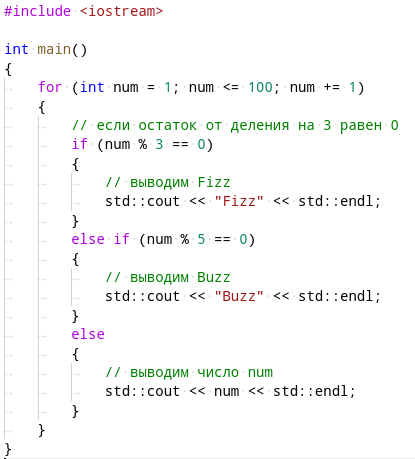

Перепишите код в "main.cpp", затем соберите командой `cmake --build .` (не забывайте точку в конце), и запустите программу "00\00". Обратите внимание на вывод районе чисел 12..17:

```
Fizz
13
14
Fizz
16
17
```

К сожалению, вывод программы неправилен: для числа 15 надо вывести "FizzBuzz", а выведено "Fizz". Мы исправим это дополнительным условием: если число кратно и 3, и 5, то выведем "FizzBuzz". Воспользуемся логическими операциями в C++:

- `a || b` — логическое ИЛИ, истинно если хотя бы одно из двух условий "a" и "b" истинно
- `a && b` — логическое И, истинно только если оба условия "a" и "b" истинны

>Есть другой способ: число, которое делится на 3 и на 5, делится на 15, и наоборот. Но мы будем использовать операцию "логическое И" в целях тренировки.

Доработайте код следующим образом:

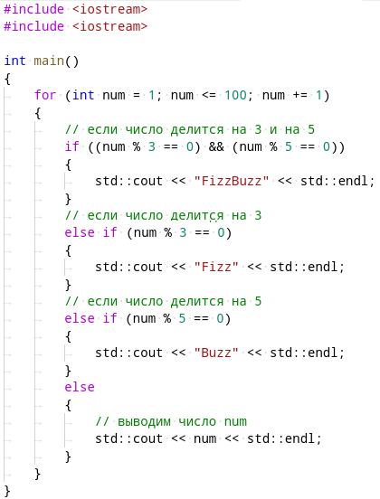

Перепишите код в "main.cpp", затем соберите командой `cmake --build .` (не забывайте точку в конце), и запустите программу "00\00". Теперь программа должна работать правильно для всех чисел 1..100.

### Инстукция switch

Хотя мы уже написали программу FizzBuzz, нам ещё есть что изучить: воспользуемся инструкцией switch (*рус.* "переключатель") вместо if. У неё любопытный синтаксис:

```cpp
switch (вычислимое_значение)
{
case константа_1:
    список_инструкций
case константа_2:
    список_инструкций
case константа_3:
    список_инструкций
...
default:
    список_инструкций
}

// ветка case выполняется, если значение совпадает с заданной константой
// ветка default выполяется, если значение не совпадает ни с одной константой
// после завершения ветки выполнение продолжается сквозь следующую ветку!

// неправильны пример: если число чётное, выводим его и пишем "odd!", иначе пишем "odd!"
switch (num % 2)
{
case 0:
    // чётное
    std::cout << num << std::endl;
    // выполнение продолжается, хотя (num % 2) != 1
    // такова особенность switch/case
case 1:
    // нечётное
    std::cout << "odd!" << std::endl;
}

// пример: если число чётное, выводим его, иначе выводим "odd!"
switch (num % 2)
{
case 0:
    // чётное
    std::cout << num << std::endl;
    // если не будет break, выполнение продолжится сквозь "case 1:"
    break;
case 1:
    // нечётное
    std::cout << "odd!" << std::endl;
    // ставим break в конце для безопасности:
    break;
}
```

Всегда будьте аккуратны со switch: если вы не ставите break в конце списка инструкций case, то выполнение продолжится далее, хотя условие case уже не соблюдается. Это источник огромного числа ошибок, хотя иногда программист действительно хотел продолжить выполнение насквозь.

Мы перепишем FizzBuzz, чтобы использовать switch для выбора поведения по остатку от деления на 15. Число 15 — это наименьшее общее кратное 3 и 5, и по остатку от деления на 15 можно судить о делимости на 3 и 5.

```cpp
#include <iostream>

int main()
{
    for (int num = 1; num <= 100; num += 1)
    {
        switch (num % 15)
        {
        case 0:
            std::cout << "FizzBuzz" << std::endl;
            break;
        case 5:
        case 10:
            std::cout << "Buzz" << std::endl;
            break;
        case 3:
        case 6:
        case 9:
        case 12:
            std::cout << "Fizz" << std::endl;
            break;
        default:
            // выводим само число
            std::cout << num << std::endl;
        }
    }
}
```

## Цикл рисования и обработки событий

В любой операционной системе оконные приложения рисуют содержимое окон непрерывно и циклически. В каждую секунду в системе проиходит множество событий:

- мониторы обновляются с частотой ~60 Герц (60 кадров в секунду)
- контроллер мыши присылает уведомления об изменении положения мыши
- контроллер клавиатуры присылает состояние клавиш
- каждая программа старается получить процессорное время, чтобы выполнить свои задачи

В таких условиях операционной системе (ОС) приходится ловко манипулировать множеством событий и потоков данных. Например, 60 раз в секунду система собирает изображения всех окон, рисует их поверх друг друга в одну картинку рабочего стола и выводит на экран.

Чтобы ОС могла выполнить свою задачу, программа должна ей помогать: вести общение с системой в режиме интерактивного диалога, реагируя на переданные окну события ввода и рисуя новые кадры со скоростью ~60 кадров в секунду.

С точки зрения программиста надо написать приложение так, чтобы в нём был цикл, в котором выполняются два действия:

1. обработка событий
2. рисование нового кадра

Поскольку за один кадр может прийти несколько событий, цикла будет два: один внутри другого. Вся эта схема называется циклом событий (event loop).

## Создаём приложение с event loop

Откройте файл `sfml.2\CMakeLists.txt`, добавьте строку `add_subdirectory(01)`, чтобы он выглядел так:

```cmake
# Минимальная версия CMake: 3.8
cmake_minimum_required(VERSION 3.8 FATAL_ERROR)

# Имя проекта: sfml-lab-2
project(sfml-lab-2)

# Каждый подкаталог содержит CMakeLists.txt
add_subdirectory(00)
add_subdirectory(01)
```

Создайте в каталоге `sfml.2` подкаталог `01`, и создайте в нём файлы `01\CMakeLists.txt`, `01\main.cpp`.

Перепишите в файл `sfml1.2\01\CMakeLists.txt` следующий скрипт:

```cmake
add_executable(01 main.cpp)

set(SFML_STATIC_LIBRARIES TRUE)

find_package(Freetype REQUIRED)
find_package(JPEG REQUIRED)
find_package(SFML 2 COMPONENTS window graphics system REQUIRED)

target_include_directories(01 PRIVATE ${SFML_INCLUDE_DIR})
target_compile_features(01 PUBLIC cxx_std_17)
target_compile_definitions(01 PRIVATE SFML_STATIC)

target_link_libraries(01 ${SFML_LIBRARIES} ${SFML_DEPENDENCIES})
```

Теперь перепишите код в файл `sfml1.2\01\main.cpp`:

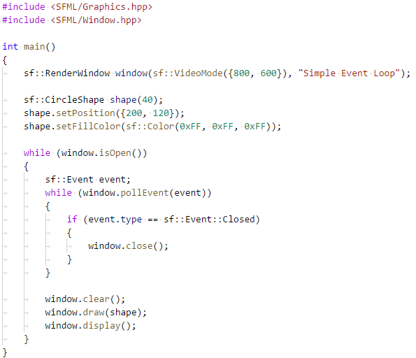

Соберите проект через CMake и запустите `01\01.exe`. Посмотрите на результат. Попробуйте сделать скриншот окна. Закройте окно, нажав на кнопку "закрыть" (крест в углу окна).

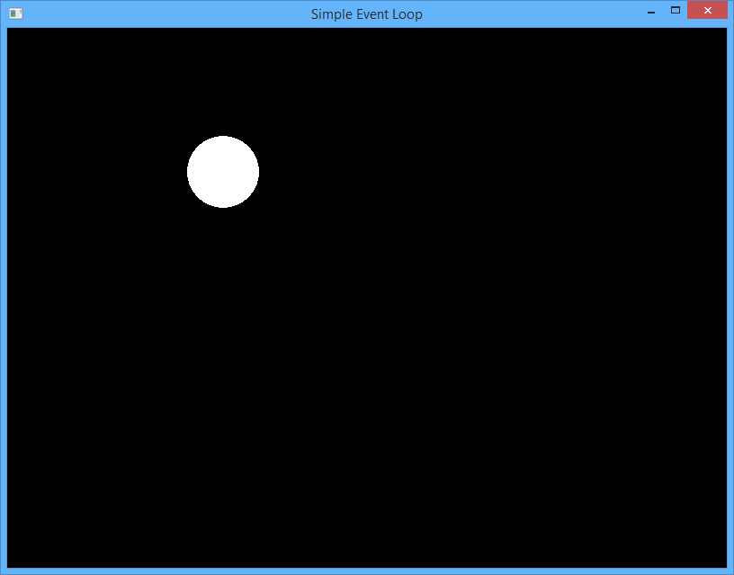

## Добавляем движение

Цикл событий выполняется постоянно, и непрерывно отправляет операционной системе новые кадры — это происходит при вызове `window.display()`. Для начала мы попробуем на каждом шаге цикла прибавлять значение к координате x позиции круга. Добавьте этот код перед вызовом `window.clear()`:

```cpp
sf::Vector2f position = shape.getPosition();
position.x += 0.5;
shape.setPosition(position);
```

Соберите программу через CMake и запустите её. Вы увидите, что шар быстро улетает в строну, причём на разных машинах он может лететь с разной скоростью.

Почему так происходит? Потому мы не учли промежутки времени: прибавлять на каждом кадре 0.5px нельзя, если мы не знаем число кадром или если оно может меняться.

Чтобы получить изменение местоположения численным методом, мы должны умножить текущую скорость на длину интервала времени. Чтобы это осознать, представьте себе разгоняющийся автомобиль, который вы фотографируете каждые 0.3 секунды. Если совместить фотографии, автомобиль будет выглядеть примерно так:


Если в программе мы будем каждые 0.3 секунды прибавлять текущую скорость, умноженную на время, мы получим правильное перемещение с предсказуемой скоростью!

Для замера времени воспользуемся классом [sf::Clock](https://www.sfml-dev.org/documentation/2.4.2/classsf_1_1Clock.php). Он имеет метод `restart()`, который перезапускает часы и возвращает прошедшее с предыдущего перезапуска число секунд, хранимое в типе данных `sf::Time`. Получить число секунд в виде `float` можно вызовом метода `asSeconds()`. Доработайте код:

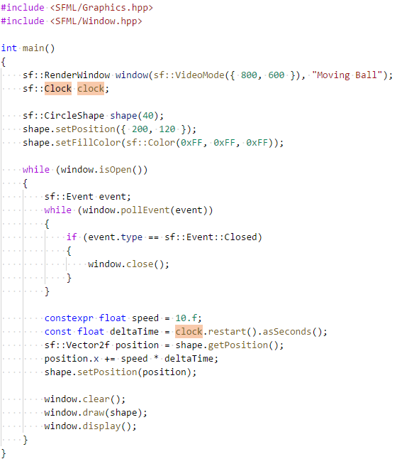

Соберите и запустите программу. Двигается ли шарик плавно? Совпадает ли на ваш взгляд его скорость с заданной скоростью?

## Воспользуемся векторной алгеброй

Библиотека SFML предоставляет готовые средства для работы с векторами вместо обычных значений. В частности, класс [sf::Vector2f](https://www.sfml-dev.org/documentation/2.4.2/classsf_1_1Vector2.php) поддерживает привычные арифметические операции сложения, умножения, деления и вычитания - как с другими векторами, так и с целыми числами. Мы воспользуемся этим и будем представлять скорость не в виде числа, а в виде вектора. Перепишите код:

```cpp
#include <SFML/Graphics.hpp>
#include <SFML/Window.hpp>

int main()
{
    sf::RenderWindow window(sf::VideoMode({ 800, 600 }), "Moving Ball");
    sf::Clock clock;

    sf::CircleShape shape(40);
    shape.setPosition({ 200, 120 });
    shape.setFillColor(sf::Color(0xFF, 0xFF, 0xFF));

    while (window.isOpen())
    {
        sf::Event event;
        while (window.pollEvent(event))
        {
            if (event.type == sf::Event::Closed)
            {
                window.close();
            }
        }

        const sf::Vector2f speed = { 50.f, 15.f };
        const float deltaTime = clock.restart().asSeconds();
        sf::Vector2f position = shape.getPosition();
        position += speed * deltaTime;
        shape.setPosition(position);

        window.clear();
        window.draw(shape);
        window.display();
    }
}
```

Соберите приложение и запустите, оно должно работать так же (только скорость теперь будет векторной величиной).

## Добавляем отталкивание от стенок

Добавлять отталкивание мы будем в полном сооствествии с подходом "Игровой Цикл" (Game Loop). Он расширяет понятие цикла событий, и схематически выглядит так:


Чтобы шаг отталкивался от стенок, мы добавим серию проверок через if:

```cpp
#include <SFML/Graphics.hpp>
#include <SFML/System.hpp>
#include <SFML/Window.hpp>

int main()
{
    constexpr unsigned WINDOW_WIDTH = 800;
    constexpr unsigned WINDOW_HEIGHT = 600;
    constexpr float BALL_SIZE = 40;

    sf::RenderWindow window(sf::VideoMode({ WINDOW_WIDTH, WINDOW_HEIGHT }), "Bouncing Ball");
    sf::Clock clock;

    sf::CircleShape shape(BALL_SIZE);
    shape.setPosition({ 200, 120 });
    shape.setFillColor(sf::Color(0xFF, 0xFF, 0xFF));

    sf::Vector2f speed = { 100.f, 100.f };

    while (window.isOpen())
    {
        // Обработка событий
        sf::Event event;
        while (window.pollEvent(event))
        {
            if (event.type == sf::Event::Closed)
            {
                window.close();
            }
        }

        // Обновление состояния
        const float dt = clock.restart().asSeconds();

        sf::Vector2f position = shape.getPosition();
        position += speed * dt;

        if ((position.x + 2 * BALL_SIZE >= WINDOW_WIDTH) && (speed.x > 0))
        {
            speed.x = -speed.x;
        }
        if ((position.x < 0) && (speed.x < 0))
        {
            speed.x = -speed.x;
        }
        if ((position.y + 2 * BALL_SIZE >= WINDOW_HEIGHT) && (speed.y > 0))
        {
            speed.y = -speed.y;
        }
        if ((position.y < 0) && (speed.y < 0))
        {
            speed.y = -speed.y;
        }

        shape.setPosition(position);

        // Рисование текущего состояния
        window.clear();
        window.draw(shape);
        window.display();
    }
}
```

## Волновое движение

Создайте в каталоге `sfml.2` подкаталог `02`, в нём создайте `CMakeLists.txt` аналогично предыдущим упражениям. Создайте в каталоге `02` файл `main.cpp`, далее мы будем работать в нём.

Мы нарисуем шар, движущийся по плавной траектории. Для этого воспользуемся тригонометрическими функциями: легко заметить, что их графики плавные, и движение по такой траектории будет приятно глазу:

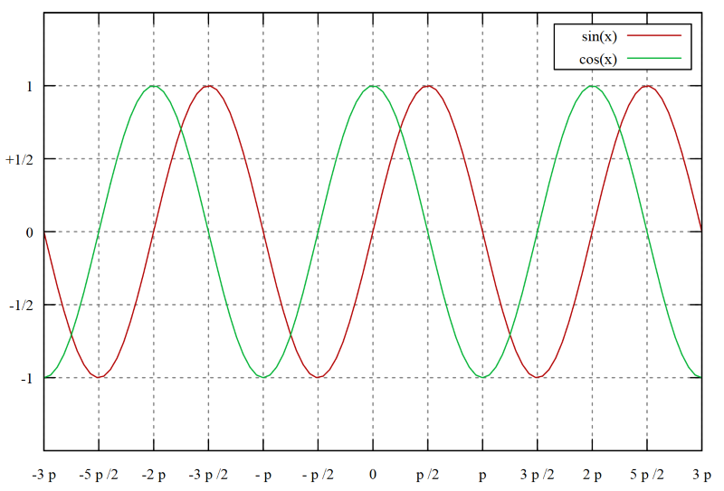

В C++ тригонометрические функции доступны в заголовке [cmath](http://en.cppreference.com/w/cpp/header/cmath) под именами `std::sin` и `std::cos`. Перепишите следующий код:

```cpp
#include <SFML/Graphics.hpp>
#include <SFML/System.hpp>
#include <SFML/Window.hpp>
#include <cmath>

constexpr unsigned WINDOW_WIDTH = 800;
constexpr unsigned WINDOW_HEIGHT = 600;

int main()
{
    constexpr float BALL_SIZE = 40;

    sf::RenderWindow window(sf::VideoMode({ WINDOW_WIDTH, WINDOW_HEIGHT }), "Wave Moving Ball");
    sf::Clock clock;

    const sf::Vector2f position1 = { 10, 250 };
    const sf::Vector2f position2 = { 10, 350 };

    sf::CircleShape ball(BALL_SIZE);
    ball.setFillColor(sf::Color(0xFF, 0xFF, 0xFF));

    while (window.isOpen())
    {
        sf::Event event;
        while (window.pollEvent(event))
        {
            if (event.type == sf::Event::Closed)
            {
                window.close();
            }
        }

        constexpr float speedX = 100.f;
        constexpr float amplitudeY = 80.f;
        constexpr float periodY = 2;

        const float time = clock.getElapsedTime().asSeconds();
        const float x = speedX * time;
        const float wavePhase = time * float(2 * M_PI);
        const float y = amplitudeY * std::sin(wavePhase / periodY);
        const sf::Vector2f offset = { x, y };

        ball.setPosition(position1 + offset);

        window.clear();
        window.draw(ball);
        window.display();
    }
}
```

## Задание sfml2.1: волновое движение с отталкиванием

1. Создайте в каталоге `sfml.2` подкаталог `sfml2.1`, в нём создайте `CMakeLists.txt` аналогично предыдущим упражениям
2. Создайте в каталоге `sfml2.1` файл `main.cpp` и в нём совместите волновое движение шарика с отталкиванием от стенок.

## Рисуем окружность через ConvexShape

Создайте в каталоге `sfml.2` подкаталог `03`, в нём создайте `CMakeLists.txt` аналогично предыдущим упражениям. Создайте в каталоге `03` файл `main.cpp`, далее мы будем работать в нём.

SFML имеет встроенную поддержку кругов. Но ConvexShape - более гибкий механизм, и он позволяет сделать то же самое. Для того чтобы этим воспользоваться, мы применим декартовы и полярные координаты. В этом нам снова помогут тригонометрические функции, поскольку полярные и декартовы координаты напрямую связаны с их определениями:


Опираясь на эту иллюстрацию, можем вывести способ перевода полярных координат в декартовы:

```cpp
// полярные координаты
float angle = ...;
float radius = ...;
// получаем декартовы координаты
sf::Vector2f point = {
    radius * std::sin(angle),
    radius * std::cos(angle)
};
```

Применим этот метод в коде, чтобы заполнить ConvexShape двадцатью точками, расположенными на окружности:

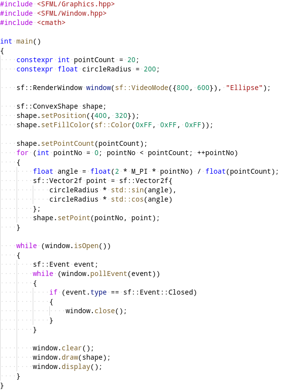

Соберите и запустите этот пример. Убедьтесь, что программа рисует круг:

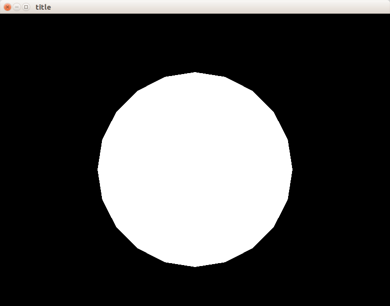

> Этот круг получися грубым, неровные границы видны неворужённым взглядом. Попробуйте повысить визуальное качество этого круга, изменив константные значения в программе.

## Рисуем эллипс

Теперь мы сделаем то, для чего SFML нет готового решения: нарисуем эллипс. Это сделать несложно, достаточно заменить постоянный радиус на вектор, хранящий радиусы по осям Ox и Oy: `const sf::Vector2f ellipseRadius = { 200.f, 80.f };`

Применим этот радиус к вычисляемым коодинатам `(x, y)`:

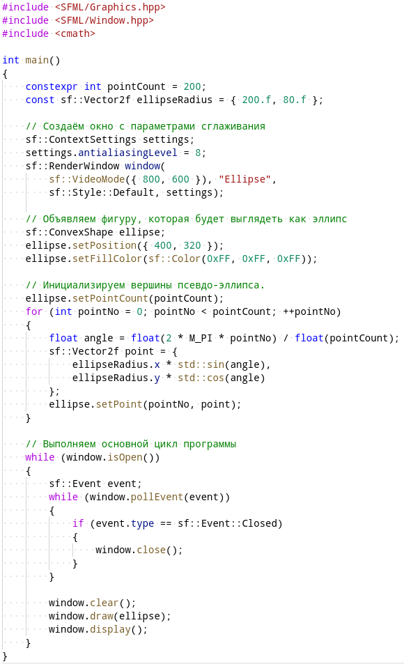

Соберите и запустите этот пример. Убедьтесь, что программа рисует эллипс:

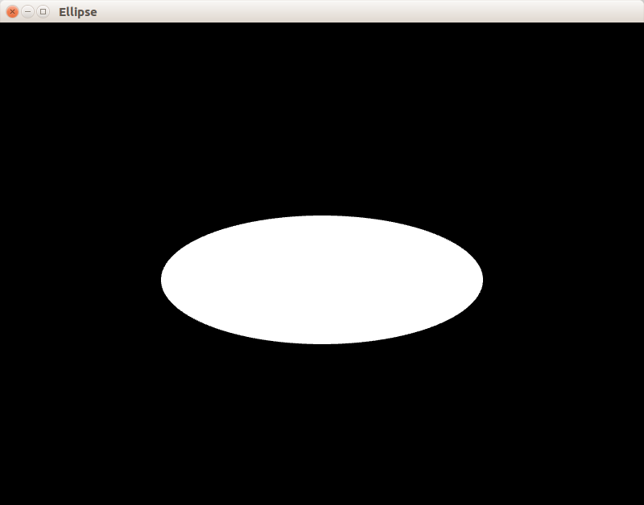

## Задание sfml2.2: полярная роза

1. Создайте в каталоге `sfml.2` подкаталог `sfml2.1`, в нём создайте `CMakeLists.txt` аналогично предыдущим упражениям
2. Создайте в каталоге `sfml2.1` файл `main.cpp` и в него скопируйте код, рисующий эллипс.
3. Доработайте этот пример, чтобы для вычисления радиуса использовалась функция от угла: `200 * sin(6 * angle)`
4. Доработайте пример, чтобы полярная роза двигалась по окружности в пределах окна.

Полярная роза должна выглядеть так (вы можете поменять цвет на свой вкус, рекомендуется использовать для этого [online color picker](http://getcolor.ru/0102E9)):

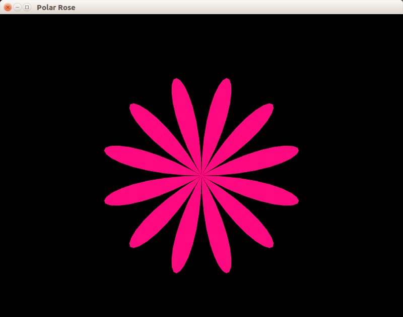
