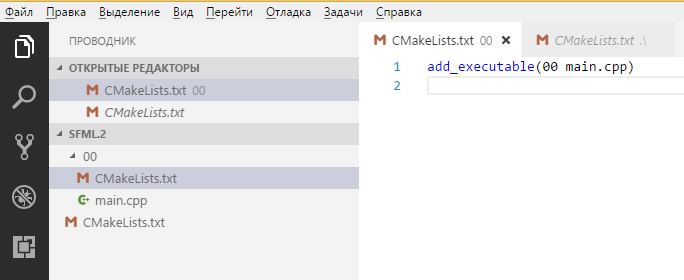
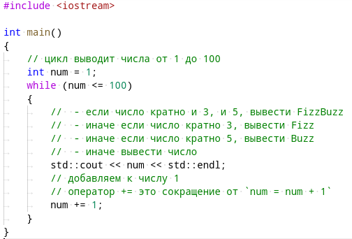
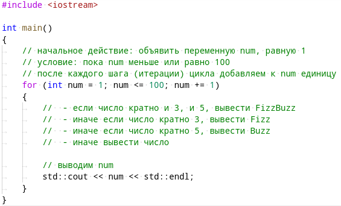

Создайте каталог с названием `sfml.2`. Откройте каталог в Visual Studio Code. Откройте терминал и убедитесь, что вы находитесь в этом каталоге:


Все упражнения и задания вы будете выполнять в подкаталогах каталога `sfml.2`: `sfml.2\00`, `sfml.2\01` и так далее.

## Игра Fizz-Buzz и цикл while

Когда американские дети изучают числа, они играют в игру Fizz-Buzz:

- ведущий считает от 1 до 100
- когда называют число, кратное трём, дети должны сказать "Fizz"
- если названо число, кратное 5, дети должны сказать "Buzz"
- если число кратно и 3, и 5, надо сказать "FizzBuzz"
- иначе надо назвать число

Давайте напишем программу, которая играет в FizzBuzz сама с собой!

Создайте в каталоге `sfml.2` файл `CMakeLists.txt`, перепишите в него текст:

```cmake
# Минимальная версия CMake: 3.8
cmake_minimum_required(VERSION 3.8 FATAL_ERROR)

# Имя проекта: sfml-lab-2
project(sfml-lab-2)

# Подкаталог 00 содержит ещё один CMakeLists.txt
add_subdirectory(00)
```

Создайте подкаталог `00` в каталоге `sfml.2`. В подкаталоге создайте ещё один файл `CMakeLists.txt`, и скопируйте в него текст:

```cmake
# Добавляем исполняемый файл 00
# Он собирается из 1 файла исходного кода: main.cpp
add_executable(00 main.cpp)
```

Сейчас каталог должен выглядеть так:



Затем создайте файл `main.cpp` и опишите в нём псевдокод:

```cpp
#include <iostream>

int main()
{
	// в цикле от 1 до 100
	//  - если число кратно и 3, и 5, вывести FizzBuzz
	//  - иначе если число кратно 3, вывести Fizz
	//  - иначе если число кратно 5, вывести Buzz
	//  - иначе вывести число
}
```

Теперь мы будем раскрывать псевдокод шаг за шагом. Снала разберёмся с циклами, которые в C++ представлены ключевыми словами `while` и `for`. Синтаксис:

```cpp
// цикл, пока выполняется условие
// тело - это одна инструкция или блок
while (условие) инструкция;

// цикл с блоком инструкций
while (условие)
{
	инструкция_1;
	инструкция_2;
}

// цикл выводит числа от 1 до 100
int num = 1;
// условие: пока num меньше или равно 100
while (num <= 100)
{
	std::cout << num << std::endl;
	// добавляем к числу 1
	// оператор += это сокращение от `num = num + 1`
	num += 1;
}
```

Последний цикл перепишите в main вместо комментария "в цикле от 1 до 100", а остальные комментарии пока поместите в тело цикла:



Соберите программу с помощью следующих команд:

```cpp
cmake -G "MinGW Makefiles"
cmake --build .
```

Если сборка прошла успешно и ошибок не было, запустите программу. Она должна просто вывести числа от 1 до 100 включительно.

## Цикл for

Цикл for имеет две формы: классическая и range-based. Мы рассмотрим классическую:

```cpp
for (начальное_действие; условие; действие_в_конце_итерации)
    инструкция_или_блок

// начальное действие: объявить переменную num, равную 1
// условие: пока num меньше или равно 100
// после каждого шага (итерации) цикла добавляем к num единицу
for (int num = 1; num <= 100; num += 1)
{
	// выводим num
	std::cout << num << std::endl;
}
```

Вернитесь к `main.cpp` и замените цикл while на цикл for:



Соберите программу командой `cmake --build .` (не забудьте про точку в конце команды). Если программа собралась успешно и ошибок не было, запустите программу командой `00\00`. Она должна снова вывести числа от 1 до 100 включительно.

## Деление с остатком и инструкция if

## Цикл рисования и обработки событий

В любой операционной системе оконные приложения рисуют содержимое окон непрерывно и циклически. В каждую секунду в системе проиходит множество событий:

- мониторы обновляются с частотой ~60 Герц (60 кадров в секунду)
- контроллер мыши присылает уведомления об изменении положения мыши
- контроллер клавиатуры присылает состояние клавиш
- каждая программа старается получить процессорное время, чтобы выполнить свои задачи

В таких условиях операционной системе приходится ловко манипулировать множеством событий и потоков данных. Например, 60 раз в секунду система собирает изображения всех окон, рисует их поверх друг друга в одну картинку рабочего стола и выводит на экран.

