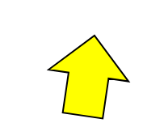
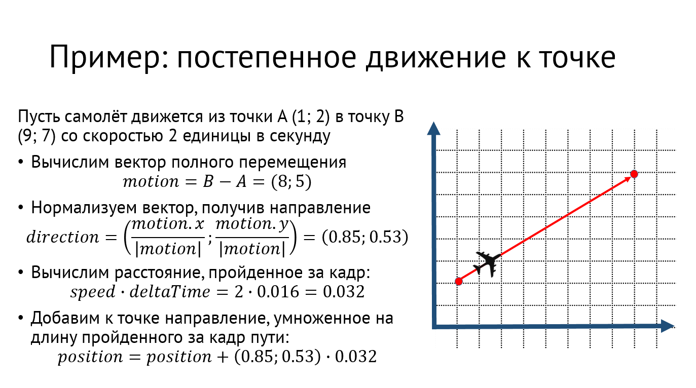
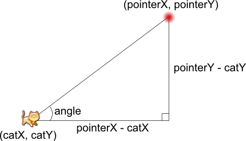

Выполнять задания надо в парах. Это также называется парным программированием.

Не все программисты умеют правильно заниматься парным программированием. О том, как это делать неправильно, расскажет ролик от Atlassian:

<iframe width="560" height="315" src="https://www.youtube.com/embed/dYBjVTMUQY0" frameborder="0" allowfullscreen></iframe>

Мы будем выполнять парное программирование иначе:

1. Сначала вы подготавливаете решение:
	- Если задача требует моделирования, вы вдвоём составляете модель и рисуете её в свободной форме (если опыта мало, лучше рисовать на листочке и выписывать все формулы там же)
	- Если же стоит цель разобраться с возможностями библиотеки, вы изучаете документацию и примеры в документации
2. Затем вы составляете псевдокод готовой программы
3. Наконец, вы кодируете решение

## Задание workshop1.1

Нарисуйте стрелку такую же, какая показана на скриншоте ниже. В этом вам помогут методы [Shape::setOutlineColor](https://www.sfml-dev.org/documentation/2.0/classsf_1_1Shape.php#a5978f41ee349ac3c52942996dcb184f7) и [sf::Shape::setOutlineThickness](https://www.sfml-dev.org/documentation/2.0/classsf_1_1Shape.php#a5ad336ad74fc1f567fce3b7e44cf87dc), изучите их документацию.

Затем закрасьте фон окна белым цветом. Используйте для этого необязательный параметр метода [RenderWindow::clear](https://www.sfml-dev.org/documentation/2.4.2/classsf_1_1RenderTarget.php#a6bb6f0ba348f2b1e2f46114aeaf60f26)

## Задание workshop1.2

Заставьте стрелку двигаться к текущей позиции курсора мыши, поворачиваясь в сторону курсора. Скорость движения стрелки должна быть ограничена величиной 20 пикселей в секунду, скорость поворота стрелки ограничена величиной 90° в секунду.

Вы должны делать задачу последовательно:

1. Зарисовать на листочке полную модель решения вместе с формулами
2. Написать псевдокод на уровне "функции с комментариями вместо инструкций" и сохранить псевдокод в отдельном файле
3. Затем выполнить кодирование, то есть реализовать тела всех функций

Изучить поведение можете с помощью [Интерактивного пример на Javascript](http://users.polytech.unice.fr/~strombon/camash/Foundation%20HTML5%20Animation%20with%20JavaScript/html5-animation-source-code/examples/ch05/04-follow-mouse-1.html)

Справиться с задачей вам поможет слайд из лекции:

## Задание workshop1.3

С помощью руководства [Sprites and textures](https://www.sfml-dev.org/tutorials/2.4/graphics-sprite.php), а также документации [класса sf::Sprite](https://www.sfml-dev.org/documentation/2.4.2/classsf_1_1Sprite.php) нарисуйте на белом фоне кота. Используйте спрайт, представленный ниже.

## Задание workshop1.4

Требуется разработать программу, в которой кот будет двигаться к лазерной указке, поворачиваясь зеркально строго влево или вправо (т.е. 0° либо 180°) в направлении указки. Отразить кота зеркально можно с помощью метода [Sprite::setScale](https://www.sfml-dev.org/documentation/2.0/classsf_1_1Transformable.php#a4c48a87f1626047e448f9c1a68ff167e), передав параметры `(-1, 1)` в качестве нового масштаба спрайта; вернуть обратно можно с помощью параметров `(1, 1)`. Позиция лазерной указки выбирается пользователем путём клика мышью.

Спрайт точки попадания лазерной указки:

Вы должны делать задачу последовательно:

1. Зарисовать на листочке полную модель решения вместе с формулами
2. Написать псевдокод на уровне "функции с комментариями вместо инструкций" и сохранить псевдокод в отдельном файле
3. Затем выполнить кодирование, то есть реализовать тела всех функций

