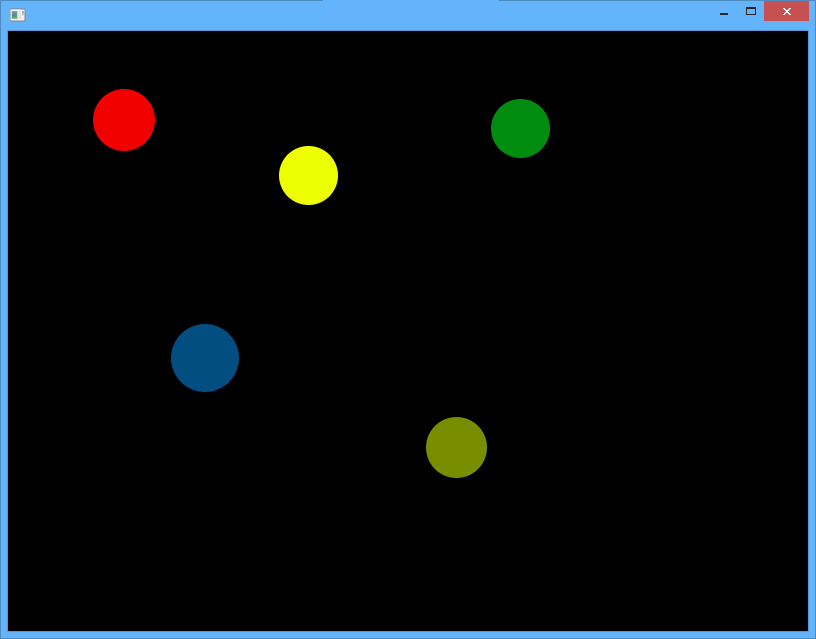
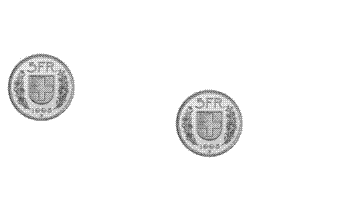
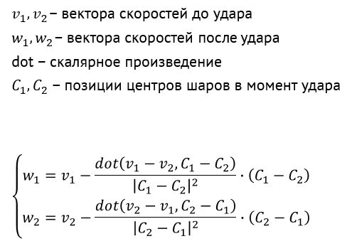
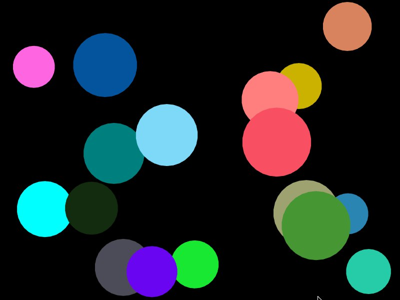

Выполните задания, соблюдая [стиль кодирования](cxx_coding_style). Готовые задания должны быть выложены на гитхаб.

## Задание workshop2.1

Напишите программу, в которой несколько разноцветных шаров летают в пределах окна, отталкиваясь от стенок

- шарам не нужно сталкиваться между собой
- цвета и начальные скорости шаров задаются прямо в коде без какого-либо механизма случайностей
- для выполнения задания вы можете использовать массив либо `std::vector`
- скорость и CircleShape шара лучше поместить в структуру, и использовать массив структур

Перед выполнением задачи изучите статью [Массивы в C++](/cxx/cxx_arrays). Вы можете использовать инициализацию массива при объявлении, чтобы сделать код более аккуратным и читаемым.



## Задание workshop2.2 (до 2 баллов)

Добавьте шарам возможность отталкиваться друг от друга.

Для обнаружения столкновений достаточно сравнить все возможные пары шаров: если расстояние между центрами меньше суммы радиусов, шары сталкиваются. Перебрать каждую пару объектов ровно один раз можно с помощью вложенного цикла:

```cpp
constexpr size_t SIZE = 100;
Ball balls[SIZE];

// Перебираем каждую пару объектов
//  - ни одну пару не используем дважды
//  - не используем пары из одного объекта (т.е. объект не сталкивается сам с собой)
for (size_t fi = 0; fi < SIZE; ++fi)
{
    for (size_t si = fi + 1; si < SIZE; ++si)
    {
        // проверяем столкновение fi, si
    }
}
```

Такой цикл среди всех возможных сочетаний элементов переберёт только пары разных элементов, и ни одну пару не переберёт дважды:


При расчёте скоростей после удара важны скорости шаров до удара и взаимное положение их центров (при условии, что массы шаров равны). Это проиллюстрировано рисунке:



Считайте, что шары имеют одинаковую массу, а столкновение абсолютно упругое. В этом случае скорости шаров после удара вычисляются так, как показано на схеме:



### Как понять, что всё работает правильно

Достаточно проверить соблюдение основных закономерностей. Для удобства вы можете снять видеозапись экрана и оценивать работу столкновений на ней.

 1. Закон сохранения импульса в векторной форме должен сохраняться
    - проверьте, что суммарный вектор скорости до столкновения равен (с погрешностью 0.01) суммарному вектору скоростей после столкновения
 2. Суммарная кинетическая энергия шаров в системе должна оставаться неизменной; если скорости шариков нарастают или падают, значит, вы делаете что-то неправильно.

## Задание workshop2.3

Перед выполнением задачи изучите статью [Генерация случайных чисел в Modern C++](/cxx/cxx_random).

Добавьте случайную генерацию скоростей для шаров. Скорости не должны быть слишком большими или слишком маленькими: при генерации случайных чисел надо задать разумные ограничения.

## Задание workshop2.4 (дополнительное, до 2 баллов)

Изучите документацию класса [sf::Color](https://www.sfml-dev.org/documentation/2.4.2/classsf_1_1Color.php).

Затем добавьте случайную генерацию цвета шаров. Выбирать случайный цвет можно, например, следующим методом:

 1. Создать массив предопределённых значений типа sf::Color (достаточно 8 цветов на ваш вкус), этот массив будет служить палитрой
 2. Реализовать случайную генерацию индекса в этом массиве
 3. Получив случайный индекс, запросить из палитры цвет с этим индексом

>Составить хорошую палитру поможет сайт [websafecolors.info](http://websafecolors.info/).

Задание оценивается вполовину, если вы лишь берёте цвет из палитры. Для получения полных баллов надо повысить случайность цвета:

- выбирать два случайных индекса вместо одного
- полученные из палитры два цвета комбинировать путём вычисления среднего арифметического их RGBA-значений

## Задание workshop2.5 (дополнительное, до 2 баллов)

Добавьте возможность создавать шар со случайным цветом и скоростью по клику левой кнопкой мыши.

- шар не должен создаваться, если после создания он бы сразу пересёкся с другим шаром (другими словами, нельзя создать шар над другим шаром)
- для хранения динамического массива шаров вам не подойдёт массив в стиле `Ball balls[...]`, используйте `std::vector`

## Задание workshop2.6 (дополнительное, до 2 баллов)

Добавьте шарикам время жизни: каждый шар после создания существует ровно 10 секунд, после чего исчезает.

- счётчик оставшегося времени жизни лучше держать в структуре Ball
- удаление отживших своё элементов массива шаров можно выполнять с помощью идиомы `remove_if + erase`; изучите, как эта идиома реализуется в C++, и используйте её
- удаление отживших своё элементов удобнее выделить в функцию removeDeathBalls, обновление времени жизни всех шаров удобно выделить в функцию updateBallLifetimes

Если вы допускаете существенные ошибки в реализации `remove_if + erase`, то задание оценивается вполовину.

>Хорошая статья: [C++ std::remove_if with lambda explained](https://studiofreya.com/cpp/std-remove_if-with-lambda/)

### Задание workshop2.7 (дополнительное)

Могут возникать ситуации, когда шарики под воздействием других шариков "заталкиваются" друг в друга:



Решить эту проблему можно, если в процедуре update интервал каждого кадра разделить на 5-10 небольших интервалов, и на каждом из этих маленьких интервалов выполнять полный расчёт физики. Уменьшение временных интервалов при расчётах физики уменьшит вероятность заталкивания, т.к. за один интервал шарики будут передвигаться на меньшее расстояние.

>При таком решенеии производительность не пострадает: если у вас меньше 1000-10000 шариков, то рисование шариков всё равно будет занимать больше ресурсов процессора, чем расчёт физики. Только на большом числе шариков квадратичная сложность попарного перебора окажет заметное влияние.

### Задание workshop2.8 (дополнительное)

>Освоить работу с макросом [assert](http://en.cppreference.com/w/cpp/error/assert) вам поможет статья [Assert. Что это?](https://habrahabr.ru/post/141080/).

С помощью инструкции assert добавьте проверку соблюдения законов сохранения энергии и импульса при проверке столкновений:

- закон сохранения энергии (уравнение умножено на 2): `m1 * v1^2 + m2 * v2^2 = m1 * w1^2 + m2 * w2^2`
    - v1, v2 - скорости до столкновения
    - w1, w2 - скорости после столкновения
    - m1, m2 - массы шариков
- закон сохранения импульса: `m1 * v1 + m2 * v2 = m1 * w1 + m2 * w2`
- можно считать, что все массы равны константе либо вычисляются как произведение константы и `R^3`, где R - радиус шара

Проверка через assert должна выполняться после расчёта отталкивания очередной пары шариков.

Сравнивать числа с плавающей точкой через `==` не стоит: при вычислениях возможны погрешности, из-за которых ожидаемое и реальное значение будут равны лишь приблизительно. Для сравнения лучше проверить, что разница между числами не превышает `0.01`:

```cpp
#include <cmath>

bool areFuzzyEqual(float a, float b)
{
    constexpr float tolerance = 0.01f;
    const bool areEqual = (std::abs(a - b) < tolerance);

    return areEqual;
}
```

Однако, при проверке закона сохранения энергии может возникнуть проблема: если скорости будут достаточно велики, то разница между квадратами скоростей может превысить `0.01`. В этом случае разумно проверять относительную погрешность, а не абсолютную. С другой стороны, для чисел вблизи нуля относительная погрешность может быть большой даже в нормальной ситуации. Например, относительная погрешность между `0.00001` и `0` бесконечно велика. Поэтому лучше всего комбинировать расчёт относительной и абсолютной погрешностей.

Мы можем доработать функцию areFuzzyEqual, чтобы выбирать между относительной и абсолютной погрешностями в зависимости от величины чисел:

```cpp
#include <cmath>

// Сравнение с допустимой абсолютной погрешностью
bool areCloseAbsolute(float a, float b, float tolerance = 0.001f)
{
    return std::abs(a - b) < tolerance;
}

// Сравнение с допустимой относительной погрешностью
bool areCloseRelative(float a, float b, float tolerance = 0.001f)
{
    return std::abs((a - b) / b) < tolerance;
}

// Сравнение двух чисел с плавающей точкой с допустимой погрешностью 0.001
bool areFuzzyEqual(float a, float b)
{
    constexpr float tolerance = 0.001f;
    if (std::abs(b) > 1.f)
    {
        return areCloseRelative(a, b, tolerance);
    }
    return areCloseAbsolute(a, b, tolerance);
}
```
