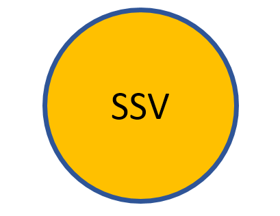
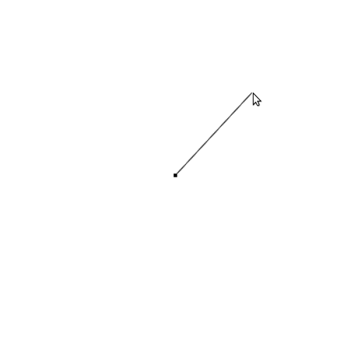
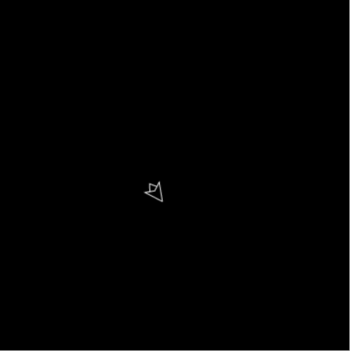
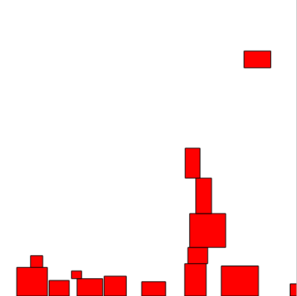
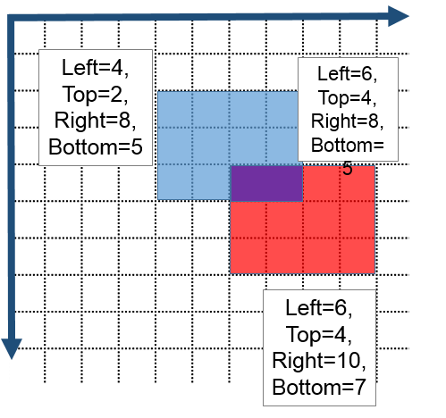

Задания из этой практики выполняются на выбор, в любом порядке.

Все задания надо выполнять с учётом нескольких требований:

- нужно соблюдать [Соглашения о кодировании на C++](cxx_coding_style)
- программа должна быть разделена на части с помощью функций (или методов) и типов данных (например, структур либо классов)
    - вам поможет руководство [Классы в C++ для новичков](/cxx/cxx_multiple_files)
    - вы должны следовать паттерну Game Loop и выделить шаги игрового цикла в отдельные функции (например, в функции createWindow, init, pollEvents, update, drawFrame)
    - размер одной функции не превышает 20 строк, в идеале от 1 до 15 строк
- программа должна быть разделена на несколько файлов
    - вам поможет руководство [Программы из нескольких файлов на C++](`/cxx/cxx_multiple_files`)
    - один из файлов должен называться `main.cpp`, он длжен содержать только функцию main и, возможно, несколько функций, составляющих игровой цикл; всё остальное находится в других файлах
- сделанные работы выкладываются на github

В выполнении заданий могут помочь следующие статьи:

- Руководство [Text and fonts](https://www.sfml-dev.org/tutorials/2.4/graphics-text.php)
    - шрифт `arial.ttf` вы можете взять здесь: [github.com/zyedidia/SFML.jl/blob/master/assets/arial.ttf](https://github.com/zyedidia/SFML.jl/blob/master/assets/arial.ttf)
- Руководство [Designing your own entities with vertex arrays](https://www.sfml-dev.org/tutorials/2.4/graphics-vertex-array.php)
- Руководство [Controlling the 2D camera with views](https://www.sfml-dev.org/tutorials/2.4/graphics-view.php)

>Также вы можете изучить примеры на странице [github.com/ps-group/sfml-from-scratch](https://github.com/ps-group/sfml-from-scratch/)

## Задание workshop3.1 (до 3 баллов)

### Часть I (1 балл)

Напишите программу, которая рисует ваше имя либо ваши инициалы с помощью примитива `sf::Text`. Имя (инициалы) должно быть нарисовано в круге с обводкой.



### Часть II (1 балл)

Модифицируйте программу, чтобы шарик с инициалами подпрыгивал. Прыжок долже происходит по правилам равноускоренного движения: в начале прыжка шарик получает начальную скорость, которую затем постепенно теряет из-за гравитации - до тех пор, пока не столкнётся с землёй. Прыжки шарика должны повторяться в цикле.

### Часть III (1 балл)

Доработайте программу так, чтобы ваш тип данных был классом и наследовался от Drawable, а рисовать кружок с вашими инициалами можно было привычным и удобным способом:

```cpp
window.draw(initials);
```

## Задание workshop3.2 (до 6 баллов)

>Реализовать камеру вам поможет руководство [Controlling the 2D camera with views](https://www.sfml-dev.org/tutorials/2.4/graphics-view.php)

В этом задании вы сможете вернуться к прошлой задаче с шариками!


### Часть I (2 балла)

Увеличьте размер виртуального поля с шариками так, чтобы он был в 3 раза больше размера окна и по ширине, и по высоте. Добавьте возможность передвигаться по увеличенному полю с помощью клавиш-стрелок, которые передвигают виртуальную камеру, основанную на `sf::View`.

### Часть II (2 балла)

> Закон притяжения в векторной форме вы можете найти в статье [Newton's law of universal gravitation](https://en.wikipedia.org/wiki/Newton%27s_law_of_universal_gravitation#Vector_form)

Добавьте в систему с шариками взаимное притяжение: небольшая сила должна притягивать шары друг к другу.

- можно считать, что сила, действующая на шарик, равна сумме сил притяжения к каждому из остальных шариков
- корректно решать [задачу трёх тел](https://ru.wikipedia.org/wiki/%D0%97%D0%B0%D0%B4%D0%B0%D1%87%D0%B0_%D1%82%D1%80%D1%91%D1%85_%D1%82%D0%B5%D0%BB) не нужно, достаточно на каждом кадре подсчитывать суммарную силу и затем применять её
- сила притяжения пропорциональна квадрату расстояния между шариками

Вы можете изучить [интерактивный пример на Javascript](http://users.polytech.unice.fr/~strombon/camash/Foundation%20HTML5%20Animation%20with%20JavaScript/html5-animation-source-code/examples/ch12/03-gravity-random.html).

### Часть III (2 балла)

> Закон кулоновского отталкивания в векторной форме вы можете найти в статье [Newton's law of universal gravitation](https://en.wikipedia.org/wiki/Coulomb%27s_law#Vector_form)

Добавьте в систему с шариками силы отталкивания, похожие на силы кулоновского отталкивания. В этом случае каждый шарик несёт заряд, и все заряды равны по модулю, но могу иметь разные знаки. Некоторые частицы отталкиваются, некоторые - притягиваются. Гравитационые силы можно убрать или сделать намного менее значимыми, чем кулоновская сила отталкивания.

## Задание workshop3.3 (2 балла)

>Рисовать линии вам поможет руководство [Designing your own entities with vertex arrays](https://www.sfml-dev.org/tutorials/2.4/graphics-vertex-array.php)

Напишите программу, которая рисует линию между центром окна и курсором, а также выводит в консоль расстояние от центра окна до курсора (в пикселях). Программа не обязана обрабатывать ситуации, когда курсор находится за пределами окна.



Вы можете изучить [интерактивный пример на Javascript](http://users.polytech.unice.fr/~strombon/camash/Foundation%20HTML5%20Animation%20with%20JavaScript/html5-animation-source-code/examples/ch03/11-mouse-distance.html).

## Задание workshop3.4 (3 балла)

>Рисовать космический корабль вам поможет руководство [Designing your own entities with vertex arrays](https://www.sfml-dev.org/tutorials/2.4/graphics-vertex-array.php)

Напишите программу, в которой под управлением клавиш-стрелок в космическом пространстве двигается космический корабль.

- Клавиша Вверх включает двигатели (до тех пор, пока клавишу не отпустят)
- Клавиши Влево/Вправо наращивают/убавляют угол поворота корабля
- Корабль должен обладать инерцией, т.е. при нажатии на клавиши-стрелки скорость не сразу возрастает до предельной
- Скорость поворота корабля ограничена
- На корабль действует сила, направленная против его движения, и эта сила увеличивется с ростом скорости корабля пропорционально квадрату скорости



Вы можете изучить [интерактивный пример на Javascript](http://users.polytech.unice.fr/~strombon/camash/Foundation%20HTML5%20Animation%20with%20JavaScript/html5-animation-source-code/examples/ch05/11-ship-sim.html).

## Задание workshop3.5 (3 балла)

>Функции для работы с датой и временем описаны в [документации языка C](http://en.cppreference.com/w/cpp/chrono/c). Скорее всего вам пригодятся функции `std::time` и `std::localtime`, которые позволят получить объект типа [std::tm](http://en.cppreference.com/w/cpp/chrono/c/tm).

В рамках задания следует разработать приложение, симулирующее аналоговые часы. Требования по внешнему виду показаны ниже на иллюстрации. В том числе:

- по краям циферблата должны быть расположены 12 арабских или римских цифр
- также по краям циферблата должны стоять 60 засечек, из них 12 крупнее остальных (т.к. в них попадает часовая стрелка в начале каждого часа)
- отображаемое время совпадает с локальным временем пользователя системы
- секундная стрелка должна отличаться по цвету от остальных стрелок

Стрелки должны передвигаться раз в секунду; секундная стрелка за это время передвинется на одно деление, минутная - на `1/60` часть деления, а часовая - на `1 / (60 * 12)` часть деления.


## Задание workshop3.6 (3 балла)

Напишите программу, в которой блоки случайно выбранного размера со случайно выбранной координатой `x` падают с верхней границы экрана вниз. Блоки должны накладываться друг на друга. Чтобы проверить, пересекается ли блок с другими блоками, достаточно проверить пересечение двух прямоугольников.



Если выровненные по осям координат прямоугольники пересекаются, то их пересечение будет прямоугольником, в котором:

- левая граница равна наименьшей из двух левых границ двух прямоугольника
- правая граница равна наибольшей из двух правых границ двух прямоугольника
- верхняя граница равна наименьшей из двух верхних границ двух прямоугольника
- нижняя граница равна наибольшей из двух нижних границ двух прямоугольника

Если же вычисленный таким образом прямоугольник области пересечения имеет отрицательную ширину или высоту, то прямоугольники не пересекаются.



Вы можете изучить [интерактивный пример на Javascript](http://users.polytech.unice.fr/~strombon/camash/Foundation%20HTML5%20Animation%20with%20JavaScript/html5-animation-source-code/examples/ch09/02-boxes.html).

