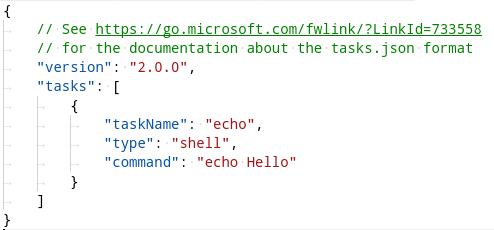
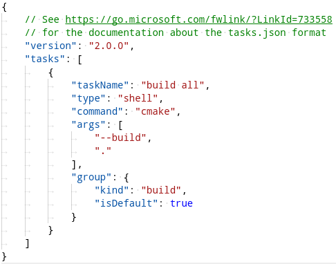
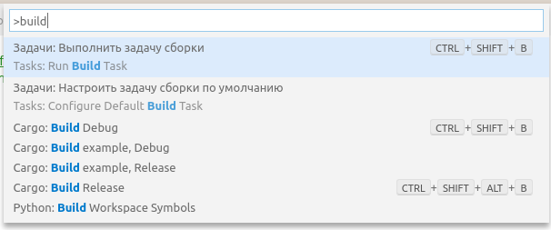
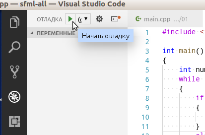
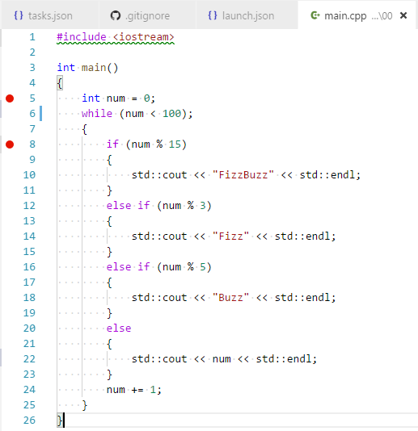
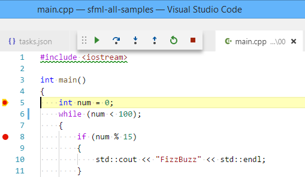

## Конфигурирование и сборка

Используемая в примерах система сборки `cmake` выполняет две задачи:

1. конфигурирование проекта, то есть обнаружение компилятора, компоновщика и других необходимых для сборки инструментов
2. сборка проекта, то есть последовательный вызов компилятора для каждого файла

Конфигурирование выполняется обычной командой `cmake`. В качестве необязательного аргумента ей можно передать имя генератора, создающего промежуточные файлы сборки:

- на Windows используйте генератор "MinGW Makefiles" (не путайте регистр!): `cmake -G "MinGW Makefiles" .`
- на Linux генератор по умолчанию - "Unix Makefiles", так что можно его не указывать: `cmake .`
- на Mac OS X генератор также можно не указывать, т.к. генератор по умолчанию достаточно хорош

Сборка проекта выполняется запуском `cmake` с флагом `--build`:

```cmake
cmake --build .
```

Сборка *инкрементальная*, то есть результат предыдущей сборки будет использован повторно, и будут перекомпилированы только изменившиеся файлы с исходным кодом. Чтобы выполнить сборку с нуля, используйте дополнительный флаг:

```cmake
cmake --build . --clean-first
```

### Настраиваем сборку проекта в одно нажатие

>Этот материал основан на статье [C/C++ for VS Code (Preview)](https://code.visualstudio.com/docs/languages/cpp) из документации VS Code.

Чтобы собирать проект одним нажатием, нам надо создать и настроить для проекта файл `tasks.json`:

1. Откройте панель ввода команд сочетанием клавиш `Ctrl+Shift+P`
2. Введите "Tasks: ", в выпадающем списке найдите и выберите опцию **Tasks: Configure Task Runner**


Появится список, и в нём надо выбрать вариант Others (*рус.* Прочие) — мы будем настраивать сборку через CMake, а его в списке нет:


Теперь у вас в каталоге проекта появился файл `tasks.json`. Он будет сразу открыт в редакторе. Этот файл в специальном формате JSON

>JSON — сокращение от JavaScript Object Notation. Это формальный язык, удобный для описания простых данных. Будьте внимательны, работая с JSON: не пропускайте запятые, кавычки и скобки.

Файл скорее всего выглядит так:



Теперь надо доработать описание команды: мы поменяем "taskName", "command", добавим поле "args" для аргументов команды. Мы также опишем поле "group" так, чтобы редактор VSCode считал эту задачу (*англ.* task) командой сборки (*англ.* build). Доработайте `tasks.json`, как показано на скриншоте:



Теперь вы можете собирать одним нажатием! Нажмите сочетание `Ctrl+Shift+B`. Если всё в порядке, вы увидите внизу в терминале такой вывод:


Поздравляем! Теперь собирать программу стало проще. Вы также можете открыть панель команд сочетанием `Ctrl+Shift+P`, ввести "build" и увидеть ту же самую команду запуска сборки:



### При запуске сборки ошибка "Could not load cache"

Это означает, что в открытом каталоге проекта нет файла `CMakeLists.txt`, либо проект не сконфигурирован. Попробуйте сделать следующее:

1. Перейдите в терминале в тот каталог, который открыт в Visual Studio Code, и убедитесь, что в нём есть файл `CMakeLists.txt`. Файл должен быть именно в открытом каталоге, а не только в его подкаталогах.
2. Если файла `CMakeLists.txt` нет, то создайте его и добавьте в него нужные подкаталоги инструкцией `add_subdirectory(...)`
3. Если файл есть, просто выполните конфигурирование: `cmake -G "MinGW Makefiles" .`

Если после этих шагов сборка командой `cmake --build .` не работает и выдаёт ту же ошибку, значит, вы неправильно выполнили шаги =) Попробуйте снова.

## Запуск и отладка

### Тип сборки Debug/Release

В языке C++ (как и во многих других) принято использовать два типа сборки:

- Debug (отладочный) создаётся для запуска отладчика и поиска ошибок, поэтому он имеет низкую производительность, но зато программа выполняется именно так, как описал программист, без оптимизаций
- Release создаётся для выпуска (то есть публикации) программы для клиентов, в нём используются оптимизации, что делает пошаговое выполнение в отладчике крайне трудным (т.к. некоторые фрагменты кода или переменные компилятор мог просто убрать ради оптимизации)

Для учебных целей всегда собирайте отладочную версию. Это можно сделать с помощью опции `-DCMAKE_BUILD_TYPE=Debug`:

```cmake
cmake -G "MinGW Makefiles" -DCMAKE_BUILD_TYPE=Debug
```

Такую сборку, например, можно запустить в отладчике

### Настраиваем запуск проекта в одно нажатие

Чтобы запускать проект одним нажатием, вам нужен файл `launch.json`. Создадим его по инструкции:

1. Перейдите в редакторе в режим отладки — нажмите на кнопку, как показано ниже, либо просто нажмите `Ctrl+Shift+D`:


2. В этом режиме нажмите кнопку настройки:


3. В выпадающем списке выберите "C+ (GDB/LLDB)", чтобы автоматически создать `launch.json`:


Если у вас нет варианта "C++", нажмите кнопку "More...", после чего откроется режим установки плагинов. В списке плагинов надо выбрать плагин "C/C++":


Когда плагин загрузится, вам потребуется нажать "Reload" для перезагрузки редактора с этим плагином:


Теперь вы наконец-то можете выбрать вариант "C/C++"! Сразу после выбора будет создан файл `launch.json`. Этот файл будет выглядеть примерно так:

```js
{
    "version": "0.2.0",
    "configurations": [
        {
            "name": "(gdb) Launch",
            "type": "cppdbg",
            "request": "launch",
            "program": "enter program name, for example ${workspaceRoot}/a.out",
            "args": [],
            "stopAtEntry": false,
            "cwd": "${workspaceRoot}",
            "environment": [],
            "externalConsole": true,
            "MIMode": "gdb",
            "setupCommands": [
                {
                    "description": "Enable pretty-printing for gdb",
                    "text": "-enable-pretty-printing",
                    "ignoreFailures": true
                }
            ]
        }
    ]
}
```

Измените этот файл:

- для поля "program" надо указать путь к программе, включая переменную workspaceRoot: `"program": "${workspaceRoot}/04/04"`
- добавьте свойство `"preLaunchTask": "build all"`
- добавьте свойство `"miDebuggerPath": "gdb.exe"`
- поменяйте значение свойства "externalConsole" на `false`

После изменений файл будет выглядеть так:

```js
{
    "version": "0.2.0",
    "configurations": [
        {
            "name": "(gdb) Launch",
            "type": "cppdbg",
            "request": "launch",
            "program": "${workspaceRoot}/00/00.exe",
            "args": [],
            "stopAtEntry": false,
            "cwd": "${workspaceRoot}",
            "environment": [],
            "externalConsole": false,
            "MIMode": "gdb",
            "miDebuggerPath": "gdb.exe",
            "setupCommands": [
                {
                    "description": "Enable pretty-printing for gdb",
                    "text": "-enable-pretty-printing",
                    "ignoreFailures": true
                }
            ],
            "preLaunchTask": "build all"
        }
    ]
}
```

Теперь вы можете начать отладку, нажав на кнопку запуска в редакторе в режиме отладки:



 Вы также можете использовать горячую клавишу `F5`, либо открыть панель команд сочетанием `Ctrl+Shif+P` и найти команду **Debug: Start Debugging**:


### Точки останова и просмотр переменных

>Этот материал основан на статье [Debugging](https://code.visualstudio.com/docs/editor/debugging) из документации VSCode

Точки останова — это подсказки для отладчика: он остановит выполнение программы в указанном месте и позволит вам просмотреть состояние переменных. В Visual Studio Code вы можете добавить точку останова, нажав на область левее номера нужной строки:



Добавьте точку останова напротив строки №5. После этого нажмите F5, либо нажмите кнопку запуска отладки в режиме отладки. Начнётся сборка, затем программа запустится под управлением отладчика. Вы увидите в редакторе панель, связанную с отладчиком:



Наведите на каждую из кнопок этой панели. Посмотрите во всплывающих подсказках, что они делают и какие у них сочетания клавиш. Подсказка по горячим клавишам:

- `F10` переход через инструкцию
- `F11` заход в тело вызываемой функции
- `Shift+F11` выход из тела вызываемой функции
- `F5` продолжение выполнения до следующей точки останова либо до завершения программы

Состояние переменных можно просматривать в левой панели.


Теперь пройдите 6-8 раза по циклу, нажимая F10. После этого можно нажать F5, чтобы программа продолжила выполнение до самого конца.
