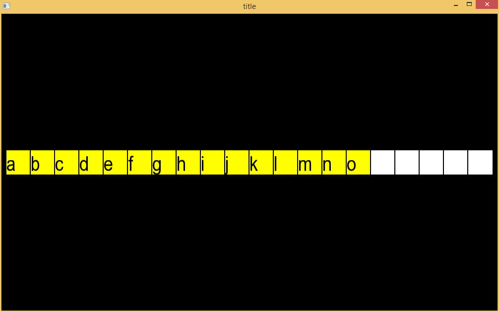

?????? ?????? ??????????, ??? ? ??????? ??????? ??????? ???????????? ????? ???????????????? ??????????? ????????? ?????? ? ??????? ????????????? ???????????? ???????? ??? ????????.



## ???????????? ??????????? C++

- [????????? ????????? ??????? std::function ?? ????????? `<functional>`](http://en.cppreference.com/w/cpp/utility/functional/function)
- [????????? ??????? (lambda-???????)](http://en.cppreference.com/w/cpp/language/lambda)
- [?????? assert ?? ????????? `<cassert>`](https://habrahabr.ru/post/141080/)

## ?????????? ??????? ? ???????? ??? ???

?????? ???????? ???????? ? ??????????? ????? ??? ???????????? ???????? ?????????.

```cpp
// ???? MyArray.h

#pragma once

struct MyArray
{
    static const size_t CAPACITY = 20;

    size_t SIZE;
    char data[CAPACITY];
};

// ??????????????? ??????? ??????? ? ?????????? ??????.
void MyArray_Init(MyArray &array);

// ?????????? ???????? ? ????? ???????,
//  ?????????? ??????? ?????? ??? ??????? ?? ????????????? ???????.
void MyArray_Push(MyArray &array, char item);

// ??????? ???????? ? ???????????? ????? ? ???????.
void MyArray_Insert(MyArray &array, size_t position, char item);

// ?????????? ???????? ?? ????? ???????,
//  ???? ?????? ????, ?????? ?? ????? ???????.
void MyArray_Pop(MyArray &array);
```

## ??????????? ???????? ??? ????????

??? ????????? ??? ???????? ???????? ?????? ?? ??????? ? ?????? ??????? ?????????????? ? ??????? ??????????? assert (??????????? ?????? ? ?????????? ??????).

```cpp
// ???? MyArray.cpp

#include "MyArray.h"
#include <cassert>

void MyArray_Init(MyArray &array)
{
    array.SIZE = 0;
    for (char &ch : array.data)
    {
        ch = '\0';
    }
}

void MyArray_Push(MyArray & array, char item)
{
    assert(array.SIZE < array.CAPACITY);
    array.data[array.SIZE] = item;
    ++array.SIZE;
}

void MyArray_Insert(MyArray & array, size_t position, char item)
{
    if (position >= array.SIZE)
    {
        MyArray_Push(array, item);
    }
    else
    {
        assert(array.SIZE < array.CAPACITY);
        for (size_t i = array.SIZE; i < position; --i)
        {
            array.data[i] = array.data[i - 1];
        }
        array.data[position] = item;
        ++array.SIZE;
    }
}

void MyArray_Pop(MyArray & array)
{
    if (array.SIZE > 0)
    {
        array.data[array.SIZE - 1] = '\0';
        --array.SIZE;
    }
}
```

## ???????????? ??????? ? ???????? ????

- ?????????? ?????????? ???????????? ???????? [???????? ???????? Game Loop](http://gameprogrammingpatterns.com/game-loop.html)
- ??? ?????? ?????????? ??????? ???????????? [????? sf::Clock](http://www.sfml-dev.org/documentation/2.0/classsf_1_1Clock.php) (?????????? [????????? ??????](http://progressor-blog.ru/sfml/obrabotka-vremeni/) ? ??? ??????????)
- ??? ??????????? ?????????? ???????? ??? ????????? ???????????? ??????????? ?????????? std::vector ? std::function

```cpp
// ???? main.cpp

#include <SFML/Window.hpp>
#include <SFML/Graphics.hpp>
#include <cassert>
#include <functional>
#include <queue>
#include "MyArray.h"

// ?????????? ??????? ????????? ???????? ?? ? ???????? ????? ? ??????.
void DrawMyArray(const MyArray &array, const sf::Font &font, sf::RenderWindow &window);

struct Chronometer
{
    float GetElapsedSeconds()const
    {
        return 0.001f * clock.getElapsedTime().asMilliseconds();
    }

    void Restart()
    {
        clock.restart();
    }

    sf::Clock clock;
};

// ????????? ?????????? ???????? ??? ?????????.
// ??????????? ??????? ? ???? commands
// ????????? ?? ?????? 0.5?
// ?????? ????? ? ???????????? ????????? ????????? ???????.
struct ArrayController
{
    void Init()
    {
        const bool succeed = font.loadFromFile("arialn.ttf");
        (void)succeed;
        assert(succeed);
    }

    void Update(MyArray &array)
    {
        const float COMMAND_EXECUTION_PERIOD = 0.5f;
        if (commandClocks.GetElapsedSeconds() > COMMAND_EXECUTION_PERIOD
            && !commands.empty())
        {
            commandClocks.Restart();
            auto command = commands.front();
            commands.pop();
            command(array);
        }
    }

    void AddPushCommand(char ch)
    {
        commands.push([ch](MyArray &array) {
            MyArray_Push(array, ch);
        });
    }

    void AddPopCommand()
    {
        commands.push([](MyArray &array) {
            MyArray_Pop(array);
        });
    }

    void Draw(const MyArray &array, sf::RenderWindow &window)const
    {
        DrawMyArray(array, font, window);
    }

    sf::Font font;
    Chronometer commandClocks;
    std::queue<std::function<void(MyArray &array)>> commands;
};

// ???? ??????? ???????
//  ?? ?????? ?????? ?????????????? sf::Event::Closed
void ProcessWindowEvents(sf::RenderWindow &window)
{
    sf::Event event;
    while (window.pollEvent(event))
    {
        if (event.type == sf::Event::Closed)
        {
            window.close();
        }
    }
}

std::string ArrayItemToString(char ch)
{
    std::string result;
    if (ch != '\0')
    {
        result += ch;
    }
    return result;
}

// ?????? ???????? ?? ??? ??????, ? ???????? 10px ????? ? ??????,
//  ???????????? ?????? ????????????? ?????? (? ? ??? ???????? ??????????),
//  ?????????????? ?????? ????????????? ?????.
void DrawMyArray(const MyArray &array, const sf::Font &font, sf::RenderWindow &window)
{
    const sf::Vector2u windowSize = window.getSize();
    const float marginX = 10.f;
    const float itemSize = float((windowSize.x - 2 * marginX)  / array.CAPACITY);
    const float shapeY = 0.5f * (float(windowSize.y) - itemSize);

    // ?????????? ???? ?????? ? ???? ??????? ??? ????????? ????? ???????.
    sf::RectangleShape shape;
    shape.setSize({ itemSize, itemSize });
    sf::Text text("", font);
    text.setFillColor(sf::Color::Black);
    text.setCharacterSize(42);

    // ??????? ??? ?????? ???????, ??????? ??????????????.
    for (size_t i = 0; i < array.CAPACITY; ++i)
    {
        sf::Color fillColor = (i < array.SIZE)
            ? sf::Color::Yellow
            : sf::Color::White;
        const float shapeX = marginX + float(i * itemSize);
        const std::string item = ArrayItemToString(array.data[i]);

        text.setString(item);
        text.setPosition({ shapeX, shapeY });

        shape.setFillColor(fillColor);
        shape.setPosition({ shapeX, shapeY });
        shape.setOutlineColor(sf::Color::Black);
        shape.setOutlineThickness(2.f);

        window.draw(shape);
        window.draw(text);
    }
}

// ????????? ??????? ????,
// ??????????? ??? ???????? ????.
void EnterGameLoop(sf::RenderWindow &window, ArrayController &controller, MyArray &array)
{
    while (window.isOpen())
    {
        // ????????? ???????
        ProcessWindowEvents(window);
        // ?????????? ?????????
        controller.Update(array);
        // ????????? ?????????
        window.clear();
        controller.Draw(array, window);
        // ????? ????? ?? ?????
        window.display();
    }
}

int main(int, char *[])
{
    sf::ContextSettings settings;
    settings.antialiasingLevel = 4;
    sf::RenderWindow window(
        sf::VideoMode(1000, 600), "title",
        sf::Style::Default, settings);

    MyArray array;
    MyArray_Init(array);

    ArrayController controller;
    controller.Init();
    char letter = 'a';
    for (int i = 0; i < 18; ++i)
    {
        controller.AddPushCommand(letter);
        ++letter;
    }
    for (int i = 0; i < 18; ++i)
    {
        controller.AddPopCommand();
    }

    EnterGameLoop(window, controller, array);

    return 0;
}
```
