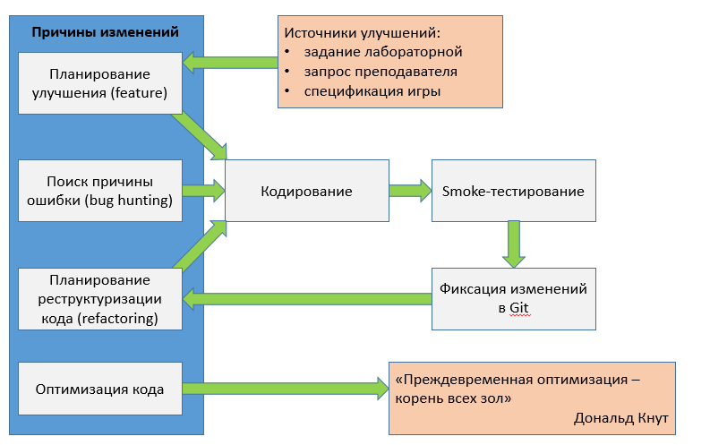

## Итеративная разработка кода

Не стоит опрометчиво бросаться писать код без какого-либо планирования, или показывать код преподавателю сразу после написания. Рабочий процесс программиста в индустрии включает в себя написание кода всего лишь как один из этапов, занимающий порядка 1/4 рабочего времени программиста.

В индустрии принят итеративный подход к разработке. Программист делит свой рабочий процесс на выполнение задач и подзадач, каждая из которых решается в одну или несколько итераций рабочего цикла. Общая схема цикла (в адаптации для студентов) выглядит так:



Учащимся следует:

- помнить, что такое [Дымовое тестирование (Smoke test)](http://www.protesting.ru/testing/types/smoke.html)
- фиксировать в Git каждое заметное изменение
- после кодирования проводить беглое тестирование программы (то есть дымовое тестирование), фиксировать изменения в Git
- после реализации улучшения следует подумать, как реструктурировать код

## Поиск ошибок

Следует уметь пользоваться интегрированным отладчиком своей среды разработки, в том числе надо уметь

- устанавливать и использовать точки останова (breakpoint)
- просматривать значения локальных переменных
- добавлять "watches" &mdash; вычислимые пользовательские выражения (таким методом можно, например, узнать значение глобальной переменной)
- использовать навигацию по стеку вызовов функций (call stack)
- использовать макрос assert и другой вспомогательный код при отладке
- использовать аннотированный вывод вместо непонятных неаннотированных значений при отладке:

```cpp
// аннотированный вывод, выводит "new speed value = %число%"
// значения acceleration и deltaTime не выводим, т.к. в случае подозрений
// в их адрес проще просмотреть значения в отладчике.
    float speed = m_currentSpeed + acceleration * deltaTime;
    std::cerr << "new speed value = " << speed << std::endl;

// нечитаемый вывод, выводит просто число вперемешку с остальным выводом
    float speed = m_currentSpeed + acceleration * deltaTime;
    std::cerr << speed << acceleration << deltaTime << std::endl;
```

Материалы:

- [Поисковый запрос "visual c++ debugger" по Youtube](https://www.youtube.com/results?search_query=visual+c%2B%2B+debugger)
- [Поисковый запрос "clion c++ debugger" по Youtube](https://www.youtube.com/results?search_query=clion+debugger)

## Реструктуризация кода

Полезные материалы:

- [Стиль кодирования в рамках курса](cpp-style-sfml.md)
- [Русскоязычный сайт о рефакторинге: refactoring.guru](https://refactoring.guru/ru)
- [Англоязычный сайт по книге о рефакторинге: sourcemaking.com](https://sourcemaking.com/refactoring)
